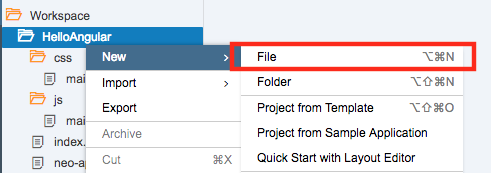
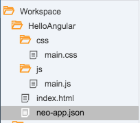
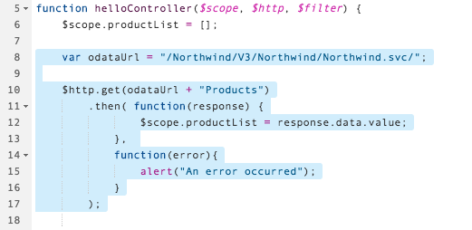
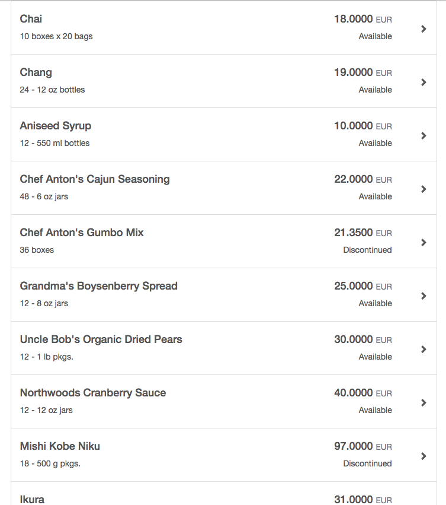

## Prerequisites  
 - **Proficiency:** Beginner
 - **Tutorials** [Separate the JavaScript and CSS Files](https://www.sap.com/developer/tutorials/angular-separate-files.html)

## Next Steps
 - **Tutorials** [Add a Header and Detail Modal Dialog](https://www.sap.com/developer/tutorials/angular-add-header-detail-dialog.html)

## Details
### You will learn  
In this tutorial series, we will explore another technology for Single Page Application (SPA) development - AngularJS (or just Angular).  Angular is a popular web framework in North America, and is used by many companies for both internal and client-facing systems.  These tutorials will parallel our SAPUI5 tutorials, building a visual interface using Angular, and connecting it to an OData back end service.

### Time to Complete
**10 Min**.

---
#### AngularJS series
Start to work with the `$http` service.  This service provides a way to asynchronously get data from a server.  We will be using the [public Northwind test data service](http://www.odata.org/) to provide this test data.

We need to do two things to make this work:

1. Set up a destination to the [Northwind OData reference service](http://www.odata.org/odata-services/).  
2. Remove our static data, and connect to this destination.

---

### Configure the Northwind Test data in Web IDE.

> **Warning**
>
> If you have not configured the Northwind destination in SAP Cloud Platform, you must do that first.  To verify that you have configured SAP Cloud Platform correctly, do the following:
>
> - Open a new browser page to the **[SAP Cloud Platform Cockpit](https://account.hanatrial.ondemand.com/cockpit)**
> - In the right hand navigation, select *Connectivity*, then select *Destinations*
> - Look for the Destination called `Northwind`.
>
> If you do not see a Destination called `Northwind`, go to the **[Create a Destination](https://www.sap.com/developer/tutorials/hcp-create-destination.html)** tutorial.  When you are finished, return here.
>

1.  Create a new file in your project.  Select the `HelloAngular` project, and then right click.  Choose **New** --> **File**.

    

2. Enter the name `neo-app.json`, and then click OK.

    

    > **IMPORTANT**
    >
    > The new file should be in the `HelloAngular` directory, as shown here:
    >
    > 
    >

3.  Add the following code to the `neo-app.json` file, and then click **Save**

    ```xml
    {
    	"routes": [{
    		"path": "/Northwind",
    		"target": {
    			"type": "destination",
    			"name": "Northwind"
    		},
    		"description": "Northwind ODATA service"
    	}]
    }
    ```

    

---

### Change the test data to the OData source

1.  Remove the test data from the JavaScript file.

    In the `main.js` file, select all of the test data (starting with `var testData =`, and delete it.

    >Don't forget to save your file.

       

2.  Change the line that defines the `productList` to start with an empty array.

    Select the line `$scope.productList = testData;`, and change it to

    ```javascript
    $scope.productList = [];
    ```

       

3.  Now we want to add in the HTML call to get the OData information.  To do that, we will use the `$http` service to get the data.  

    Change the `helloController` function to get the `$http` service from Angular

    ```javascript
    function helloController($scope, $http) {
    ```

       

4.  Now, add in the `$get` method.  

    Update your `helloController` function and add this code at the bottom:

    ```javascript
    var odataUrl = "/Northwind/V3/Northwind/Northwind.svc/";

    $http.get(odataUrl + "Products")
    .then( function(response) {
    $scope.productList = response.data.value;
    },
    function(error){
    alert("An error occurred");
    }
    );
    ```

       

5.  Run your application.  The data on the screen should now contain 20 rows, and look like this:

       


## Additional Information

#### Angular Services

- [`$http`](https://docs.angularjs.org/api/ng/service/$http)
- [`$get`](https://docs.angularjs.org/api/ng/service/$http#get) (which is a shortcut for `$http`)

#### Northwind OData test service

- This tutorial uses the demo data available on <http://www.odata.org>.  Specifically, we use the [Northwind V3 service](http://services.odata.org) Click the link found there for `Browse the Read-Only Northwind Service` or point to `http://services.odata.org/V3/Northwind/Northwind.svc/`.  The OData web site also provides several other samples, please check out the [complete list](http://www.odata.org/odata-services/).

#### Using SAP Cloud Platform Destinations

The sample application uses the [SAP Cloud Platform (HCP) destinations](https://help.hana.ondemand.com/help/frameset.htm?e4f1d97cbb571014a247d10f9f9a685d.html) to access the sample data.  

We do this using the `neo-app.json` file.  This is the [Application Descriptor File](https://help.hana.ondemand.com/help/frameset.htm?aed1ffa3f3e741b3a4573c9e475aa2a4.html), and can be used to configure your application running inside HCP.

**Why doesn't the sample application just connect directly to the OData test service?**

Normally, you can do this.  In fact, it's the recommended method.  But we are working around a bug.  

There are two things happening here.  First, all the major web browsers prevent you from loading insecure data in to a secure page.  That is called [Mixed Content](https://developer.mozilla.org/en-US/docs/Web/Security/Mixed_content).  If the original web page is secure, the browser will demand all data is secure as well.  So, the browser automatically uses HTTPS connections for all data.

Second, when the browser attempts to get data from <https://services.odata.org/>, it runs in to another problem.  The OData test site has an invalid SSL certificate.  When the browser attempts to get the data, using HTTPS, the invalid certificate generates an error.

We work around this by having SAP Cloud Platform talk to <http://services.odata.org/> directly.  This avoids the HTTPS connection, and works around the bug.

