## Details
### You will learn
  - How to configure SAP Cloud Platform for push
  - How to configure Mobile Services for push
  - Foreground notifications
  - Background notifications

---

[ACCORDION-BEGIN [Step 1: ](Configure the SAP Cloud Platform for push notifications)]

Open <a target="_blank" href="https://account.hanatrial.ondemand.com">SAP Cloud Platform Trial</a> and log in to **Neo Trial**.

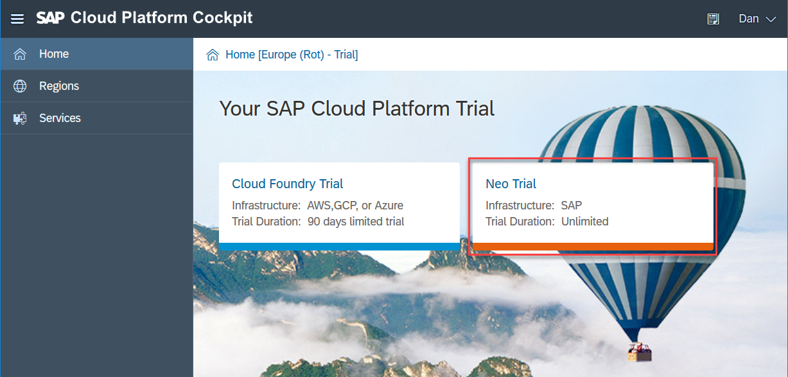

Select **Services**, then choose **Mobile** from the dropdown.  Then click on **Mobile Services, std**.

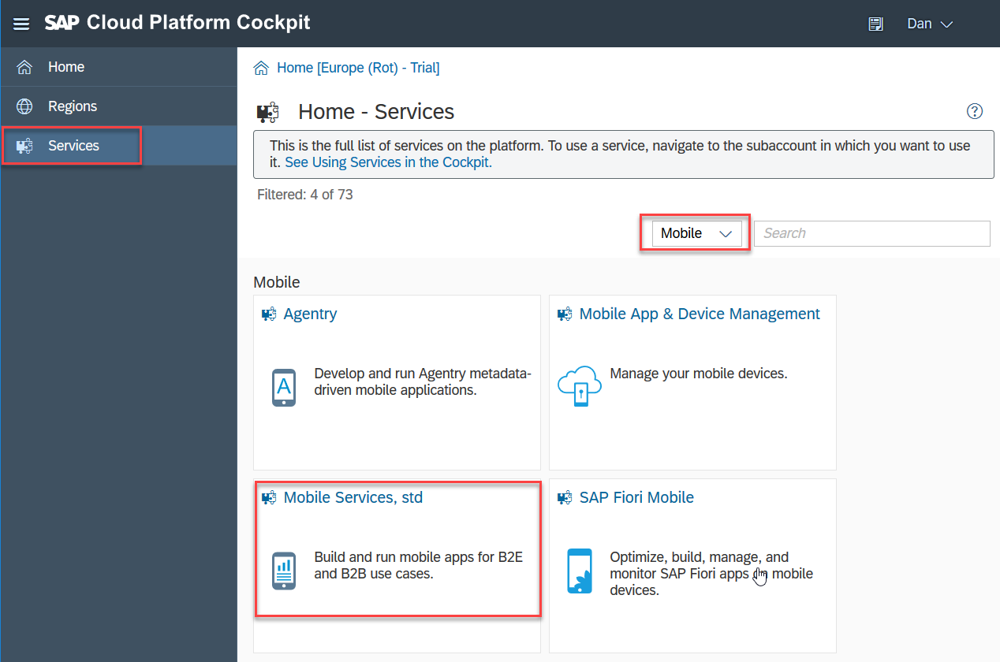

Click on the **Configure Mobile Services** link.

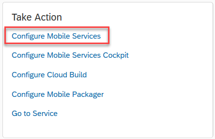

On the **Roles** tab, select the **Notification User** role and click the **Assign** button, assigning your **User ID**.

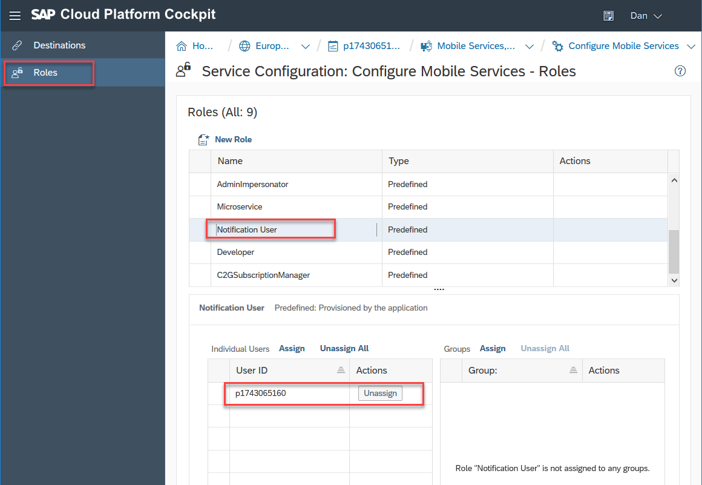

[VALIDATE_1]
[ACCORDION-END]

[ACCORDION-BEGIN [Step 2: ](Configure Mobile Services for push notifications)]

Return to the **Mobile Services** screen.

Click the **Go to Service** link.

In SAP Cloud Platform Mobile Services, select the application **`com.sap.wizapp`** and click on **Push Notification**.

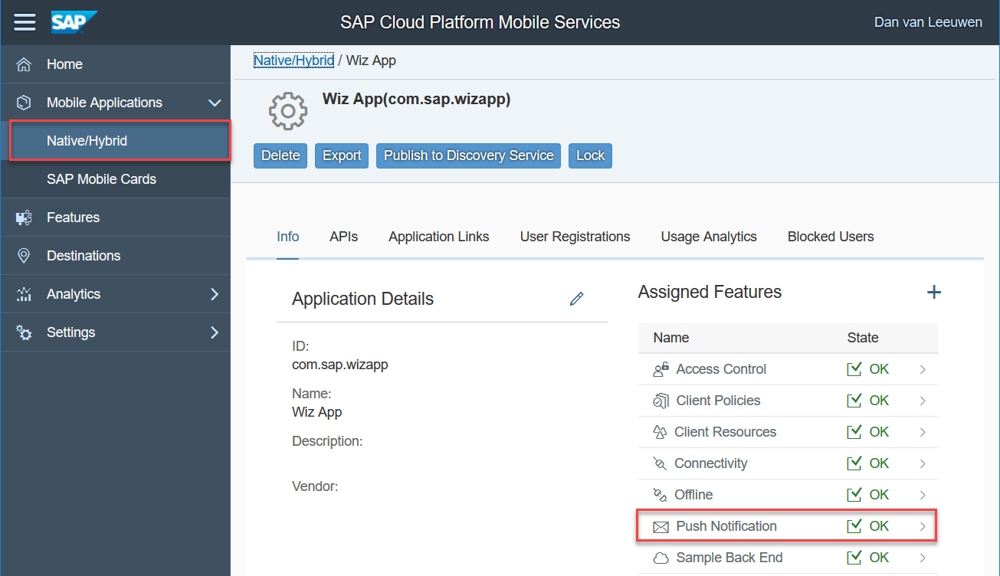

This screen requires information from the `Firebase console`.

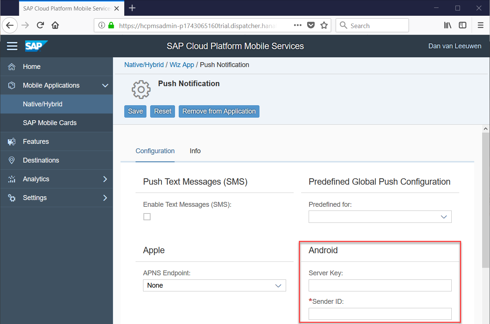

In the <a target="_blank" href="https://console.firebase.google.com/">Firebase</a> console, go to the **Project settings**

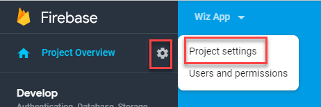

Select the **Cloud Messaging** tab and copy the **Server Key** and **Sender ID** values from Firebase to the SAP Mobile Services **Android Push Notification** settings screen.

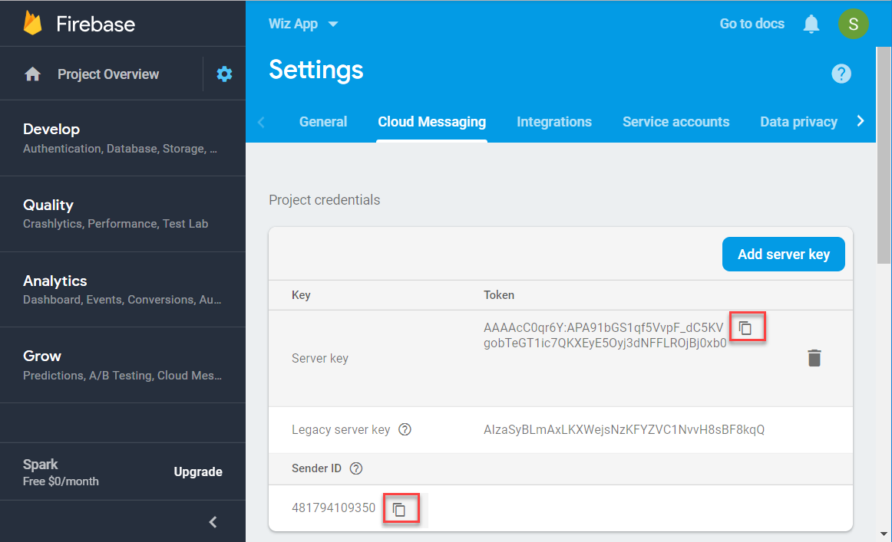

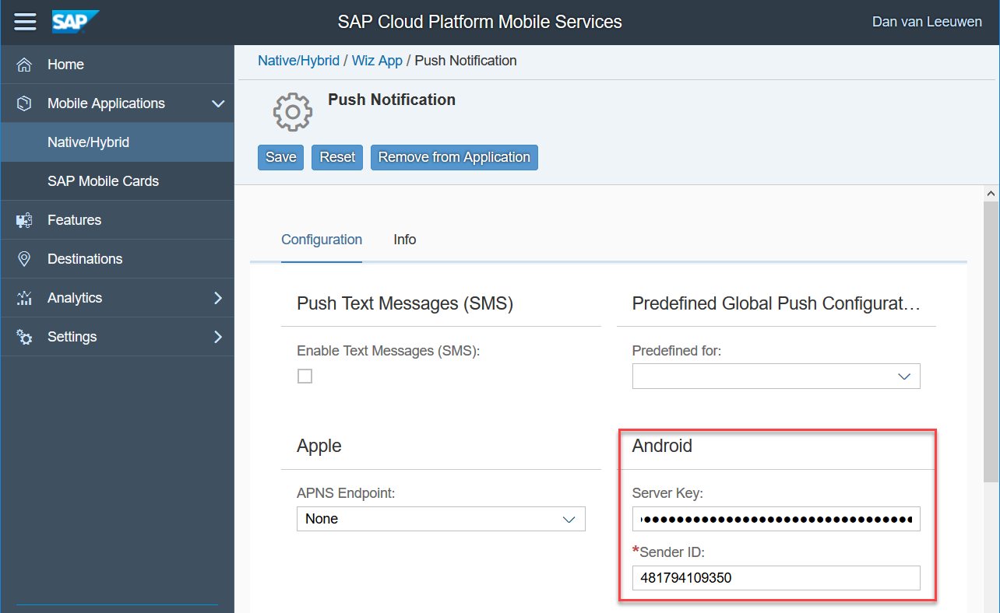

[VALIDATE_2]
[ACCORDION-END]

[ACCORDION-BEGIN [Step 3: ](Send a notification)]
Under **Mobile Applications**, select the application.

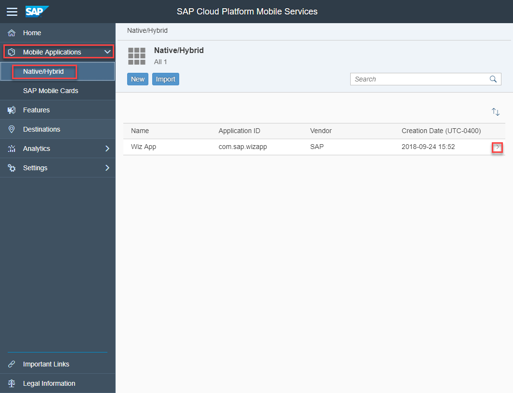

Select the User Registrations tab to send the notification to your app.  

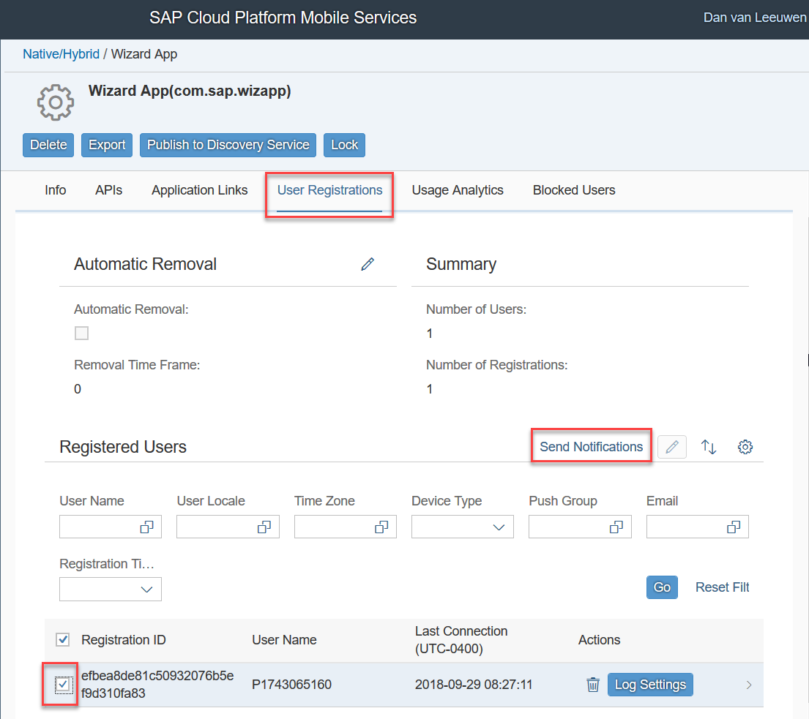

> **Note**: It may be difficult to tell which registration to choose. The **Last Connection** field shows the last time a given registration made a request.  If you are unsure which registration to choose, click through a few screens in the application and then press the **GO** button to refresh the display or select all of them and send a greeting to all the registrations.

Specify the notification text to send to the app.

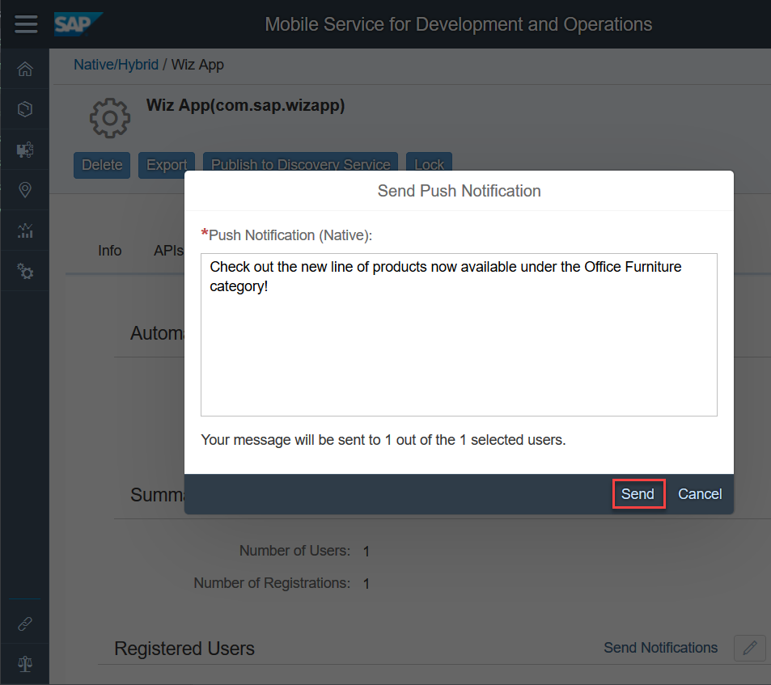

[DONE]
[ACCORDION-END]

[ACCORDION-BEGIN [Step 4: ](Foreground notification)]
Notice that the app shows the notification.

[DONE]
[ACCORDION-END]

[ACCORDION-BEGIN [Step 5: ](Background notification)]

On the emulator or mobile device, open another app, such as Chrome, which will cause the Wiz App to no longer be the foreground app.

If you now send another notification you notice that since the app is in the background, or not running, a notification is placed in the notification drawer.

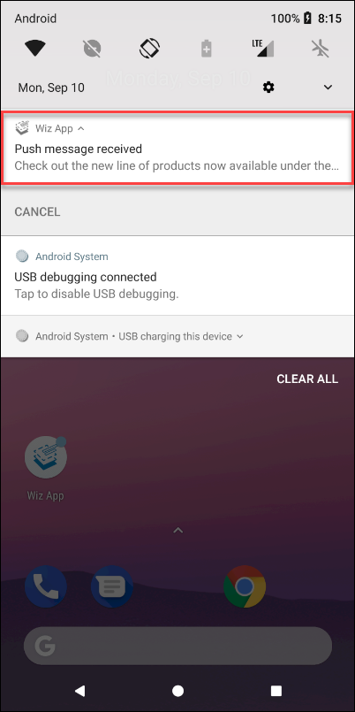

Tapping on the notification will bring the app to the foreground or open the app.

Currently, the message is displayed in an `AlertDialog`.  

Custom logic could be added to the app to decide on the action to take, such as displaying the new Office Furniture category.

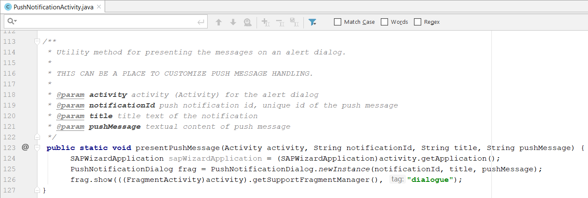

> **Note**: Further information on push can be found at <a target="_blank" href="https://help.sap.com/doc/c2d571df73104f72b9f1b73e06c5609a/Latest/en-US/docs/user-guide/foundation/remotenotification.html">Push Notifications</a>, <a target="_blank" href="https://help.sap.com/viewer/38dbd9fbb49240f3b4d954e92335e670/Cloud/en-US/aaec2dbe78ec4fc08ef0a605a899e3dd.html">Push API Notification Scenarios</a>, and <a target="_blank" href="https://firebase.google.com/docs/cloud-messaging/concept-options">About FCM Messages</a>.

Congratulations! You have seen how an app can make use of foreground and background notifications.

[DONE]
[ACCORDION-END]

---
