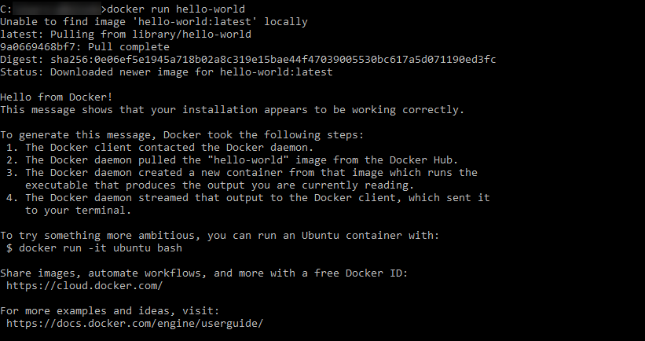

## Prerequisites  

## Next Steps
 - [Navigate around SAP Data Hub, developer edition](https://www.sap.com/developer/tutorials/datahub-docker-navigation.html)


## Details
**This tutorial is obsolete and will be removed shortly (end of-November 2018).**
### You will learn  
During this tutorial, you will learn how to download SAP Data Hub, developer edition, from SAP Store and run it on your local computer as a Docker container.

### Time to Complete
**45 Min**

---

[ACCORDION-BEGIN [Step 1: ](Check the prerequisites)]
Running SAP Data Hub, developer edition on your local computer requires:

* at least **2 CPU cores** (recommended 4 CPU cores) with `X86_64` instruction set

* at least **8 GB of RAM**

* at least **10 GB disk space** for a running Docker container

* Internet connectivity (temporarily while building the Docker image)

* Docker installed and running (http://www.docker.com)
  **Attention:** If you use Docker Toolbox, pay special attention to the sizing of the Linux VM. For details take a look at our [FAQ](http://blogs.sap.com/2017/12/06/faqs-for-sap-data-hub-developer-edition).

Verify that Docker is properly installed and running by opening a terminal window and entering the following.

```sh
docker run hello-world
```

You see an output similar to the following.


>Make sure that you select the Linux container and not the Windows container during the Docker installation.

[ACCORDION-END]

[ACCORDION-BEGIN [Step 2: ](Download SAP Data Hub, developer edition)]
Download SAP Data Hub, developer edition and unpack the archive to your disk. You find it via the following link.

```sh
https://www.sap.com/developer/trials-downloads/additional-downloads/sap-data-hub-developer-edition-1-4-15004.html
```

Carefully read the `README.html` as well as the license agreement prior to continuing with the tutorial.

[ACCORDION-END]


[ACCORDION-BEGIN [Step 3: ](Build the Docker image)]
Open and review the `Dockerfile` with any text editor. For now you do **not** have to understand the file in detail. You **do** have to ensure that the proxy settings for Internet access are maintained correctly though.

```sh
ENV http_proxy=http://myproxy:8080

ENV https_proxy=http://myproxy:8080
```

Open a terminal window and navigate to the directory where you have unpacked the archive (that is the directory which includes the `Dockerfile`). Build the docker image for SAP Data Hub, developer edition. Replace the values of build-time variables `VORA_USERNAME` and `VORA_PASSWORD` in the following command with meaningful values **prior to executing the following command**.

```sh
docker build --build-arg VORA_USERNAME=vora --build-arg VORA_PASSWORD=SomeNicePassword19920706 --tag datahub .
```

After 5-10 minutes (depending on the speed of your internet connection) the build completes. Verify that your local Docker registry now includes a new image (called `datahub`) for SAP Data Hub, developer edition by entering the following.

```sh
docker images
```
You see an output similar to the following.
  

[ACCORDION-END]

[ACCORDION-BEGIN [Step 4: ](Run a Docker container (based on the image))]
Create a Docker network by opening a terminal window (or using the already open one). This will later help you to easily connect the container running SAP Data Hub, developer edition (which you will soon start) with other containers. Enter the following command.

```sh
docker network create dev-net
```

Run a Docker container based on image `datahub`. By publishing the ports `8090`, `8998`, `9225` and `50070` you ensure that you later can access the different user interfaces running inside the Docker container via `localhost`.

The `livy` parameter starts Apache Livy (inside the Docker container) and thereby makes it possible to access Spark via REST services (from outside the Docker container), e.g. to connect from Apache Zeppelin to the SAP Vora tables.

```sh
docker run -ti --publish 127.0.0.1:8090:8090 --publish 127.0.0.1:8998:8998 --publish 127.0.0.1:9225:9225 --publish 127.0.0.1:50070:50070 --name datahub --hostname datahub --network dev-net datahub run --agree-to-sap-license --hdfs --livy
```

After a few minutes (during which you can follow what happens inside the container), you see an output ("status loop") similar to the following. The output refreshes every minute and indicates that all services related to SAP Data Hub, developer edition are running.

  

**Attention:** If you press `Ctrl-C` during the "status loop", this will stop the running container (see also step 6).

[ACCORDION-END]

[ACCORDION-BEGIN [Step 5: ](Perform a smoke test)]
Open a web browser and test the following URLs (where necessary enter **Username** and **Password** which you have set while building the Docker image):

* `http://localhost:8090` (SAP Data Hub Pipeline Modeler)
* `http://localhost:9225` (SAP Vora Tools)
* `http://localhost:50070` (Apache Hadoop User Interface)
* `http://localhost:8998` (Livy)

If all URLs are working, you can assume that you have successfully set up SAP Data Hub, developer edition on your local computer.

[ACCORDION-END]

[ACCORDION-BEGIN [Step 6: ](Stop and restart the Docker container)]
You can stop SAP Data Hub, developer edition by using the `stop` command. After you used the above `run` command, you need to open a new terminal window to enter the `stop` command (alternatively you can use `Ctrl-C`).

```sh
docker stop datahub
```

You can also restart SAP Data Hub, developer edition (without creating a completely new container) by using the `start` command (this will not open a "status loop"). The `-i` option ensures that you see the "status loop".

```sh
docker start -i datahub
```

**Attention**: When stopping and restarting the Docker container, currently the tables which you have created in SAP Vora get lost. You need to recreate them.


If you like to see what is going on (after you have issued a `start` command) you can take a look at the logs.

```sh
docker logs datahub
```

[ACCORDION-END]

---
