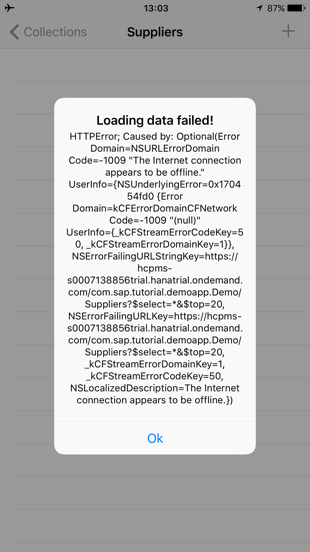
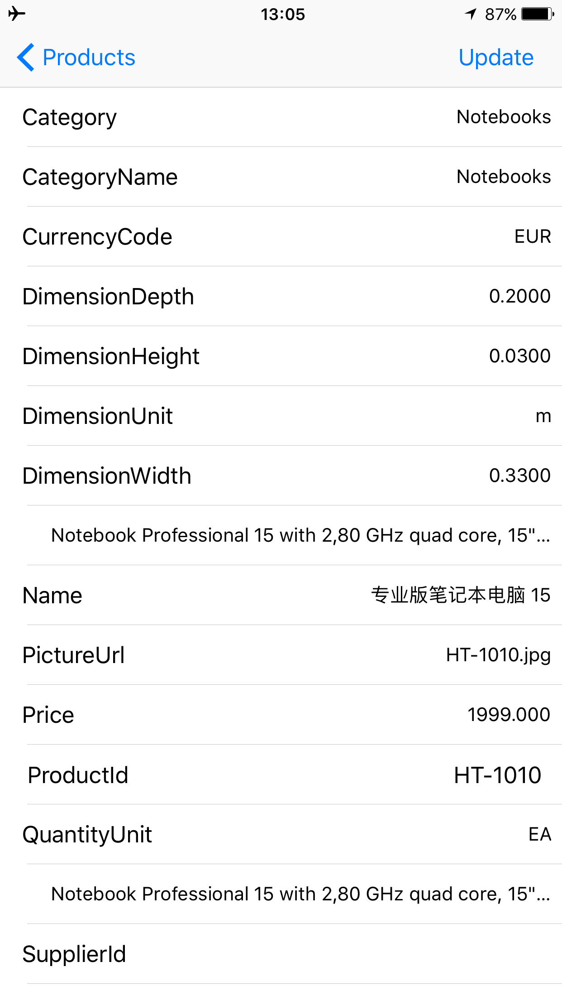

## Prerequisites  
 - **Proficiency:** Intermediate
 - **Development environment:** Apple iMac, MacBook or MacBook Pro running Xcode 9 or higher
 - **SAP Cloud Platform SDK for iOS:** Version 2.0
 - **Tutorials:** [Offline OData - Configuration](https://www.sap.com/developer/tutorials/fiori-ios-hcpms-offline-odata-config.html)

## Next Steps
 - [Offline OData - Error handling](https://www.sap.com/developer/tutorials/fiori-ios-hcpms-offline-odata-errorhandling.html)

## Details
### You will learn  
In this tutorial, you will implement the coding for use with offline OData into your application, and use the SAP Cloud Platform mobile service for development and operations offline configuration settings.

### Time to Complete
**15 Min**.

---

In the previous tutorial, you have finalized the offline configuration in SAP Cloud Platform mobile service for development and operations. In this tutorial, you will implement the necessary coding so your application can use OData while offline.

If you now switch on Airplane mode, and try opening a collection from the app, you will see a message similar to this:



After you have followed the implementation below, your application should now work offline as well.

[ACCORDION-BEGIN [Step 1: ](Add import statement)]

Now, you need to change the **Online** behavior to **Offline** usage. Open the `AppDelegate.swift` file.

Add the import declaration for `SAPOfflineOData` just below the already existing `SAPOData` import declaration:

```swift
import SAPOfflineOData
```


[ACCORDION-END]

[ACCORDION-BEGIN [Step 2: ](Change Service Declaration to Offline)]

Since the data service is used offline, you need to change the service declaration for offline usage. In order to do so, add a new service declaration `espmContainerOffline` just below the existing service declaration:

```swift
var espmContainer: ESPMContainer<OnlineODataProvider>!
var espmContainerOffline: ESPMContainer<OfflineODataProvider>!
```


[ACCORDION-END]

[ACCORDION-BEGIN [Step 3: ](Change OData initializer)]

Scroll down to method `configureOData(urlSession:serviceRoot:)` and add the following at the bottom of the method:

```swift
var offlineParameters = OfflineODataParameters()
offlineParameters.enableRepeatableRequests = true

// create offline OData provider
let offlineODataProvider = try! OfflineODataProvider(
    serviceRoot: URL(string: serviceRoot.absoluteString)!,
    parameters: offlineParameters,
    sapURLSession: urlSession
)

// define offline defining query
try! offlineODataProvider.add(
    definingQuery: OfflineODataDefiningQuery(
        name: CollectionType.products.rawValue,
        query: "/\(CollectionType.products.rawValue)?$top=5",
        automaticallyRetrievesStreams: false
    )
)

espmContainerOffline = ESPMContainer(provider: offlineODataProvider)
```

> To initialize the offline OData provider, you first set up an instance of `OfflineODataParameters`. With this instance, you set the custom header, provide a name and path for the offline store, and ensure an OData request is applied only once in case of multiple executions.

> Then, a reference to the offline data provider is set to the variable `offlineODataProvider`.

> The line which defines the offline defining query is used for the `Products` defining query you created in the previous tutorial.

> Finally, the `service` field is set to reference the `ESPMContainer` based on the offline data provider.


[ACCORDION-END]

[ACCORDION-BEGIN [Step 4: ](Maintain State of the Offline Store)]

Next, we need to modify the online behavior of the view controller for the `Products` entity. Open file `ProductsMasterViewController.swift` in `Demo > ViewControllers > Products` and add import the offline framework here as well:

```swift
import SAPOfflineOData
```

Then add a reference to the `espmContainerOffline` field in the `AppDelegate.swift` file. Below the `espmContainer` declaration, add a similar declaration but now for offline usage:

```swift
private var espmContainerOffline: ESPMContainer<OfflineODataProvider> {
    return self.appDelegate.espmContainerOffline
}
```

And finally, add a new field which holds the state of the store, whether it's open or not. Add the following boolean field:

```swift
private var isStoreOpened = false
```


[ACCORDION-END]

[ACCORDION-BEGIN [Step 5: ](Change request methods for offline usage)]

Locate method `requestEntities(completionHandler:)`, and replace its implementation with the following:

```swift
func requestEntities(completionHandler: @escaping (Error?) -> Void) {
    // Only request the first 20 values. If you want to modify the requested entities, you can do it here.
    espmContainerOffline.open { error in
        guard error == nil else {
            return;
        }

        self.isStoreOpened = true

        self.espmContainerOffline.download { error in
            guard error == nil else {
                let query = DataQuery().selectAll().top(20)
                self.espmContainerOffline.fetchProducts(matching: query) { products, error in
                    guard let products = products else {
                        completionHandler(error!)
                        self.closeOfflineStore()
                        return
                    }
                    self.entities = products
                    completionHandler(nil)
                    self.closeOfflineStore()
                }
                return
            }

            let query = DataQuery().selectAll().top(20)
            self.espmContainer.fetchProducts(matching: query) { products, error in
                guard let products = products else {
                    completionHandler(error!)
                    self.closeOfflineStore()
                    return
                }
                self.entities = products
                completionHandler(nil)
                self.closeOfflineStore()
            }
        }
    }
}
```

> The code above looks a bit more complex compared to the original implementation of the method. This is because the `requestEntities` method now also takes care of the opening of the store, downloading of the store and closing the store, each with their error handlers and fallbacks.

> In addition, a method or function generally should perform only one single task (the "single responsibility" principle, the first and most important principle of the SOLID object-oriented design guidelines), in this case, execute the request. But to get a better understanding of the flow of the code, it is chosen to combine the above multiple responsibilities into one method.

.

Below this modified method, add the following method:

```swift
func closeOfflineStore() {
    if isStoreOpened {
        do {
            try espmContainerOffline.close()
            isStoreOpened = false
        } catch {
            logger.error("Offline Store closing failed")
        }
    }
    logger.info("Offline Store closed")
}
```

This is used to close the store after each store operation.

In short, the `requestEntities(completionHandler:)` method tries to open the offline store first, and then try to perform a download of the data. If no download is possible, chances are the app is offline, and the `espmContainerOffline` is queried to retrieve the data. If the download is successful, the app is online, and the online `espmContainer` is queried instead.

> In a real-world scenario, you would not code it this way because there could be other reasons why the download fails. You would rather download data in the background, and not triggered by a navigation.

[ACCORDION-END]

[ACCORDION-BEGIN [Step 6: ](Build and run the application again)]

Deploy your application to your iOS device, and once loaded, log on to it.


[ACCORDION-END]

[ACCORDION-BEGIN [Step 7: ](Run the application in offline mode)]

Switch on Airplane mode, and try open a collection and an entity. It should work without errors:




[ACCORDION-END]

## Next Steps
- [Offline OData - Error handling](https://www.sap.com/developer/tutorials/fiori-ios-hcpms-offline-odata-errorhandling.html)
