## Prerequisites  
 - **Proficiency:** Intermediate
 - **Development environment:** Apple iMac, MacBook or MacBook Pro running Xcode 9 or higher
 - **SAP Cloud Platform SDK for iOS:** Version 2.0
 <!-- - **Tutorials:** [Create an application definition](https://www.sap.com/developer/tutorials/fiori-ios-scpms-deliveryapp-part1.html) -->

<!-- ## Next Steps
 - [Implement a new Table View Controller](https://www.sap.com/developer/tutorials/fiori-ios-scpms-deliveryapp-part3.html) -->

## Details
### You will learn  
In this tutorial series, you will create a Fiori for iOS application which will show tracking info for purchased packages. When you have finished all 8 tutorials, the application will have the following characteristics:

 - Connects to an **SAP HANA MDC (Multi-tenant Database Container) XS OData service**. It contains records of packages and their delivery status.
 - Uses **simplified OData querying** with the SAP Cloud Platform SDK for iOS.
 - Implements **SAP Fiori for iOS controls** to show timeline data.
 - Configured for offline usage with **Offline OData**.

The final SAP Fiori for iOS application will look like the following:

> Before you start, make sure you:

> - have a trial account on SAP Cloud Platform. See [Sign up for a free trial account on SAP Cloud Platform](https://www.sap.com/developer/tutorials/hcp-create-trial-account.html) for more information.
> - enabled SAP Cloud Platform mobile service for development and operations. See [Enable SAP Cloud Platform mobile service for development and operations](https://www.sap.com/developer/tutorials/fiori-ios-hcpms-setup.html) for more information.

.

In this tutorial, you will create an Xcode project with the **SAP Cloud Platform SDK for iOS Assistant**.

### Time to Complete
**10 Min**

---

[ACCORDION-BEGIN [Step 1: ](Configure SAP Cloud Platform SDK for iOS Assistant)]

> **Note**: If you have already configured the SAP Cloud Platform SDK for iOS Assistant, you can **skip this step** and proceed with "Step 2 - Run the SAP Cloud Platform SDK for iOS Assistant".

.

This step provides simplified steps to configure the SAP Cloud Platform SDK for iOS Assistant application using the SAP Cloud Platform mobile service for development and operations cockpit.

Log on to your SAP Cloud Platform trial account at [https://account.hanatrial.ondemand.com/](https://account.hanatrial.ondemand.com/) and once logged in, navigate to **Services**. Scroll down to **Mobile Services** and click on the **Development & Operations** tile. In the **Development & Operations - Overview** page, click the **Go to Service** link to open a new window to **SAP Cloud Platform mobile service for development and operations**.

> Alternatively, you can go directly to `https://hcpms-<your_user_id>trial.dispatcher.hanatrial.ondemand.com/`.

.

Once you're logged in to **SAP Cloud Platform mobile service for development and operations**, click the **Important Links** tab in the lower left bottom. The **Important Links** section opens:

Locate the tile **SAP Cloud Platform SDK for iOS Assistant** and click the **Importing URLs directly into Assistant** link. You should now see the following pop-up:

Click the **Open SAP Cloud Platform SDK for iOS Assistant** button. The SAP Cloud Platform SDK for iOS Assistant application will start. The **New Account** settings dialog will open, and both **Admin API URL** and **Admin UI URL** parameters are pre-populated automatically:

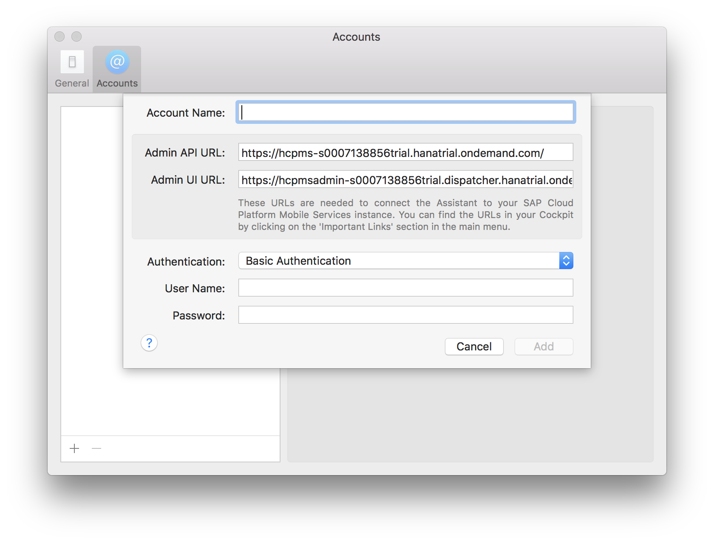

Provide the following additional details:

| Field | Value |
|----|----|
| Name | A descriptive name for the configuration, for instance `SAP Cloud Platform Mobile Services` |
| Authentication Type | `Basic Authentication` |
| User | Your trial account user |
| Password | Password for your trial account user |

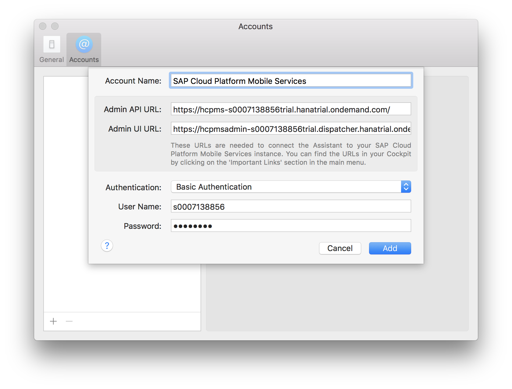

Click **Add** when finished. The account is now added to the SDK Assistant:

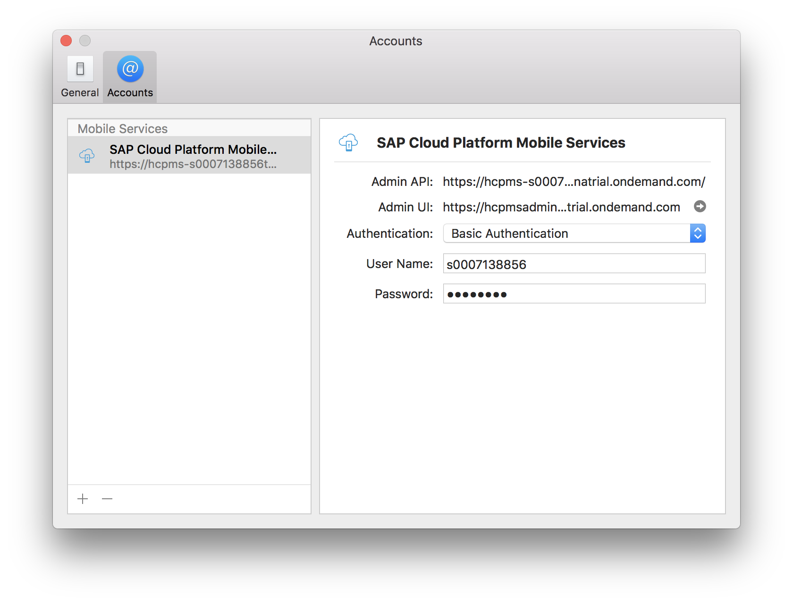

Close the **Accounts** dialog.

[DONE]
[ACCORDION-END]

[ACCORDION-BEGIN [Step 2: ](Run the SAP Cloud Platform SDK for iOS Assistant)]

> **Note**: If you went through "Step 1 - Configure SAP Cloud Platform SDK for iOS Assistant", the SAP Cloud Platform SDK for iOS Assistant is already running and you may continue to "Step 3 - Create an Xcode Project".

.

Double-click the **SAP Cloud Platform SDK for iOS Assistant** icon to start the application. If no applications have been generated previously, you will see the initial screen:

[DONE]
[ACCORDION-END]

[ACCORDION-BEGIN [Step 3: ](Create an Xcode Project)]

Click the **Plus** button on the top-right of the SDK Assistant. The first page of the Xcode Project generation wizard lets you define the Project Properties.

Enter the following details:

| Field | Value |
|----|----|
| Product Name | `MyDeliveries` |
| Author | `<your name>` |
| Organization Name | `<your company name>` |
| Organization Identifier | `com.sap.tutorials.demoapp` |
| Destination | `<choose a local destination>` |

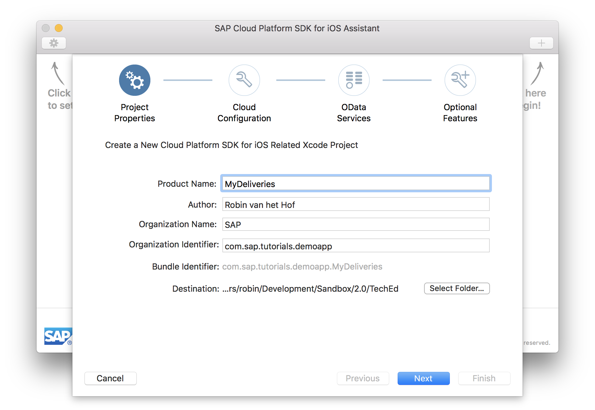

Click **Next** to advance to the **SAP Cloud Platform mobile service for development and operations Configuration** step.

[VALIDATE_3]

[ACCORDION-END]

[ACCORDION-BEGIN [Step 4: ](SAP Cloud Platform mobile service for development and operations Configuration details)]

In the **SAP Cloud Platform mobile service for development and operations Configuration** page, select the **Create** tab button.

Enter the following details:

| Field | Value |
|----|----|
| Application Name | `MyDeliveries` |
| Application Identifier | `com.sap.tutorials.demoapp.MyDeliveries` |
| Authentication Type | `SAML Authentication` |

Click **Next** to advance to the **OData Services** step.

[DONE]
[ACCORDION-END]

[ACCORDION-BEGIN [Step 5: ](OData Services)]

In the **OData Services** page, you can define the back end connection. Here you will add the OData endpoint for the `DeliveryService` OData service.

Click the **Plus** button, and from the context menu, select **New Destination...**. A dialog opens:

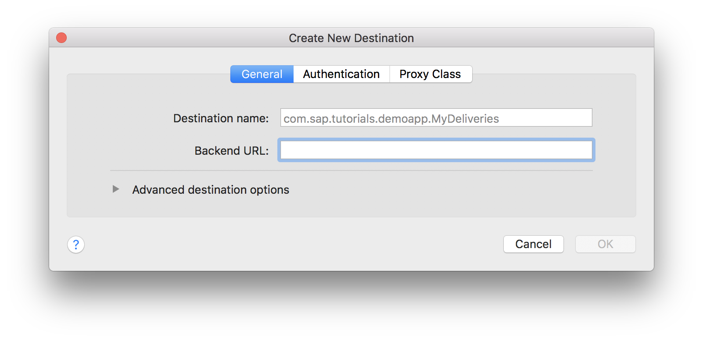

At the **General** tab, enter the following details:

| Field | Value |
|----|----|
| Backend URL | `https://sapdevsdd27584c4.us2.hana.ondemand.com/codejam/wwdc/services/DeliveryService.xsodata` |

Expand the **Advanced destination options** node, and set the following:

| Field | Value |
|----|----|
| Proxy Type | `Internet` |
| URL rewrite mode | `Rewrite URL` |
| Maximum connections | `Server default` |

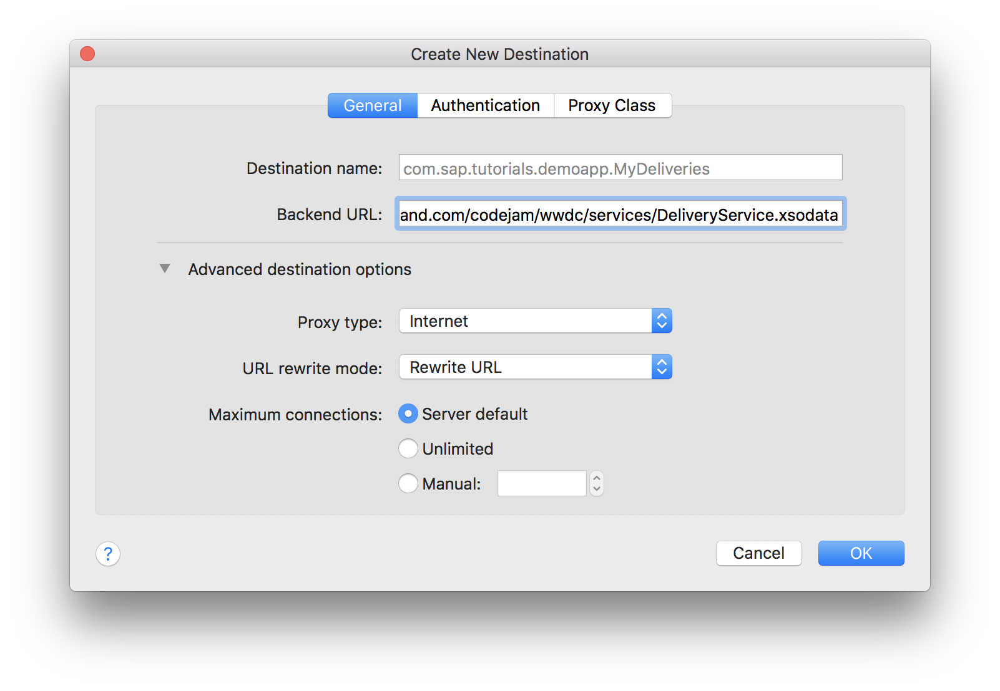

At the **Authentication** tab, make sure **Authentication Type** is set to **No Authentication**.

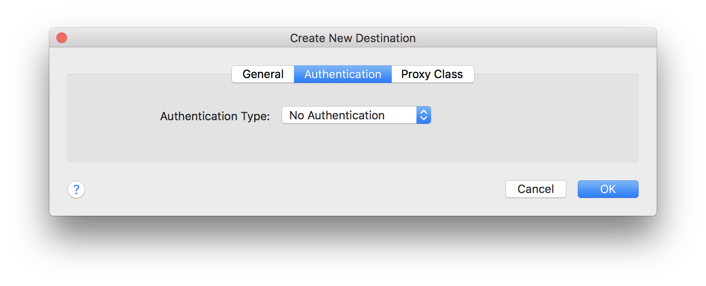

Click **OK** to save the backend configuration. It is now listed in the available destinations:

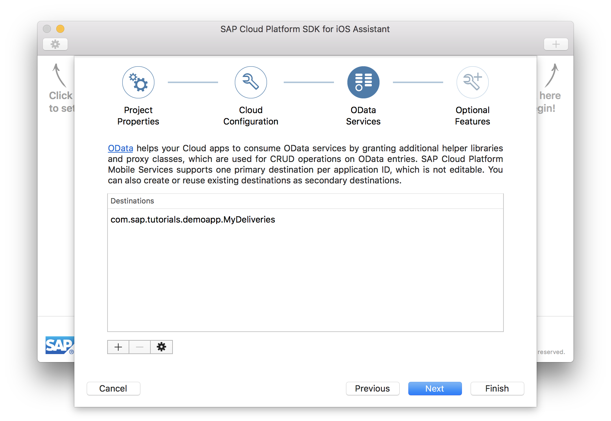

Click **Next** to advance to the **Optional Features** step.

[DONE]
[ACCORDION-END]

[ACCORDION-BEGIN [Step 6: ](Optional Features)]

In the **Optional Features** page, you have the option to generate a **Master-Detail Application**, enable **logging** and **log uploads**, and enable **remote notifications**.

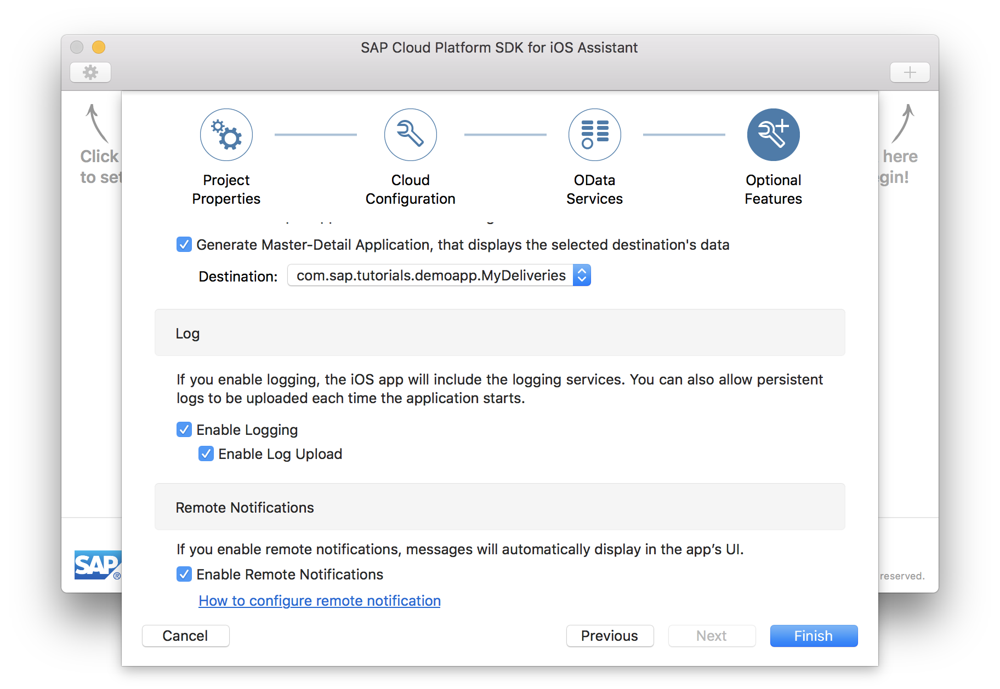

Make sure the checkboxes **Generate Master-Detail Application**, **Enable Logging** and **Enable Log Upload** are selected and click **Finish** to complete the wizard.

> Most likely the checkbox for **Remote Notifications** is disabled. This happens because no APNS endpoint is configured for the application definition in SAP Cloud Platform mobile service for development and operations. Once configured with a valid certificate, this option becomes available.

[DONE]
[ACCORDION-END]

[ACCORDION-BEGIN [Step 7: ](Generating the Xcode project)]

After you have clicked **Finish** in the previous step, the SDK Assistant now loads the OData service's metadata. This metadata describes the data model, and can be accessed via `<service URL>$metadata`. For your service, the metadata URL would be `https://sapdevsdd27584c4.us2.hana.ondemand.com/codejam/wwdc/services/DeliveryService.xsodata/$metadata`
Based on this metadata, the OData proxy classes will be generated for the Xcode project.

In addition, the configuration settings you have provided in the SDK Assistant are now being sent to SAP Cloud Platform mobile service for development and operations.

> **NB:** If you have already 3 native applications defined in SAP Cloud Platform mobile service for development and operations, the SDK Assistant will give the following error:

> 

> In that case, log on to your **SAP Cloud Platform mobile service for development and operations** account at `https://hcpms-<your_user_id>trial.dispatcher.hanatrial.ondemand.com/` and navigate to **Mobile Applications > Native/Hybrid**. Select one of the available application configurations and delete in order for the SDK Assistant to add the new application configuration.

<!--
NB: In some cases the loading of the metadata fails, and a dialog will open asking you to import the metadata manually:

In order to upload the metadata file, you need to download it first. Open a browser to the aforementioned metadata URL `https://sapdevsdd27584c4.us2.hana.ondemand.com/codejam/wwdc/services/DeliveryService.xsodata/$metadata`

From the menu, select **File > Save Page As...** and save the file in **XML text** format locally:

Switch back to the **SAP Cloud Platform SDK for iOS Assistant**, select the just downloaded `$metadata.xml` file and click **Open**:

The SDK Assistant should now finish gracefully.
-->
[DONE]

[ACCORDION-END]

[ACCORDION-BEGIN [Step 8: ](Examine the generated Xcode Project)]

After the SDK Assistant has finished, **Xcode** will launch and open the just generated `MyDeliveries` project.

The `Main.storyboard` shows split-view setup for the generated Master-Detail views.

Folder `MyDeliveries/Onboarding` contains logic for the user on-boarding, authentication and handling of pass-codes and Touch ID.

Folder `Proxy Classes` contains the OData proxy classes generated from the OData service. File `DeliveryService.swift` acts as a data service provider to gain access to the OData entities. The two files `PackagesType.swift` and `DeliveryStatusType.swift` are classes for the OData entities `Packages` and `DeliveryStatus`, respectively. These classes give access to the various properties of the OData entities.

[DONE]
[ACCORDION-END]

[ACCORDION-BEGIN [Step 9: ](Build and run the generated application)]

Click the **Run** button to build and run the generated application:

The **Simulator** app now launches. If you have configured the app to allow for push notifications, you will get the following pop-up:

Press **Allow** and click the blue **Start** button.

The **SAML** login screen of **SAP Cloud Platform mobile service for development and operations** is shown. Enter your login credentials for the SAP Cloud Platform and press the **Log On** button:

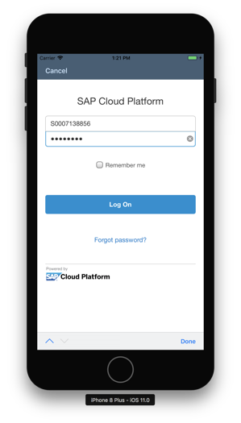

The app now gives you the option to enable Touch ID for quick access to your app. Since you are running from the simulator, you can click **Not Now**

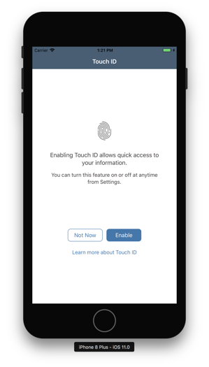

Now, you should provide a passcode with a minimum of 8 characters. Enter a numeric passcode:

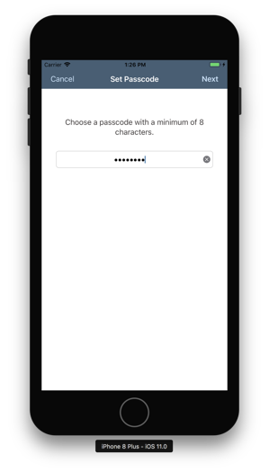

Click **Next**, confirm the passcode, and click **Done**.

The app starts with an overview of the available **Collections** of the OData service:

[DONE]
[ACCORDION-END]

[ACCORDION-BEGIN [Step 10: ](Examine the generated application)]

If you click on the `Packages` collection, you navigate to a **Master** list with all available `Package` entities:

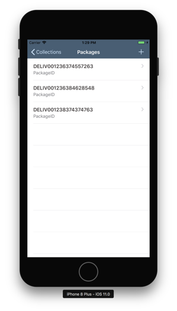

If you click on one of the `Package` entities, you navigate to a **Detail** page which lists all the properties for the selected entity:

[DONE]
[ACCORDION-END]

<!-- ## Next Steps
- [Implement a new Table View Controller](https://www.sap.com/developer/tutorials/fiori-ios-scpms-deliveryapp-part3.html) -->
