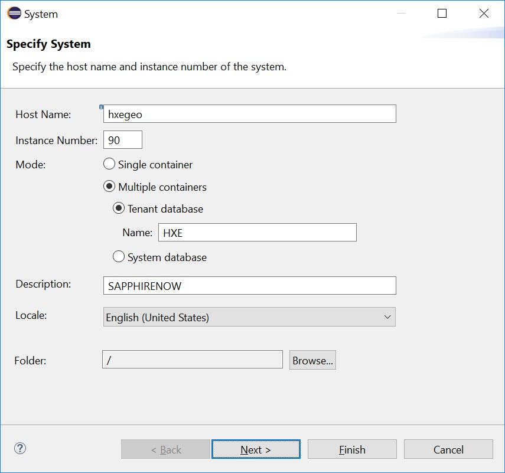
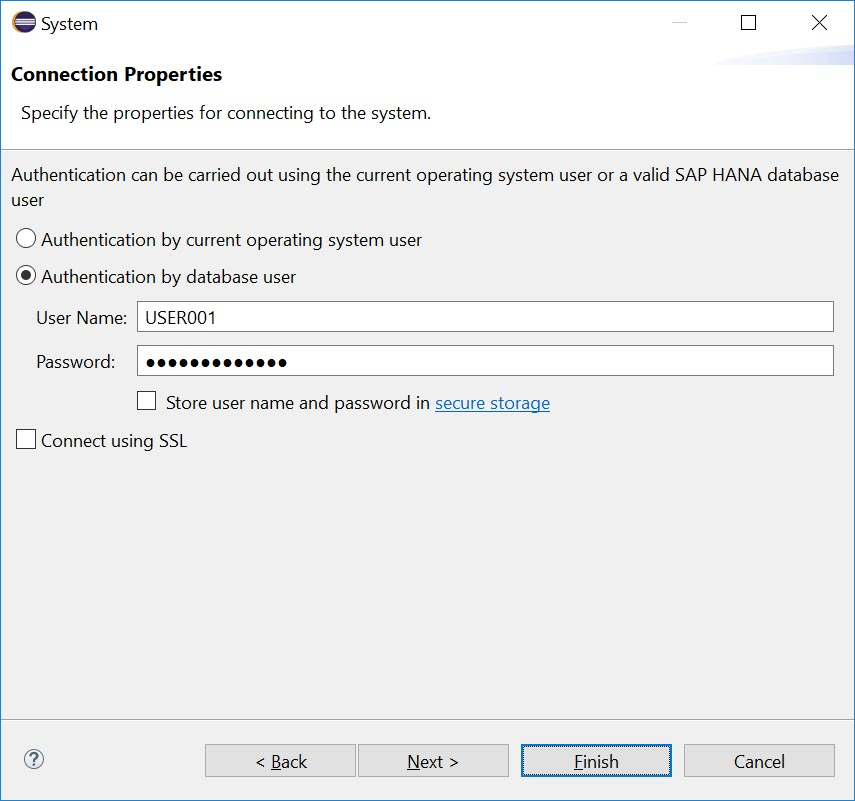
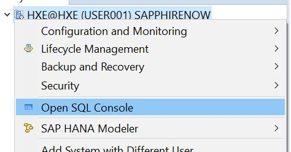
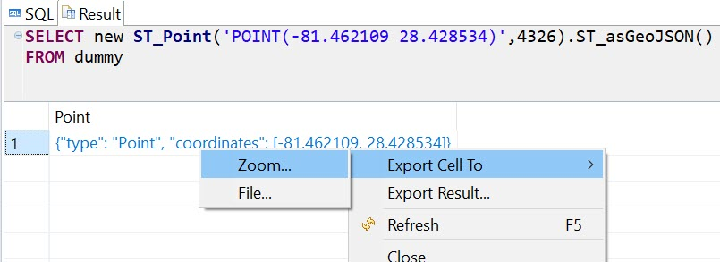
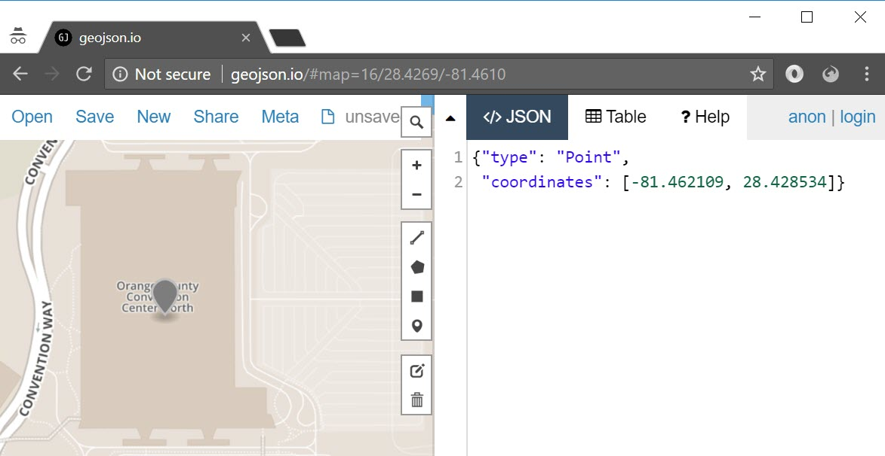

## Prerequisites  
 - **Proficiency:** Beginner

## Details
### You will learn  
  - What SQL Geospatial standard is and how to use SAP HANA with it

### Time to Complete
**5 Min**

---

[ACCORDION-BEGIN [Step 1: ](Connect to the SAP HANA instance)]
Welcome to a tutorial showing you how to start with Geospatial SQL with SAP HANA!

The instance of the database with the preloaded data is available to you, so you need to connect to it first.

You will be using Eclipse IDE.

Start Eclipse on this machine, if the application is not yet running. You can use an icon on the desktop or in the taskbar.


Next, make sure you have the proper perspective open in Eclipse, by going to menu **Window > Perspective > Open perspective > SAP HANA Administration Console**.

Check if the system `HXE@HXE(USER001)` already exists in the left **Systems** panel.

If it does, then right-click it and select **Log On**.


Type the password **`Sapphirenow18`** and click **OK**. Proceed to Step 3.

If the system `HXE@HXE(USER001)` is missing in the left **Systems** panel, then go to Step 2 to configure it.

[ACCORDION-END]

[ACCORDION-BEGIN [Step 2 (optional): ](Configure the system in Eclipse)]

If system `HXE@HXE(USER001)` is not present, then add it by right click on the area `Systems`, and selecting **Add System...** command.

Populate the first screen **Specify system** with following parameters

| Parameter | Value |
| --- | --- |
| Host Name | `hxegeo` |
| Instance Number | `90` |
| Mode | `Multiple containers` -> `Tenant database` |
| Name | `HXE` |
| Description | `SAPPHIRENOW` |



Click **Next**

On the **Connection Properties** screen in the option **Authentication by database user**, enter the following:

|Parameter |Value |
|:---|:--- |
| User Name | `USER001` |
| Password | `Sapphirenow18` |



Click **Finish**.

[ACCORDION-END]


[ACCORDION-BEGIN [Step 3: ](Introduction to Spatial data)]
SAP HANA includes a spatial engine and supports spatial data types and methods for processing spatial data. Spatial data is data that describes the position, shape, and orientation of objects in a defined space.

Spatial support in SAP HANA database follows the **`ISO/IEC 13249-3` "SQL multimedia and application packages -- Part 3: Spatial"** (`SQL/MM`) standard. This standard defines:

 - How to store, retrieve and process spatial data using SQL
 - How spatial data is to be represented as values
 - Which functions are available for converting, comparing, and processing this data in various ways

A key component of this standard is the use of the ___spatial data types hierarchy___. Within the hierarchy, the prefix `ST` is used for all data types (also referred to as ___classes___ or ___types___).


For example, a point can represent your current location, a polygon can represent a country's area, and a collection of line strings can represent a network of roads.

[ACCORDION-END]

[ACCORDION-BEGIN [Step 4: ](Make your first geospatial query)]
It's time to write your first geospatial processing query!

In Eclipse, right-click the system, and choose **Open SQL Console**.



In the console window, enter or paste the following code:

```sql
SELECT new ST_Point('POINT(1 0)') FROM dummy;
```

Click the **Execute** icon, or press `F8`.


> ### What just happened?
>
> 1. `dummy` is a special system table in SAP HANA to select one record, like you would do to select a string with `SELECT 'Hello SAPPHIRENOW!' FROM dummy;` or to calculate number of days left until SAP TechEd conference in Las Vegas with `SELECT DAYS_BETWEEN (NOW(), TO_DATE('2018-10-02', 'YYYY-MM-DD')) "days until SAP TechEd" FROM dummy`
> 2. `ST_POINT()` is one of constructors to create a point, or a single location in space. You need to use a key word `new` in front of constructors
> 3. `'POINT(1 0)'` is the text representation of a point in **Well Known Text (WKT)** format. A point has `x` and `y` coordinates. In this example `x=1` and `y=0` on a two-dimensional Euclidean plane. WKT is a text markup language for representing vector geometry objects defined by the Open Geospatial Consortium (OGC). SAP HANA follows this industry standard
> 4. `0101000000000000000000F03F0000000000000000` is the binary representation of the point you just constructed. To be more precise, it is **WKB**, or **Well Known Binary** representation, which is a part of the same standard from OGC. It has to be converted to be readable by human.

[ACCORDION-END]

[ACCORDION-BEGIN [Step 5: ](Convert geospatial format to GeoJSON)]
In the SQL console window, enter or paste the following new query:

```sql
SELECT new ST_Point('POINT(-81.462109 28.428534)',4326).ST_asGeoJSON() as "Point"
FROM dummy;
```

Execute it by clicking the icon, or pressing `F8`.


> ### What just happened?
>
> 1. You added additional parameter `4326` to the constructor. It tells SAP HANA, that the point is to be constructed using **Spatial Reference System (SRS)** with id `SRID = 4326`. This SRS is the one that is used by GPS satellite navigation system. It has been assigned id `4326` in [EPSG Geodetic Parameter Dataset](http://www.epsg-registry.org/) maintained by the International Association of Oil & Gas Producers (IOGP).
> 2. SAP HANA supports this and almost 4000 other spatial reference systems from EPSG dataset. Users can define and add there own reference systems as well. The complete list and further details can be found in SAP HANA system view `"PUBLIC"."ST_SPATIAL_REFERENCE_SYSTEMS"`
> 3. SRS `4326` defines Round Earth model with latitude and longitude coordinates. Please note that longitude coordinate should be first, followed by latitude. So, in the example above the latitude is `28.428534` (or `28°25'42.7" North`) and longitude is `-81.462109` (or `81°27'43.6" West`).
> 4. To make the result readable for a human you used a geospatial method `.ST_asGeoJSON()` that converted the output to JSON-based standard notation `{"type": "Point", "coordinates": [-81.462109, 28.428534]}`.
> 5. GeoJSON is the popular standard for open data sets, and can be read not only by humans, but as well by other applications.

[ACCORDION-END]

[ACCORDION-BEGIN [Step 6: ](Visualize data with geojson.io)]
Copy the result of the previous query. To do that, right-click the cell and choose **Export Cell to > Zoom**. You can do the same by double-clicking on the cell with the result.



Then select the result in the dialog window and copy it (e.g., using `Ctrl+C`).

Now, in the new web browser window, open <http://geojson.io>. Paste the GeoJSON result of the query into the **JSON** pane of the service. The location should render automatically on the left, and you can check what this geography point represents.



[ACCORDION-END]

---
