## Prerequisites  
- **Proficiency:** Beginner
- **Tutorials:** [Configuring Eclipse with SAP Cloud Platform Tools for Java](https://www.sap.com/developer/tutorials/hcp-java-eclipse-setup.html)

## Next Steps
- Select a tutorial from the [Tutorial Navigator](https://www.sap.com/developer/tutorial-navigator.html) or the [Tutorial Catalog](https://www.sap.com/developer/tutorial-navigator.tutorials.html)

## Details
### You will learn  
In this tutorial you will create a Dynamic Web project, a servlet to respond to a browser request and after running it in your local development environment, deploy it to SAP Cloud Platform.

### Time to Complete
**15 Min**.

---


[ACCORDION-BEGIN [Step 1: ](Open your Eclipse IDE)]

The first step in building your application is to create a new Dynamic Web Project. Open your Eclipse IDE with the installed SAP Cloud Platform Tools. Make sure the **Java EE perspective** is open by choosing **Window > Open Perspective > Other**.

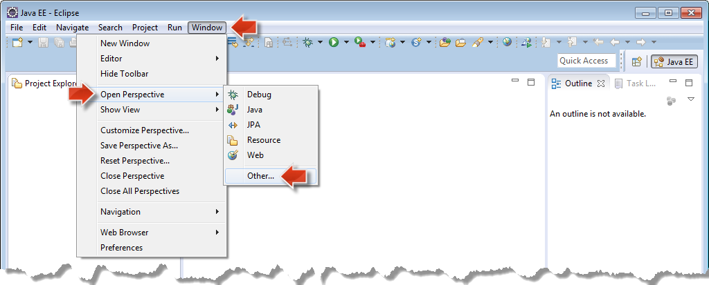


[ACCORDION-END]

[ACCORDION-BEGIN [Step 2: ](Choose Java EE (Default))]

Then choose the perspective **Java EE (Default)** and confirm by clicking **OK**.

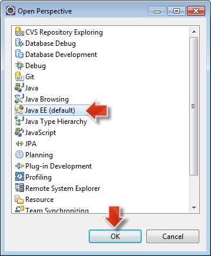

The J2EE perspective is now open.


[ACCORDION-END]

[ACCORDION-BEGIN [Step 3: ](Open Dynamic Web Project )]

In the Eclipse main menu choose **File > New > Dynamic Web Project** to open the respective wizard.


[ACCORDION-END]

[ACCORDION-BEGIN [Step 4: ](Set project name)]

In the **New Dynamic Web Project Wizard** define the **Project name** to be `helloworld`. Make sure the **Target Runtime** is set to `Java Web`, the Server Runtime Environment that has been created in the tutorial [Configuring Eclipse with SAP Cloud Platform Tools for Java](https://www.sap.com/developer/tutorials/hcp-java-eclipse-setup.html). Leave all other settings untouched and click **Finish** to create the project.

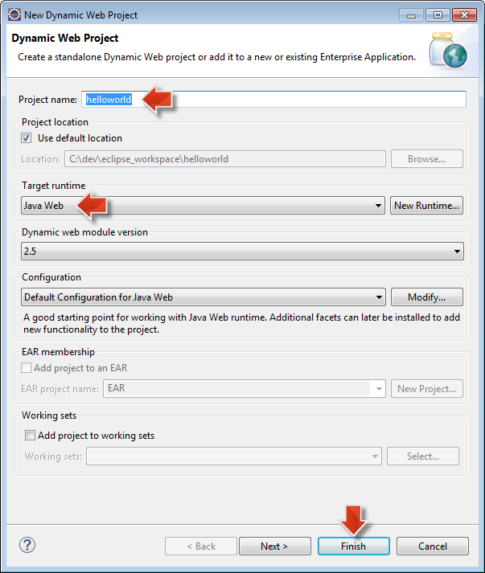

The `helloworld` project is now ready for your code.


[ACCORDION-END]

[ACCORDION-BEGIN [Step 5: ](Create new servlet)]

In Java EE, web applications are implemented as `Servlets`. On the newly created `helloworld` project node, open the context menu with a right-click and choose **New > Servlet** to open the Create Servlet wizard.

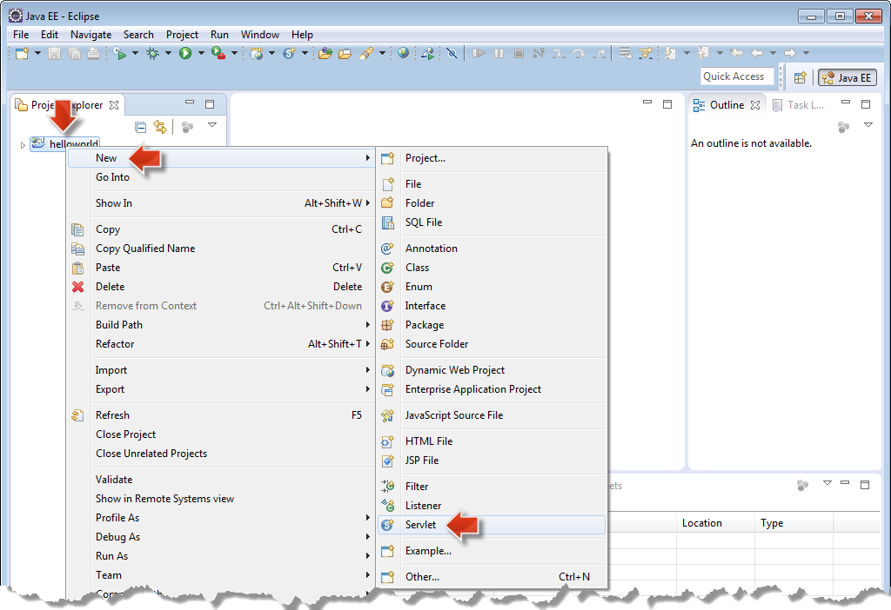


[ACCORDION-END]

[ACCORDION-BEGIN [Step 6: ](Set class name)]

In the Create Servlet wizard enter `helloworld` as Java package and `HelloWorldServlet` as Class name. This will create Java classes with the respective package and name. Choose **Next**.

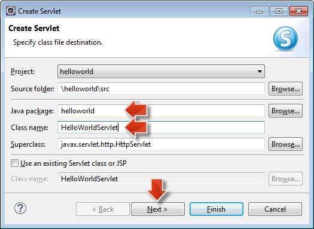


[ACCORDION-END]

[ACCORDION-BEGIN [Step 7: ](Set URL mapping)]

You will want this Servlet to be accessible via the URL `<servername>/helloworld`, for example `http://localhost:8080/helloworld`. For this we will set the URL mapping to `\`. For this select `/HelloWorldServlet` in the **URL mappings** field and choose **Edit**.

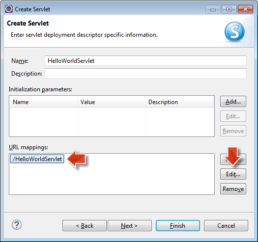


[ACCORDION-END]

[ACCORDION-BEGIN [Step 8: ](Change URL pattern)]

In the **Pattern** field, replace the current value with just `/`. Confirm with **OK**.

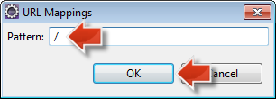


[ACCORDION-END]

[ACCORDION-BEGIN [Step 9: ](Generate servlet)]

Click **Finish** to generate the servlet.

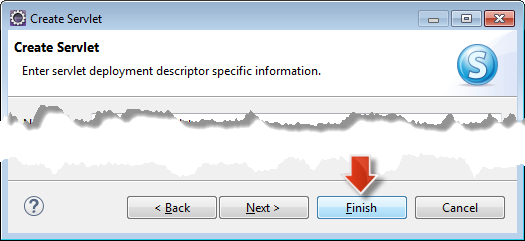


[ACCORDION-END]

[ACCORDION-BEGIN [Step 10: ](Servlet opening)]

The Java Editor will open the corresponding `HelloWorldServlet` class in the editor pane. You will also find the `Servlet` under the **`helloworld` project node > Java Resources > `src` > `helloworld` > `HelloWorldServlet.java`**

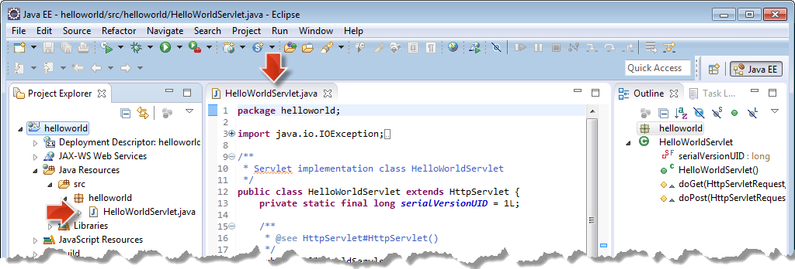


[ACCORDION-END]

[ACCORDION-BEGIN [Step 11: ](Write hello world code)]

Next, you will edit the Servlet to output the classical "Hello World". For this you will modify the `doGet()` method and add the following code and save your changes.


```java
/**
 * @see HttpServlet#doGet(HttpServletRequest request, HttpServletResponse response)
 */
protected void doGet(HttpServletRequest request, HttpServletResponse response) throws ServletException, IOException {
    response.getWriter().println("Hello World!");
}
```


The application is now ready to run.


[ACCORDION-END]

[ACCORDION-BEGIN [Step 12: ](Run on server)]

To test your application before deploying it to the SAP Cloud Platform you can run it on a local runtime. To do this, do the following:

Navigate to your `HelloWorldServlet.java` via the **`helloworld` project node > Java Resources > `src` > `helloworld` > `HelloWorldServlet.java`**. Open the context menu on the `Servlet` with a right-click and choose the **Run on Server** option.


[ACCORDION-END]

[ACCORDION-BEGIN [Step 13: ](Manually define server)]

Make sure that **Manually define a new server** is selected and choose **SAP > Java Web Server** as server type. Leave all other settings unchanged and click **Finish**.

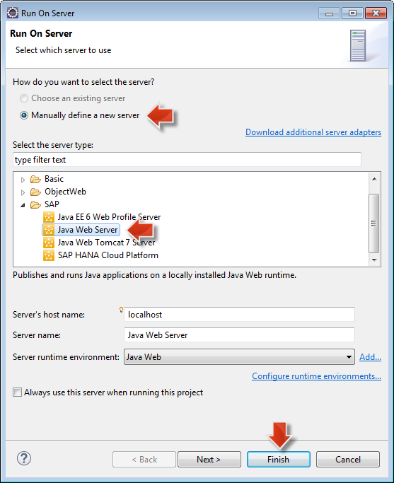


[ACCORDION-END]

[ACCORDION-BEGIN [Step 14: ](View running server)]

A local server will start with your `helloworld` application deployed. After the server is ready your application will be opened in a browser within Eclipse and greet you with "Hello World!". In the **Servers** view you can also see the running server with your application deployed.

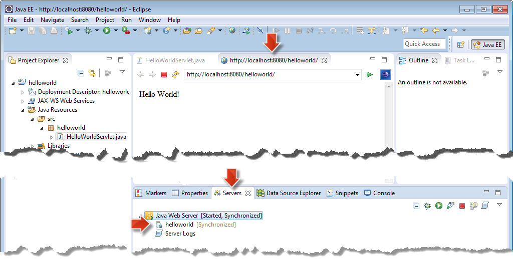


[ACCORDION-END]

[ACCORDION-BEGIN [Step 15: ](Run on the SAP Cloud Platform)]

To run your application on the SAP Cloud Platform you will choose a different server to run it. Again, navigate to your `HelloWorldServlet.java` via the **`helloworld` project node > Java Resources > `src` > `helloworld` > `HelloWorldServlet.java`**. Open the context menu on the Servlet with a right-click and choose the **Run on Server** option.


[ACCORDION-END]

[ACCORDION-BEGIN [Step 16: ](Select SAP Cloud Platform as server type)]

As before, make sure that **Manually define a new server** is selected. This time choose **SAP > SAP Cloud Platform** as server type. Make sure to set the **Landscape host** to `hanatrial.ondemand.com`. Leave all other settings unchanged and choose Next.

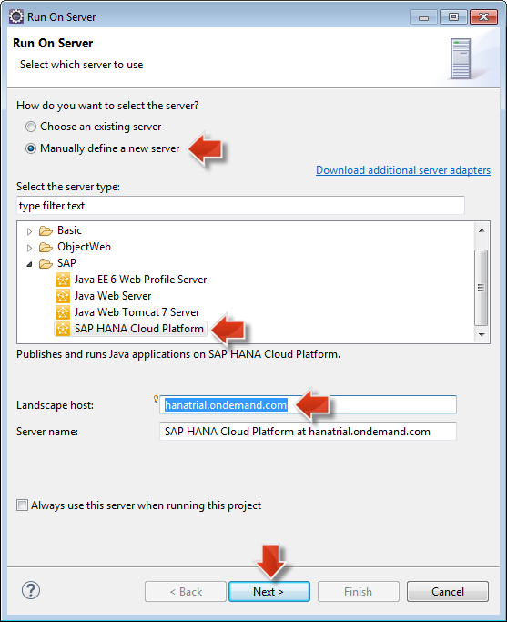

> Note: The used Landscape host `hanatrial.ondemand.com` is only valid if you are using a free Developer Account. Please change the landscape host if you want to use a productive account. The respective landscape hosts can be found in the [official documentation](https://help.hana.ondemand.com/help/frameset.htm?e4986153bb571014a2ddc2fdd682ee90.html).


[ACCORDION-END]

[ACCORDION-BEGIN [Step 17: ](Specify the Application name)]


On the next wizard page specify the Application name to be `helloworld`, provide the login information for your SAP Cloud Platform account and click **Finish**:

Field Name     | Value
:------------- | :-------------
Account Name   | Your SAP Cloud Platform account name, for example `p1234567890trial`
Username       | Your SAP Cloud Platform account name, for example `p1234567890` and your password

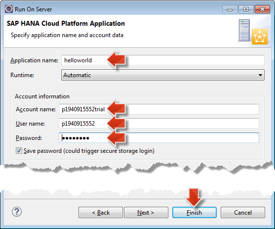


[ACCORDION-END]

[ACCORDION-BEGIN [Step 18: ](View running server)]

A Cloud server will start that has your `helloworld` application deployed. After the server is ready your application will be opened in a browser in Eclipse and greet you with Hello World!. In the **Servers** view you can also see the running server with your application deployed

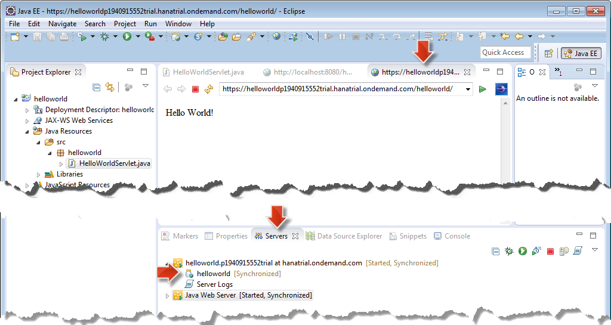

Congratulations: You have your first application running on the SAP Cloud Platform!


[ACCORDION-END]


### Optional
Now that you are familiar with the basic routine of developing applications and deploying them locally and to the cloud, you may want to check out the [samples](https://help.hana.ondemand.com/help/frameset.htm?937ce0d172bb101490cf767db0e91070.html) provided as part of the SAP Cloud Platform SDK.

Related Information

- (Official documentation) [Deploying Applications](https://help.hana.ondemand.com/help/frameset.htm?e5dfbc6cbb5710149279f67fb43d4e5d.html)
- (Official documentation) [Deploying Locally from Eclipse IDE](https://help.hana.ondemand.com/help/frameset.htm?0f16c9db4a9c407abb1b4987c0afe714.html)
- (Official documentation) [Deploying on the Cloud from Eclipse IDE](https://help.hana.ondemand.com/help/frameset.htm?60ab35d9edde43a1b38cf48174a3dca2.html)
- (Official documentation) [SDK Samples](https://help.hana.ondemand.com/help/frameset.htm?937ce0d172bb101490cf767db0e91070.html)


## Next Steps
- Select a tutorial from the [Tutorial Navigator](https://www.sap.com/developer/tutorial-navigator.html) or the [Tutorial Catalog](https://www.sap.com/developer/tutorial-navigator.tutorials.html)
