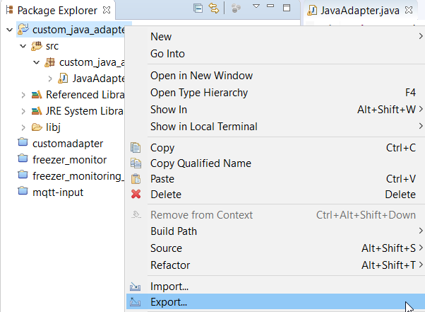
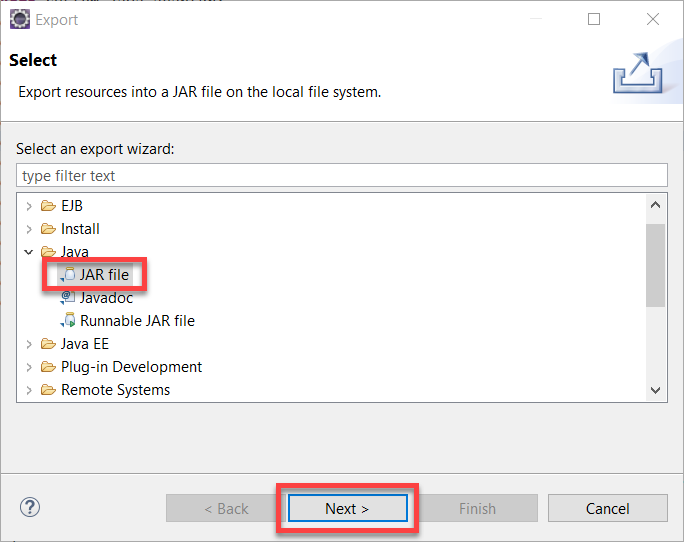
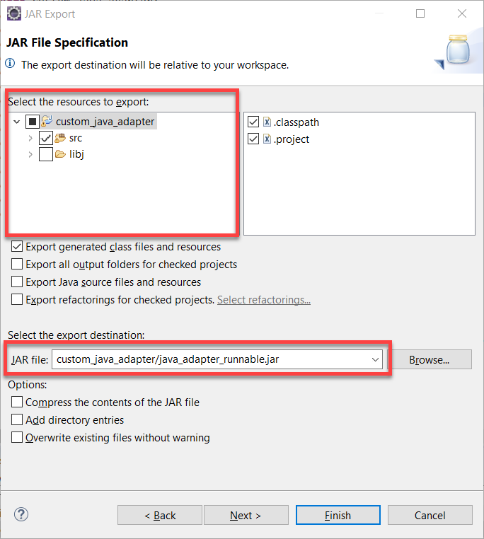
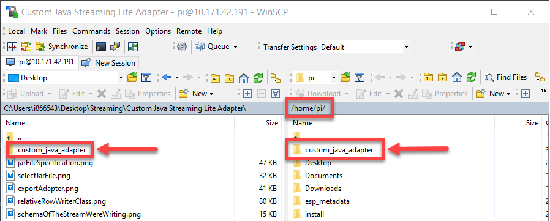
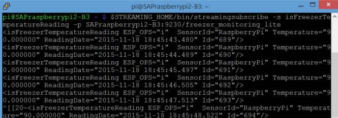

## Prerequisites  
 - **Proficiency:** Beginner
 - **Tutorial:** [Code the Streaming Lite Custom Java Adapter](https://www.sap.com/developer/tutorials/hsa-lite-custom-java-adapter-part3.html)

## Details
### You will learn  
 - How to deploy our Custom Java Adapter into a .jar file
 - How to transfer the .jar file to our Raspberry Pi
 - How to test our Custom Java Adapter by subscribing to the event streams

## Next Steps
 - Select a tutorial group from the [Tutorial Navigator](https://www.sap.com/developer/tutorial-navigator.html) or the [Tutorial Catalog](https://www.sap.com/developer/tutorial-navigator.tutorials.html)

### Time to Complete
**15 Min**

---

[ACCORDION-BEGIN [Step 1: ](Deploy the Adapter)]

After we have finished coding the adapter, we can go ahead and create a jar file.

Right click the project name in the Package Explorer and click `"Export"`.



Choose `Jar` file, and click Next.



On the subsequent screen, make sure to check off only the `"src"` folder under `"Select the resources to export"`.

Under "Select the export destination", put our folder name `(custom_java_adapter)`, and then the name of the jar file we want to create. We will be calling it `"java_adapter_runnable.jar"`. Click Finish.



Connect to your `Raspberry Pi` using `WinSCP`.

Copy over the entire `custom_java_adapter` folder onto your `Raspberry Pi`, into the `/home/pi` directory



[DONE]

[ACCORDION-END]

[ACCORDION-BEGIN [Step 2: ](Test the Adapter)]

We will now start Streaming Lite and run our Custom Java Adapter. To see what our Custom Java Adapter is inputting, we will subscribe to the `isFreezerTemperatureReading` stream of our `freezer_monitoring_lite` project.

First, start up the freezer monitoring lite program in `PuTTY/SSH` by running:

```Bash

$STREAMING_HOME/bin/streamingproject --ccx $HOME/freezer_monitoring_lite.ccx --command-port 9230
```

Open up another `PuTTY/SSH` window to run our Custom Java Adapter. To run our adapter, run this command:

```Bash

java -cp "$HOME/custom_java_adapter/java_adapter_runnable.jar:$HOME/custom_java_adapter/libj/streaming-client.jar" custom_java_adapter.JavaAdapter
```

If it is successful, you should see this:


Next, we will subscribe to the `isFreezerTemperatureReading` stream. The `streamingsubscribe` executable comes with the installation of Streaming Lite, and is used to view the contents of any stream in a running project.

Open up a third `PuTTY/SSH` window, and run it using the following command. Make sure to replace **`<host>`** with your `FQDN` (Fully Qualified Domain Name):

```Bash

$STREAMING_HOME/bin/streamingsubscribe -s isFreezerTemperatureReading -p <host>:9230/freezer_monitoring_lite
```

If our Custom Java Adapter is working correctly, you will be able to see the rows being written into our input stream:



For the question below, select the correct answer, and click **Validate**.

[VALIDATE_1]

[ACCORDION-END]

---

## Next Steps
 - Select a tutorial group from the [Tutorial Navigator](https://www.sap.com/developer/tutorial-navigator.html) or the [Tutorial Catalog](https://www.sap.com/developer/tutorial-navigator.tutorials.html)
