## Prerequisites  
- **Proficiency:** Beginner
- **Tutorial:** [Add REST OData retrieval](https://www.sap.com/developer/tutorials/react-add-odata.html)

## Next Steps
- **Tutorial:** [Create child components](https://www.sap.com/developer/tutorials/react-child-components.html)


## Details
### You will learn  
In this tutorial series, we will explore another technology for Single Page Application (SPA) development - React.  React is another popular web framework, and is used by many companies for both internal and client-facing systems.  These tutorials will parallel our SAPUI5 tutorials, building a visual interface using Angular, and connecting it to an OData back end service.

### Time to Complete
**20 Min**.

---

#### REACT tutorial series
**Step 7**: Extend the current application in two areas:  First, add a header to the list of products.  The header will eventually contain dynamic items for the entire list.  Second, add a modal dialog box with product details.  When the user clicks on a row, the application will show this detail.

These are the steps:

1.  Add a header component to the list
2.  Add a dialog box with product details

---


[ACCORDION-BEGIN [Step 1: ](Add a header component to the list)] 

The list on the screen is nice, but it would be better if it had a header describing the data below.  We can add that header bar using Bootstrap to create bar, and a new REACT component to hold the HTML and code.

Open the `main.js` file, and add the following REACT component at the very top (above the `ListBox` component):

```javascript
var TitleBar = React.createClass({
render: function() {
	return (
		<nav className="navbar navbar-default navbar-fixed-top">
			<div className="container">
				<div className="navbar-header">
					<div className="navbar-brand">Product Overview</div>
				</div>
			</div>
		</nav>
	)
}
});
```

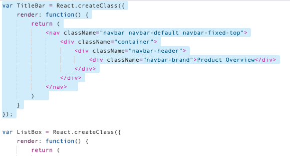


[ACCORDION-END]

[ACCORDION-BEGIN [Step 2: ](Display component)] 

To display the new `TitleBar` component, add it to the `ProductList` component below.  

**Replace** the JavaScript in to the `render` function with this new code:

```javascript
<div>
  <TitleBar />
  <div className="list-group">
      {productListBoxes}
  </div>
</div>
```

> **NOTE**
>
> Why did we add an additional `<div>` tag around everything?  
>
> HTML elements, like XML, use a tree hierarchy.  Normally, you can have several elements at the same level.  But, there is always a single **outer** element that encapsulates everything.  The same thing is true with the JMX pre-processor.  Every section of JMX code must be wrapped in a single outer element.
>
> In this case, we use a blank `<div>` tag as our outermost element.

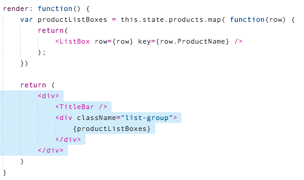


[ACCORDION-END]

[ACCORDION-BEGIN [Step 3: ](Run the application)] 

Run the application.  The navigation bar appears at the top.

Unfortunately, that navigation bar covers the first row of the list.


[ACCORDION-END]

[ACCORDION-BEGIN [Step 4: ](Modify the CSS)] 

To fix the title bar, so it no longer covers the list, modify the CSS file to push the list down the screen.  

Open your `main.css` file, and this CSS to the top.  (Don't forget to save!)

```css
body {
 padding-top: 50px;
}
```

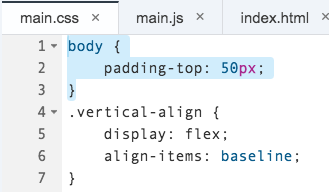


[ACCORDION-END]

[ACCORDION-BEGIN [Step 5: ](Run the application)] 

Run the application.  The header should now appear at the top, and the first row directly beneath.

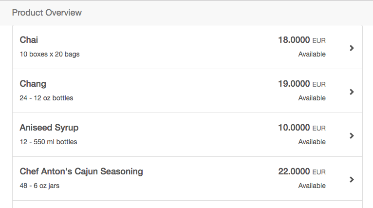


[ACCORDION-END]

[ACCORDION-BEGIN [Step 6: ](Add dynamic content)] 

Now that the header bar is in place, we can add additional dynamic content to it.  Start by adding a count of the number of products displayed.  

Open your `main.js` file again, and scroll to the `TitleBar` component.  Add the following JavaScript JMX to the `render` method, inside the `<div className="container">` section:


```javascript
<div className="nav navbar-nav navbar-right">
  <p className="navbar-text">Items: {this.props.count}</p>
</div>
```

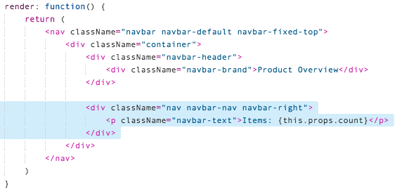


[ACCORDION-END]

[ACCORDION-BEGIN [Step 7: ](Add length property)] 

To send the data from the application to the `TitleBar`, modify the `ProductList` component.  **Add** the following property to the `<TitleBar />` component:

```javascript
count={this.state.products.length}
```

> The `length` property is a JavaScript property found on every array.

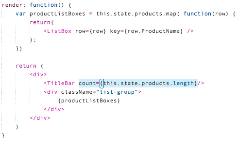


[ACCORDION-END]

[ACCORDION-BEGIN [Step 8: ](View the item count)] 

Run the application, and you will see the item count in the navigation bar.

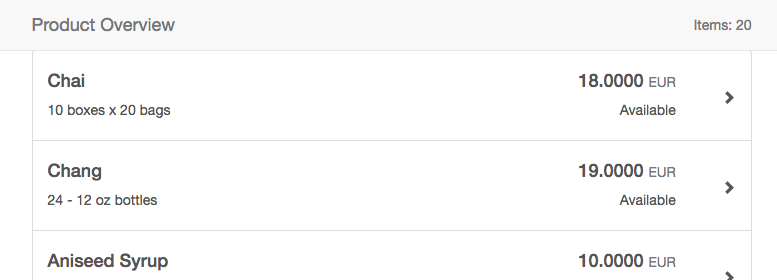


[ACCORDION-END]


[ACCORDION-BEGIN [Step 9: ](Adding a dialog box with product details)] 

When you click on a product, the application should respond with the details of that product.  In this example, and to showcase the Bootstrap options, a [modal dialog box]((https://getbootstrap.com/javascript/#modals)) will be used to display product details.


[ACCORDION-END]

[ACCORDION-BEGIN [Step 10: ](Add Bootstrap Modal dialog)] 

First, we need to add a [Bootstrap Modal dialog box](https://getbootstrap.com/javascript/#modals) to our HTML page.  

> A modal dialog box looks complicated, but it's not.  It's broken up in to three sections:  the header, the body, and the footer.  We will add the HTML for all three at the same time, and then modify it.
>
> Like all other REACT components, this dialog box will be part of the JavaScript code as a REACT component.  

To start, open the `main.js` file and add the following JavaScript component to the top of the file:

```javascript
var ModalProductDetail = React.createClass({
  render: function() {
      return (
          <div className="modal fade" tabIndex="-1" role="dialog" id="product-detail">
          	<div className="modal-dialog modal-lg" role="document">
          		<div className="modal-content">
          			<div className="modal-header">
          				<h4 className="modal-title">Title</h4>
          			</div>
          			<div className="modal-body">
          				<p>Modal body</p>
          			</div>
          			<div className="modal-footer">
          				<button type="button" className="btn btn-default" data-dismiss="modal">Close</button>
          			</div>
          		</div>
          	</div>
          </div>
      )
  }
});
```

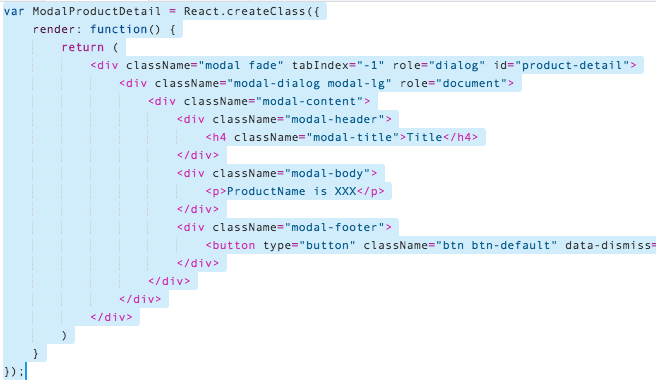


[ACCORDION-END]

[ACCORDION-BEGIN [Step 11: ](Modify getInitialState)] 

Next, add the code to handle the event, and open the dialog box.

> In order to activate the modal when the row is clicked, the REACT code requires two things.  First, a function is defined to handle the event call.  Second, the corresponding tag for the event is linked to the JavaScript function.  
>
> The exact location of these two elements is a little tricky.  In order to have a single modal that handles all rows, the dialog box is defined in the `ProductList` component.  So the method that handles the modal, and assigns the values to the modal, should be at the `ProductList` level.
>
> The link to the browser event, however, is in the `<button>` tag.  This tag is defined in the `ListBox` element.  
>
> To hook the two together, we will create the function to handle the event, and then pass a pointer to this function down to each `ListBox` element.  

First, the selected product must be stored in the component state.  We will define this in `getInitialState`.  In the `main.js` file, scroll to the `ProductList` component, and **replace** the `getInitialState:` attribute with this new code:

```javascript
getInitialState: function() {
return {
	products: [],
	selectedRow: null,
};
},
```

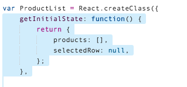


[ACCORDION-END]

[ACCORDION-BEGIN [Step 12: ](Handle click event)] 

Second, create a function to handle the click event on a row.  This function will set the state, and then open the modal.  

After the `getInitialState:` code, **add** the following JavaScript:

```javascript
onListBoxClick: function( row ) {
  this.setState({selectedRow: row});

  setTimeout( function() {
  	$('#product-detail').modal("show");
  });
},
```

> **Set Timeout?**  To make our modal work, the REACT code needs to do the following:  handle the click event, then render the modal, then display the modal.  In the click event, above, the state of the component is changed.  This will trigger a render event in REACT.  After that render event is completed, the dialog box should be displayed.
>
> In order to place the "display" part of that work at the very end of the processing chain, use the JavaScript `setTimeout()` method.  This places the function in to the event queue, at the end.  After all the other work is done, this event will be processed.  Then the modal will be shown.

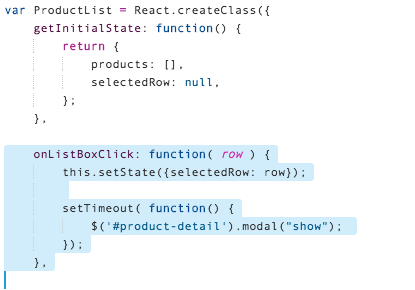


[ACCORDION-END]

[ACCORDION-BEGIN [Step 13: ](Pass the event to the component)] 

Third, pass the click handler event on to the `ListBox` component.  Scroll to the `render:` event in the `ProductList` component, and **replace** the `<ListBox />` JMX with the following code:

```javascript
<ListBox row={row} key={row.ProductName} clickEvent={this.onListBoxClick.bind(this, row)}/>
```

> This is a good example of the `bind()` JavaScript method.  The bind method attaches additional variables to the `clickEvent`.  This allows us to pass the current row to the `clickEvent` directly.

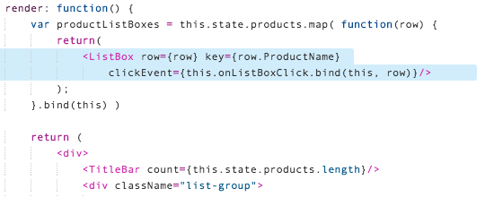


[ACCORDION-END]

[ACCORDION-BEGIN [Step 14: ](Add ModalProductDetail component to page)] 

Fourth, the `ModalProductDetail` component should be added to the web page.

> The modal dialog box has one problem.  If there is no current row selected, all the fields that should be displayed are not defined.  It is possible to modify the `ModalProductDetail` box with lots of if/then checks to avoid any undefined variable warnings.  
>
> The easier way is to only render the component if there is a valid value for the current row.  This is easy to do.  Simply place a ternary operator in the row that displays the `ModalDialogBox`

Scroll down to the `return(` section of the `render:` method, and add the following JavaScript code before the final `</div>` tag.

```javascript
{this.state.selectedRow == null ? null : <ModalProductDetail row={this.state.selectedRow} /> }
```

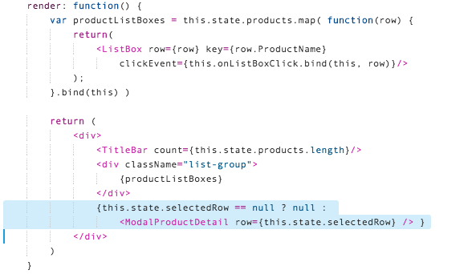


[ACCORDION-END]

[ACCORDION-BEGIN [Step 15: ](Display data in dialog)] 

Now, the data is being sent to the `ModalProductDetail` component.  The only remaining step is to display the data inside the modal box.

Scroll up to the `ModalProductDetail` component, and replace the text inside the `<div className="modal-body">` section with the following new JMX:

```javascript
<p>Product Name: {this.props.row.ProductName}</p>
<p>Unit Price: {this.props.row.UnitPrice}</p>
<p>Status: {this.props.row.Discontinued}</p>
<p>Category: {this.props.row.CategoryID} </p>
```

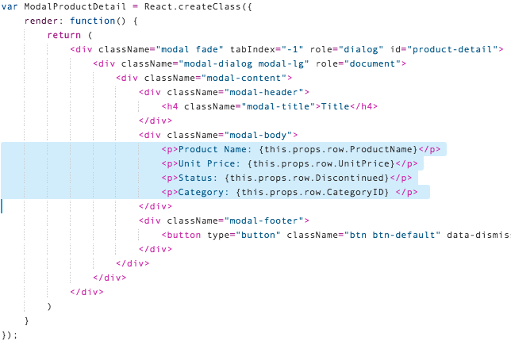


[ACCORDION-END]

[ACCORDION-BEGIN [Step 16: ](Run the application)] 

Run the application.  Click on a row, and the dialog box will display with the product information for that row inside.

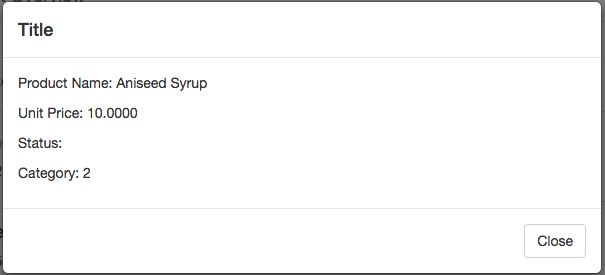


It doesn't look great, yet.  The next tutorial will update the modal with a Bootstrap Form, and make it much more presentable.


[ACCORDION-END]


[ACCORDION-BEGIN [Step 17: ](Review final code)] 

The only file modified was `main.js`.  This it the final code:

```javascript
var ModalProductDetail = React.createClass({
render: function() {
return (
<div className="modal fade" tabIndex="-1" role="dialog" id="product-detail">
	<div className="modal-dialog modal-lg" role="document">
		<div className="modal-content">
			<div className="modal-header">
				<h4 className="modal-title">Title</h4>
			</div>
			<div className="modal-body">
				<p>Product Name: {this.props.row.ProductName}</p>
				<p>Unit Price: {this.props.row.UnitPrice}</p>
				<p>Status: {this.props.row.Discontinued}</p>
				<p>Category: {this.props.row.CategoryID} </p>
			</div>
			<div className="modal-footer">
				<button type="button" className="btn btn-default" data-dismiss="modal">Close</button>
			</div>
		</div>
	</div>
</div>
)
}
});

var TitleBar = React.createClass({
render: function() {
return (
<nav className="navbar navbar-default navbar-fixed-top">
	<div className="container">
		<div className="navbar-header">
			<div className="navbar-brand">Product Overview</div>
		</div>

		<div className="nav navbar-nav navbar-right">
			<p className="navbar-text">Items: {this.props.count}</p>
		</div>
	</div>
</nav>
)
}
});

var ListBox = React.createClass({
render: function() {
  return (
<button type="button" className="list-group-item" id="product-list"
		onClick={this.props.clickEvent} >
	<div className="row vertical-align">
		<div className="col-sm-8 top">
			<h4>{this.props.row.ProductName}</h4>
			<p> {this.props.row.QuantityPerUnit}</p>
		</div>
		<div className="col-sm-3 text-right top">
			<h4>
				{this.props.row.UnitPrice}
				<small className="text-muted"> EUR</small>
			</h4>
			<p>{this.props.row.Discontinued ? "Discontinued" : "Available"}</p>
		</div>
		<div className="col-sm-1 center">
			<span className="glyphicon glyphicon-chevron-right pull-right" aria-hidden="true"></span>
		</div>
	</div>
</button>
);
}
});

var ProductList = React.createClass({
getInitialState: function() {
return {
products: [],
selectedRow: null,
};
},

onListBoxClick: function( row ) {
this.setState({selectedRow: row});

setTimeout( function() {
$('#product-detail').modal("show");
});
},

componentDidMount: function() {
var odataUrl = "/Northwind/V3/Northwind/Northwind.svc/";

$.ajax({
url: odataUrl + "Products" ,
dataType: 'json',
cache: false
})
.done( function( data, textStatus, jqXHR ) {
	this.setState( {products: data.value } )
}.bind(this)
)
.fail( function( jqXHR, textStatus, errorThrown ) {
console.log("Error", jqXHR, textStatus, errorThrown );
alert( "An arror occurred while retrieving data from the server: " + textStatus );
});
},

render: function() {
var productListBoxes = this.state.products.map( function(row) {
return(
	<ListBox row={row} key={row.ProductName}
		clickEvent={this.onListBoxClick.bind(this, row)}/>		
);
}.bind(this) )

return (
<div>
	<TitleBar count={this.state.products.length}/>
	<div className="list-group">
		{productListBoxes}
	</div>
	{this.state.selectedRow == null ? null :
		<ModalProductDetail row={this.state.selectedRow} /> }
</div>
)
}
});

ReactDOM.render(
<ProductList />,
document.getElementById('product-list')
);
```


[ACCORDION-END]

[ACCORDION-BEGIN [Step 18: ](Review additional resources)] 

Bootstrap:

- [`navbar`](https://getbootstrap.com/components/#navbar) - Put a navigation bar on the page
- [`modal`](https://getbootstrap.com/javascript/#modals) - to display a modal dialog.

JavaScript:

- [Using the `setTimeout()` method](http://www.w3schools.com/jsref/met_win_settimeout.asp)
- [Adding additional parameters with the `bind()` method](https://developer.mozilla.org/en-US/docs/Web/JavaScript/Reference/Global_Objects/Function/bind)


[ACCORDION-END]


## Next Steps
- **Tutorial:** [Create child components](https://www.sap.com/developer/tutorials/react-child-components.html)
