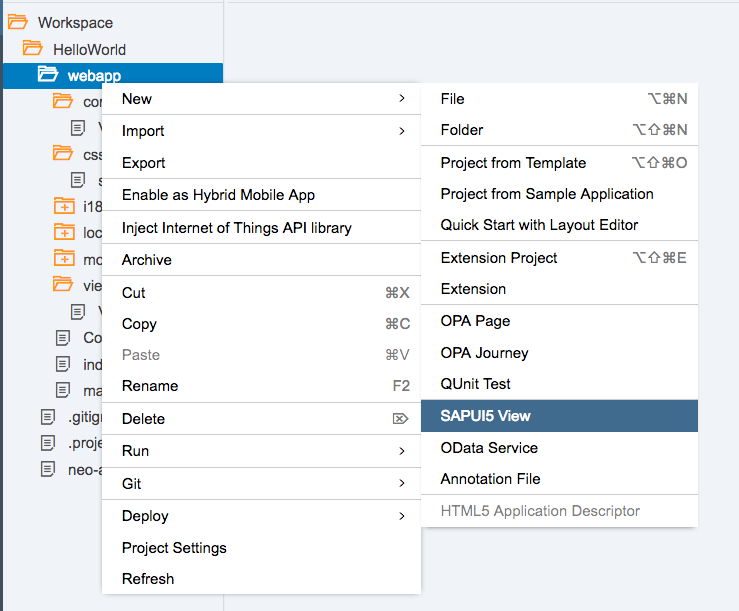
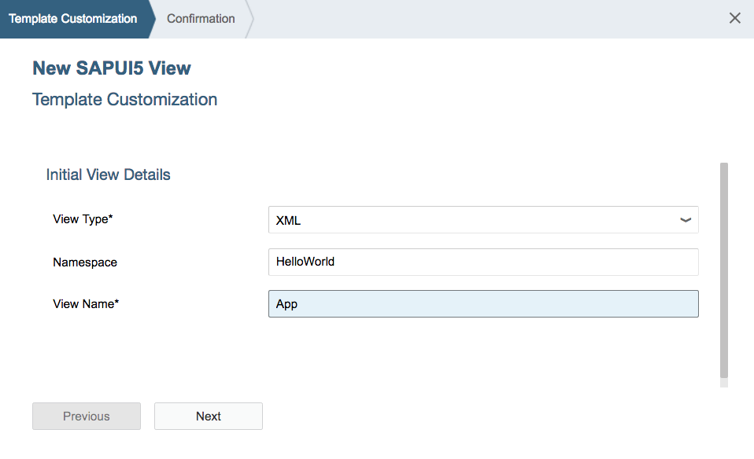
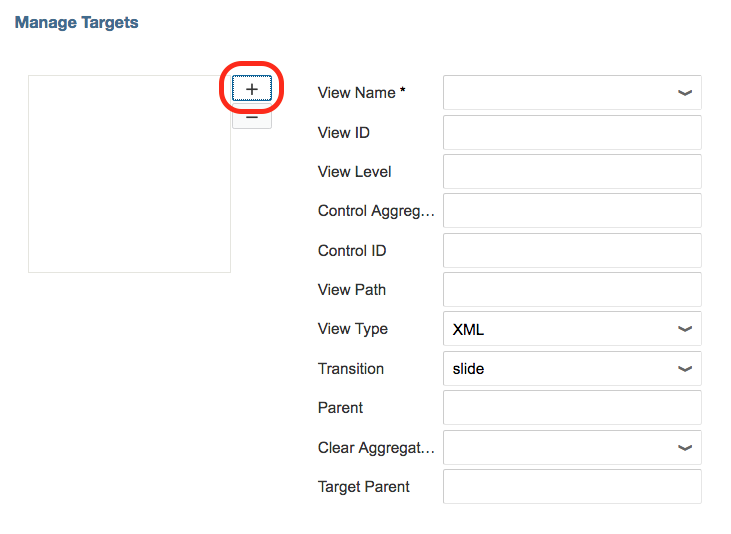
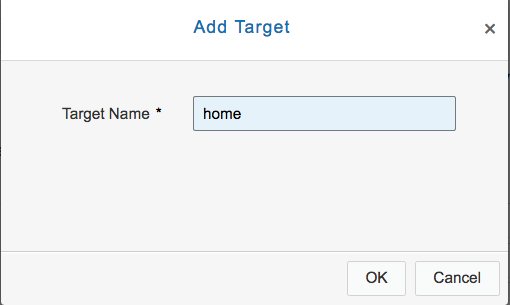
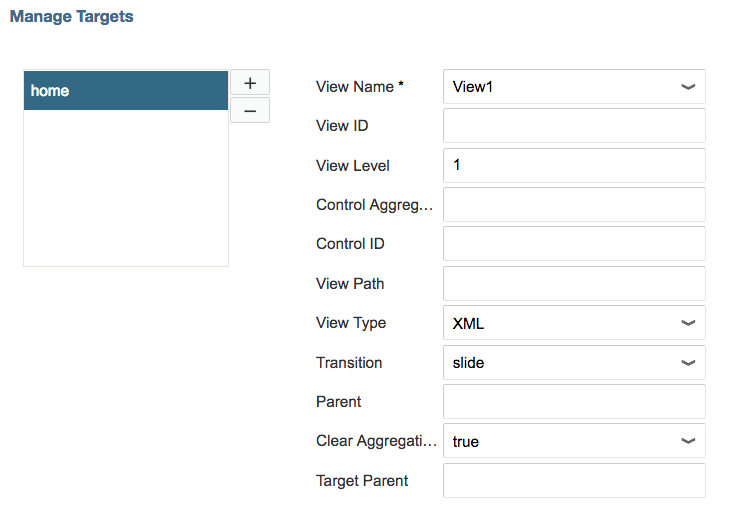
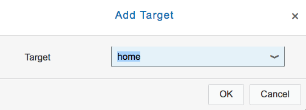
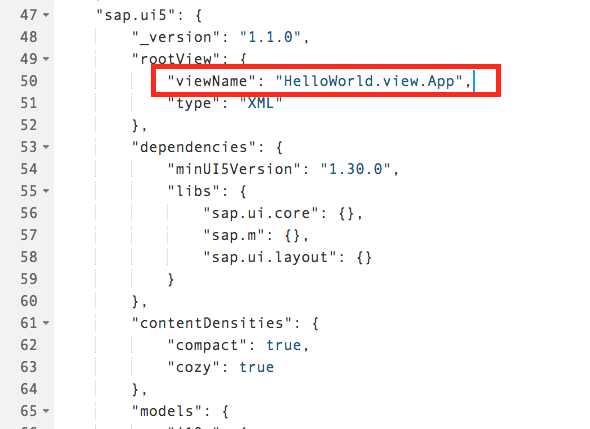

## Prerequisites  
- **Proficiency:** Beginner
- **How-To** [Start this tutorial series](https://www.sap.com/developer/tutorials/sapui5-webide-open-webide.html)
- **Tutorials:** This tutorial is part of a series.  The previous tutorial is part 4: [Add a list to the view](https://www.sap.com/developer/tutorials/sapui5-webide-add-list.html)

## Next Steps
 - The next tutorial in this series is Part 6: [Display List Details](https://www.sap.com/developer/tutorials/sapui5-webide-display-list-details.html)

## Details
### You will learn  
In order to enable navigating from one view to another, our app needs to be enabled for routing. With the newest version of SAPUI5, routing configurations are stored within the app descriptor called `manifest.json`.

### Time to Complete
**15 Minutes**.

---
>  **Web IDE** If you don't have the Web IDE open, follow these steps: [Enable and open the SAP Cloud Platform Web IDE](https://www.sap.com/developer/tutorials/sapui5-webide-open-webide.html)


You have to add a routing configuration to the descriptor file and initialize the router instance within the component definition (`webapp/Component.js`).

1.  Create a new SAPUI5 View called `App`.  

    To create a new SAPUI5 View, right click in the **`webapp`** folder, and then choose **New > SAPUI5 View**.  Enter the file name `App.view.xml`.

    > **IMPORTANT!** Be sure to right click in the **`webapp`** folder.  If you choose the wrong folder, the files will be created in the wrong place.  If this happens, delete the folders and start over.

    

2.  In the dialog box, change the **View Name** to `App`.  Then click on **Next**.  

    In the next page, click on **Finish**.  (You do not need to overwrite the existing file.)

    

3.  Open the `App.view.xml` file, and replace the `<App>` tag with the following code:

    > Don't forget to save your files!

    ```xml
	   <App id="app"/>
    ```

    


4.  Open the `Mainfest.json` file again.  Click on the **Routing** tab at the top of the screen.

    Next, under *Default Configuration*, click the **Show More Properties...** link.

    

5.  Enter the following information in to the *Default Configuration* area:

    |       |       |
    |------:|------ |
    |View Path  |`HelloWorld.view`  |
    |View Type  |XML                |
    |Control ID |app                |
    |View Level |0                  |
    |Control Aggregation    |pages  |
    |Transition |slide              |


    

6.  Scroll down to the *Manage Targets* area.  Click on the **+** icon to create a new target.

    

7.  Enter the target name `home`.  Click on **OK**.

    

8.  Now, add the following properties to the new `home` target:

    |           |       |
    |----------:|------ |
    |View Name  |`View1`|
    |View Level |1      |

    

9.  Go up to the *Routes* section, and click on the **+** icon to create a new route.

    

10. Select the name `home` from the *Name* drop down box.  Then click the **+** icon in the *Targets* column.

    

11. Select the target **home**, and then click **OK**.

    

12. In the same `manifest.json` file, we will switch to the **Code Editor** tab, which is on the bottom of the screen.

    

13. Scroll to the `rootView` section, and *Change* the following line:

    ```javascript
    "viewName": "HelloWorld.view.App",
    ```

    


14. Open the `webapp/Component.js` file, and add the following to the `init:` section:

    ```javascript
    // create the views based on the url/hash
	this.getRouter().initialize();
	```

    

15. Open the `webapp/css/style.css` file, and change the *entire* file to the following:

    ```css
    .spacerTop {
	 	margin-top: 2rem;
	 }
	 .sap-tablet .sapMDialog,
	 .sap-desktop .sapMDialog {
		min-width: 18rem;
	 }
	 .sapMMessageDialog {
		width: 18rem;
	 }
	```

    

16. After this tutorial, you should be able to run your application again, but you will not see any changes.  All of the routing work occurs "behind the scenes" and is not visible to the user.   


## Next Steps
- The next tutorial in this series is Part 6: [Display List Details](https://www.sap.com/developer/tutorials/sapui5-webide-display-list-details.html)
