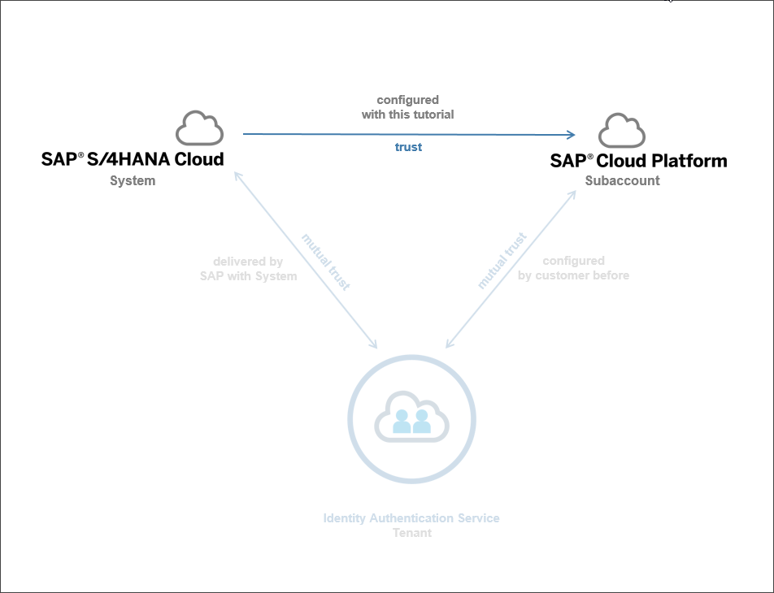
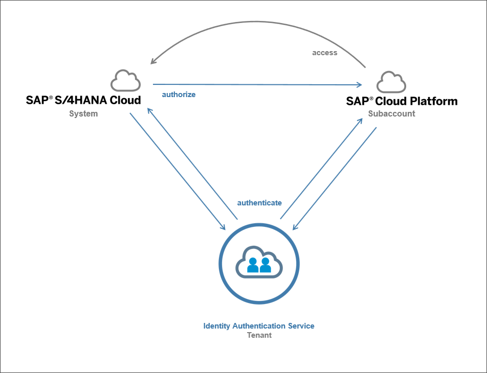
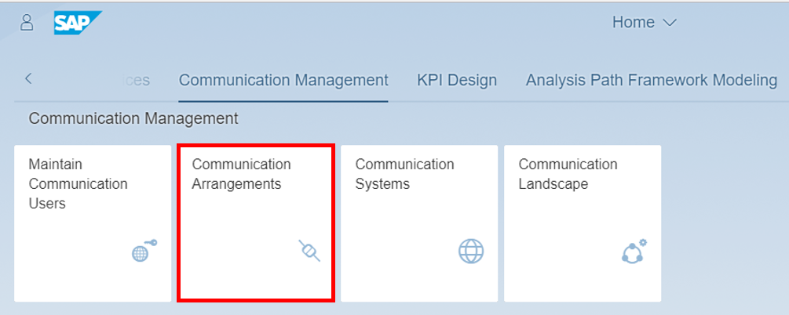
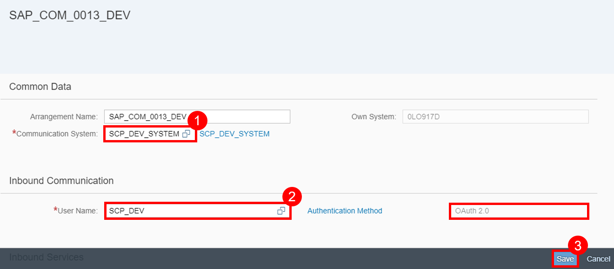
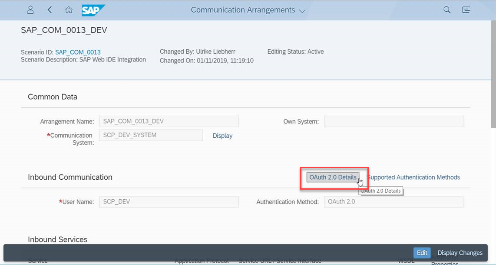
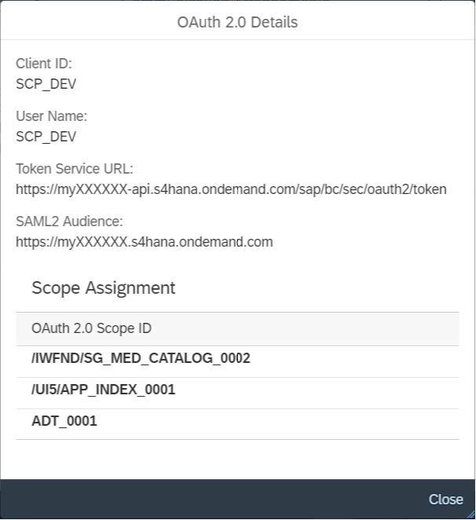
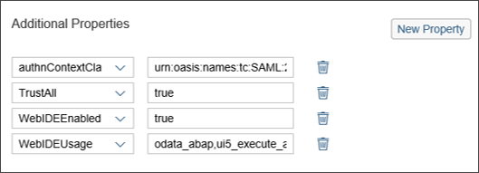
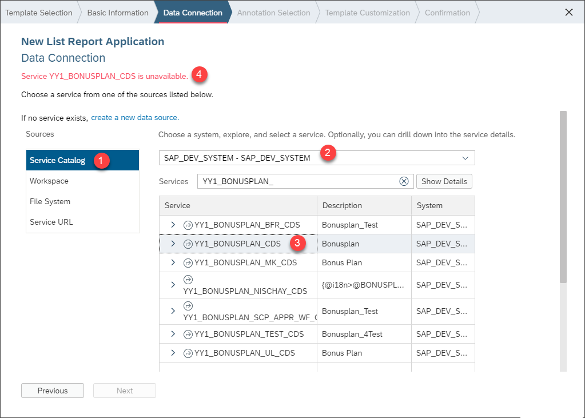

## Prerequisites
**Authorizations**: Your user needs
- a business role with business catalog **Communication Management** (ID: `SAP_CORE_BC_COM`) in your **S/4HANA Cloud** system
- Administrator access to your **SAP Cloud Platform** subaccount
- Developer access to your SAP Cloud Platform subaccount's **SAP Web IDE**

## Details
### You will learn
- How to create a communication arrangement for SAP Web IDE scenario `SAP_COM_0013` in S/4HANA Cloud
- How to create a HTTP destination to S/4HANA Cloud in SAP Cloud Platform
- How to create a UI project in SAP Web IDE

You will learn how to enable SAP Cloud Platform development with SAP Web IDE against a S/4HANA Cloud system via OAuth authentication. You will see that the communication arrangement for SAP Web IDE scenario `SAP_COM_0013` in S/4HANA Cloud will expose essential services, that SAP Web IDE needs. SAP Cloud Platform subaccount will get a destination which holds data for the connection and OAuth communication with the S/4HANA Cloud system. At the end you will see in SAP Web IDE a list of services that you can theoretically build extensions on.

Regarding the overall trust settings, you will now make your S/4HANA Cloud system trust your SAP Cloud Platform subaccount.

That enables its Web IDE to request data from the S/4HANA system during Custom UI development and finally to deploy that UI to the S/4HANA Cloud system. Both processes are so called inbound requests to the S/4HANA Cloud system.

### Additional Information
- **SAP S/4HANA Cloud Release** (tutorial's last update): 1902

---

[ACCORDION-BEGIN [Step 1: ](Connect S/4HANA Cloud with SAP Web IDE)]
Enter your S/4HANA Cloud system's Fiori Launchpad and open the **Communication Arrangements** application from **Communication Management**.

Click **New** to create a communication arrangement.

Select **`SAP_COM_0013`** as scenario, give a name and click **Create**.

Add your communication system to your communication arrangement. Select **`SCP_DEV`** with **`OAuth2.0`** as communication system. Be sure that your service status of your launch SAP Web IDE is activated and click **Save**.

[DONE]
[ACCORDION-END]

[ACCORDION-BEGIN [Step 5: ](Get S/4HANA Cloud OAuth Details)]
For the OAuth destination on SAP Cloud Platform being created in next steps you will need some OAuth details that you can get from the Communication Arrangement. Open the **OAuth 2.0 Details** from Inbound Communication section of the communication arrangement. Copy the data or simply leave the pop up open while maintaining the SAP Cloud Platform destination.

A pop up opens

You will need following data

| Label in S/4HANA OAuth Details |	Label in SAP Cloud Platform destination | equals to
|:-------------------------------|:------------------|:----
| Client ID	| Client Key | Communications System's Inbound User
| User Name |	Token Service User | Communications System's Inbound User
| Token Service URL	| Token Service URL | |
| Token Service URL: first parts (protocol + domain, for example: https://myXXXXXX-api.s4hana.ondemand.com) | URL | |
| SAML2 Audience| Audience | |

[DONE]
[ACCORDION-END]

[ACCORDION-BEGIN [Step 6: ](Connect SAP Web IDE's SAP Cloud Platform with S/4HANA Cloud)]
Enter the SAP Cloud Platform account as an administrator. Switch to **Destinations** and click **New Destination**.

Enter following **data** to your destination:

| ---------------------------- | ------------------------------------------------- |
|          **Name**            |            Name of your destination               |
|          **Type**            |                    `HTTP`                         |
|      **Description**         |            Description of your destination        |
|           **URL**            |  first parts (protocol + domain, for example: `https://myXXXXXX-api.s4hana.ondemand.com`) of **Token Service URL** in S/4HANA Web IDE communication arrangement OAuth details for inbound communication:     |
|       **Proxy Type**         |                  `Internet`                       |
|     **Authentication**       |            `OAuth2SAMLBearerAssertion`            |
|        **Audience**          | **SAML2 Audience** in S/4HANA Web IDE communication arrangement OAuth details for inbound communication |
|       **Client Key**         |          Equals your S/4HANA Web IDE communication system's inbound user           |
| **Token Service URL** | URL + `/sap/bc/sec/oauth2/token`|
|    **Token Service User**    |          Equals your S/4HANA Web IDE communication system's inbound user           |
| **Token Service Password**   |        Password of your S/4HANA Web IDE communication system's inbound user        |

Add additional properties:

| ----------------------------- | -------------------------------------------------------- |
| **`authnContextClassRef`**    |      `urn:oasis:names:tc:SAML:2.0:ac:classes:X509`       |
|       **`TrustAll`**          |                      `true`                              |
|     **`WEBIDEEnabled`**       |                      `true`                              |  
|      **`WebIDEUsage`**        |         `odata_abap,ui5_execute_abap,dev_abap`           |

**Save** your changes.

[DONE]
[ACCORDION-END]

[ACCORDION-BEGIN [Step 10: ](Test connection from SAP Web IDE to S/4HANA Cloud)]
<!--Start of equal part with abap-custom-ui-tile-->
In your SAP Cloud Platform Subaccount go to **Services**, search for **SAP Web IDE** and select it.

Click **Go to Service** to open SAP Web IDE.

Select **New Project from Template** to start wizard for UI project creation.

If you don't see this welcome page then follow the alternative way:

 **File** > **New** > **Project from Template**

Select the **List Report Application** template and click **Next** to create a new UI of this type.

Enter basic information for the project, like **`Bonusplan`** as name and title.

Click **Next**.

To add a data connection click **Service Catalog** and set the destination **`SAP_DEV_SYSTEM`** which you have previously created on your SAP Cloud Platform.
<!-- End of equal part with abap-custom-ui-tile-->

Now you can see a list of all custom services in the S/4HANA Cloud system. But if you try to select the `Bonusplan` service, you'll get an error message as it is not exposed yet. To finish creating your project, you have to expose that service before.

[DONE]
[ACCORDION-END]

[ACCORDION-BEGIN [Step 11: ](Test yourself)]

[VALIDATE_1]
[ACCORDION-END]
