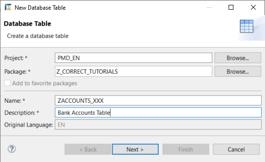
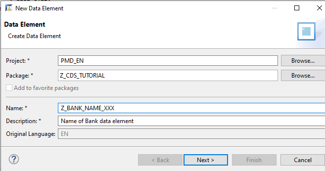
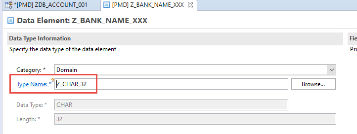
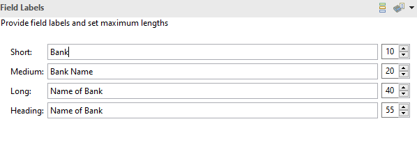
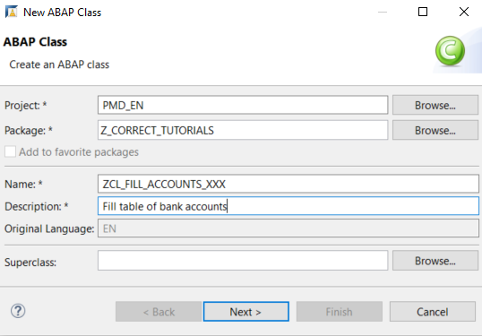

## Prerequisites  
- You have done one of the following:
    - You have a valid instance of SAP Business Technology Platform (BTP) ABAP Environment. For more information, see **Tutorial**: [Create Your First ABAP Console Application](abap-environment-console-application), steps 1-2
    - You have a valid instance of an on-premise AS ABAP server, version 7.52 or higher. (The text-based Table Editor is not available for earlier ABAP server versions). For a free AS ABAP server, 7.52, SP04, see [SAP Developers: Trials and Downloads - 7.52](https://developers.sap.com/trials-downloads.html?search=7.52)
- You have installed [ABAP Development Tools](https://tools.hana.ondemand.com/#abap), latest version
- You have downloaded or pulled the ABAP Flight Reference Scenario. To pull this reference scenario from `Github`, see [ Downloading the ABAP Flight Reference Scenario](https://help.sap.com/viewer/923180ddb98240829d935862025004d6/Cloud/en-US/def316685ad14033b051fc4b88db07c8.html)

## Details

### You will learn  
- How to create a table in ABAP, representing a table in your database
- How to create a reusable **domain**, which provides technical attributes for data elements
- How to create an elementary data type, or **data element**
- How to add an input check to a field. You can use this, for example, to check that the user is working in the correct client
- How to fill the table with three rows of test data

Tables are defined independently of the database in the ABAP Dictionary. When you activate the table in the Data Dictionary, the table is created in the underlying database.

The table in this tutorial will store bank account details for customers. The table will have the following columns (or **fields**):

- `client`
- `bank_customer_id`
- `account_number`
- `bank_name`
- `city`
- `balance`
- `currency`
- `account_category`
- `lastchangedat`


---

[ACCORDION-BEGIN [Step 1: ](Create table)]
Create a table in your package:

1. Select (right-click) the package and choose **New > Other ABAP Repository Object** from the context menu:

    !

2. Enter the filter text **Table > Database table**, then choose **Next**.

3. Enter a name such as `ZACCOUNTS_XXX` - always replacing `XXX` with your initials - and a description, then choose **Next**.

    !

4. Accept the proposed transport request and choose Finish.

The code for the table appears in a new editor. Ignore the annotations at the top for now.

!

[DONE]
[ACCORDION-END]

[ACCORDION-BEGIN [Step 2: ](Understand table fields)]
In the next step, you will define the table fields. First you need to understand your options:

**Built-in ABAP types and new types**

There are 3 ways to create a field for a database table:

  - **Built-in type**: The quickest: You specify a (pre-defined) primitive type, length, and description, but no more. You cannot then reuse this field. For more information, see [ABAP Keyword Documentation: Predefined Dictionary Types](https://help.sap.com/doc/abapdocu_752_index_htm/7.52/en-US/index.htm?file=abenddic_builtin_types.htm).

  - Use an **existing data element**: The most powerful: A data element describes both the technical and semantic attributes of a field, such as a currency, or a customer name. You can define properties such as search help and (translatable) column header, and then use the same data element in many contexts. You often define the technical attributes of the data element in a domain, so they can be reused.

  - Create a **new data element**: If you want to reuse the benefits of data elements - i.e. semantic attributes such as reuse of translatable column headers or a check table, but a suitable one does not exist yet.

    !

In this tutorial, you will create one domain and one data element. For the other fields, you will use a built-in type or existing data element.

**System clients**

One key field has been added automatically:

`client : abap.clnt;`

This specifies that the table is client-specific.
Tables can be cross-client or client-specific. Each client is a self-contained unit within an organization, such as a subsidiary. For client-specific tables, the client is the first key field in the table.

The field is also specified as `not null x`. This means that the field cannot be left blank. In this case, `abap.clnt` is automatically filled with the value of the current client (such as 001).

[DONE]
[ACCORDION-END]

[ACCORDION-BEGIN [Step 3: ](Add field account number using primitive type)]
Now you will add the field **`account_number`**, based on a primitive type.

1. Enter the following (including the period), then choose **Code completion (Ctrl+Space)**:

    ```ABAP
      key account_number : abap.
    ```

    !

2. From the dropdown list, choose `numc(len)` and specify `len` as 8. Also, specify this key field as not null:
  `key account_number : abap.numc(8) not null;`

[DONE]
[ACCORDION-END]

[ACCORDION-BEGIN [Step 4: ](Add field city using existing data element)]
Add a field based on a built-in domain.

1. In the editor, enter the name for your field, followed by a colon:  **city:**. Ignore the error for now.

2. Enter the type, by entering **`/DMO/C`** and using auto-complete (**`Ctrl+Space`**).

3. Then add a semi-colon:

    ```ABAP
    city: /dmo/city;

    ```

[DONE]
[ACCORDION-END]


[ACCORDION-BEGIN [Step 5: ](Create domain)]
1. From your package, select **Dictionary**, then choose **New > Domain** from the context menu.

    !

2. Enter following, then choose **Next**.
    - Name: **`Z_CHAR_32`**
    - Description: **Character Domain of Length 32**,


    !

3. Accept the default transport request and choose **Finish**.

4. In the editor, enter the following and choose **Save ( Ctrl+S )**.
    - Data Type: **`CHAR`**
    - Length: **32**

    !

[DONE]
[ACCORDION-END]


[ACCORDION-BEGIN [Step 6: ](Add field bank using new data element)]
Now add the field **`bank`**, based on a new data element, `z_bank_name_xxx`. You will get an error, which you will also fix in this step.

1. Select the new data element and choose **Get Quick Fix (Ctrl+1)**. From the list, choose **Create data element …** :

    !

2. The Create data element wizard appears. Enter a name and description and choose **Next**:

    !

3. Accept the default transport request and choose **Finish**:

4. You want your data element to have a character type. Enter the type name of your domain, by entering `Z_CHAR` and choosing **Auto-complete (`Ctrl+Space`)**:

    !

5. Now enter the field labels and lengths:

    !

6. Save and activate the data element (`Ctrl+S, Ctrl+F3`).

[DONE]
[ACCORDION-END]

[ACCORDION-BEGIN [Step 7: ](Remove error)]
Go back to your table, **`ZACCOUNTS_XXX`**. Run a syntax check  with **`Ctrl+F2`**. The error should disappear.

[DONE]
[ACCORDION-END]

[ACCORDION-BEGIN [Step 8: ](Add all other fields)]

  1. Now add other fields, so your code looks as follows. The field `Balance` will cause an error. Ignore this for now.

    ```ABAP
    define table ZACCOUNTS_TABLE_XXX {

      key client          : abap.clnt not null;
      key account_number  : abap.numc(8) not null;
      bank_customer_id    : /dmo/customer_id not null;
      bank_name           : z_bank_name_xxx;
      city                : /dmo/city;
      balance             : abap.curr(16,2);
      currency            : /dmo/currency_code;
      account_category    : abap.numc(2);
      lastchangedat       : timestampl;
    }
    ```

  2. Then choose Save (`Ctrl+S`) but **do not** activate your table yet.

[DONE]
[ACCORDION-END]

[ACCORDION-BEGIN [Step 9: ](Fix error)]
You will now fix the error caused by the field `Balance`:

1. Place your cursor on the error symbol (it will change from an arrow to a pointing finger). Then click on it:

    

2. The quick fix proposal appears. Choose (double-click on) the proposal **Assign currency code reference to field currency**

    !
  The error message disappears.

3. Save your changes (`Ctrl+S`), but again, do not activate the table yet.

[DONE]
[ACCORDION-END]

[ACCORDION-BEGIN [Step 10: ](Change technical settings)]
Before you activate the table, change the technical settings at the top as follows (or copy the code at the end of this step):

1. The label is derived from the description you entered; leave this.

2. **`EnhancementCategory`** : Place your cursor immediately after the hash symbol (#), delete the existing text, then choose **Auto-complete (`Ctrl+Space`)**:

    

3. Then choose `#EXTENSIBLE_CHARACTER_NUMERIC` from the dropdown list. Your table contains both character-type and numeric-type fields but does not contain any deep structures (such as a structure included within a table row).

4. Complete the other settings as follows (or copy the code below).
    - **`tableCategory`** : `#TRANSPARENT` = your table represents a table in the database.
      Tables are defined independently of the database in the ABAP Dictionary. When you activate the table in the Data Dictionary, the table is created in the underlying database. There is no need for any code to define the data in the database, nor for any vendor-specific code. Your database tables will be created in any database supported by the ABAP server.

    - **`deliveryClass`** : `#A` = application table, which stores master data and transaction data (default)

    - **`dataMaintenance`** : `#ALLOWED` = allows users to enter data manually in Table Maintenance (transaction SE16). (Generally, you would not do this, but it is useful for test purposes.)

```ABAP
@EndUserText.label : 'Bank Accounts'
@AbapCatalog.enhancementCategory : #EXTENSIBLE_CHARACTER_NUMERIC
@AbapCatalog.tableCategory : #TRANSPARENT
@AbapCatalog.deliveryClass : #A
@AbapCatalog.dataMaintenance : #ALLOWED
```

[DONE]
[ACCORDION-END]

[ACCORDION-BEGIN [Step 11: ](Save and activate)]
Save (`Ctrl+S`) and activate (`F3`) your table.

[DONE]
[ACCORDION-END]

[ACCORDION-BEGIN [Step 12: ](Add check table)]
Now you will add a check table for the field `bank_customer_id`. This checks the value of `bank_customer_id` against the field `customer_id` of the table `/dmo/customer`, using a foreign key relationship.

  1. Add the foreign key pointing to table `/dmo/customer`, where your field `bank_customer_id` points to the check table field `customer_id` :

    **`with foreign key [0..*,1] /dmo/customer
    where customer_id = ZACCOUNTS_XXX.bank_customer_id;`**

  2. Add the screen check, which checks user input against the values in `t000.mandt`:
  	`@AbapCatalog.foreignKey.keyType : #KEY
     @AbapCatalog.foreignKey.screenCheck : true`

  3. Your code should look like this:

```ABAP
@AbapCatalog.foreignKey.keyType : #KEY
@AbapCatalog.foreignKey.screenCheck : true
key bank_customer_id : /dmo/customer_id not null
  with foreign key [0..*,1] /dmo/customer
    where customer_id = ZACCOUNTS_XXX.bank_customer_id;
```

[DONE]
[ACCORDION-END]

[ACCORDION-BEGIN [Step 13: ](Save, activate, and check table code)]
Now, save (`Ctrl+S`) and activate (`Ctrl+F3`) your table. Your code should look like this:

```ABAP
@EndUserText.label : 'Bank Accounts'
@AbapCatalog.enhancementCategory : #EXTENSIBLE_CHARACTER_NUMERIC
@AbapCatalog.tableCategory : #TRANSPARENT
@AbapCatalog.deliveryClass : #A
@AbapCatalog.dataMaintenance : #LIMITED
define table ZACCOUNTS_XXX {
  key client           : mandt not null;

  @AbapCatalog.foreignKey.keyType : #KEY
  @AbapCatalog.foreignKey.screenCheck : true
  key bank_customer_id : /dmo/customer_id not null
    with foreign key [0..*,1] /dmo/customer
      where customer_id = ZACCOUNTS_XXX.bank_customer_id;

  account_number       : abap.numc(8) not null;
  bank_name            : z_bank_name_xxx;
  city                 : /dmo/city;
  @Semantics.amount.currencyCode : 'ZACCOUNTS_XXX.currency'
  balance              : abap.curr(16,2);
  currency             : /dmo/currency_code;
  account_category     : abap.numc(2);
  lastchangedat        : timestampl;

}

```

[DONE]
[ACCORDION-END]

[ACCORDION-BEGIN [Step 14: ](Test yourself)]

[VALIDATE_1]
[ACCORDION-END]

[ACCORDION-BEGIN [Step 15: ](Fill table: Create class)]
Finally, you will fill the table with three rows of test data:

1. First create the ABAP Class, by selecting your package and choosing **New > ABAP Class** from the context menu:

    

2. Enter a name **`ZCL_FILL_ACCOUNTS_XXX`** and description for your class (replacing `XXX` with your group number or initials).

    !

3. Assign a transport request and choose **Finish**.

The class appears in a new editor.

[DONE]
[ACCORDION-END]


[ACCORDION-BEGIN [Step 16: ](Add interface)]
1. Add the following interface to your class:

    ```ABAP
     interfaces if_oo_adt_classrun.
    ```

    This interface provides a light-weight solution for executing an ABAP program without launching a full user interface.
    It also lets you display text or data in the Console View.

2. Add the implementation for the **`main`** method of this interface by selecting the interface name and choosing **Add implementation...** from the context menu.

    !

[DONE]
[ACCORDION-END]


[ACCORDION-BEGIN [Step 17: ](Copy code)]
1. Add the following code to the method implementation:

    ```ABAP
    DATA: lt_accounts type table of ZACCOUNTS_XXX.

    "read current timestamp
    GET TIME STAMP FIELD DATA(zv_tsl).

    "fill internal table
    lt_accounts = VALUE #(

        ( client ='100' account_number ='00000001' bank_customer_id ='100001' bank_name ='Volksbank' city = 'Gaertringen' balance ='200.00 ' currency ='EUR' account_category ='01' lastchangedat = zv_tsl )
        ( client ='100' account_number ='00000002' bank_customer_id ='200002' bank_name ='Sparkasse' city ='Schwetzingen' balance ='500.00 ' currency ='EUR' account_category ='02' lastchangedat = zv_tsl )
        ( client ='100' account_number ='00000003' bank_customer_id ='200003' bank_name ='Commerzbank' city ='Nuernberg' balance ='150.00 ' currency ='EUR' account_category ='02' lastchangedat = zv_tsl )
    ).

    "Delete possible entries; insert new entries
    DELETE FROM ZACCOUNTS_XXX.

    INSERT ZACCOUNTS_XXX from table @lt_accounts.

    "Check result in console
    out->write( sy-dbcnt ).
    out->write(  'DONE!' ).

    ```

2. Save and activate ( **`Ctrl+S, Ctrl+F3`** ) your code.

[DONE]
[ACCORDION-END]


[ACCORDION-BEGIN [Step 18: ](Check your table in Data Preview)]
Select your table from the Project Explorer and choose **Open With > Data Preview** from the context menu (**F8**).

!

Your table should look like this:

!

You can also right click on the table and choose **Copy All Rows as ABAP Value Statement** from the context menu. You can then paste it into other code.

!

[DONE]
[ACCORDION-END]


### More Information
- SAP Help Portal: [Database Tables](https://help.sap.com/viewer/ec1c9c8191b74de98feb94001a95dd76/7.51.11/en-US/cf21ea43446011d189700000e8322d00.html)

- ABAP Keyword Documentation: [Domains](https://help.sap.com/doc/abapdocu_752_index_htm/7.52/en-US/index.htm?file=abenddic_domains.htm)

- ABAP Keyword Documentation: [Data Elements](https://help.sap.com/doc/abapdocu_751_index_htm/7.51/en-US/index.htm?file=abenddic_data_elements.htm)

- ABAP Keyword Documentation: [Glossary](https://help.sap.com/doc/abapdocu_752_index_htm/7.52/en-US/index.htm?file=abenclient_glosry.htm)

- ABAP for Cloud Keyword Documentation: [Glossary](https://help.sap.com/doc/abapdocu_cp_index_htm/CLOUD/en-US/index.htm?file=abenclient_glosry.htm)

---
