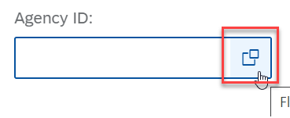
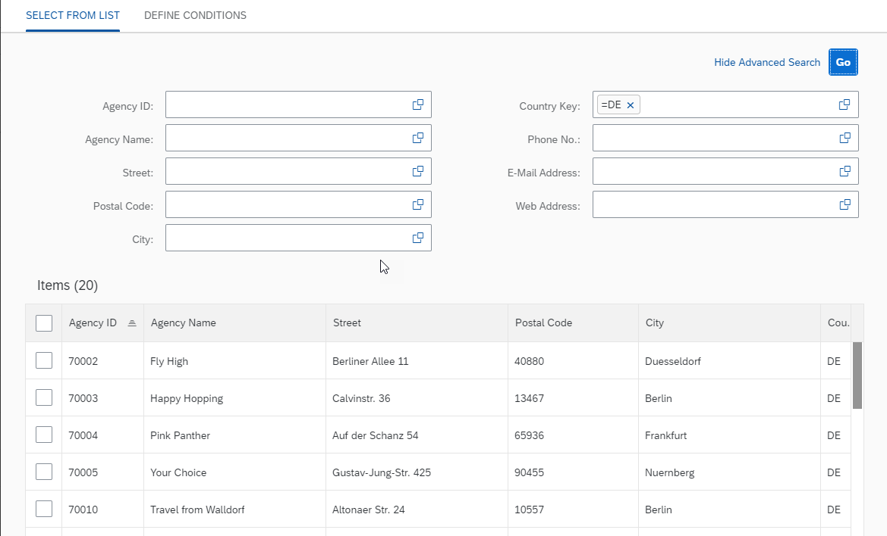
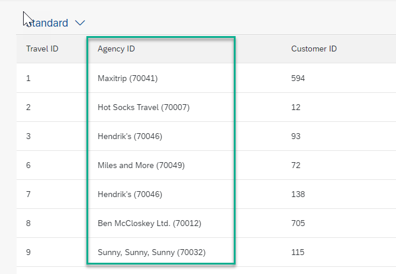
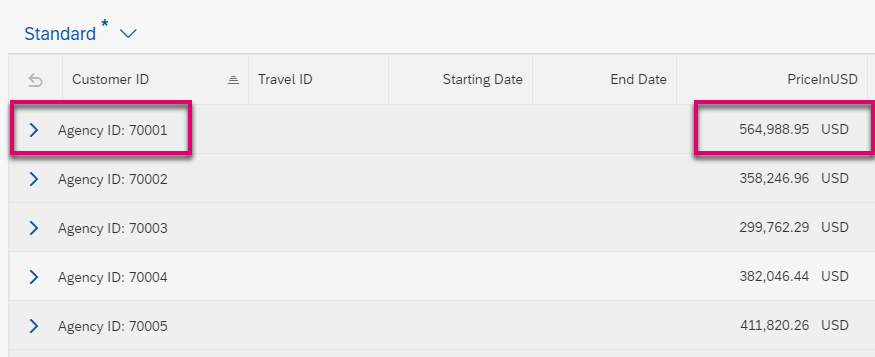
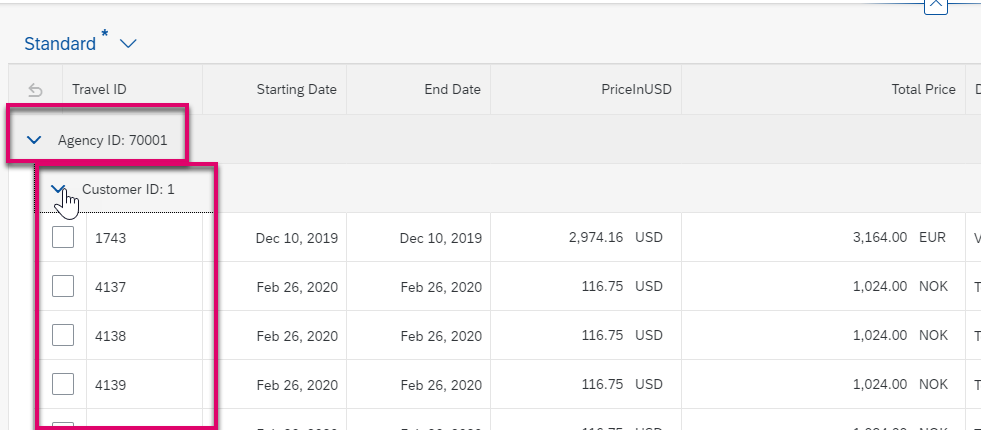

## Prerequisites
**Tutorial**: [Create an ABAP Core Data Services (CDS) View in SAP NetWeaver 7.5](abap-dev-create-cds-view)

## Details
### You will learn
- How to add value help using a filter
- How to add textual information using associations
- How to concatenate two elements, using a built-in function for CDS
- How to convert currencies using a built-in function for CDS
- How to use grouping and aggregation
- How to evaluate conditions using a CASE statement

You can then use some of these features in productive development to make your applications more powerful and more user-friendly. By the end of this tutorial, your application should look like this.

!

Throughout this tutorial, objects name include a suffix, such as `XXX`. Always replace this with your group number or initials.

---

[ACCORDION-BEGIN [Step 1: ](Add value help)]
To make the input fields more useful, you will now add input value help to the field **`AgencyID`**.

1. Specify the source of the value help. This works a bit like a join: You need to point to an entity, and field common to both the entity and your CDS view. In this case, you will point to **`AgencyID`** in the CDS entity **`/DMO/I_Agency`**. Add the following annotation to your field **`AgencyID`**.

    ```CDS
    @Consumption.valueHelpDefinition: [{  entity: {name: '/DMO/I_Agency', element: 'AgencyID'}  }]

    ```

2. You also need to expose this second entity in the OData service. To do this, add the entity **`/DMO/I_Agency`** to your service definition, so the complete definition looks like this:

    ```CDS
    @EndUserText.label: 'Service exposes Travel Data 005'
    define service Z_EXPOSE_TRAVEL_005 {
      expose Z_C_TRAVEL_DATA_005 as Travel;
      expose /DMO/I_Agency as Agency;
    }

    ```

3. Format, save, and activate both CDS view and service definition ( **`Shift+F1, Ctrl+S, Ctrl+3`** ).

4. Refresh your Fiori Elements preview and choose value help for the input field **`AgencyID`**.

    !

5. Now the value help appears. Enter the country key **DE** and choose **Go**. Only German agencies appear on the list.

    !

6. Repeat this step for **`CustomerID`**:

    ```CDS
    @Consumption.valueHelpDefinition: [{entity: {name: '/DMO/I_Customer', element: 'CustomerID' }}]
    ```

7. Also, expose this entity in the service definition:

    ```CDS
    expose /DMO/I_Customer as Customer;

    ```


[DONE]
[ACCORDION-END]


[ACCORDION-BEGIN [Step 2: ](Add text associations)]
Next, you will make the **Agency** field more readable by adding the agency name to the ID, using a text association.
CDS associations are simply specifications of joins, always in the same place in the syntax. The main advantage of an association is reuse: Once you have specified an association once, you can conveniently string several associations together in a path. In this case, however, you will use a simple association.

For more information, see:
- ABAP Keyword Documentation: [CDS - Associations](https://help.sap.com/doc/abapdocu_752_index_htm/7.52/en-US/index.htm?file=abencds.htm)

1. Add the following 2 statements to your CDS view, **`Z_C_TRAVEL_DATA_XXX`**, just before the list of fields. The first statement creates an association from the source CDS entity **`Z_C_TRAVEL_DATA_XXX`** to the target CDS entity **`/DMO/I_Agency`**, joined on the field **`AgencyID`**. The source entity is represented by the alias **`$projection`**, because you cannot use the original name in a path statement. The target entity is represented by its alias name **`_Agency`**.

    ```CDS
      association [1..1] to /DMO/I_Agency as _Agency on $projection.AgencyID = _Agency.AgencyID

    ```

    !

2. Now add the following annotation to the field **`AgencyID`**:

    ```CDS
      @ObjectModel.text.association: '_Agency'

    ```

3. Check that the association has been added to the field list. (This should have been done automatically when you inserted the signature of `/DMO/I_TRAVEL_U`.)

    !

4. Format, save, and activate ( **`Shift+F1, Ctrl+S, Ctrl+F3`** ).

5. Make sure that the entity **`/DMO/I_Agency`** has been added to your service definition. (You should have done this in step 1.)

    !

6. Refresh your Fiori Elements preview. The agency name should now be shown, with the ID number in parentheses.

    !

7. Repeat for the fields **`CustomerID`** and **`Currency_Code`**:

    ```CDS
    association [1..1] to /DMO/I_Customer as _Customer    on $projection.CustomerID =   _Customer.CustomerID
    association [0..*] to I_CurrencyText as _CurrencyText on $projection.CurrencyCode = _CurrencyText.Currency

    ```

    ```CDS
    @ObjectModel.text.association: '_Customer'
    @ObjectModel.text.association: '_CurrencyText'

    ```

8. Also make sure these associations are added to the list of fields:

    ```CDS
    //Associations
    _Customer
    _CurrencyText

    ```

      !

[DONE]
[ACCORDION-END]

[ACCORDION-BEGIN [Step 3: ](Merge two fields)]
ABAP has many built-in SQL functions for both numeric and string fields.

For more information on these functions, see : ABAP Keyword Documentation: [SQL Functions](https://help.sap.com/doc/abapdocu_752_index_htm/7.52/en-US/index.htm?file=abensql_functions.htm).

You will use a simple one to easily merge two fields. The two fields are provided by the association **`_Customer`**.

1. Add an association.

    ```CDS
        association [1..1] to /DMO/I_Customer as _Customer on $projection.CustomerID = _Customer.CustomerID
    ```

2. Ensure there is a comma after `CustomerID`, then add the function **`concat_with_space`** using auto-complete ( **`Ctrl+Space`** ); then add the alias **`as Addressee`**.

    ```CDS
      concat_with_space(_Customer.Title, _Customer.LastName, 1) as Addressee,
    ```

3. Also make sure this association is added to the list of fields:

      ```CDS
      //Associations
      _Customer
      ```
4. Format, save, and activate these objects using **`Shift+F1, Ctrl+S, Ctrl+F3 `**.

5. Check the result in the data preview, by clicking in the editor and choosing **Open With > Data Preview** from the context menu. The result should look like this.

      !

6. Now you have the addressee, you may want to comment out the text association for **`CustomerID`**.

[DONE]
[ACCORDION-END]

[ACCORDION-BEGIN [Step 4: ](Add currency conversion)]
It would be nice to find out how much money each **Agency** has received in total. To do this, you first need to convert all the sums paid to one currency. To do this, you will again use a built-in function. For more information, see the ABAP Keyword Documentation: [ABAP CDS - Conversion Functions for Units and Currencies](https://help.sap.com/doc/abapdocu_752_index_htm/7.52/en-US/index.htm?file=abencds_f1_conv_func_unit_curr.htm)

1. Convert the price (**`TotalPrice`**) of each line item to US Dollars. Again, you do this using a built-in conversion function. You simply have to define the variables you are using for amount, source currency, etc, and the built-in function does the rest.

    You need to cast the character value **` 'USD' `** to the correct type and length, **` abap.cuky( 5 ) `**.

    You may get a warning: "Reference information missing...". Ignore this.

    ```CDS
    currency_conversion(
    amount => TotalPrice,
    source_currency => CurrencyCode,
    round => 'X',
    target_currency => cast('USD' as abap.cuky( 5 )),
    exchange_rate_date => cast('20200429' as abap.dats),
    error_handling => 'SET_TO_NULL' )
    as PriceInUSD,  
    ```
2. Format, save, and activate ( **`Shift+F1, Ctrl+S, Ctrl+3`** )

3. If you check the result in the data preview, it should look like this.

    !

[DONE]
[ACCORDION-END]

[ACCORDION-BEGIN [Step 5: ](Add aggregation and grouping)]
1. Add the following annotation to the element **`total_price`**, using Auto-complete (**`Ctrl+Space`**):

    ```ABAP
    @DefaultAggregation: #SUM
    ```
    By using Auto-complete, you can see the various possibilities for aggregation, e.g. `AVG`, COUNT, SUM. In this case, we aggregate the SUM payable to each company.

2. Format, save, and activate ( **`Shift+F1, Ctrl+S, Ctrl+3`** ).

[DONE]
[ACCORDION-END]

[ACCORDION-BEGIN [Step 6: ](Test aggregation and grouping)]
1. Refresh your Fiori Elements preview. You may notice that a different grid control is used.
2. Right-click on **Agency ID** and choose Group:

    .
    !

    This groups and aggregates the entries (Travels) by Agency ID. You can also see the sum of all travels for each agency, in US dollars.

    !

3. Now, right-click on the Customer ID header and again choose Group.
This displays a two-step grouping. You can browse and expand the companies and browse / expand the associated sales orders.

    !

> The grouping will be gone each time you refresh the application. To avoid this, add the following annotation to the metadata extension definition on view level (at the top):

    ```CDS
    @UI.presentationVariant: [{groupBy: [ 'AgencyID' , 'CustomerID' ]}]

    ```

[DONE]
[ACCORDION-END]


[ACCORDION-BEGIN [Step 7: ](Add CASE statement)]
1. You will now create a bonus scheme, where the most expensive trips priced in US dollars are categorized as "Gold" or "Silver" trips. You can do this by adding the following CASE statement to the SELECT list, assigning the alias **`Premium`**.

    ```CDS
    case
     when CurrencyCode = 'USD' and TotalPrice >= 5000 then 'Gold'
     when CurrencyCode = 'USD' and TotalPrice < 5000 and TotalPrice >= 2000 then 'Silver'
     else ' '
     end as Premium,    

    ```
2. Format, save, and activate ( **`Shift+F1, Ctrl+S, Ctrl+F3`** ).

3. In your Fiori Elements preview, select the **`Premium`** and **`CurrencyCode`** fields in **Settings > Columns**. (You may wish to deselect **`PriceInUSD`** for clarity.) In **Sort**, choose **Currency Code** and **Descending**. Choose **Go**.

    !
    .
    !
    .
    !

The updated preview should look like this:

    !

[DONE]
[ACCORDION-END]


[ACCORDION-BEGIN [Step 8: ](Check code)]
The code for your CDS entity should look like this:

```CDS
@AbapCatalog.sqlViewName: 'ZCTRAVEL_xxx'
@AbapCatalog.compiler.compareFilter: true
@AbapCatalog.preserveKey: true
@AccessControl.authorizationCheck: #NOT_REQUIRED
@EndUserText.label: 'Consumption view for Travels XXX'
@Metadata.allowExtensions: true
@Search.searchable: true

define view Z_C_TRAVELS_xxx
  as select from /DMO/I_Travel_U

  association [1..1] to /DMO/I_Agency   as _Agency       on $projection.AgencyID = _Agency.AgencyID
  association [1..1] to /DMO/I_Customer as _Customer     on $projection.CustomerID = _Customer.CustomerID
  association [0..*] to I_CurrencyText  as _CurrencyText on $projection.CurrencyCode = _CurrencyText.Currency

{

      ///DMO/I_Travel_U

  key TravelID,
      @Consumption.valueHelpDefinition: [{entity: {name: '/DMO/I_Agency', element: 'AgencyID'}}]
      @ObjectModel.text.association: '_Agency'
      AgencyID,

//      @Consumption.valueHelpDefinition: [{entity: {name: '/DMO/I_Customer', element: 'CustomerID' }}]
//      @ObjectModel.text.association: '_Customer'
      CustomerID,

      concat_with_space(_Customer.Title, _Customer.LastName, 1) as Addressee,
      BeginDate,
      EndDate,
      BookingFee,

      @DefaultAggregation: #SUM
      @Semantics.amount.currencyCode: 'CurrencyCode'
      TotalPrice,

      //Currency Conversion
      currency_conversion(
      amount => TotalPrice,
      source_currency => CurrencyCode,
      round => 'X',
      target_currency => cast('USD' as abap.cuky( 5 )),
      exchange_rate_date => cast('20200429' as abap.dats),
      error_handling => 'SET_TO_NULL' )                         as PriceInUSD,

      @Semantics.currencyCode
      @ObjectModel.text.association: '_CurrencyText'
      CurrencyCode,

      //Evaluate Premium status for customers paying in USD
      case
      when CurrencyCode = 'USD' and TotalPrice >= 5000 then 'Gold'
      when CurrencyCode = 'USD' and TotalPrice < 5000 and TotalPrice >= 2000 then 'Silver'
      else ' '
      end                                                       as Premium,

      @Search.defaultSearchElement: true
      @Search.fuzzinessThreshold: 0.90
      Memo,

      Status,
      LastChangedAt,

      /* Associations */
      //DMO/I_Travel_U
      _Agency,
      _Booking,
      _Currency,
      _Customer,
      _CurrencyText

}

```

[DONE]
[ACCORDION-END]

[ACCORDION-BEGIN [Step 9: ](Test yourself)]

[VALIDATE_1]
[ACCORDION-END]

### More information
[From Open SQL Joins to CDS Associations](https://blogs.sap.com/2016/08/12/from-open-sql-joins-to-cds-associations/)

---
