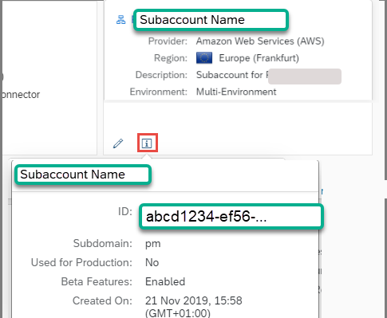
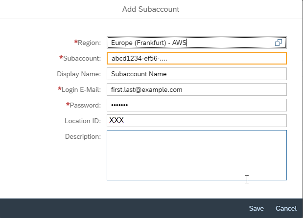
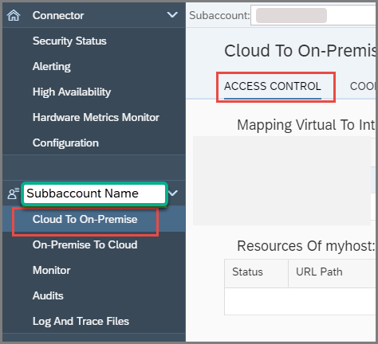
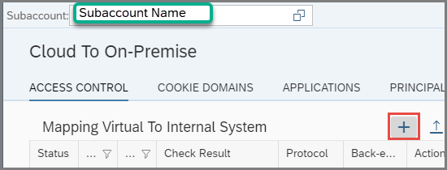
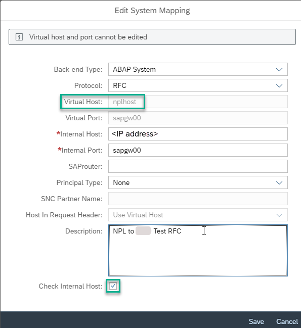
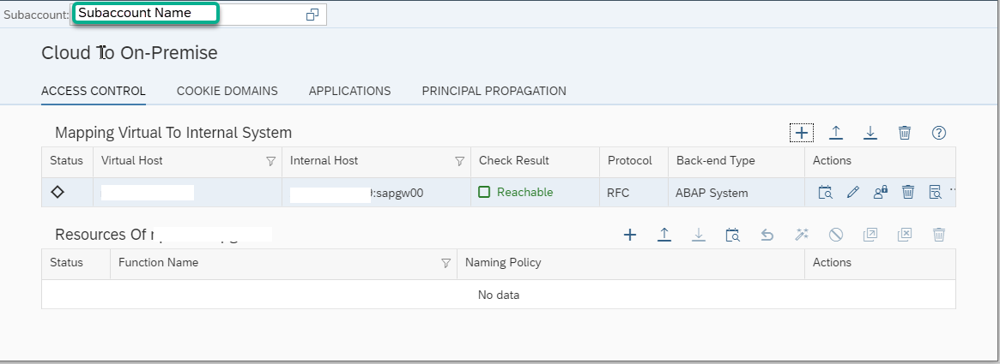
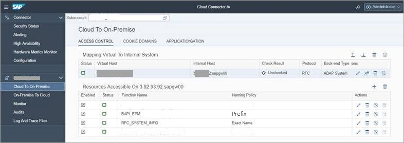
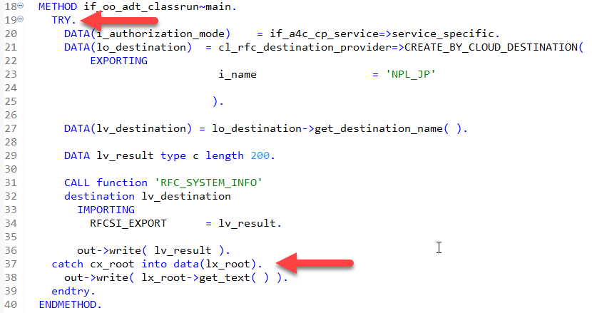
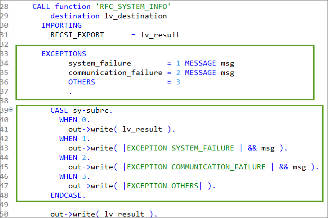

## Prerequisites
- **IMPORTANT**: This tutorial cannot be completed on a trial account
- You have set up SAP Cloud Platform, ABAP Environment, for example by using the relevant booster: [Using a Booster to Automate the Setup of the ABAP Environment](https://help.sap.com/viewer/65de2977205c403bbc107264b8eccf4b/Cloud/en-US/cd7e7e6108c24b5384b7d218c74e80b9.html)
- **Tutorial**: [Create Your First Console Application](https://developers.sap.com/tutorials/abap-environment-trial-onboarding.html), for a licensed user, steps 1-2
-	You have developer rights to an ABAP on-premise system, such as:
    - [SAP S/4HANA 1809 fully activated appliance](https://blogs.sap.com/2018/12/12/sap-s4hana-fully-activated-appliance-create-your-sap-s4hana-1809-system-in-a-fraction-of-the-usual-setup-time/) or:
    - [The SAP Gateway Demo System (ES5)](https://blogs.sap.com/2017/12/05/new-sap-gateway-demo-system-available/)
-	In this on-premise system, you have installed SAP Cloud Connector with Administrator rights. (In the above systems, this is pre-installed)

## Details
### You will learn
  - How to open a secure tunnel connection between your SAP Cloud Platform ABAP Environment and an on-premise SAP System, e.g. SAP S/4HANA
  - How to create a destination service instance with an RFC connection
  - How to test the connection using an ABAP handler class

Throughout this tutorial, replace `XXX` with your initials or group number.
 
**The problem:**

There are two problems when setting up connectivity between the Cloud Platform ABAP Environment and an on-premise:

- The ABAP Environment "lives" in the Internet, but customer on-premise systems are behind a firewall
- RFC is not internet-enabled

**The solution:**

- Set up a connection from the on-premise system to the SAP Cloud Platform Neo Environment using SAP Cloud Connector
- Set up a connection from the SAP Neo to the SAP Cloud Foundry Environment

**Specifically:**

1. The ABAP environment tenant fetches the destination from the Destination service instance.
2. The ABAP environment tenant requests to open the tunnel connection through the Connectivity service.
3. The Connectivity service tells the Cloud Connector to open the connection to this specific ABAP environment tenant using the admin connection.
4. The Cloud Connector opens a tunnel connection to the ABAP environment tenant using its public tenant URL.
5. After the tunnel is established, it can be used for actual data connection using the RFC or HTTP(S) protocols.


---

[ACCORDION-BEGIN [Step 1: ](Configure SAP Cloud Connector)]
First, you need to connect your ABAP on-premise system to a Cloud Foundry subaccount by means of SAP Cloud Connector.

1. In your browser, log on to SAP Cloud Connector:
    - Address = e.g. `https://localhost:<port>` (Default = 8443)
    - User = Administrator
    - Initial password = Manage (You will change this when you first log in)

2. Choose **Add Subaccount**:

    |  Field Name     | Value
    |  :------------- | :-------------
    |  Region           | Your region. You can find this in SAP Cloud Cockpit (see screenshot below) - e.g. here, **Europe (Frankfurt) - AWS**
    |  Subaccount           | Cloud Foundry Subaccount ID. You can find this by choosing your subaccount in SAP Cloud Cockpit and choosing the **information (i)** icon. (see screenshot below)
    |  Display Name    | (Subaccount) Display Name. You can find this in by choosing your subaccount in SAP Cloud Cockpit (see screenshot below)
    |  Subaccount User          |
    |  Password   |
    |  Location ID | Optional here. However, it is mandatory if you want to connect several Cloud Connectors to your subaccount. This can be any text, e.g. `NPL_XXX` as here:

    !

Your configuration should now look like this. Note down the **Location ID**, here **`NPL_JP`** (Change this to your own initials.)

  !
  !

[DONE]
[ACCORDION-END]

[ACCORDION-BEGIN [Step 2: ](Add On-Premise System)]
1. In the menu in the left pane, expand the subaccount and choose **Cloud To On-Premise > Access Control**.

    !

2. In the **Mapping Virtual to Internal System** pane, choose **Add (+)**.

    !

3. Enter the following values, and choose **Save**.


    |  Field Name             | Value
    |  :----------------------| :-------------
    |  Backend Type           | **ABAP**
    |  Protocol               | **`RFC`**
    |                         | Without Load Balancing
    |  Application Server     | **IP address of the on-premise server, e.g. of `NPL`**
    | Instance Number         | **`00`**
    |  Virtual Host           | e.g. **`nplhost`**. This represents an external hostname, so that you can hide the internal hostname from the outside world. **You will need this external hostname and port later, when creating a destination from SAP Cloud Cockpit**.
    |  Virt. Inst. No.        | **`00`**
    | Principal Type | None
    |Description | Optional
    | Check Internal Host | Ticked

    !

The mapping should now look something like this. Check that the status = `Reachable`. If not, check that you chose the correct port, or whether an internal firewall is preventing communication:

  

[DONE]
[ACCORDION-END]

[ACCORDION-BEGIN [Step 3: ](Specify remote function modules and BAPIs)]
Now, still in the **Cloud to On-Premise > Access Control** tab, enter the resource you need, `RFC_SYSTEM_INFO`.

1. Add the resource **`RFC_SYSTEM_INFO`** by choosing the **Protocol = RFC**, then choosing **+**.

    !

2. Enter the name of the RFC, e.g. **`RFC_SYSTEM_INFO`**. Alternatively, add **`RFC`** as a **Prefix**. Then choose **Save**

    

3. Add BAPIs to the list of resources by choosing **+** again. (You will need this BAPI in a later tutorial.)

4. Enter the name **`BAPI_EPM`** as a **Prefix**, then choose **Save**.

5. The list of resources should now look roughly like this.

    

[DONE]
[ACCORDION-END]


[ACCORDION-BEGIN [Step 4: ](Check connectivity from SAP Cloud Cockpit)]
In the SAP Cloud Platform Cockpit of your Cloud Foundry subaccount, choose **Cloud Connectors**:

!


> The location ID points to the correct SAP Cloud Connector (located in the on-Premise system); The virtual host points to the on-Premise connection mapped in SAP Cloud Connector.

[DONE]
[ACCORDION-END]


[ACCORDION-BEGIN [Step 5: ](Create destination)]
You will now create a destination in the ABAP Environment. This must be created at subaccount (not Space) level.

1. In the SAP Cloud Platform Cockpit of your Cloud Foundry subaccount, choose **Destinations**, then choose **New Destinations**.

    !

2. Enter the following values:

    |  Field Name     | Value
    |  :------------- | :-------------
    |  Name           | e.g. **`NPL_RFC`** as here
    |  Type           | **`RFC`**
    |  Description    | Can be anything, here **`NPL`**
    |  Location ID    | same as in step 1, e.g. **`NPL_XXX`**
    |  User   | Your user for the on-premise system, e.g. DEVELOPER
    |  Password | Your password

3. Add the following additional properties and values, by choosing **New Property**:


    |  Field Name         | Value
    |  :-------------     | :-------------
    |  `jco.client.ashost`| Virtual hostname of your on-premise ABAP System, defined in SAP Cloud Connector, e.g. **`<nplhost>`**
    |  `jco.client.client`| `<Your ABAP System client`, e.g. **001**
    | `jco.client.sysnr`  | `<Your ABAP System number>`, e.g. **00**

    !
      .
    !

[DONE]
[ACCORDION-END]

[ACCORDION-BEGIN [Step 6: ](Create ABAP class for RFC connection)]
1. Create a new ABAP class: Choose **File > New > Other... > ABAP Class**.

2. Enter a name and description. The name should be in the form `ZCL_...RFC_XXX`. Replace `XXX` with your group number or initials.

3. Create or assign a transport request.

[DONE]
[ACCORDION-END]

[ACCORDION-BEGIN [Step 7: ](Add interfaces statement; implement main method)]
1. Implement the interface by adding this statement to the public section:

    `interfaces if_oo_adt_classrun.`

    This allows you to test your class by displaying the output in the ABAP Console.

2. In the implementation section, add the METHOD and ENDMETHOD statements:

    `METHOD IF_OO_ADT_CLASSRUN~MAIN.`
    `ENDMETHOD.`

[DONE]
[ACCORDION-END]

[ACCORDION-BEGIN [Step 8: ](Create variables)]
Create the data types that specify your remote connection information, replacing the `i_name` with your the name of the specific **RFC** destination, which you created in SAP Cloud Cockpit (in step 5 of this tutorial).

    ```ABAP
    DATA(lo_destination) = cl_rfc_destination_provider=>CREATE_BY_CLOUD_DESTINATION(
                            i_name                  = 'NPL_RFC'

                           ).

    DATA(lv_destination) = lo_destination->get_destination_name( ).

    DATA lv_result type c length 200.

    ```

[DONE]
[ACCORDION-END]

[ACCORDION-BEGIN [Step 9: ](Call remote function from on-premise system)]
```ABAP
CALL function 'RFC_SYSTEM_INFO'
destination lv_destination
  IMPORTING
    RFCSI_EXPORT      = lv_result.

```

[DONE]
[ACCORDION-END]

[ACCORDION-BEGIN [Step 10: ](Output result)]
Output the result of the RFC call to the ABAP Console

```ABAP
out->write( lv_result ).
```

[DONE]
[ACCORDION-END]

[ACCORDION-BEGIN [Step 11: ](Wrap method in an exception)]
Wrap the whole method in an exception using TRY...CATCH.

```ABAP
catch cx_root into data(lx_root).
  out->write( lx_root->get_text( ) ).
endtry.
```    


[DONE]
[ACCORDION-END]

[ACCORDION-BEGIN [Step 12: ](Check your code)]
Your code should look roughly like this:

```ABAP
CLASS ZCL_A4C_RFC_XXX DEFINITION
  public
  final
  create public .

public section.
  interfaces if_oo_adt_classrun.
protected section.
private section.
ENDCLASS.

CLASS ZCL_A4C_RFC_XXX IMPLEMENTATION.
  METHOD IF_OO_ADT_CLASSRUN~MAIN.
    TRY.
      DATA(lo_destination) = cl_rfc_destination_provider=>CREATE_BY_CLOUD_DESTINATION(
                              i_name                  = 'NPL_RFC'
                             ).

      DATA(lv_destination) = lo_destination->get_destination_name( ).

      DATA lv_result type c length 200.

      CALL function 'RFC_SYSTEM_INFO'
      destination lv_destination
        IMPORTING
          RFCSI_EXPORT      = lv_result.

        out->write( lv_result ).
    catch cx_root into data(lx_root).
      out->write( lx_root->get_text( ) ).
    endtry.
  ENDMETHOD.

ENDCLASS.
```

[DONE]
[ACCORDION-END]

[ACCORDION-BEGIN [Step 15: ](Test the class)]
1. Save and activate the class, using **`Ctrl+S, Ctrl+F3`**.

2. Run the class by choosing **`F9`**. Some system information, such as the hostname, the System ID ( `<SID>` ), and the IP address should be displayed.

[DONE]
[ACCORDION-END]

[ACCORDION-BEGIN [Step 16: ](Test yourself)]

[VALIDATE_1]
[ACCORDION-END]

[ACCORDION-BEGIN [Step 17: ](Add error handling to the class for the RFC connection )]
1. Go back to your RFC class. Remove the period (.) after the IMPORTING parameter and add the following exception parameters to the function call `RFC_SYSTEM_INFO`:

    ```ABAP

    EXCEPTIONS
      system_failure        = 1 MESSAGE msg
      communication_failure = 2 MESSAGE msg
      OTHERS                = 3.

    ```

2. Now evaluate `sy-subrc` by adding the following CASE...ENDCASE statement:

    ```ABAP

    CASE sy-subrc.
       WHEN 0.
         out->write( lv_result ).
       WHEN 1.
         out->write( |EXCEPTION SYSTEM_FAILURE | && msg ).
       WHEN 2.
         out->write( |EXCEPTION COMMUNICATION_FAILURE | && msg ).
       WHEN 3.
         out->write( |EXCEPTION OTHERS| ).
     ENDCASE.

    ```

    

[DONE]
[ACCORDION-END]

## More Information
For more information on SAP Cloud Platform:
- SAP Help Portal: [What is SAP Cloud Platform](https://help.sap.com/viewer/65de2977205c403bbc107264b8eccf4b/Cloud/en-US/73beb06e127f4e47b849aa95344aabe1.html)

- SAP Help Portal: [Getting Started With a Customer Account](https://help.sap.com/viewer/65de2977205c403bbc107264b8eccf4b/Cloud/en-US/e34a329acc804c0e874496548183682f.html) - If you use the booster, these steps are performed automatically for you, but you may be interested in the background information

For more information on connectivity in this context, see:
- [SAP Help Portal: SAP Cloud Connector](https://help.sap.com/viewer/368c481cd6954bdfa5d0435479fd4eaf/Cloud/en-US/642e87f1492146998a8eb0779cd07289.html)

- [SAP Help Portal: Setting Up Destinations to Enable On-Premise Connectivity](https://help.sap.com/viewer/DRAFT/65de2977205c403bbc107264b8eccf4b/Dev/en-US/9b6510edf4d844a28f022b3db41f3202.html)

- [SAP Help Portal: Set Up an RFC Destination](https://help.sap.com/viewer/DRAFT/60f1b283f0fd4d0aa7b3f8cea4d73d1d/Internal/en-US/a69e99c457a54ff881adcff843eea950.html)

For more information on OData services and SAP Gateway in general, see:

- [OData service development with SAP Gateway using CDS](https://blogs.sap.com/2016/06/01/odata-service-development-with-sap-gateway-using-cds-via-referenced-data-sources/) - pertains to on-premise Systems, but contains lots of useful background information on the relationships between CDS views and OData services

- [OData – Everything that you need to know](https://blogs.sap.com/2016/02/08/odata-everything-that-you-need-to-know-part-1/) - especially Parts 1-3 (Community content)

- [How to call a remote function module in your on-premise SAP system from SAP Cloud Platform – ABAP Environment](https://blogs.sap.com/2019/02/28/how-to-call-a-remote-function-module-in-your-on-premise-sap-system-from-sap-cloud-platform-abap-environment/)

---
