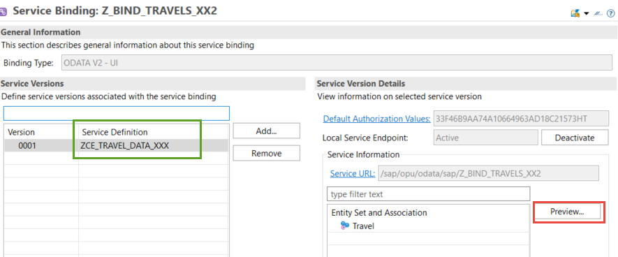
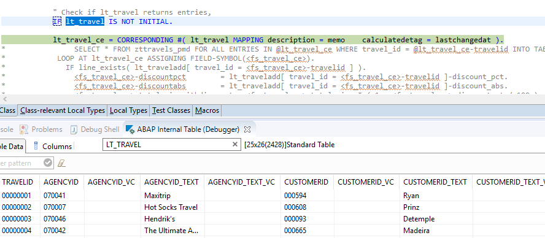

## Details
### You will learn
  - How to implement a query manually for your CDS custom entity
  - How to display the data retrieved in a Fiori Elements preview

This tutorial is based on:

  - [Using a CDS Custom Entity for Data Modeling](https://help.sap.com/viewer/923180ddb98240829d935862025004d6/Cloud/en-US/6436a50d7d284f01af2cca7a76c7116a.html).

Therefore, this tutorial will only cover in detail those aspects that are different. In this case, you are not including both remote and local data, you are only retrieving local data. Therefore, you do not need to include the local calculated fields,  `DiscountPct` and `DiscountAbs`.

---

[ACCORDION-BEGIN [Step 1: ](Create a class that implements the data retrieval logic)]
First, you create the class that implements the data retrieval logic.

1. In ADT, open your package **`Z_A4C_TO_A4C_XX2`** and choose **New > Class**.

2. Enter a name and description:
    - `ZCL_TRAVELS_XXX`
    - Show travels from A4C System

3. Accept the default transport request, then choose **Finish**.

[DONE]
[ACCORDION-END]


[ACCORDION-BEGIN [Step 2: ](Add the interfaces statement)]
The signature of the method `IF_RAP_QUERY_PROVIDER~SELECT` contains the import parameter `io_request`. This parameter represents the OData query options that are delegated from the UI and used as input for the SELECT method. Whenever the OData client requests data, the query implementation class must return the data that matches the request, or throw an exception if the request cannot be fulfilled.

1. Implement the interface by adding this statement to the public section:

    `INTERFACES if_rap_query_provider.`

2. Choose **Quick Fix (`Ctrl+1`)**, then choose **Add implementation for SELECT...**.

3. Save and activate ( **Ctrl+S, Ctrl+F3** ) your class.

Later, you will implement the SELECT method of the interface.

[DONE]
[ACCORDION-END]


[ACCORDION-BEGIN [Step 3: ](Specify the class in your custom entity)]

1. Open your CDS custom entity **`ZCE_TRAVEL_DATA_XXX`**, created in [Create a Service Consumption Model](abap-environment-create-service-model).

2. Add the following annotation to the view (immediately after the '@EndUserText.label' annotation), pointing to the class you have just created - NOTE: Use upper case!

    ```CDS

    @ObjectModel.query.implementedBy: 'ABAP:ZCL_TRAVELS_XXX'

    ```

[DONE]
[ACCORDION-END]


[ACCORDION-BEGIN [Step 4: ](Copy code)]
Copy the following code into your query implementation class, **`ZCL_TRAVELS_XXX`**. Ignore the warnings.

    ```ABAP
    CLASS zcl_travels_xxx DEFINITION
      PUBLIC
      FINAL
      CREATE PUBLIC .

      PUBLIC SECTION.
          INTERFACES if_rap_query_provider.
      PROTECTED SECTION.
      PRIVATE SECTION.
    ENDCLASS.

    CLASS zcl_travels_xxx IMPLEMENTATION.
      METHOD if_rap_query_provider~select.
              """Instantiate Client Proxy
            DATA(lo_client_proxy) = zcl_proxy_travels_xxx=>get_client_proxy( ).

          DATA(lo_read_request) = lo_client_proxy->create_resource_for_entity_set( 'TRAVEL' )->create_request_for_read( ).

          TRY.
              """Create Read Request
              CATCH /iwbep/cx_gateway INTO DATA(lx_gateway).
                RAISE EXCEPTION TYPE ZCX_TRAVELS_CONS_XXX
                  EXPORTING
                    textid   = ZCX_TRAVELS_CONS_XXX=>query_fail
                    previous = lx_gateway.
        ENDTRY.

            """Request Count
            IF io_request->is_total_numb_of_rec_requested( ).
              lo_read_request->request_count( ).
            ENDIF.

            """Request Paging
            DATA(ls_paging) = io_request->get_paging( ).
              IF ls_paging->get_offset( ) >= 0.
                lo_read_request->set_skip( ls_paging->get_offset( ) ).
              ENDIF.

            IF ls_paging->get_page_size( ) <> if_rap_query_paging=>page_size_unlimited.
                lo_read_request->set_top( ls_paging->get_page_size( ) ).

                """Execute the Request
                DATA(lo_response) = lo_read_request->execute( ).
            ENDIF.            
      ENDMETHOD.

    ENDCLASS.

    ```

[DONE]
[ACCORDION-END]

[ACCORDION-BEGIN [Step 5: ](Implement SELECT method in query implementation class)]
1. Add the variables you need using the **`DATA`** statement.
    - **`lt_travel`** = internal table of the generated abstract entity, **`ZTRAVEL`** or **`ZTRAVEL+10-digit-GUID`**, created in tutorial [Create a Service Consumption Model](abap-environment-create-service-consumption-model). The data from the remote service will be written into that table.

        !

    - **`lt_travel_ce`** = internal table of the custom entity, **``zce_travels_xxx``**, created in step 3 above. This table is used to fill the output parameter of the select method.
    -

    ```ABAP

    "Provide result data
    IF io_request->is_data_requested( ).

    DATA:
        "abstract entity; receives data from remote servce
        lt_travel    TYPE STANDARD TABLE OF ZTRAVEL,
        "custom entity; fills output param of SELECT
        lt_travel_ce TYPE STANDARD TABLE OF zce_travel_data_pmd.

    ```

2. Get the data from the response object of your remote service, and write it to **`lt_travel`**.

    ```ABAP
    "Get data from response object
    lo_response->get_business_data( IMPORTING et_business_data = lt_travel ).

    ```

3. If **`lt_travel`** returns entries, provide a mapping for those elements in the custom entity that are not identical with the names of the abstract entity elements - in this case, **Description**.

    ```ABAP
    " Check if lt_travel returns entries; map elements
    IF lt_travel IS NOT INITIAL.
        lt_travel_ce = CORRESPONDING #( lt_travel MAPPING description = memo    calculatedetag = lastchangedat ).
    ENDIF.

    ```

4. Set return data.

    ```ABAP
    "Set return data
    io_response->set_data( lt_travel_ce ).
    ENDIF.

    ```

5. Save and activate ( **`Ctrl+S, Ctrl+F3`** ) the class.


[DONE]
[ACCORDION-END]

[ACCORDION-BEGIN [Step 6: ](Check the code for your query implementation class)]

```ABAP
CLASS zcl_travels_xxx DEFINITION
  PUBLIC
  FINAL
  CREATE PUBLIC .

  PUBLIC SECTION.
      INTERFACES if_rap_query_provider.
  PROTECTED SECTION.
  PRIVATE SECTION.
ENDCLASS.


CLASS zcl_travels_xxx IMPLEMENTATION.

    METHOD if_rap_query_provider~select.
          """Instantiate Client Proxy
    DATA(lo_client_proxy) = zcl_proxy_travels_xxx=>get_client_proxy( ).
    DATA(lo_read_request) = lo_client_proxy->create_resource_for_entity_set( 'TRAVEL' )->create_request_for_read( ).

    TRY.
          """Create Read Request
          CATCH /iwbep/cx_gateway INTO DATA(lx_gateway).
            RAISE EXCEPTION TYPE ZCX_TRAVELS_CONS_XXX
              EXPORTING
                textid   = ZCX_TRAVELS_CONS_XXX=>query_fail
                previous = lx_gateway.
    ENDTRY.

    """Request Count
    IF io_request->is_total_numb_of_rec_requested( ).
      lo_read_request->request_count( ).
    ENDIF.

    """Request Paging
    DATA(ls_paging) = io_request->get_paging( ).

    IF ls_paging->get_offset( ) >= 0.
        lo_read_request->set_skip( ls_paging->get_offset( ) ).
    ENDIF.

    IF ls_paging->get_page_size( ) <> if_rap_query_paging=>page_size_unlimited.
        lo_read_request->set_top( ls_paging->get_page_size( ) ).

        """Execute the Request
        DATA(lo_response) = lo_read_request->execute( ).
    ENDIF.

        "Provide result data
        IF io_request->is_data_requested( ).

        DATA:
            "abstract entity; receives data from remote service
            lt_travel    TYPE STANDARD TABLE OF ztravelf7fb77ae54,
            "custom entity; fills output param of SELECT
            lt_travel_ce TYPE STANDARD TABLE OF zce_travel_data_pmd,
            "local db table
            lt_traveladd TYPE STANDARD TABLE OF zttravels_pmd.

            "Get data from response object
            lo_response->get_business_data( IMPORTING et_business_data = lt_travel ).

            " Check if lt_travel returns entries, then pass data to internal table for custom entity
            IF lt_travel IS NOT INITIAL.
                lt_travel_ce = CORRESPONDING #( lt_travel MAPPING description = memo    calculatedetag = lastchangedat ).
            ENDIF.

          "Set return data
          io_response->set_data( lt_travel_ce ).
        ENDIF.

  ENDMETHOD.

ENDCLASS.

```


[DONE]
[ACCORDION-END]


[ACCORDION-BEGIN [Step 7: ](Create service binding)]
1. Select your service definition, **`ZCE_TRAVEL_DATA_XXX`**, created in the tutorial [Create a Service Consumption Model](abap-environment-create-service-consumption-model) and choose **New > Create Service Binding** from the context menu.

    !

2. In the wizard:
    - Enter a name: **`Z_BIND_TRAVELS_XXX`** and description **Bind Travels Service**
    - Enter the binding type: **`ODATA V2 - Web API`**
    - Choose **Next**

    !

3. Accept the transport request and choose **Finish**.    

    The service binding opens in a new editor.

4. Choose **Activate**.

    On the left is the Service Definition, `ZCE_TRAVEL_DATA_XXX`.
    On the right, is the active service, including the Entity Set and the Service URL.

5. Select the entity Set **Travel** and choose **Preview**.

    !

    The Fiori Elements preview for your remote OData service appears in the browser, but without any data.

6. Choose **Settings > Select All > OK**, then choose **Go**.

    Your Fiori Elements preview should look roughly like this:

    !


[DONE]
[ACCORDION-END]

[ACCORDION-BEGIN [Step 8: ](Refine UI)]
If the data appears, you can now improve the look and feel of your preview.

1. Make the first five column headers appear automatically when the app appears (without your having to select them in settings), by adding the following annotations:

    ```CDS
    @UI.lineItem: [ { position: 10 } ]
    key TravelID           : abap.numc( 8 );

    @UI.lineItem: [ { position: 20 } ]
    AgencyID               : abap.numc( 6 );
    @UI.lineItem: [ { position: 30 } ]
    CustomerID             : abap.numc( 6 );

    @UI.lineItem: [ { position: 40, label: 'Start Date'} ]
    BeginDate              : rap_cp_odata_v2_edm_datetime;

    @UI.lineItem: [ { position: 50, label: 'End Date'} ]      
    EndDate                : rap_cp_odata_v2_edm_datetime;

    ```

2. The two headings **`RESTful` ABAP Programming: Data Type...** are ugly. Change them to **Begin Date** and **End Date** by adding labels, as follows:

    ```CDS
    @UI.lineItem: [ { position: 40, label: 'Start Date'} ]
    BeginDate              : rap_cp_odata_v2_edm_datetime;

    @UI.lineItem: [ { position: 50, label: 'End Date'} ]      
    EndDate                : rap_cp_odata_v2_edm_datetime;

    ```

[DONE]
[ACCORDION-END]

[ACCORDION-BEGIN [Step 9: ](Check the code for your custom entity)]
Your code should now look like this.

```ABAP
@EndUserText.label: 'Travel data custom entity in PMD'
@ObjectModel.query.implementedBy: 'ABAP:ZCL_TRAVELS_PMD'

define custom entity ZCE_TRAVEL_DATA_PMD

 {

    @UI.lineItem: [ { position: 10 } ]
    key TravelID               : abap.numc( 8 );

    @UI.lineItem: [ { position: 20 } ]
    AgencyID               : abap.numc( 6 );
    @UI.lineItem: [ { position: 30 } ]
    CustomerID             : abap.numc( 6 );

    @UI.lineItem: [ { position: 40, label: 'Start Date'} ]
    BeginDate              : rap_cp_odata_v2_edm_datetime;

    @UI.lineItem: [ { position: 50, label: 'End Date'} ]      
    EndDate                : rap_cp_odata_v2_edm_datetime;

    @Semantics.amount.currencyCode: 'CurrencyCode'
    BookingFee             : abap.dec( 17, 3 );

    @Semantics.amount.currencyCode: 'CurrencyCode'
    TotalPrice             : abap.dec( 17, 3 );

    @Semantics.currencyCode: true
    CurrencyCode           : abap.cuky( 5 );
    Description            : abap.char( 1024 );   //renamed element
    Status                 : abap.char( 1 );
    LastChangedAt          : tzntstmpl;

    CalculatedEtag         : abap.string( 0 );
}


```
The Fiori Elements preview should now open looking like this.

!


[DONE]
[ACCORDION-END]


[ACCORDION-BEGIN [Step 10: ](Test yourself)]

[VALIDATE_1]
[ACCORDION-END]


[ACCORDION-BEGIN [Step 11: ](Optional: Test message class)]
You can test your message class, for example by commenting out the value `i_service_instance_name` in the class `zcl_proxy_travels_xx2` and changing it to a non-existent value. When you run the application, by choosing **Go** in the Fiori Elements preview, then you should get an error message like this:

!

[DONE]
[ACCORDION-END]

[ACCORDION-BEGIN [Step 12: ](Debugging)]
If you are having problems, you can trace the flow of your application in ABAP Debugger.

1. For example, set a breakpoint at this statement:

    `lt_travel_ce = CORRESPONDING #( lt_travel MAPPING description = memo    calculatedetag = lastchangedat ).`

2. You can then see whether the two internal tables have been filled.

    !

[DONE]
[ACCORDION-END]

## More Information

- [Inspect Your Class in the ABAP Debugger](abap-environment-custom-entity-debug)

---
