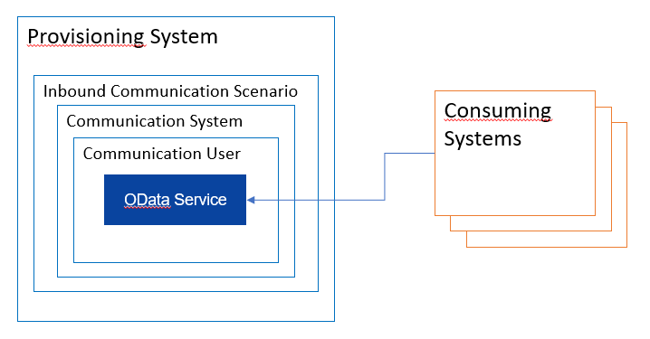
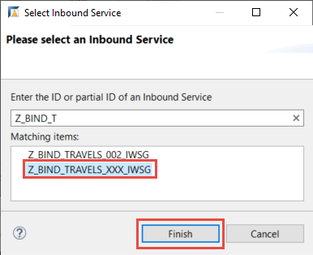
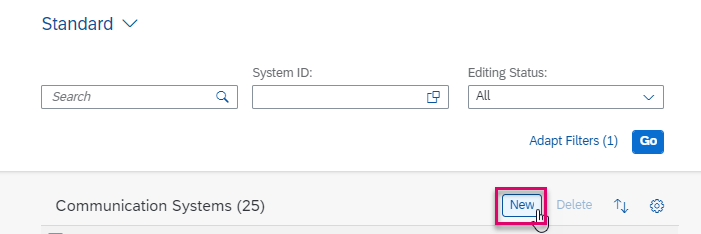
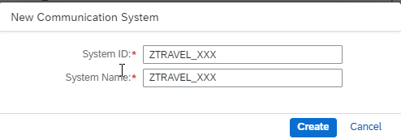
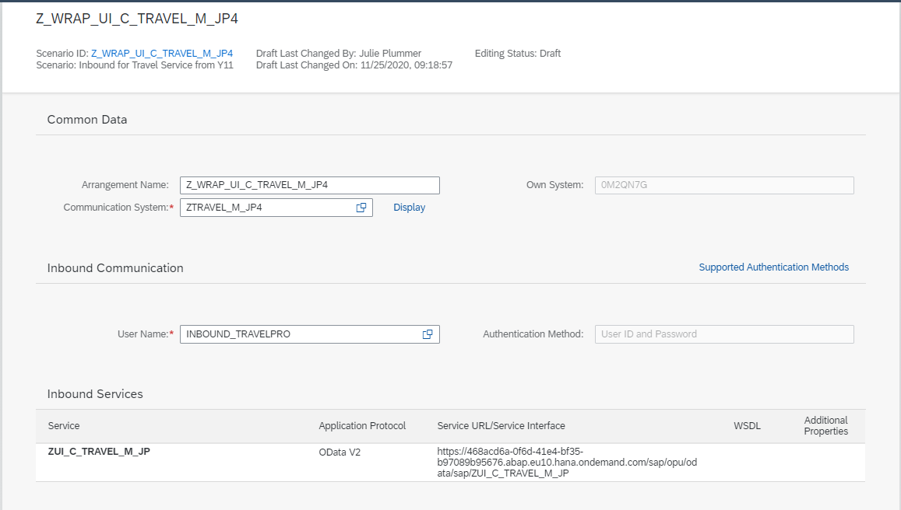
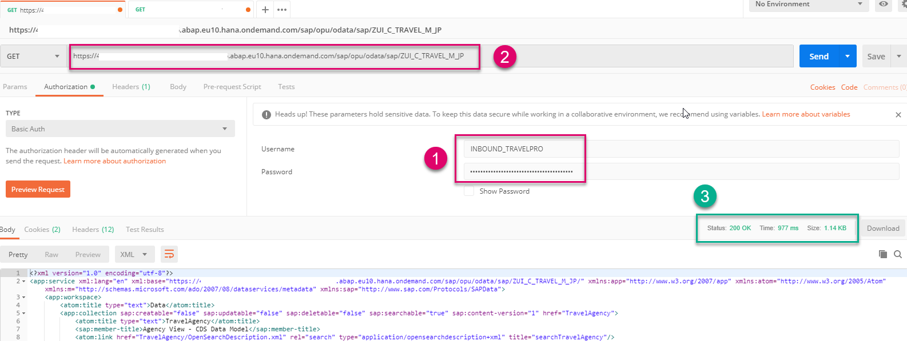
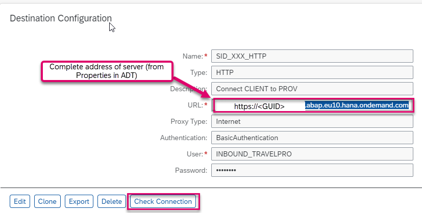

## Prerequisites
- **IMPORTANT**: This tutorial cannot be completed on a trial account
- You have set up 2 instances of SAP Business Technology Platform, ABAP Environment, a **provisioning system** and a **client system**, for example by using the relevant booster: [Using a Booster to Automate the Setup of the ABAP Environment](https://help.sap.com/viewer/65de2977205c403bbc107264b8eccf4b/Cloud/en-US/cd7e7e6108c24b5384b7d218c74e80b9.html)
- **Tutorial**: [Create Your First Console Application](abap-environment-trial-onboarding), for a licensed user, steps 1-2, for both instances
- In the provisioning system:
    - The business catalog **`SAP_CORE_BC_COM`** is assigned to your user
    - The ABAP Flight Reference Scenario is available. To pull this reference scenario from `Github`, see [ Downloading the ABAP Flight Reference Scenario](https://help.sap.com/viewer/923180ddb98240829d935862025004d6/Cloud/en-US/def316685ad14033b051fc4b88db07c8.html)
    - You have exposed the data definition **` /DMO/TRAVEL_U`** as an OData service, using a service definition and service binding
- You have read [Developing a UI Service with Access to a Remote Service](https://help.sap.com/viewer/923180ddb98240829d935862025004d6/Cloud/en-US/f4969e551d3049c59715210cbeb4ef56.html) and its [Scenario Description](https://help.sap.com/viewer/923180ddb98240829d935862025004d6/Cloud/en-US/4f539da657fe427f868a95c0bc1b3cfa.html), since this mission is based on this tutorial series
- Optional: You have installed the [Postman API Platform](https://www.getpostman.com/)

## Details
### You will learn
- In the **provisioning** system: How to expose a CDS view as an OData service using a **Service Binding**
- How to wrap this OData service in an inbound communication scenario, so that it can be accessed from another instance of SAP BTP, ABAP environment
- How to make the provisioning system available for connection from other ABAP systems
- How to test your service URL in Postman (optional)
- In the **client** system: How to create a new destination with an HTTP connection, pointing to the provisioning system

This involves some overhead for one consumer; however, the advantage is that you can add several consumer systems, or users (for example, with different authentication) pointing to the same HTTP service, wrapped in the same Communication Scenario.

!

.
.

**Mission Scenario**:

You want to get data that is only available in a remote instance of SAP BTP, ABAP Environment ( **provisioning system** ) and display it in a second instance ( **client system** ).

You need to:

1. Create inbound communication artefacts for an OData Service in the **provisioning system**
2. Create a Service Consumption Model, and save this locally as a `$metadata` XML file; From this you will create proxy artefacts in the client system, representing the remote service, and use this model to generate an **abstract entity**
3. Create a Remote Client Proxy
4. Build a new OData service in the client system, using a CDS custom entity and query implementation class
5. Finally, display the remote data in Fiori Elements preview in your browser

!

---

[ACCORDION-BEGIN [Step 1: ](Create inbound Communication Scenario)]
1. In your **provisioning** system, select your package, then choose **New > Other Repository Object...** from the context menu.

    !

2. Add the filter **`scen`**, then choose **Communication Scenario**, then choose **Next**.

    !

3. Add a Name: **`Z_WRAP_TRAVEL_XXX`** and Description, **Inbound for Travel Remote Service**, choose a transport request, then choose **Finish**.

Your Communication Scenario appears in a new editor.

!

You can also see this scenario in the Project Explorer.

!

[DONE]
[ACCORDION-END]

[ACCORDION-BEGIN [Step 2: ](Point to OData service binding)]
1. On the **Inbound** tab, choose **Add...**.

    !

2. **IMPORTANT**: Choose **Browse**. You cannot simply enter the name. Then add a filter, such as **`Z_BIND_T`**, select your service - with the ending `IWSG`, then choose **Finish**.

    !

3. Your service appears. Choose **Publish Locally**.

    !

[DONE]
[ACCORDION-END]

[ACCORDION-BEGIN [Step 3: ](Create Communication System)]
1. From the Dashboard Home screen, choose From **Communication Management > Communication Systems**.

    !

2. Choose **New**.

    !

3. Enter a System ID, **`ZTRAVEL_XXX`**, and accept the default (identical) System name, then choose **Create**.

    !

4. In **Technical Data**:

- Switch **Destination Service** to **OFF**.

- In **Host Name**, enter the base URL of your provisioning system **without the protocol** - i.e. the URL should have the form **`<GUID>.abap.<region>.hana.ondemand.com`**. Again, you can find the URL for the dashboard by selecting your system (that is, ABAP Project in Project Explorer), then choosing **Properties > ABAP Development** from the context menu.

- **Business System** = dummy

    !

5. Scroll down to **Users for Inbound Communication**, then create a new user by choosing the **+** icon.

    !

6. Choose **New User** and the **Authentication Method: User name and password**.

    !

7. Enter a name, **`Z_TRAVELPRO_XXX`**, and description, then choose **Propose password**, then choose **Create > OK > Save**. `XXX` is the name of the provisioning system, that is, this system. **IMPORTANT**: Save the proposed password to a text file, since you will need it later.

8. Save your changes.

[DONE]
[ACCORDION-END]

[ACCORDION-BEGIN [Step 4: ](Create inbound communication arrangement)]
1. Open the dashboard for your system in a browser. You can find the URL for the dashboard by selecting your system (that is, ABAP Project in Project Explorer), then choosing **Properties > ABAP Development** from the context menu.

    !

2. From **Communication Management**, choose **Communication Arrangement**. Then choose **New**.

    !

3. Choose your scenario, **`Z_WRAP_TRAVEL_XXX`** from the drop-down list. Accept the default (identical) Arrangement name.

    !

4. From the dropdown list, choose your communication system **`ZTRAVEL_XXX`**

    !

5. Save your changes.

Your Communication Arrangement should look roughly like this.
The Service URL / Service Interface = < Base URL of provisioning system > + relative path of your Inbound Service, here `/sap/opu/odata/sap/Z_BIND_TRAVELS_XXX`.

!

[DONE]
[ACCORDION-END]

[ACCORDION-BEGIN [Step 5: ](Optional: Check service URL in Postman)]
1. Open Postman. In the **Authorization** tab, enter your authorization credentials:

    - Type = Basic Auth.
    - Username = `INBOUND_TRAVELPRO_XXX`
    - Password = The generated password you noted down

2. Stick with the default **GET** and paste the complete path of your service, Base URL and relative path, into the input field, then choose **Send**.

3. The response appears in the **Body** field, along with the status **200 OK**.

    !

[DONE]
[ACCORDION-END]

[ACCORDION-BEGIN [Step 6: ](Create destination in client system)]
You will now open the client system and create a destination service instance there. This must be created at subaccount (not Space) level.

1. In the **client** system, open the SAP BTP Cockpit of your Cloud Foundry subaccount and choose **Destinations**, then choose **New Destinations**.

    !

2. Enter the following values. Note the name, since you will be using it later:

    |  Field Name     | Value
    |  :------------- | :-------------
    |  Name           | **`SID_XXX_HTTP`**, where `SID` = your provisioning system
    |  Type           | **`HTTP`**
    |  Description    | Connect \<your_client_system> to \<your_provisioning_system>
    |  URL    | <URL of inbound service **without** relative path (see below)>
    | Proxy Type | Internet
    | Authentication | **`BasicAuthentication`**
    | User | **`INBOUND_TRAVELPRO_XXX`** (i.e. from the communication system)
    | Password | The generated password you noted down

    !

3. Check the connection:

    !

[DONE]
[ACCORDION-END]

[ACCORDION-BEGIN [Step 7: ](Test yourself)]

[VALIDATE_1]
[ACCORDION-END]

### More Information
[Postman: Video Tutorials](https://www.youtube.com/playlist?list=PLM-7VG-sgbtAgGq_pef5y_ruIUBPpUgNJ)

---
