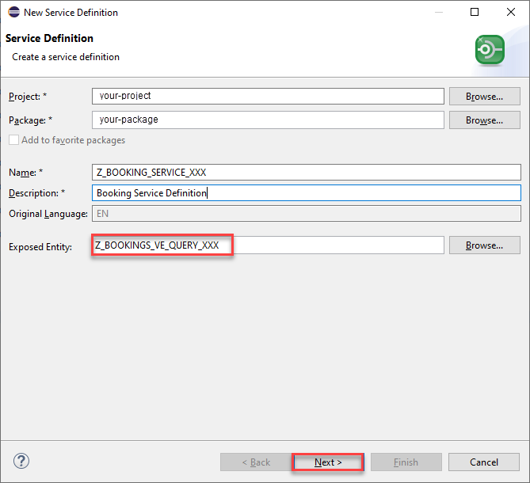
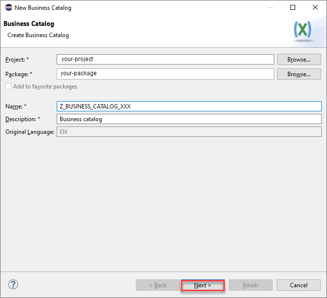
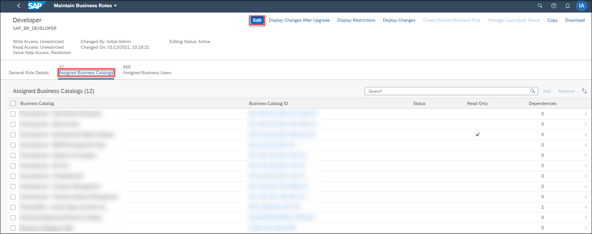
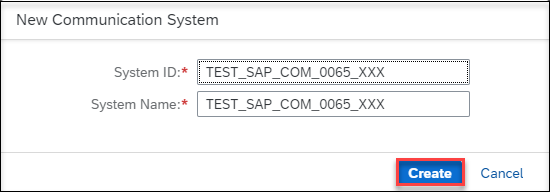
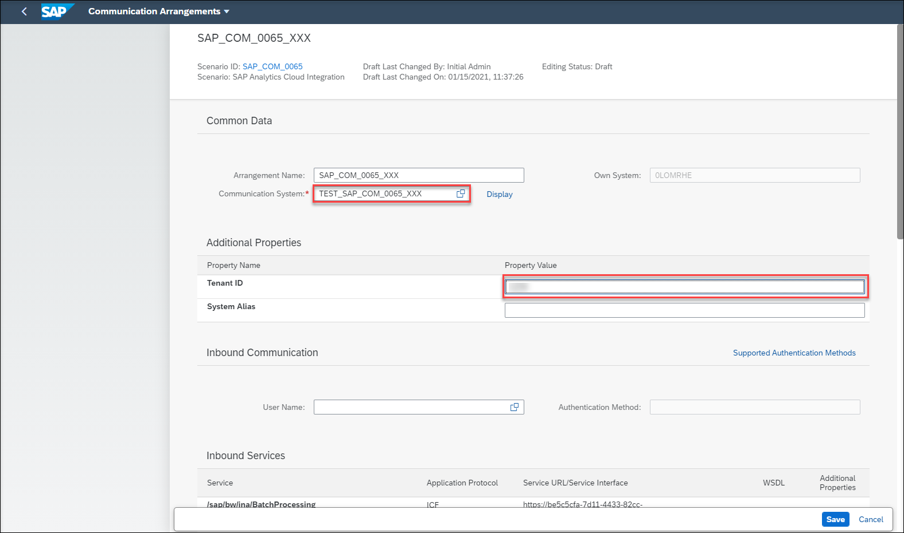
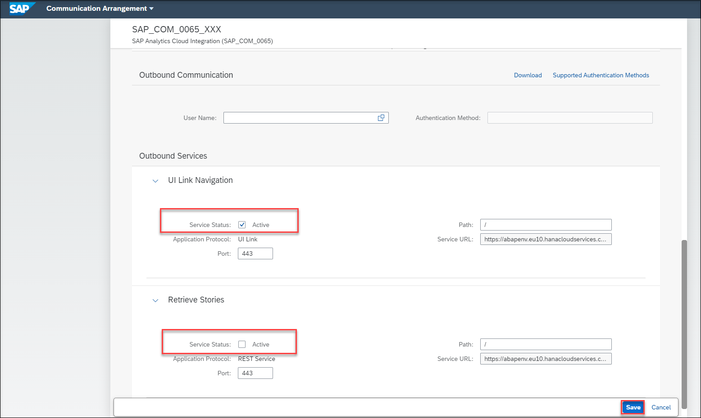
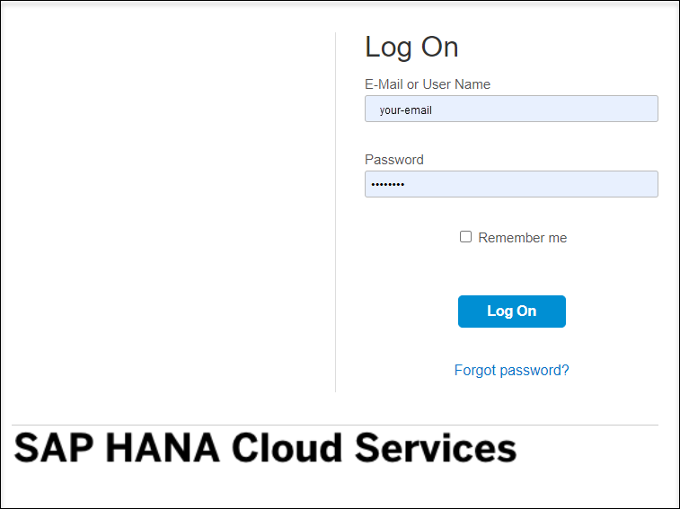
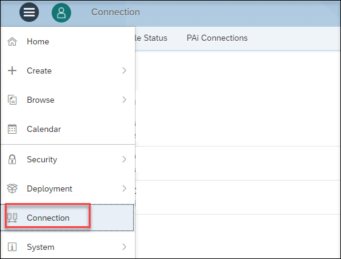
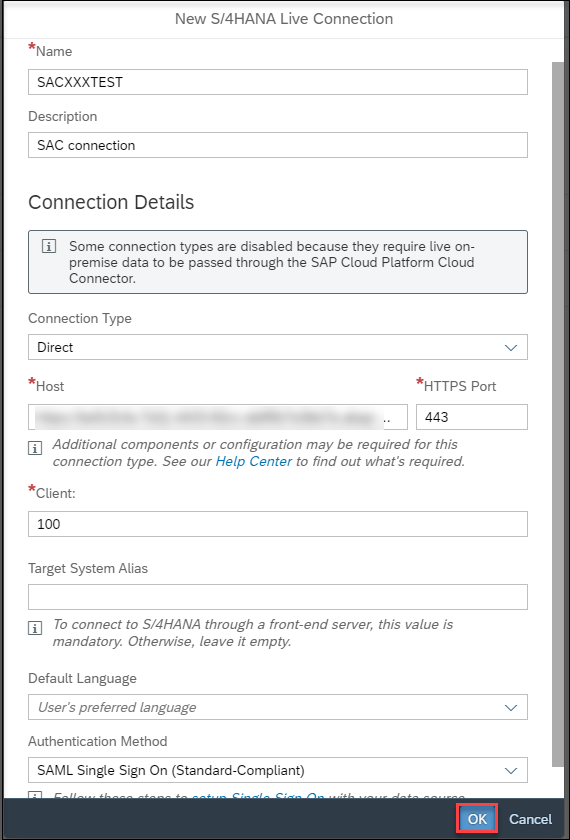

## Prerequisites
 - You need the standard developer authorization profile to create ABAP development objects.
 - You need a SAP Analytics Cloud account.
 - Install `ABAPGit` Plugin in ADT. See <http://eclipse.abapgit.org/updatesite/>
 - To get the Flight Model into the system, follow the description at <https://github.com/SAP/abap-platform-refscen-flight/blob/master/README.md>


## Details
### You will learn
  - How to create an analytical query as CDS View Entities
  - How to connect an ABAP System to SAP Analytics Cloud
  - How to consume analytical queries on SAP Analytics Cloud by creating models and stories

Always replace `XXX` with your initials or group number.

---

[ACCORDION-BEGIN [Step 1: ](Overview)]
The new **RAP based InA service exposure** enables the SAP Business Technology Platform ABAP Environment developers to develop analytical queries(based on ABAP-CDS analytical data models) and expose them via the `InA` (Information Access) service protocol. These analytical queries can be further consumed in the SAP Analytics cloud to create analytical models, stories, multi-dimensional reports and more.


[DONE]
[ACCORDION-END]

[ACCORDION-BEGIN [Step 2: ](Create data definition for dimension view entities)]
  1. Open ADT and login to your ABAP System.
    If you do not have a package, create a new one.

  2. Right-click your package and choose **New** > **Other ABAP Repository Object**.

      

  3. Choose **Core Data Services** > **Data Definition** and click **Next**.

      

  4. Enter a **Name** and **Description** and click **Next**.

      

  5. Choose a transport request and click **Next**.

      

  6. Choose **Define View Entity** and click **Finish**.

      

  7. Check your result.

      

[DONE]
[ACCORDION-END]


[ACCORDION-BEGIN [Step 3: ](Implement dimension as CDS view entity)]

  The dimensional data are descriptive data such as the Airline ID, Connection ID, and so on. This tells you who, when, and what but does not give any quantifiable fields.

  These are mandatory header annotations for dimensions:

  `@Analytics.dataCategory: #DIMENSION`

  `@ObjectModel.representativeKey: 'AirlineID'`

>- All dimensions must have an **`@Analytics.dataCategory: #DIMENSION`** classification in the header of the view entity.

>- Dimensions with composite keys need a definition of a single field as a representative key, this configuration is achieved through annotation **`@ObjectModel.representativeKey`**.

>- Associations with texts and names are executed through annotation **`@ObjectModel.text.element`**.

>- Annotation **`@Semantics`** helps to define text and address fields.

>- Associations of external attributes are determined by foreign keys using annotation **`@ObjectModel.foreignKey.association`**.

  1. Edit the code in your created data definition with **`/dmo/carrier as Airline`**  and use the code completion by pressing `CTRL + Space` keys to define your fields.

      

  2. Annotations must be defined on top of the fields. Your complete code should look like following:

      

    ```Z_AIRLINE_VE_DIM_XXX
      @AbapCatalog.viewEnhancementCategory: [#NONE]
      @AccessControl.authorizationCheck: #CHECK
      @EndUserText.label: 'airline view entity- CDS data model'
      @Metadata.ignorePropagatedAnnotations: true
      @ObjectModel.usageType:{
          serviceQuality: #X,
          sizeCategory: #S,
          dataClass: #MIXED
      }


      @Analytics.dataCategory: #DIMENSION
      @ObjectModel.representativeKey: 'CarrierId'

      define view entity Z_AIRLINE_VE_DIM_XXX as select from /dmo/carrier as Airline

      {

          @ObjectModel.text.element: ['AirlineName']
      key carrier_id as CarrierId,

          @Semantics.text: true
          @Search.defaultSearchElement: true
          @Search.fuzzinessThreshold: 0.7
          Airline.name as AirlineName,

          Airline.currency_code as CurrencyCode
      }
    ```

  3. Save an activate your data definition.

[DONE]
[ACCORDION-END]

[ACCORDION-BEGIN [Step 4: ](Create three other dimensions)]
  1. Follow step 2 and step 3 and create customer dimension:

    ```Z_CUSTOMER_VE_DIM_XXX

      @AbapCatalog.viewEnhancementCategory: [#NONE]
      @AccessControl.authorizationCheck: #CHECK
      @EndUserText.label: 'Customer View Entity - CDS View Model'
      @Metadata.ignorePropagatedAnnotations: true
      @ObjectModel.usageType:{
          serviceQuality: #X,
          sizeCategory: #S,
          dataClass: #MIXED
      }

      @Analytics.dataCategory: #DIMENSION
      @ObjectModel.representativeKey: 'CustomerID'

      define view entity Z_CUSTOMER_VE_DIM_XXX
      as select from /dmo/customer as Customer

      association [1] to I_Country as _Country on Customer.country_code = _Country.Country

      {
          key Customer.customer_id as CustomerId,
              Customer.first_name as FirstName,
              Customer.last_name as LastName,
              Customer.title as Title,
              Customer.street as Street,
              Customer.postal_code as PostalCode,
              Customer.city as City,
              @ObjectModel.foreignKey.association: '_Country'
              Customer.country_code as CountryCode,
              Customer.phone_number as PhoneNumber,
              Customer.email_address as EmailAddress,
              Customer.createdby as Createdby,
              Customer.createdat as Createdat,
              Customer.lastchangedby as Lastchangedby,
              Customer.lastchangedat as Lastchangedat,

        /*Associations*/
        _Country

      }

    ```

  2. Follow step 2 and step 3 and create connection dimension:

    ```Z_CONNECTION_VE_DIM_XXX
      @AbapCatalog.viewEnhancementCategory: [#NONE]
      @AccessControl.authorizationCheck: #CHECK
      @EndUserText.label: 'Connection View Entity - CDS View Model'
      @Metadata.ignorePropagatedAnnotations: true
      @ObjectModel.usageType:{
          serviceQuality: #X,
          sizeCategory: #S,
          dataClass: #MIXED
      }
      @Analytics.dataCategory: #DIMENSION
      @ObjectModel.representativeKey: 'ConnectionID'

      define view entity Z_CONNECTION_VE_DIM_XXX as select from /dmo/connection as Connection

      association [1] to Z_AIRLINE_VE_DIM_XXX as _Airline on Connection.carrier_id = _Airline.CarrierId

      {
          @ObjectModel.foreignKey.association: '_Airline'
          key Connection.carrier_id as CarrierId,
          key Connection.connection_id as ConnectionId,
          Connection.airport_from_id as AirportFromId,
          Connection.airport_to_id as AirportToId,
          Connection.departure_time as DepartureTime,
          Connection.arrival_time as ArrivalTime,
          Connection.distance as Distance,
          Connection.distance_unit as DistanceUnit,
          concat(airport_from_id, concat(' -> ', airport_to_id)) as Trip,

            /*Associations*/
            _Airline
      }

    ```

  3. Follow step 2 and step 3 and create agency dimension:

    ```Z_Agency_VE_DIM_XXX
        @AbapCatalog.viewEnhancementCategory: [#NONE]
        @AccessControl.authorizationCheck: #CHECK
        @EndUserText.label: 'Agency View - CDS View Entity Model'
        @Metadata.ignorePropagatedAnnotations: true
        @ObjectModel.usageType:{
          serviceQuality: #X,
          sizeCategory: #S,
          dataClass: #MIXED
        }


        @Analytics.dataCategory: #DIMENSION
        @ObjectModel.representativeKey: 'AgencyID'

        define view entity Z_Agency_VE_DIM_XXX as select from
        /dmo/agency as Agency
        association to /DMO/I_Travel_U as _Travel  on Agency.agency_id = _Travel.AgencyID

        {
        key Agency.agency_id as AgencyId,
          @Semantics.text: true
          Agency.name as Name,
          Agency.street as Street,
          Agency.postal_code as PostalCode,
          Agency.city as City,
          Agency.country_code as CountryCode,
          Agency.phone_number as PhoneNumber,
           _Travel.TravelID    as TravelID,

         /*Associations*/
         _Travel

        }

    ```

  4. Do not forget to save and activate all your created data definitions. You have now 4 data definitions for 4 dimensions.

      

[DONE]
[ACCORDION-END]

[ACCORDION-BEGIN [Step 5: ](Implement cube as CDS view entity)]
  We will implement a cube, which is linked to all dimensions, what we created in last steps.

  1. Follow the procedure in step 2 and create a **Data Definition** to implement your cube.

  2. To create a cube, there is a mandatory header annotation:

      `@Analytics.dataCategory: #CUBE`

  3. An Association is used to link a view (or table) to the source view (or table) in CDS view entities. In an Association, cardinality is defined. Cardinality is the relationship between the source and associated view entities in the form of [ min .. max ] (only the target cardinality is stated).

    ```associations
      association to Z_CUSTOMER_VE_DIM_XXX   as _Customer   on  Booking.CustomerID = _Customer.CustomerId
      association to Z_AIRLINE_VE_DIM_XXX    as _Airline    on  Booking.AirlineID = _Airline.CarrierId
      association to Z_Connection_VE_DIM_XXX as _Connection on  Booking.AirlineID    = _Connection.CarrierId
                                                      and Booking.ConnectionID = _Connection.ConnectionId
      association to Z_AGENCY_VE_DIM_XXX     as _Agency     on  Booking.TravelID = _Agency.TravelID
    ```

  4.  All Cubes must have at least one measure.
  The measurable data are the quantifiable fields that can be calculated, such as number of flight bookings and number of flight seats. Using a query, you can SUM these fields.

    ```measure
          @EndUserText.label: 'Total of Bookings'
          @Aggregation.default: #SUM
          1                     as TotalOfBookings
    ```

  5. Associations of external attributes are determined by foreign keys using annotation `@ObjectModel.foreignKey.association`.

    ```Foreign-key-association
      @ObjectModel.foreignKey.association: '_Airline'
      Booking.carrier_id             as AirlineID,

    ```

  6. Your complete code should look like following:

    ```Z_BOOKINGS_VE_CUBE_XXX
    @AbapCatalog.viewEnhancementCategory: [#NONE]
    @AccessControl.authorizationCheck: #CHECK
    @EndUserText.label: 'Bookings view entity - CDS Data Model'
    @Metadata.ignorePropagatedAnnotations: true

    @Analytics.dataCategory: #CUBE

    /*+[hideWarning] { "IDS" : [ "CARDINALITY_CHECK" ]  } */
    define view entity Z_BOOKINGS_VE_CUBE_XXX
      as select from /DMO/I_Booking_U as Booking

      association to Z_CUSTOMER_VE_DIM_XXX   as _Customer   on  Booking.CustomerID = _Customer.CustomerId
      association to Z_AIRLINE_VE_DIM_XXX    as _Airline    on  Booking.AirlineID = _Airline.CarrierId
      association to Z_CONNECTION_VE_DIM_XXX as _Connection on  Booking.AirlineID    = _Connection.CarrierId
                                                        and Booking.ConnectionID = _Connection.ConnectionId
      association to Z_Agency_VE_DIM_XXX     as _Agency     on  Booking.TravelID = _Agency.TravelID

    {
          /* Dimensions */
      key Booking.TravelID      as TravelID,

      key Booking.BookingID     as BookingID,

          Booking.BookingDate   as BookingDate,

          @ObjectModel.foreignKey.association: '_Customer'
          Booking.CustomerID    as CustomerID,

          @ObjectModel.foreignKey.association: '_Airline'
          Booking.AirlineID     as AirlineID,

          @EndUserText.label: 'Customer Country'
          @ObjectModel.foreignKey.association: '_CustomerCountry'
          _Customer.CountryCode as CustomerCountry,

          @EndUserText.label: 'Customer City'
          _Customer.City        as CustomerCity,

          @ObjectModel.foreignKey.association: '_Connection'
          Booking.ConnectionID  as ConnectionID,

          //    @Semantics.currencyCode: true
          Booking.CurrencyCode  as CurrencyCode,

          Booking.FlightDate    as FlightDate,

          _Agency.AgencyId      as AgencyID,

          _Agency.Name          as AgencyName,

          /* Measures */

          @EndUserText.label: 'Total of Bookings'
          @Aggregation.default: #SUM
          1           as TotalOfBookings,

          @Semantics.amount.currencyCode: 'CurrencyCode'
          @Aggregation.default: #MIN
          Booking.FlightPrice   as FlightPrice,


          /* Associations */
          _Customer,
          _Airline,
          _Connection,
          _Customer._Country    as _CustomerCountry

    }
    ```


[DONE]
[ACCORDION-END]

[ACCORDION-BEGIN [Step 6: ](Implement query as CDS view entity)]
  1. Follow the procedure in step 2 and create a **Data Definition** to implement your query.

  2. To create a query, there is a mandatory header annotation:

      `@Analytics.query: true`

  3. With the annotation `@AnalyticsDetails.query.axis:<VALUE>`, the elements of the view can be positioned on multiple axes: Rows, Columns and Free. The elements can be directly annotated with their axis. All measures (elements which can be aggregated) need to be on the same axis. The annotation of the first measure will therefore be used for all measures of the query. If `@AnalyticsDetails.query.axis:<VALUE>` is not found, the system positions the measures on the columns.

    >The default value for elements that are not measures is the free axis. Note that elements in the projection list, which belong to the same field in the query, will be grouped together.

  4. Your complete code should look like following:

    ```Z_BOOKINGS_VE_QUERY_XXX
      @EndUserText.label: 'Bookings View Entity - CDS Data Model'
      @Analytics.query: true

      define view entity Z_BOOKINGS_VE_QUERY_XXX
      as select from Z_BOOKINGS_VE_CUBE_XXX as BookingsCube

      {
          /*Dimensions*/    
          @AnalyticsDetails.query.display: #KEY_TEXT
          @AnalyticsDetails.query.axis: #ROWS
      key BookingsCube.TravelID,
          @AnalyticsDetails.query.display: #KEY_TEXT
          @AnalyticsDetails.query.axis: #ROWS
      key BookingsCube.BookingID,
          @AnalyticsDetails.query.axis: #ROWS
          BookingsCube.BookingDate,
          @AnalyticsDetails.query.axis: #ROWS
          BookingsCube.CustomerID,
          @AnalyticsDetails.query.axis: #ROWS
          BookingsCube.AirlineID,
          @AnalyticsDetails.query.axis: #ROWS
          BookingsCube.CustomerCountry,
          @AnalyticsDetails.query.axis: #ROWS
          BookingsCube.CustomerCity,
          @AnalyticsDetails.query.axis: #ROWS
          BookingsCube.ConnectionID,
          @AnalyticsDetails.query.axis: #ROWS
          BookingsCube.CurrencyCode,
          @AnalyticsDetails.query.axis: #ROWS
          BookingsCube.FlightDate,
          @AnalyticsDetails.query.axis: #ROWS
          BookingsCube.AgencyID,
          @AnalyticsDetails.query.axis: #ROWS
          BookingsCube.AgencyName,

          /*Measures*/
          TotalOfBookings,
          FlightPrice   
      }

    ```

  5. Test the created query via **Preview Analytical Queries** App. Right-click the query, **Open With** > **Data Preview**.

      

    Data preview in **Preview Analytical Queries** App looks like the following:

      

[DONE]
[ACCORDION-END]

[ACCORDION-BEGIN [Step 7: ](Create service definition)]
  You use a service definition to define which data is to be exposed as a business service, using one or more business service bindings.

  1. Right-click your created query in step 6 and choose **New Service Definition**.

      

  2. Enter a **Name** and **Description** and check if **Exposed Entity** is your created query, click **Next**.

      

  3. Select transport request and click **Finish**.

      

  4. After the query is exposed as a service, save and activate your service definition.

      


[DONE]
[ACCORDION-END]

[ACCORDION-BEGIN [Step 8: ](Create service binding as InA)]
  The service binding is used to bind a service definition to a communication protocol and in our case, the protocol that enables web-based data access from ABAP systems is the Information Access (InA) protocol.

  1. Right-click your created query in step 6 and choose **New Service Binding**.

      

  2.  Enter a **Name** and **Description** and choose **InA - UI** as **Binding Type**. Check if **Service Binding** is your created service binding in last step. Click **Next**.

      

  3. Choose a transport request and click **Finish**.

      

  4. Activate your service binding. After activation, the external service name for your query is displayed.

      

    >The analytical query will be displayed with the external service name in SAP Analytics Cloud as the data source.

[DONE]
[ACCORDION-END]

[ACCORDION-BEGIN [Step 9: ](Create IAM App)]
  1. Right-click your package, choose **New** > **Other ABAP Repository Object**.

      

  2. Search for **IAM App** under **Cloud Identity and Access Management**. Click **Next**.

      

  3. Enter a **Name** and **Description** and choose **EXT-External App** as **Application Type**. Click **Next**.

      

  4. Choose a transport request and click **Finish**.

      

    >Your created **IAM App** name will get an **EXT** automatically in his name like: **`Z_IAM_EXT_XXX_EXT`**.

  5. Go to the **Services** tab and click on **Insert** button. Select **Service Type** as **InA -UI** and your **Service Name** which is your service binding name **`Z_BOOKINGS_INA_BINDING_XXX`**.
  Click **OK**.

      

  6. Save and **Publish Locally**.

      

[DONE]
[ACCORDION-END]

[ACCORDION-BEGIN [Step 10: ](Create business catalog)]
  1. Right-click **Cloud Identity and Access Management** in your package, choose **New** > **Business Catalog**.

      

  2. Enter a **Name** and **Description** and click **Next**.

      

  3. Choose a transport request and click **Finish**.

      

  4. To create a **Business Catalog App Assignment**, in your created Business Catalog click **Apps**, click **Add**, assign your previously created external IAM app as **IAM App**. Enter a **Name** and **Description** and click **Next**.

      

  5. Choose a transport request and click **Finish**. The **Business Catalog App Assignment** will be opened.

      
      

  6. Back to the **Business Catalog**, choose your **Assignment ID** and click **Publish Locally**.

      

[DONE]
[ACCORDION-END]

[ACCORDION-BEGIN [Step 11: ](Add business catalog to developer business role)]
  1. Login to the Fiori launchpad and open **Maintain Business Roles** App under **Identity and Access Management**.

      

  2. Navigate to the **`SAP_BR_Developer`** Role, select **Assign Business Catalogs** and click **Edit**.

      

      

  3. Click **Add** and find your business catalog in the popup and click **OK** to add the business catalog.

      

      

  4. Check in the **Assigned Business Catalogs**, if your business catalog is added in the list. Click **Save**.

      


[DONE]
[ACCORDION-END]

[ACCORDION-BEGIN [Step 12: ](Create communication system and arrangement)]
  1. Back to the main page of Fiori launchpad and open **Communication Systems** App under **Communication Management**.

      

  2. Click **New** to create a new communication system. Enter **System ID** and **System Name**, click **Create**.

      

      

  3. The new communication system will be opened. Switch **Destination Service** to **OFF** and now enter you SAP Analytics Cloud host name (ex: `xxx.cloud.sap`) as **Host Name** and `443` as **Port**. Click **Save**.

      

  4. Back to the **Communication Management** and open **Communication Arrangements** to create a new one.

      

  5. Click **New** and select `SAP_COM_0065` as **Scenario**.Enter a name for your communication arrangement and click **Create**.

      

  6. The new communication arrangement will be opened. Choose the communication system which you created previously in the **Communication System** field. Provide the **Tenant ID** of your SAP Analytics Cloud tenant.

      

    > **Tenant ID** can be found under the main menu of the SAP Analytics Cloud tenant, click **System** > **About** > **System Name**.

  7. Under the **Outbound Services**, the service status for **UI Link Navigation** should be checked as **Active** and **Retrieve Stories** should be unchecked, click **Save**.

      

[DONE]
[ACCORDION-END]

[ACCORDION-BEGIN [Step 13: ](Connect the ABAP system to SAP Analytics Cloud)]
  1. Login to the SAP Analytics Cloud tenant.

      

  2. Open the main menu and click **Connection** and on the Connection Window click **Add**. In the popup under **Connect to Live Data** click **SAP S/4 HANA**.

      

      

  3. In the **New S/4 HANA Live Connection** dialog enter **Name** and **Description**, **Connection Type** has to be **Direct**, for **Host** copy your Fiori launchpad link like `xxx.abap-web.stagingaws.hanavlab.ondemand.com`. Enter `443` in **HTTPS Port** field, and `100` for **Client**. As **Authentication Method** choose **SAML Single Sign-on (Standard Compliant)**. Click **OK**.

      

  4. check the result.

      

[DONE]
[ACCORDION-END]

[ACCORDION-BEGIN [Step 14: ](Create model)]
  1. Open the main menu, go to **Create** > **Model**.

      

  2. To create a model, open **Get data from a data source**.

      

  3. Click **Live Data Connection**. Choose **SAP BW** as **System type**, choose your created connection in the last step as **Connection** and your query created in step 6 as **Data Source**. Click **OK**.

      

    >query name can be found in the service binding as External Service Name.

  4. After the creation of the model, click **Save** to save the model and select a pre-existing folder or create a new folder. Enter an name and description for your model. Click **OK**.

      


[DONE]
[ACCORDION-END]

[ACCORDION-BEGIN [Step 15: ](Create Story)]
  1. To create a simple analytical story, go to main menu, open **Create** > **Story**.

      

  2. You can choose **Report** as template.

      

  3. Click **Chart and table** and in this dialog click on add button on the graph. In **Select Dataset or Model** popup select your created model in the last step. You will maybe asked to login into Fiori in an other dialog and your model will successfully linked.

      

      

      

  4. Use the **Builder** on the right-hand side to select **Measures** and **Dimensions** for your chart.

      

  5. You can insert a table as well and use **Builder** to manage your table.

      

      

  6. Click **Save** icon, enter a **Name** and **Description** for your story and click **OK**.

      

  7. To find your created model and story, go to the main menu, open **Browse** > **Files**.

      

      

[DONE]
[ACCORDION-END]
[ACCORDION-BEGIN [Step 16: ](Test yourself)]

[VALIDATE_1]
[ACCORDION-END]

---
