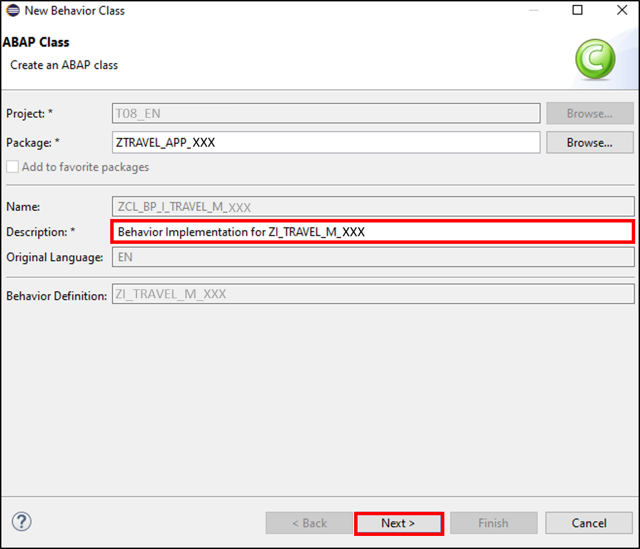
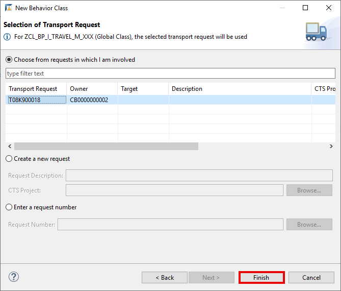
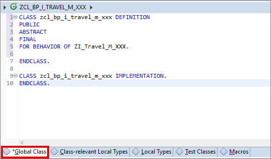
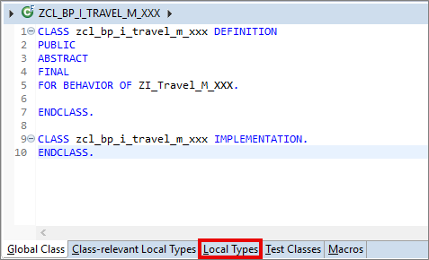
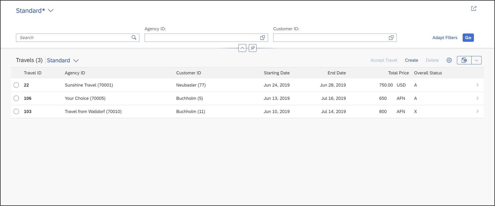

## Prerequisites  
- You have created an SAP Cloud Platform ABAP environment trial user or
- You have created a developer user in an SAP Cloud Platform ABAP Environment system.
- You have downloaded Eclipse Photon or Oxygen and installed ABAP Development Tools (ADT). See <https://tools.hana.ondemand.com/#abap>.

## Details
### You will learn  
  - How to enhance behavior definition
  - How to enhance behavior implementation
  - How to enhance behavior definition for projection view

In this tutorial, wherever XXX appears, use a number (e.g. 000).

---

[ACCORDION-BEGIN [Step 1: ](Enhance behavior definition)]
  1. Switch to your behavior definition `ZI_TRAVEL_M_XXX` and add following action and validation to your coding:

    ```ABAP
    // instance action and dynamic action control
    action ( features : instance ) acceptTravel result [1] $self;

    // validations
    validation validateCustomer on save { field customer_id; }
    validation validateDates on save { field begin_date, end_date; }

    // determination
    determination CalculateTravelKey on modify
    { create; }
    ```

  2. Your result should look like this. Replace your code with following:

    ```ABAP

    managed implementation in class ZCL_BP_I_TRAVEL_M_XXX unique;

    define behavior for ZI_TRAVEL_M_XXX alias Travel
    persistent table ztravel_xxx
    etag master last_changed_at
    lock master
    {
      // key that will be automatically generated by the framework
      field ( readonly, numbering : managed ) mykey;

      // semantic key calculated in a determination
      field ( readonly ) travel_id;

      // administrative fields (read only)
      field ( readonly ) last_changed_at, last_changed_by, created_at, created_by;

      // mandatory fields that are required to create a travel
      field ( mandatory ) agency_id, overall_status, booking_fee, currency_code;

      // standard operations for travel entity
      create;
      update;
      delete;

      // instance action and dynamic action control
      action ( features : instance ) acceptTravel result [1] $self;

      // validations
      validation validateCustomer on save { field customer_id; }
      validation validateDates on save { field begin_date, end_date; }

      // determination
        determination CalculateTravelKey on modify
        { create; }

    }
    ```

  3. Save and activate.

      

[DONE]
[ACCORDION-END]

[ACCORDION-BEGIN [Step 2: ](Enhance behavior definition for projection view)]
  1. Switch to your behavior definition `ZC_TRAVEL_M_XXX` and add following action to your coding:

    ```ABAP
    use action acceptTravel;
    ```

  2. Your result should look like this. Replace your code with following:

    ```ABAP
    projection;

    define behavior for ZC_TRAVEL_M_XXX alias TravelProcessor
    use etag
    {
    // scenario specific field control
    field ( mandatory ) BeginDate, EndDate, CustomerID;

    use create;
    use update;
    use delete;

    use action acceptTravel;
    }

    ```

  3. Save and activate.

      

     The **validation** allows you to check the data consistency of your travel booking application.

     By using **actions** your are able to change the status of your booking status.

[DONE]
[ACCORDION-END]

[ACCORDION-BEGIN [Step 3: ](Create implementation class)]
  1. In your behavior definition `ZI_Travel_M_XXX` set the cursor before the implementation class `ZCL_BP_I_TRAVEL_M_XXX` and click **`CTRL` + 1**. Double-click on **Create behavior implementation class `zcl_bp_i_travel_m_xxx`** to create your implementation class.

      

  2. Create a new behavior implementation:

     - Description: Behavior implementation for `ZI_TRAVEL_M_XXX`

     Click **Next >**.

      

  3. Click **Finish** to use your transport request.

      

[DONE]
[ACCORDION-END]

[ACCORDION-BEGIN [Step 4: ](Enhance behavior implementation)]

  1. Open your behavior implementation `ZCL_BP_I_TRAVEL_M_XXX` and switch to **global class** to replace your code.

      


  2. In your **global class** replace your code with following:

    ```ABAP
    CLASS zcl_bp_i_travel_m_xxx DEFINITION
    PUBLIC
    ABSTRACT
    FINAL
    FOR BEHAVIOR OF ZI_Travel_M_XXX.

    ENDCLASS.

    CLASS zcl_bp_i_travel_m_xxx IMPLEMENTATION.
    ENDCLASS.

    ```

  3. Open your behavior implementation `ZCL_BP_I_TRAVEL_M_XXX` and switch to **local types** to replace your code.

      

  4. In your **local types** replace your code with following:

    ```ABAP
    *"* use this source file for the definition and implementation of
    *"* local helper classes, interface definitions and type
    *"* declarations

    CLASS lhc_travel DEFINITION INHERITING FROM cl_abap_behavior_handler.

      PRIVATE SECTION.

        TYPES tt_travel_update TYPE TABLE FOR UPDATE zi_travel_m_xxx.

        METHODS validate_customer          FOR VALIDATION travel~validateCustomer IMPORTING keys FOR travel.
        METHODS validate_dates             FOR VALIDATION travel~validateDates    IMPORTING keys FOR travel.
        METHODS set_status_completed       FOR MODIFY IMPORTING   keys FOR ACTION travel~acceptTravel              RESULT result.
        METHODS get_features               FOR FEATURES IMPORTING keys REQUEST    requested_features FOR travel    RESULT result.


        METHODS CalculateTravelKey FOR DETERMINATION Travel~CalculateTravelKey IMPORTING keys FOR Travel.


    ENDCLASS.

    CLASS lhc_travel IMPLEMENTATION.

    **********************************************************************
    *
    * Validate customer data when saving travel data
    *
    **********************************************************************
      METHOD validate_customer.

        READ ENTITY zi_travel_m_xxx\\travel FROM VALUE #(
            FOR <root_key> IN keys ( %key     = <root_key>
                                     %control = VALUE #( customer_id = if_abap_behv=>mk-on ) ) )
            RESULT DATA(lt_travel).

        DATA lt_customer TYPE SORTED TABLE OF /dmo/customer WITH UNIQUE KEY customer_id.

        " Optimization of DB select: extract distinct non-initial customer IDs
        lt_customer = CORRESPONDING #( lt_travel DISCARDING DUPLICATES MAPPING customer_id = customer_id EXCEPT * ).
        DELETE lt_customer WHERE customer_id IS INITIAL.
        CHECK lt_customer IS NOT INITIAL.

        " Check if customer ID exist
        SELECT FROM /dmo/customer FIELDS customer_id
          FOR ALL ENTRIES IN @lt_customer
          WHERE customer_id = @lt_customer-customer_id
          INTO TABLE @DATA(lt_customer_db).

        " Raise msg for non existing customer id
        LOOP AT lt_travel INTO DATA(ls_travel).
          IF ls_travel-customer_id IS NOT INITIAL AND NOT line_exists( lt_customer_db[ customer_id = ls_travel-customer_id ] ).
            APPEND VALUE #(  mykey = ls_travel-mykey ) TO failed.
            APPEND VALUE #(  mykey = ls_travel-mykey
                             %msg      = new_message( id       = /dmo/cx_flight_legacy=>customer_unkown-msgid
                                                      number   = /dmo/cx_flight_legacy=>customer_unkown-msgno
                                                      v1       = ls_travel-customer_id
                                                      severity = if_abap_behv_message=>severity-error )
                             %element-customer_id = if_abap_behv=>mk-on ) TO reported.
          ENDIF.

        ENDLOOP.

      ENDMETHOD.


    **********************************************************************
    *
    * Check validity of date
    *
    **********************************************************************
      METHOD validate_dates.

        READ ENTITY zi_travel_m_xxx\\travel FROM VALUE #(
            FOR <root_key> IN keys ( %key     = <root_key>
                                     %control = VALUE #( begin_date = if_abap_behv=>mk-on
                                                         end_date   = if_abap_behv=>mk-on ) ) )
            RESULT DATA(lt_travel_result).

        LOOP AT lt_travel_result INTO DATA(ls_travel_result).

          IF ls_travel_result-end_date < ls_travel_result-begin_date.  "end_date before begin_date

            APPEND VALUE #( %key        = ls_travel_result-%key
                            mykey   = ls_travel_result-mykey ) TO failed.

            APPEND VALUE #( %key     = ls_travel_result-%key
                            %msg     = new_message( id       = /dmo/cx_flight_legacy=>end_date_before_begin_date-msgid
                                                    number   = /dmo/cx_flight_legacy=>end_date_before_begin_date-msgno
                                                    v1       = ls_travel_result-begin_date
                                                    v2       = ls_travel_result-end_date
                                                    v3       = ls_travel_result-travel_id
                                                    severity = if_abap_behv_message=>severity-error )
                            %element-begin_date = if_abap_behv=>mk-on
                            %element-end_date   = if_abap_behv=>mk-on ) TO reported.

          ELSEIF ls_travel_result-begin_date < cl_abap_context_info=>get_system_date( ).  "begin_date must be in the future

            APPEND VALUE #( %key        = ls_travel_result-%key
                            mykey   = ls_travel_result-mykey ) TO failed.

            APPEND VALUE #( %key = ls_travel_result-%key
                            %msg = new_message( id       = /dmo/cx_flight_legacy=>begin_date_before_system_date-msgid
                                                number   = /dmo/cx_flight_legacy=>begin_date_before_system_date-msgno
                                                severity = if_abap_behv_message=>severity-error )
                            %element-begin_date = if_abap_behv=>mk-on
                            %element-end_date   = if_abap_behv=>mk-on ) TO reported.
          ENDIF.

        ENDLOOP.

      ENDMETHOD.


    ********************************************************************************
    *
    * Implements travel action (in our case: for setting travel overall_status to completed)
    *
    ********************************************************************************
      METHOD set_status_completed.

        " Modify in local mode: BO-related updates that are not relevant for authorization checks
        MODIFY ENTITIES OF zi_travel_m_xxx IN LOCAL MODE
               ENTITY travel
                  UPDATE FROM VALUE #( FOR key IN keys ( mykey = key-mykey
                                                         overall_status = 'A' " Accepted
                                                         %control-overall_status = if_abap_behv=>mk-on ) )
               FAILED   failed
               REPORTED reported.

        " Read changed data for action result
        READ ENTITIES OF zi_travel_m_xxx IN LOCAL MODE
             ENTITY travel
             FROM VALUE #( FOR key IN keys (  mykey = key-mykey
                                              %control = VALUE #(
                                                agency_id       = if_abap_behv=>mk-on
                                                customer_id     = if_abap_behv=>mk-on
                                                begin_date      = if_abap_behv=>mk-on
                                                end_date        = if_abap_behv=>mk-on
                                                booking_fee     = if_abap_behv=>mk-on
                                                total_price     = if_abap_behv=>mk-on
                                                currency_code   = if_abap_behv=>mk-on
                                                overall_status  = if_abap_behv=>mk-on
                                                description     = if_abap_behv=>mk-on
                                                created_by      = if_abap_behv=>mk-on
                                                created_at      = if_abap_behv=>mk-on
                                                last_changed_by = if_abap_behv=>mk-on
                                                last_changed_at = if_abap_behv=>mk-on
                                              ) ) )
             RESULT DATA(lt_travel).

        result = VALUE #( FOR travel IN lt_travel ( mykey = travel-mykey
                                                    %param    = travel
                                                  ) ).

      ENDMETHOD.

    ********************************************************************************
    *
    * Implements the dynamic feature handling for travel instances
    *
    ********************************************************************************
      METHOD get_features.

        "%control-<fieldname> specifies which fields are read from the entities

        READ ENTITY zi_travel_m_xxx FROM VALUE #( FOR keyval IN keys
                                                          (  %key                    = keyval-%key
                                                           "  %control-travel_id      = if_abap_behv=>mk-on
                                                             %control-overall_status = if_abap_behv=>mk-on
                                                            ) )
                                    RESULT DATA(lt_travel_result).


        result = VALUE #( FOR ls_travel IN lt_travel_result
                           ( %key                           = ls_travel-%key
                             %features-%action-acceptTravel = COND #( WHEN ls_travel-overall_status = 'A'
                                                                        THEN if_abap_behv=>fc-o-disabled ELSE if_abap_behv=>fc-o-enabled   )
                          ) ).

      ENDMETHOD.


      METHOD calculatetravelkey.
        SELECT FROM ztravel_xxx
            FIELDS MAX( travel_id ) INTO @DATA(lv_max_travel_id).

        LOOP AT keys INTO DATA(ls_key).
          lv_max_travel_id = lv_max_travel_id + 1.
          MODIFY ENTITIES OF zi_travel_m_xxx  IN LOCAL MODE
            ENTITY Travel
              UPDATE SET FIELDS WITH VALUE #( ( mykey     = ls_key-mykey
                                                travel_id = lv_max_travel_id ) )
              REPORTED DATA(ls_reported).
          APPEND LINES OF ls_reported-travel TO reported-travel.
        ENDLOOP.

      ENDMETHOD.

    ENDCLASS.
    ```

  5. Save and activate.

      

  6. Now switch to your service binding and double click on `TravelProcessor`.

      

  7. Check your result.

      The behavior implementation is created for travel booking. By using the managed approach, the implementation of create, update and delete is done automatically.

     The accept travel button appears.
     Create a new travel booking with the booking status O.
     O stands for open. Save your travel booking and you are able to accept your created travel booking.

      

      Hint: If your accept travel button does not appear, wait a few minutes or deactivate your service binding and activate it again.

[DONE]
[ACCORDION-END]


[ACCORDION-BEGIN [Step 4: ](Test yourself)]

[VALIDATE_1]
[ACCORDION-END]
---
