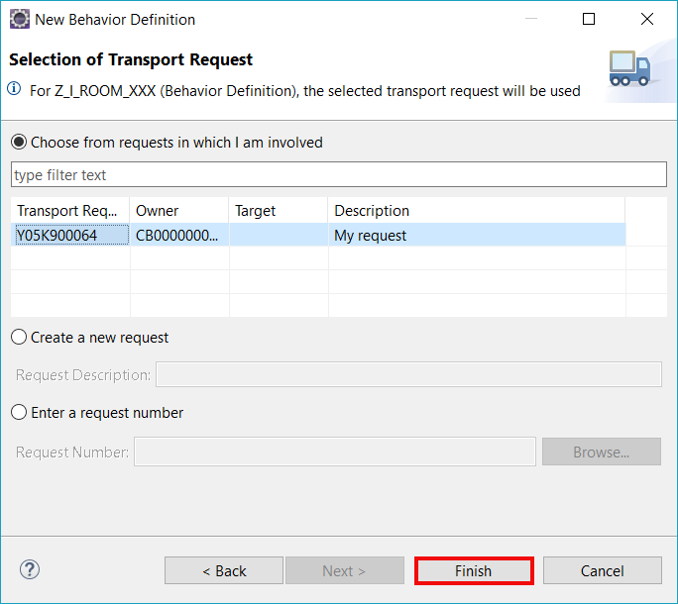
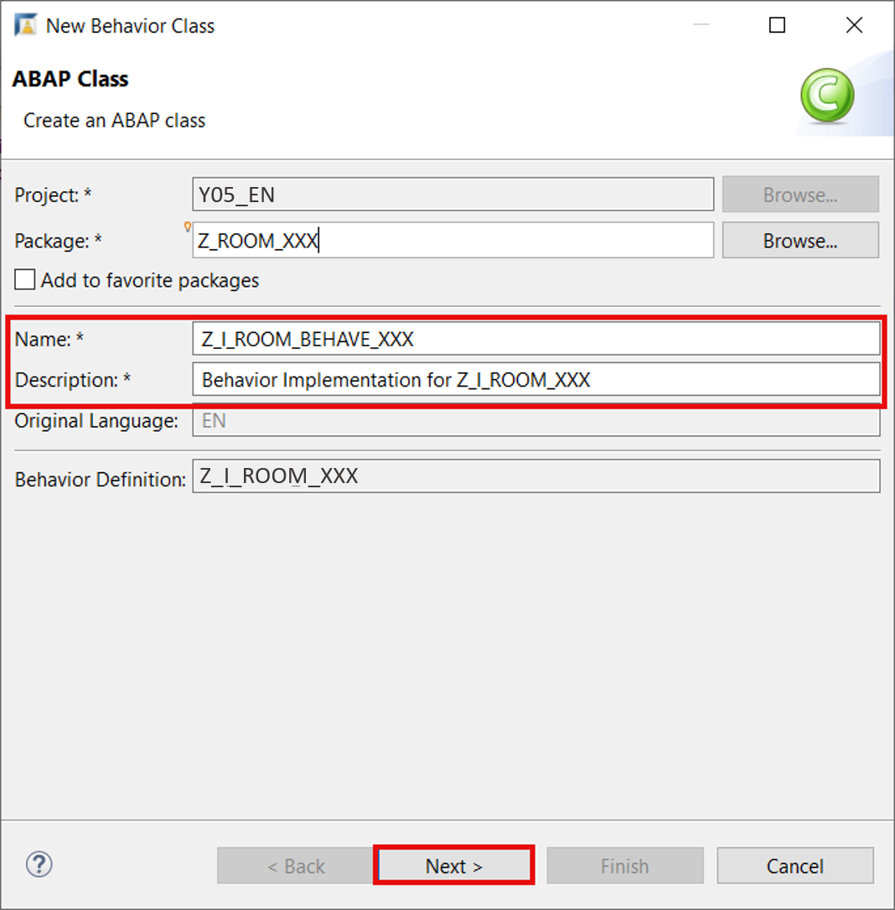
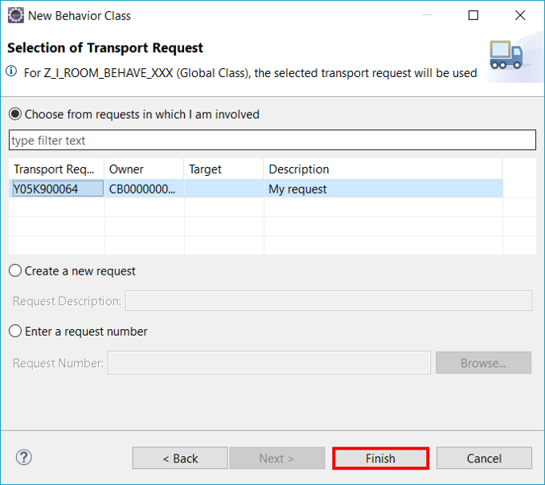
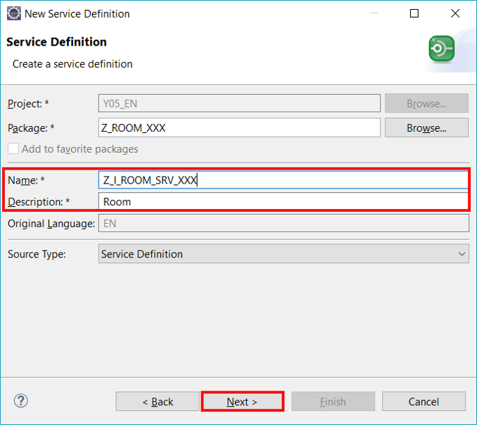
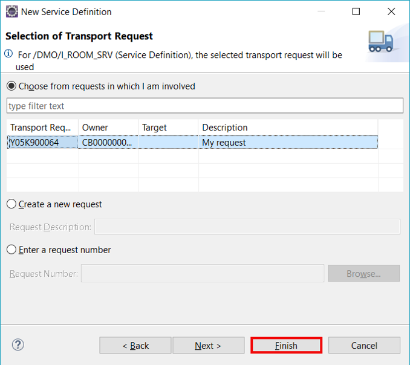
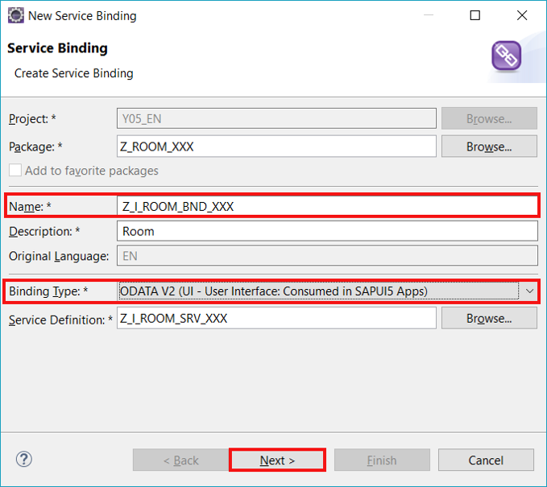
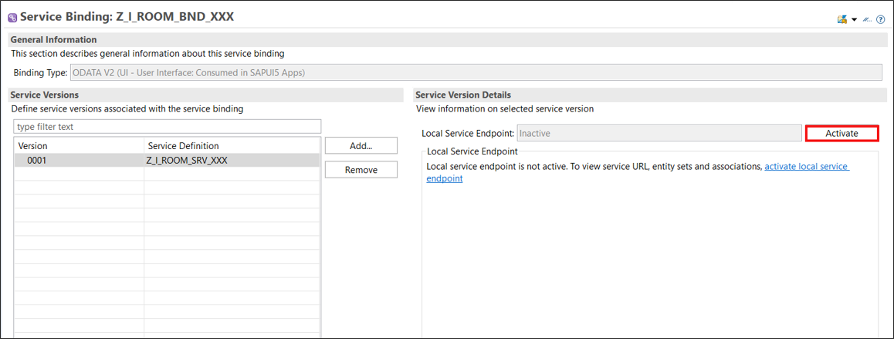
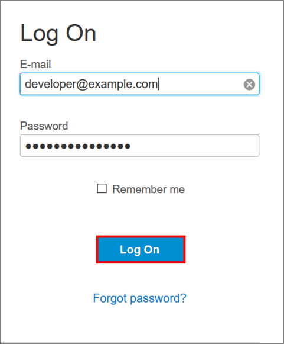
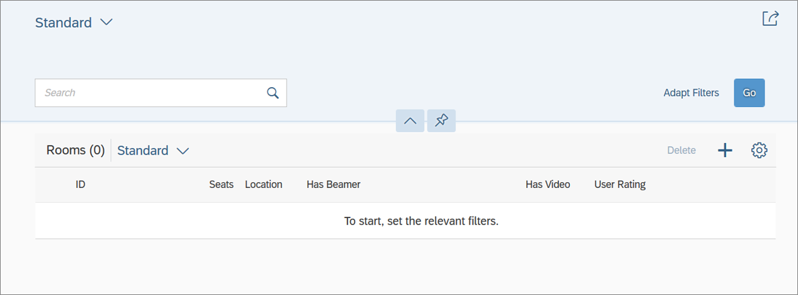

## Prerequisites  
  - SAP Cloud Platform ABAP Environment user
  - ADT version 2.96 or higher

## Details
### You will learn
  - How to create a behavior definition
  - How to create a behavior implementation
  - How to create a service definition
  - How to create a service binding
  - How to test a service

In this tutorial, wherever `XXX` appears, use a number (e.g. `000`).

---


[ACCORDION-BEGIN [Step 1: ](Create behavior definition)]
1. Right-click on **`Z_I_ROOM_XXX`** (data definition) and select **New Behavior Definition**.

    

2. Create your **behavior definition**:
     - Name: **`Z_I_ROOM_XXX`**
     - Description: **`Behavior for Z_I_ROOM_XXX`**
     - Root Entity: **`Z_I_ROOM_XXX`**

     Click **Next>**.

    

3. Click **Finish**.

    

4. Create your behavior definition with following coding:

    ```ABAP
    implementation unmanaged;
    define behavior for Z_I_ROOM_XXX
      alias room
      lock master
      etag master lastchangeddatetime
      {
        create;
        update;
        delete;

        field (mandatory) id;
        field (read only) lastchangedbyuser, lastchangeddatetime;
      }
    ```
   Save and activate.

[DONE]
[ACCORDION-END]


[ACCORDION-BEGIN [Step 2: ](Create behavior implementation)]
1. Right-click on **`Z_I_ROOM_XXX`** (behavior definition) and select **New Behavior Implementation**.

      

2.  Create your **behavior implementation**:
       - Name: **`Z_I_ROOM_BEHAVE_XXX`**
       - Description: **`Behavior implementation for Z_I_ROOM_XXX`**
       - Behavior Definition: **`Z_I_ROOM_XXX`**

       Click **Next>**.

       

3. Click **Finish**.

      

4. Create your behavior implementation with following coding:

    ```ABAP
    CLASS lcl_handler DEFINITION INHERITING FROM cl_abap_behavior_handler.
      PUBLIC SECTION.
        CLASS-DATA:
          mt_root_to_create TYPE STANDARD TABLE OF zroom_xxx WITH NON-UNIQUE DEFAULT KEY,
          mt_root_to_update TYPE STANDARD TABLE OF zroom_xxx WITH NON-UNIQUE DEFAULT KEY,
          mt_root_to_delete TYPE STANDARD TABLE OF zroom_xxx WITH NON-UNIQUE DEFAULT KEY.
      PRIVATE SECTION.
        TYPES:
          ty_action(2)     TYPE c,
          tt_message       TYPE TABLE OF symsg,
          tt_room_failed   TYPE TABLE FOR FAILED z_i_room_xxx,
          tt_room_reported TYPE TABLE FOR REPORTED z_i_room_xxx.
        CONSTANTS:
          BEGIN OF cs_action,
            create TYPE ty_action VALUE '01',
            update TYPE ty_action VALUE '02',
            delete TYPE ty_action VALUE '03',
          END OF cs_action.
        METHODS:
          create FOR MODIFY IMPORTING roots_to_create FOR CREATE room,
          update FOR MODIFY IMPORTING roots_to_update FOR UPDATE room,
          delete FOR MODIFY IMPORTING roots_to_delete FOR DELETE room,
          lock FOR BEHAVIOR IMPORTING roots_to_lock FOR LOCK room,
          read FOR BEHAVIOR IMPORTING roots_to_read FOR READ room RESULT et_room,
          validate
            IMPORTING
              iv_action         TYPE ty_action
              is_room           TYPE zroom_xxx
            RETURNING
              VALUE(rv_message) TYPE string.
    ENDCLASS.

    CLASS lcl_handler IMPLEMENTATION.

      METHOD create.
        LOOP AT roots_to_create INTO DATA(ls_root_to_create).
          DATA(lv_message) = validate( iv_action = cs_action-create is_room = CORRESPONDING zroom_xxx( ls_root_to_create ) ).
          IF lv_message IS INITIAL.
            ls_root_to_create-lastchangedbyuser = sy-uname.
            GET TIME STAMP FIELD ls_root_to_create-lastchangeddatetime.
            INSERT CORRESPONDING #( ls_root_to_create ) INTO TABLE mapped-room.
            INSERT CORRESPONDING #( ls_root_to_create ) INTO TABLE mt_root_to_create.
          ELSE.
            APPEND VALUE #( %cid = ls_root_to_create-%cid id = ls_root_to_create-id %fail = VALUE #( cause = if_abap_behv=>cause-unspecific ) ) TO failed-room.
            APPEND VALUE #( %cid = ls_root_to_create-%cid id = ls_root_to_create-id %msg = new_message_with_text( severity = if_abap_behv_message=>severity-error text = lv_message ) ) TO reported-room.
          ENDIF.
        ENDLOOP.
      ENDMETHOD.

      METHOD update.
        LOOP AT roots_to_update INTO DATA(ls_root_to_update).
          SELECT SINGLE FROM zroom_xxx FIELDS * WHERE id = @ls_root_to_update-id INTO @DATA(ls_room).

          DATA(lt_control_components) = VALUE string_table(
              ( `id` )
              ( `seats` )
              ( `location` )
              ( `hasbeamer` )
              ( `hasvideo` )
              ( `userrating` )
              ( `lastchangedbydatetime` )
              ( `lastchangedbyuser` ) ).

          LOOP AT lt_control_components INTO DATA(lv_component_name).
            ASSIGN COMPONENT lv_component_name OF STRUCTURE ls_root_to_update-%control TO FIELD-SYMBOL(<lv_control_value>).
            CHECK <lv_control_value> = cl_abap_behavior_handler=>flag_changed.
            ASSIGN COMPONENT lv_component_name OF STRUCTURE ls_root_to_update TO FIELD-SYMBOL(<lv_new_value>).
            ASSIGN COMPONENT lv_component_name OF STRUCTURE ls_room TO FIELD-SYMBOL(<lv_old_value>).
            <lv_old_value> = <lv_new_value>.
          ENDLOOP.

          DATA(lv_message) = validate( iv_action = cs_action-update is_room = ls_room ).
          IF lv_message IS INITIAL.
            ls_root_to_update-lastchangedbyuser = sy-uname.
            GET TIME STAMP FIELD ls_root_to_update-lastchangeddatetime.
            INSERT ls_room INTO TABLE mt_root_to_update.
          ELSE.
            APPEND VALUE #( %cid = ls_root_to_update-%cid_ref id = ls_root_to_update-id %fail = VALUE #( cause = if_abap_behv=>cause-unspecific ) ) TO failed-room.
            APPEND VALUE #( %cid = ls_root_to_update-%cid_ref id = ls_root_to_update-id %msg = new_message_with_text( severity = if_abap_behv_message=>severity-error text = lv_message ) ) TO reported-room.
          ENDIF.
        ENDLOOP.
      ENDMETHOD.

      METHOD delete.
        LOOP AT roots_to_delete INTO DATA(ls_root_to_delete).
          SELECT SINGLE FROM zroom_xxx FIELDS * WHERE id = @ls_root_to_delete-id INTO @DATA(ls_room).
          DATA(lv_message) = validate( iv_action = cs_action-delete is_room = ls_room ).
          IF lv_message IS INITIAL.
            INSERT CORRESPONDING #( ls_root_to_delete ) INTO TABLE mt_root_to_delete.
          ELSE.
            APPEND VALUE #( %cid = ls_root_to_delete-%cid_ref id = ls_root_to_delete-id %fail = VALUE #( cause = if_abap_behv=>cause-unspecific ) ) TO failed-room.
            APPEND VALUE #( %cid = ls_root_to_delete-%cid_ref id = ls_root_to_delete-id %msg = new_message_with_text( severity = if_abap_behv_message=>severity-error text = lv_message ) ) TO reported-room.
          ENDIF.
        ENDLOOP.
      ENDMETHOD.

      METHOD lock.
        LOOP AT roots_to_lock INTO DATA(ls_root_to_lock).
          TRY.
              cl_abap_lock_object_factory=>get_instance( iv_name = 'EZROOMXXX')->enqueue(
                it_table_mode = VALUE if_abap_lock_object=>tt_table_mode( ( table_name = 'ZROOM_XXX' mode = 'E' ) )
                it_parameter  = VALUE if_abap_lock_object=>tt_parameter( ( name = 'ID' value = REF #( ls_root_to_lock-id ) ) ) ).
            CATCH cx_abap_foreign_lock INTO DATA(lx_lock).
              APPEND VALUE #( id = ls_root_to_lock-id %fail = VALUE #( cause = if_abap_behv=>cause-locked ) ) TO failed-room.
              APPEND VALUE #( id = ls_root_to_lock-id %msg = new_message_with_text( severity = if_abap_behv_message=>severity-error text = lx_lock->get_text( ) ) ) TO reported-room.
            CATCH cx_abap_lock_failure.
              ASSERT 1 = 0.
          ENDTRY.
        ENDLOOP.
      ENDMETHOD.

      METHOD read.
        LOOP AT roots_to_read INTO DATA(ls_root_to_read).
          SELECT SINGLE FROM z_i_room_xxx FIELDS * WHERE id = @ls_root_to_read-id INTO @DATA(ls_room).
          INSERT ls_room INTO TABLE et_room.
        ENDLOOP.
      ENDMETHOD.

      METHOD validate.
         "Add method from Tutorial: Create authorization in SAP Cloud Platform ABAP environment (Step 4)
      ENDMETHOD.

    ENDCLASS.


    CLASS lcl_saver DEFINITION INHERITING FROM cl_abap_behavior_saver.
      PROTECTED SECTION.
        METHODS finalize          REDEFINITION.
        METHODS check_before_save REDEFINITION.
        METHODS save              REDEFINITION.
    ENDCLASS.

    CLASS lcl_saver IMPLEMENTATION.
      METHOD finalize.
      ENDMETHOD.

      METHOD check_before_save.
      ENDMETHOD.

      METHOD save.
        INSERT zroom_xxx FROM TABLE @lcl_handler=>mt_root_to_create.
        UPDATE zroom_xxx FROM TABLE @lcl_handler=>mt_root_to_update.
        DELETE zroom_xxx FROM TABLE @lcl_handler=>mt_root_to_delete.
      ENDMETHOD.
    ENDCLASS.
    ```
 Save and activate.


[DONE]
[ACCORDION-END]

[ACCORDION-BEGIN [Step 3: ](Create service definition)]
  1. Right-click on **`Z_ROOM_XXX`**, select the menu path **New** > **Other ABAP Repository Object**.

      

  2.  Create your **service definition:**
     - Name: **`Z_I_ROOM_SRV_XXX`**
     - Description: **`Room`**

     Click **Next>**.

      

  3. Click **Finish**.

      

  4. Edit your service definition:
    ```ABAP
    @EndUserText.label: 'Room'
    define service Z_I_ROOM_SRV_XXX {
      expose Z_I_ROOM_XXX as Room;
    }
    ```

    Save and activate.

[DONE]
[ACCORDION-END]

[ACCORDION-BEGIN [Step 4: ](Create service binding)]
  1. Right-click on **`Z_I_ROOM_SRV_XXX`** and select **New Service Binding**.

      

  2.  Create your **service binding:**
     - Name: **`Z_I_ROOM_BND_XXX`**
     - Description: **`Room`**
     - Binding Type: **`ODATA V2(UI - User Interface: Consumed In SAPUI5 Apps)`**
     - Service Definition: **`Z_I_ROOM_SRV_XXX`**

     Click **Next>**.

      

  3. Click **Finish**.

      

  4. Click **Activate** to activate your service binding.

      

[DONE]
[ACCORDION-END]

[ACCORDION-BEGIN [Step 5: ](Test service with browser)]
  1. Click on **Service URL** to open your service.

      

  2. Logon with your developer user.

      

  3.  Check your metadata.

      

[DONE]
[ACCORDION-END]

[ACCORDION-BEGIN [Step 6: ](Open preview for Fiori Elements App)]
  1. Right-click on **`Room`** (Entity Set and Association) and select **Open Fiori Elements App Preview**.

      

  2. Logon with your developer user.

      

  3.  Check your result.

      

[DONE]
[ACCORDION-END]

[ACCORDION-BEGIN [Step 7: ](Test yourself)]

[VALIDATE_1]
[ACCORDION-END]
