## Prerequisites  
- SAP Cloud Platform ABAP environment User
- Business Catalog `SAP_CORE_BC_EXT_TST` assigned to your business user
- Initial development setup

## Details
### You will learn
- How to define a behavior implementation

In this tutorial, wherever `xxx` appears, use a number (e.g. `000`).

---

[ACCORDION-BEGIN [Step 1: ](Open Eclipse)]
Go to your ABAP package created in [Create and Expose a Core Data Service Based on a Database Table](https://www.sap.com/developer/tutorials/abap-environment-create-cds-view.html) and open your data definition **`ZI_BOOKING_XXX`** to add the following statement: **`root`**
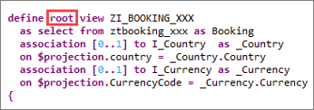

Save and activate.

[DONE]
[ACCORDION-END]

[ACCORDION-BEGIN [Step 2: ](Open other repository object)]
Right-click on your package and navigate to **New** > **Other ABAP Repository Object** from the appearing context menu.


[DONE]
[ACCORDION-END]

[ACCORDION-BEGIN [Step 3: ](Create behavior definition)]
1. Navigate to **Core Data Services**, select **data definition** and press **Next**.
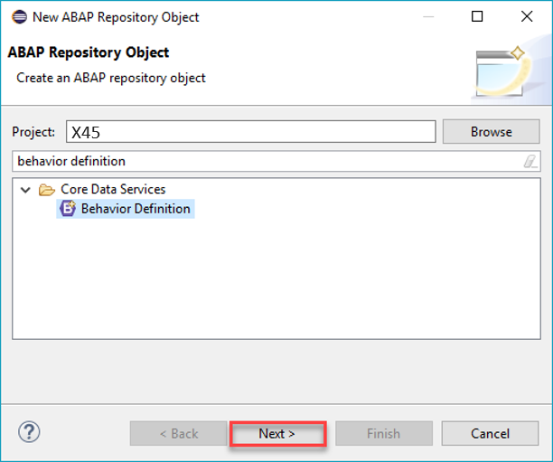

2. Create a behavior definition for booking node/entities.
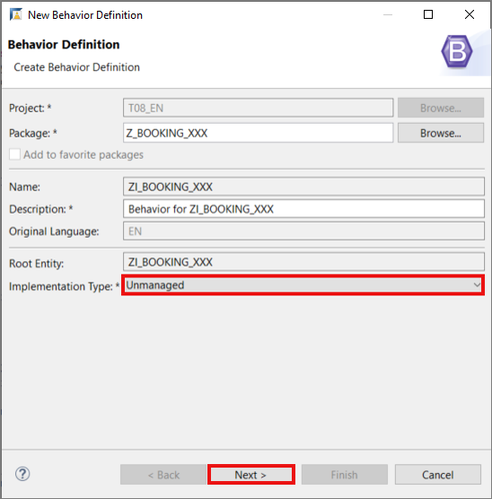

3. Click **Finish** to complete your transport request.
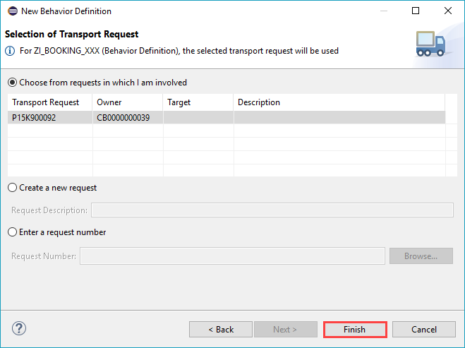

4. Check result. An empty behavior definition for unmanaged implementation is created.
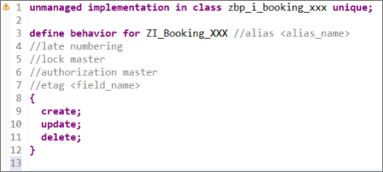

[DONE]
[ACCORDION-END]

[ACCORDION-BEGIN [Step 4: ](Implement behavior definition)]
Provide an alias (`booking`) and specify the lock master.
Define the table field **`LastChangedAt`** for the `etag` handling.
Add the following operations:

- create
- update
- delete

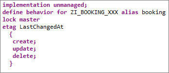

Save and activate.

[DONE]
[ACCORDION-END]

[ACCORDION-BEGIN [Step 5: ](Create behavior implementation)]
1. Right-click on your behavior definition and select **New Behavior Implementation**.


2. Provide a name and click **Next**.
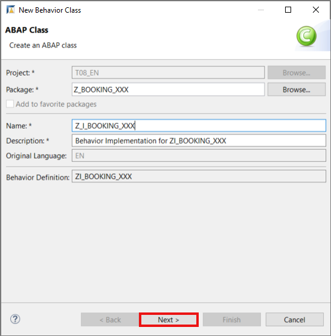

3. Provide a transport request if required and click **Finish**.
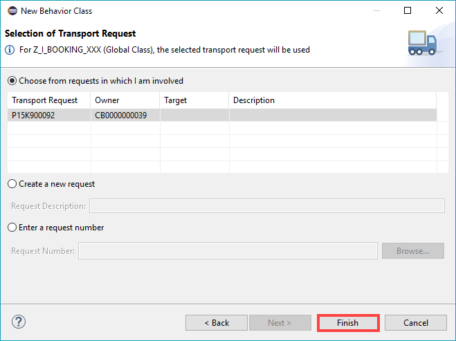

[DONE]
[ACCORDION-END]

[ACCORDION-BEGIN [Step 6: ](Enhance local class)]
1. Go to the bottom of the class editor and click on the **Global Class** tab
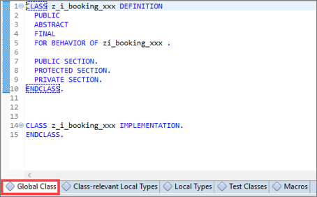

2. Go to the bottom of the class editor and click on the **Local Types** tab. This is the place the proper implementation of the behavior definition shall be implemented. In the unmanaged approach, you as developer are responsible for the complete transactional handling.
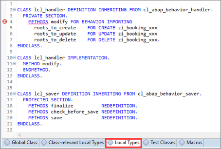

3. Define a data buffer at the top of the editor by defining the local class **`lcl_buffer`** as shown on the screenshot. You can use the source code provided below:
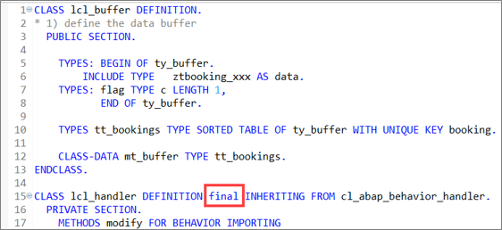

    ```swift
    CLASS lcl_buffer DEFINITION.
    * 1) define the data buffer  
      PUBLIC SECTION.

        TYPES: BEGIN OF ty_buffer.
            INCLUDE TYPE   ztbooking_xxx AS data.
        TYPES: flag TYPE c LENGTH 1,
               END OF ty_buffer.

        TYPES tt_bookings TYPE SORTED TABLE OF ty_buffer WITH UNIQUE KEY booking.

        CLASS-DATA mt_buffer TYPE tt_bookings.
    ENDCLASS.
    ```

    Add also the final statement to your **`lcl_handler`** class.

4. Enhance the definition of the local class **`lcl_handler`**. Enhance the parameter interface of the method modify with importing parameters **`roots_to_create`**, **`roots_to_update`** and **`roots_to_delete`** for the different operations. Add the read method.
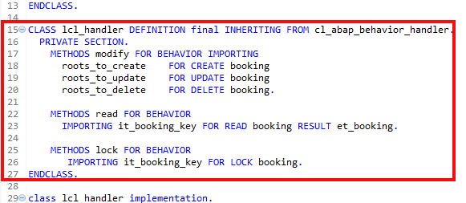

[DONE]
[ACCORDION-END]

[ACCORDION-BEGIN [Step 7: ](Implement methods in handler class)]
1. Implement the modify method in your **`lcl_handler`** implementation class.

    ```swift
    " handle delete
        LOOP AT roots_to_delete INTO DATA(ls_delete).
          " check for content id (%cid) handling
          IF ls_delete-booking IS INITIAL.
            ls_delete-booking = mapped-booking[ %cid = ls_delete-%cid_ref ]-booking.
          ENDIF.

          READ TABLE lcl_buffer=>mt_buffer WITH KEY booking = ls_delete-booking ASSIGNING <ls_buffer>.
          IF sy-subrc = 0.
            " already in buffer, check why
            IF <ls_buffer>-flag = 'C'.
              "delete after create => just remove from buffer
              DELETE TABLE lcl_buffer=>mt_buffer WITH TABLE KEY booking = ls_delete-booking.
            ELSE.
              <ls_buffer>-flag = 'D'.
            ENDIF.
          ELSE.
            " not yet in buffer.
            "TODO read from DB and raise error it does not exist...
            INSERT VALUE #( flag = 'D' booking = ls_delete-booking ) INTO TABLE lcl_buffer=>mt_buffer.
          ENDIF.
        ENDLOOP.
    ```

2. Add also following code to your **`lcl_handler`** implementation class.

    ```swift
    " handle create
    IF roots_to_create IS NOT INITIAL.
      " if there are creates, then we need to know the maximum booking number.
      SELECT SINGLE MAX( booking ) FROM ztbooking_xxx INTO @DATA(lv_max_booking).
    ENDIF.

    LOOP AT roots_to_create INTO DATA(ls_create).
      " next booking number
      ADD 1 TO lv_max_booking.
      ls_create-%data-booking = lv_max_booking.
      GET TIME STAMP FIELD DATA(zv_tsl).
      ls_create-%data-lastchangedat = zv_tsl.  "Handle field LastChangedAt

      " insert as created into buffer
      INSERT VALUE #( flag = 'C' data = CORRESPONDING #( ls_create-%data ) ) INTO TABLE lcl_buffer=>mt_buffer.

      " tell framework about new key if a content id (%cid) is used.:
      IF ls_create-%cid IS NOT INITIAL.
        INSERT VALUE #( %cid = ls_create-%cid  booking = ls_create-booking ) INTO TABLE mapped-booking.
      ENDIF.
    ENDLOOP.
    ```

3. Create a handle update by adding following coding:

    ```swift
    " handle update
    IF roots_to_update IS NOT INITIAL.
      LOOP AT roots_to_update INTO DATA(ls_update).
        " check for content id (%cid) handling
        IF ls_update-booking IS INITIAL.
          ls_update-booking = mapped-booking[ %cid = ls_update-%cid_ref ]-booking.
        ENDIF.

        " search in buffer
        READ TABLE lcl_buffer=>mt_buffer WITH KEY booking = ls_update-booking ASSIGNING FIELD-SYMBOL(<ls_buffer>).
        IF sy-subrc <> 0.
          " not yet in buffer, read from table

          SELECT SINGLE * FROM ztbooking_xxx WHERE booking = @ls_update-booking INTO @DATA(ls_db).
          "TODO raise error it does not exist...

          INSERT VALUE #( flag = 'U' data = ls_db ) INTO TABLE lcl_buffer=>mt_buffer ASSIGNING <ls_buffer>.
        ENDIF.

        IF ls_update-%control-customername IS NOT INITIAL..
          <ls_buffer>-customername = ls_update-customername.
        ENDIF.
        IF ls_update-%control-cost  IS NOT INITIAL..
          <ls_buffer>-cost = ls_update-cost.
        ENDIF.
        IF ls_update-%control-dateoftravel   IS NOT INITIAL..
          <ls_buffer>-dateoftravel  = ls_update-dateoftravel .
        ENDIF.
        IF ls_update-%control-currencycode  IS NOT INITIAL..
          <ls_buffer>-currencycode = ls_update-currencycode.
        ENDIF.
        " TODO ....  same for the other fields ....        
        GET TIME STAMP FIELD DATA(zv_tsl2).
        <ls_buffer>-lastchangedat = zv_tsl2. "handling for field LastChangedAt (for eTag)
      ENDLOOP.
    ENDIF.

    ```
4. Implement the method read in your **`lcl_handler`** implementation class. Save your changes.

    ```swift
    METHOD read.
      LOOP AT it_booking_key INTO DATA(ls_booking_key).
        " check if it is in buffer (and not deleted).
        READ TABLE lcl_buffer=>mt_buffer WITH KEY booking = ls_booking_key-booking INTO DATA(ls_booking).
        IF sy-subrc = 0 AND ls_booking-flag <> 'U'.
          INSERT CORRESPONDING #( ls_booking-data ) INTO TABLE et_booking.
        ELSE.
          SELECT SINGLE * FROM ztbooking_xxx WHERE booking = @ls_booking_key-booking INTO @DATA(ls_db).
          IF sy-subrc = 0.
            INSERT CORRESPONDING #( ls_db ) INTO TABLE et_booking.
          ELSE.
            INSERT VALUE #( booking = ls_booking_key-booking ) INTO TABLE failed-booking.
          ENDIF.
        ENDIF.
      ENDLOOP.
    ENDMETHOD.
    ENDCLASS.
    ```

[DONE]
[ACCORDION-END]

[ACCORDION-BEGIN [Step 8: ](Implement method in saver class)]
Implement the method save of the local class **`lcl_saver`**.

```swift
METHOD save.  "to be implemented:  CREATE, UPDATE, DELETE on DB (zwischenspeichern im member
    DATA lt_data TYPE STANDARD TABLE OF ztbooking_xxx.

    " find all rows in buffer with flag = created
    lt_data = VALUE #(  FOR row IN lcl_buffer=>mt_buffer WHERE  ( flag = 'C' ) (  row-data ) ).
    IF lt_data IS NOT INITIAL.
      INSERT ztbooking_xxx FROM TABLE lt_data.
    ENDIF.

    " find all rows in buffer with flag = updated
    lt_data = VALUE #(  FOR row IN lcl_buffer=>mt_buffer WHERE  ( flag = 'U' ) (  row-data ) ).
    IF lt_data IS NOT INITIAL.
      UPDATE ztbooking_xxx FROM TABLE lt_data.
    ENDIF.

    " find all rows in buffer with flag = deleted
    lt_data = VALUE #(  FOR row IN lcl_buffer=>mt_buffer WHERE  ( flag = 'D' ) (  row-data ) ).
    IF lt_data IS NOT INITIAL.
      DELETE ztbooking_xxx FROM TABLE lt_data.
    ENDIF.
  ENDMETHOD.
```

Save and activate your code.

[DONE]
[ACCORDION-END]

[ACCORDION-BEGIN [Step 9: ](Check result)]

1. This is how your complete source code should look like (local types):

    ```swift
    CLASS lcl_buffer DEFINITION.
    * 1) define the data buffer
      PUBLIC SECTION.

        TYPES: BEGIN OF ty_buffer.
            INCLUDE TYPE   ztbooking_xxx AS data.
        TYPES: flag TYPE c LENGTH 1,
               END OF ty_buffer.

        TYPES tt_bookings TYPE SORTED TABLE OF ty_buffer WITH UNIQUE KEY booking.

        CLASS-DATA mt_buffer TYPE tt_bookings.
    ENDCLASS.

    CLASS lcl_handler DEFINITION final INHERITING FROM cl_abap_behavior_handler.
      PRIVATE SECTION.
        METHODS modify FOR BEHAVIOR IMPORTING
          roots_to_create    FOR CREATE booking
          roots_to_update    FOR UPDATE booking
          roots_to_delete    FOR DELETE booking.

        METHODS read FOR BEHAVIOR
          IMPORTING it_booking_key FOR READ booking RESULT et_booking.
    ENDCLASS.

    class lcl_handler implementation.
      METHOD modify.

        LOOP AT roots_to_delete INTO DATA(ls_delete).
          IF ls_delete-booking IS INITIAL.
            ls_delete-booking = mapped-booking[ %cid = ls_delete-%cid_ref ]-booking.
          ENDIF.

          READ TABLE lcl_buffer=>mt_buffer WITH KEY booking = ls_delete-booking ASSIGNING field-symbol(<ls_buffer>).
          IF sy-subrc = 0.
            IF <ls_buffer>-flag = 'C'.
              DELETE TABLE lcl_buffer=>mt_buffer WITH TABLE KEY booking = ls_delete-booking.
            ELSE.
              <ls_buffer>-flag = 'D'.
            ENDIF.
          ELSE.
            INSERT VALUE #( flag = 'D' booking = ls_delete-booking ) INTO TABLE lcl_buffer=>mt_buffer.
          ENDIF.
        ENDLOOP.

        " handle creates
        IF roots_to_create IS NOT INITIAL.

          SELECT SINGLE MAX( booking ) FROM ztbooking_xxx INTO @DATA(lv_max_booking).
        ENDIF.

        LOOP AT roots_to_create INTO DATA(ls_create).
          ADD 1 TO lv_max_booking.
          ls_create-%data-booking = lv_max_booking.
          GET TIME STAMP FIELD DATA(zv_tsl).
          ls_create-%data-lastchangedat = zv_tsl.
          INSERT VALUE #( flag = 'C' data = CORRESPONDING #( ls_create-%data ) ) INTO TABLE lcl_buffer=>mt_buffer.

          IF ls_create-%cid IS NOT INITIAL.
            INSERT VALUE #( %cid = ls_create-%cid  booking = ls_create-booking ) INTO TABLE mapped-booking.
          ENDIF.
        ENDLOOP.

        " handle update
        IF roots_to_update IS NOT INITIAL.
          LOOP AT roots_to_update INTO DATA(ls_update).
            IF ls_update-booking IS INITIAL.
              ls_update-booking = mapped-booking[ %cid = ls_update-%cid_ref ]-booking.
            ENDIF.

            READ TABLE lcl_buffer=>mt_buffer WITH KEY booking = ls_update-booking ASSIGNING <ls_buffer>.
            IF sy-subrc <> 0.

              SELECT SINGLE * FROM ztbooking_xxx WHERE booking = @ls_update-booking INTO @DATA(ls_db).
              INSERT VALUE #( flag = 'U' data = ls_db ) INTO TABLE lcl_buffer=>mt_buffer ASSIGNING <ls_buffer>.
            ENDIF.

            IF ls_update-%control-customername IS NOT INITIAL..
              <ls_buffer>-customername = ls_update-customername.
            ENDIF.
            IF ls_update-%control-cost  IS NOT INITIAL..
              <ls_buffer>-cost = ls_update-cost.
            ENDIF.
            IF ls_update-%control-dateoftravel   IS NOT INITIAL..
              <ls_buffer>-dateoftravel  = ls_update-dateoftravel .
            ENDIF.
            IF ls_update-%control-currencycode  IS NOT INITIAL..
              <ls_buffer>-currencycode = ls_update-currencycode.
            ENDIF.
            GET TIME STAMP FIELD DATA(zv_tsl2).
            <ls_buffer>-lastchangedat = zv_tsl2.
          ENDLOOP.
        ENDIF.
      endmethod.

      METHOD read.
        LOOP AT it_booking_key INTO DATA(ls_booking_key).
          " check if it is in buffer (and not deleted).
          READ TABLE lcl_buffer=>mt_buffer WITH KEY booking = ls_booking_key-booking INTO DATA(ls_booking).
          IF sy-subrc = 0 AND ls_booking-flag <> 'U'.
            INSERT CORRESPONDING #( ls_booking-data ) INTO TABLE et_booking.
          ELSE.
            SELECT SINGLE * FROM ztbooking_xxx WHERE booking = @ls_booking_key-booking INTO @DATA(ls_db).
            IF sy-subrc = 0.
              INSERT CORRESPONDING #( ls_db ) INTO TABLE et_booking.
            ELSE.
              INSERT VALUE #( booking = ls_booking_key-booking ) INTO TABLE failed-booking.
            ENDIF.
          ENDIF.
        ENDLOOP.
      ENDMETHOD.
    ENDCLASS.


    CLASS lcl_saver DEFINITION INHERITING FROM cl_abap_behavior_saver.
      PROTECTED SECTION.
        METHODS finalize          REDEFINITION.
        METHODS check_before_save REDEFINITION.
        METHODS save              REDEFINITION.
    ENDCLASS.

    CLASS lcl_saver IMPLEMENTATION.

      METHOD save.
        DATA lt_data TYPE STANDARD TABLE OF ztbooking_xxx.

        lt_data = VALUE #(  FOR row IN lcl_buffer=>mt_buffer WHERE  ( flag = 'C' ) (  row-data ) ).
        IF lt_data IS NOT INITIAL.
          INSERT ztbooking_xxx FROM TABLE @lt_data.
        ENDIF.
        lt_data = VALUE #(  FOR row IN lcl_buffer=>mt_buffer WHERE  ( flag = 'U' ) (  row-data ) ).
        IF lt_data IS NOT INITIAL.
          UPDATE ztbooking_xxx FROM TABLE @lt_data.
        ENDIF.
        lt_data = VALUE #(  FOR row IN lcl_buffer=>mt_buffer WHERE  ( flag = 'D' ) (  row-data ) ).
        IF lt_data IS NOT INITIAL.
          DELETE ztbooking_xxx FROM TABLE @lt_data.
        ENDIF.
      ENDMETHOD.

      METHOD finalize.
      ENDMETHOD.

      METHOD check_before_save.
      ENDMETHOD.
    ENDCLASS.
    ```

2. Refresh and test your application in the browser. Now you are able to delete, add and edit objects in your application.


[DONE]
[ACCORDION-END]

[ACCORDION-BEGIN [Step 10: ](Test yourself)]
Define an unmanaged implementation of a behavior definition for following in the right order (without the lock master statement and `etag` handling):

 - `ZI_TEST` alias `test`
 - Methods:
  - create
  - update
  - delete

[VALIDATE_1]
[ACCORDION-END]
