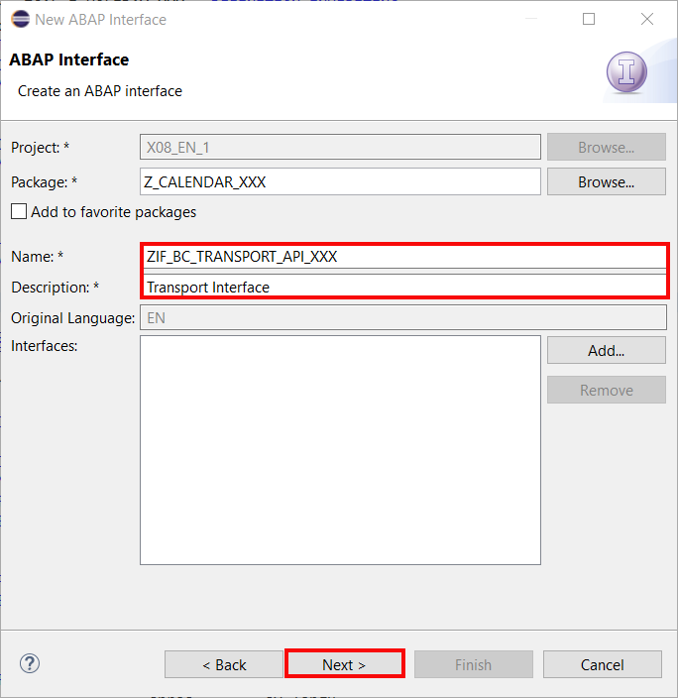
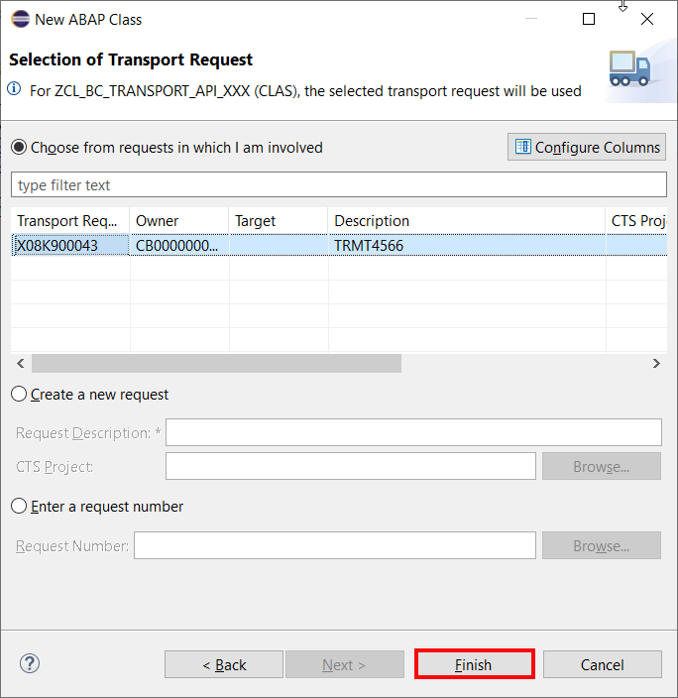
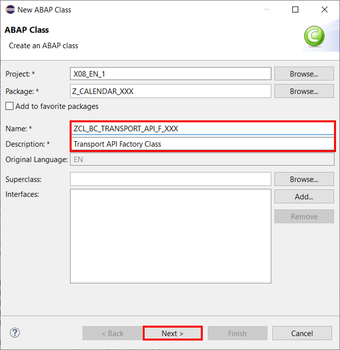
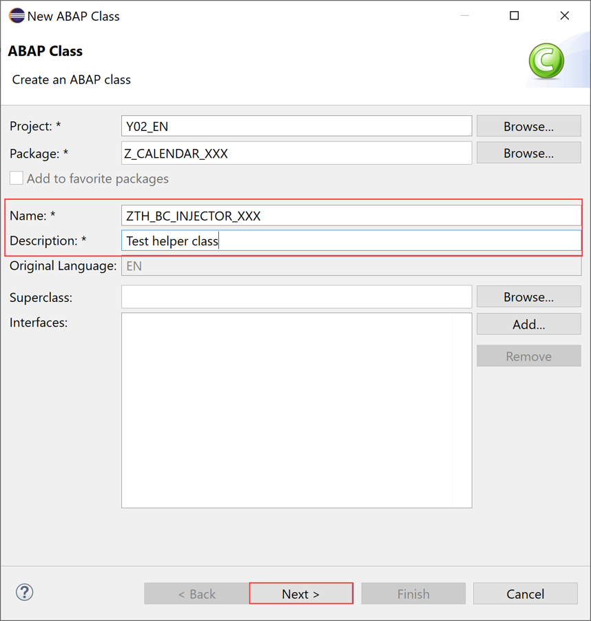
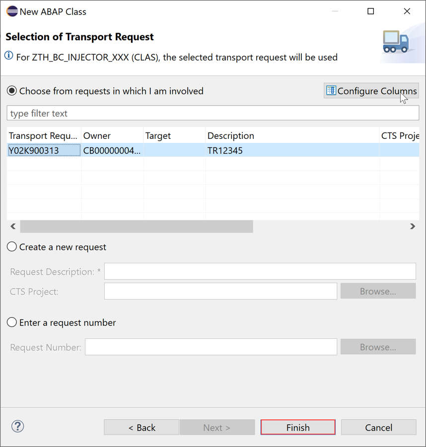

## Prerequisites  
- You need a SAP BTP, ABAP environment license.
- Content can be recorded on both software components of type **Business Configuration** or **Development**. The former is recommended, see also [Business Configuration for SAP Cloud Platform ABAP Environment](https://blogs.sap.com/2019/12/20/business-configuration-for-sap-cloud-platform-abap-environment/)
- You have to assign the **Configuration Expert - Business Process Configuration** role to the respective users.


## Details
### You will learn  
- How to create ABAP interface
- How to create transport class
- How to implement save validation


To assign role **Configuration Expert – Business Process Configuration** to the respective user please follow the following steps:

 1. Logon as administrator to your ABAP system.

 2. Go to Fiori app **Business Role Templates**, find the **Configuration Expert - Business Process Configuration** template and create a business role based on this template.

 3. With the authorizations contained in this business role, users can create customizing requests. You can create customizing requests in three ways:
    - Create them directly in the Transport Organizer in the ABAP development tools (ADT).
    - Create them implicitly using the method `add_to_transport_request()`. If no request and/or task exists for a user, the API will create one, if the user has the authorization. If the user has no authorization and no request and/or task exists, the API will raise an exception.
    - With the **Export Customizing Transport** app

 4. With the authorizations contained in this business role, users can release customizing requests in the Transport Organizer in the ABAP development tools (ADT). When releasing the request, the BC content is written to the Git repository and can be pulled into the target systems.

>HINT: In the **Edit Restriction** area of the role maintenance screen, set the property **Write, Read, Value Help** to **Unrestricted**. If you forget to do so, users with the role will have no authorization to create new transport requests.

---


[ACCORDION-BEGIN [Step 1: ](Create ABAP interface)]

  1. Right-click on your package **`Z_CALENDAR_XXX`** and select **New** > **Other ABAP Repository Object**.

      

  2. Search for **ABAP Interface**, select it and click **Next**.

      

  3. Create a new ABAP interface:
      - Name: **`ZIF_BC_TRANSPORT_API_XXX`**
      - Description: **`Transport interface`**

      

      Click **Next >**.

  4. Click **Finish**.

      

  5. Insert following code:

    ```ABAP
    INTERFACE zif_bc_transport_api_xxx PUBLIC .

      TYPES:
        BEGIN OF table_entity_relation,
          table TYPE tabname,
          entity TYPE string,
        END OF table_entity_relation,
        table_entity_relations TYPE SORTED TABLE OF table_entity_relation WITH UNIQUE KEY table.

      METHODS transport
        IMPORTING
          table_entity_relations TYPE table_entity_relations
          create                TYPE REF TO data
          update                TYPE REF TO data
          delete                TYPE REF TO data.

      METHODS validate
        IMPORTING
          table_entity_relation TYPE table_entity_relation
          keys                 TYPE REF TO data
          reported             TYPE REF TO data
          failed               TYPE REF TO data
          create               TYPE REF TO data.

    ENDINTERFACE.
    ```

  6. Save and activate.

[DONE]
[ACCORDION-END]

[ACCORDION-BEGIN [Step 2: ](Create transport class)]
The first step is to create a central class, which offers some transport change recording to the save validation and the save method for recording of the final changes. The class will reuse the SAP BTP, ABAP environment transport `API IF_A4C_BC_HANDLER`. So it will be used to wrap the generic transport API with a factory calendar specific transport API-method to offer a transport API for the Public Holiday business object. Furthermore, the class is being used to consolidate the returned success-fields, exceptions and messages of the generic API in a single output channel.

>Hint: These classes can be re-used for any customizing table related RAP BO.

  1. Right-click on **`Classes`** and select **New** > **ABAP Class**.

      

  2.  Create a new class:
      - Name: **`ZCL_BC_TRANSPORT_API_XXX`**
      - Description: **`Transport class`**

      

      Click **Next**.

  3. Click **Finish**.

      

  4. In your **global class** replace your code with following:

    ```ABAP
    CLASS zcl_bc_transport_api_xxx DEFINITION PUBLIC FINAL CREATE PROTECTED GLOBAL FRIENDS zcl_bc_transport_api_f_xxx.
      PUBLIC SECTION.
        INTERFACES zif_bc_transport_api_xxx.

        METHODS:
          constructor
            IMPORTING
              client_field             TYPE string
              use_table_scomp_transport TYPE abap_bool DEFAULT abap_false.

      PRIVATE SECTION.
        TYPES: BEGIN OF table_key,
                 table TYPE tabname,
                 keys TYPE REF TO data,
               END OF table_key,
               table_keys TYPE SORTED TABLE OF table_key WITH UNIQUE KEY table.
        DATA: transport_api            TYPE REF TO if_a4c_bc_handler,
              client_field             TYPE string,
              use_table_scomp_transport TYPE abap_bool,
              xco_transports           TYPE REF TO if_xco_cp_transports_factory,
              xco_filter               TYPE REF TO if_xco_cp_tr_filter_factory.
        METHODS transport
          IMPORTING
            check_mode       TYPE abap_bool
            table_keys       TYPE table_keys
            transport_request TYPE sxco_transport OPTIONAL
          RETURNING
            VALUE(result)    TYPE if_a4c_bc_handler=>tt_message.
        METHODS get_a4c_transport_api RETURNING VALUE(result) TYPE REF TO if_a4c_bc_handler.
        METHODS get_table_scomp_transport
          IMPORTING tabname      TYPE tabname
          RETURNING VALUE(result) TYPE sxco_transport.
        METHODS get_xco_transports
          RETURNING VALUE(result) TYPE REF TO if_xco_cp_transports_factory.
        METHODS get_xco_filter
          RETURNING VALUE(result) TYPE REF TO if_xco_cp_tr_filter_factory.
    ENDCLASS.


    CLASS zcl_bc_transport_api_xxx IMPLEMENTATION.


      METHOD constructor.
        me->client_field = client_field.
        me->use_table_scomp_transport = use_table_scomp_transport.
      ENDMETHOD.


      METHOD get_a4c_transport_api.
        IF transport_api IS NOT BOUND.
          transport_api = cl_a4c_bc_factory=>get_handler( ).
        ENDIF.
        result = transport_api.
      ENDMETHOD.


      METHOD transport.
        DATA: object_keys TYPE if_a4c_bc_handler=>tt_object_tables,
              object_key TYPE if_a4c_bc_handler=>ts_object_list,
              table_ref  TYPE REF TO data.

        FIELD-SYMBOLS:
          <import_table>  TYPE ANY TABLE,
          <original_table> TYPE ANY TABLE.

        LOOP AT table_keys ASSIGNING FIELD-SYMBOL(<table_key>).
          ASSIGN <table_key>-keys->* TO <import_table>.
          CHECK <import_table> IS NOT INITIAL.

          CREATE DATA table_ref TYPE TABLE OF (<table_key>-table).
          ASSIGN table_ref->* TO <original_table>.
          <original_table> = CORRESPONDING #( <import_table> MAPPING FROM ENTITY ).

          object_key-objname = <table_key>-table.
          object_key-tabkeys = table_ref.
          APPEND object_key TO object_keys.
        ENDLOOP.
        CHECK object_keys IS NOT INITIAL.

        TRY.
            get_a4c_transport_api( )->add_to_transport_request(
              EXPORTING
                iv_check_mode         = check_mode
                it_object_tables      = object_keys
                iv_mandant_field_name = client_field
                iv_transport_request  = transport_request
              IMPORTING
                rt_messages           = result
                rv_success            = DATA(success_flag) ).

            IF success_flag NE 'S'.
              RAISE EXCEPTION TYPE cx_a4c_bc_exception.
            ENDIF.
          CATCH cx_a4c_bc_exception INTO DATA(bc_exception).
            APPEND
              VALUE #( msgty = 'E'
                       msgid = bc_exception->if_t100_message~t100key-msgid
                       msgno = bc_exception->if_t100_message~t100key-msgno
                       msgv1 = bc_exception->if_t100_dyn_msg~msgv1
                       msgv2 = bc_exception->if_t100_dyn_msg~msgv2
                       msgv3 = bc_exception->if_t100_dyn_msg~msgv3
                       msgv4 = bc_exception->if_t100_dyn_msg~msgv4 )
              TO result.
        ENDTRY.
      ENDMETHOD.


      METHOD zif_bc_transport_api_xxx~transport.
        FIELD-SYMBOLS:
          <all_records> TYPE INDEX TABLE,
          <insert>     TYPE INDEX TABLE,
          <update>     TYPE INDEX TABLE,
          <delete>     TYPE INDEX TABLE,
          <row>        TYPE any.
        DATA transport TYPE sxco_transport.
        DATA table_keys TYPE table_keys.

        LOOP AT table_entity_relations ASSIGNING FIELD-SYMBOL(<table_entity_relation>).

          ASSIGN create->* TO FIELD-SYMBOL(<create_structure>).
          ASSIGN update->* TO FIELD-SYMBOL(<update_structure>).
          ASSIGN delete->* TO FIELD-SYMBOL(<delete_structure>).
          ASSIGN COMPONENT <table_entity_relation>-entity OF STRUCTURE <create_structure> TO <insert>.
          ASSIGN COMPONENT <table_entity_relation>-entity OF STRUCTURE <update_structure> TO <update>.
          ASSIGN COMPONENT <table_entity_relation>-entity OF STRUCTURE <delete_structure> TO <delete>.

          DATA: table_ref TYPE REF TO data,
                row_ref  TYPE REF TO data.
          CREATE DATA table_ref LIKE <insert>.
          CREATE DATA row_ref LIKE LINE OF <insert>.

          ASSIGN table_ref->* TO <all_records>.
          ASSIGN row_ref->* TO <row>.

          APPEND LINES OF <insert> TO <all_records>.
          APPEND LINES OF <update> TO <all_records>.
          LOOP AT <delete> ASSIGNING FIELD-SYMBOL(<delete_row>).
            <row> = CORRESPONDING #( <delete_row> ).
            APPEND <row> TO <all_records>.
          ENDLOOP.

          SORT <all_records>.
          DELETE ADJACENT DUPLICATES FROM <all_records> COMPARING ALL FIELDS.
          INSERT VALUE #( table = <table_entity_relation>-table keys = table_ref  ) INTO TABLE table_keys.
          IF me->use_table_scomp_transport = abap_true AND transport IS INITIAL. "assumption: same transport layer for all tables
            transport = get_table_scomp_transport( <table_entity_relation>-table ).
          ENDIF.
        ENDLOOP.

        DATA(messages) =
          transport(
            check_mode = abap_false
            table_keys = table_keys
            transport_request = transport ).

        IF line_exists( messages[ msgty = 'E' ] ) OR
           line_exists( messages[ msgty = 'A' ] ) OR
           line_exists( messages[ msgty = 'X' ] ).
          ASSERT 1 EQ 2.
        ENDIF.
      ENDMETHOD.


      METHOD zif_bc_transport_api_xxx~validate.
        DATA reported_row_ref TYPE REF TO data.
        DATA failed_row_ref TYPE REF TO data.
        FIELD-SYMBOLS:
          <keys>           TYPE INDEX TABLE,
          <create_table>   TYPE INDEX TABLE,
          <failed_table>   TYPE INDEX TABLE,
          <failed_row>     TYPE any,
          <key_fields>     TYPE any,
          <reported_table> TYPE INDEX TABLE,
          <reported_row>   TYPE any,
          <reported_key>   TYPE any,
          <failed_key>     TYPE any,
          <reported_msg>   TYPE REF TO if_abap_behv_message.

        ASSIGN keys->*  TO <keys>.
        CHECK <keys> IS NOT INITIAL.
        ASSIGN create->* TO <create_table>.
        <create_table> = CORRESPONDING #( <keys> ).

        DATA(messages) =
          transport(
            check_mode = abap_true
            table_keys  = VALUE #( ( table = table_entity_relation-table keys = create ) ) ).

        IF me->use_table_scomp_transport = abap_true AND get_table_scomp_transport( table_entity_relation-table ) IS INITIAL.
          APPEND VALUE #( msgty = 'E' msgid = 'TK' msgno = '011' ) TO messages.
        ENDIF.

        CHECK messages IS NOT INITIAL.
        ASSIGN reported->* TO FIELD-SYMBOL(<reported_structure>).
        ASSIGN failed->* TO FIELD-SYMBOL(<failed_structure>).
        ASSIGN COMPONENT table_entity_relation-entity OF STRUCTURE <reported_structure> TO <reported_table>.
        ASSIGN COMPONENT table_entity_relation-entity OF STRUCTURE <failed_structure> TO <failed_table>.
        CREATE DATA reported_row_ref LIKE LINE OF <reported_table>.
        ASSIGN reported_row_ref->* TO <reported_row>.
        CREATE DATA failed_row_ref LIKE LINE OF <failed_table>.
        ASSIGN failed_row_ref->* TO <failed_row>.
        ASSIGN COMPONENT cl_abap_behv=>co_techfield_name-tky OF STRUCTURE <reported_row> TO <reported_key>.
        ASSIGN COMPONENT cl_abap_behv=>co_techfield_name-msg OF STRUCTURE <reported_row> TO <reported_msg>.
        ASSIGN COMPONENT cl_abap_behv=>co_techfield_name-tky OF STRUCTURE <failed_row> TO <failed_key>.

        "tranport messages are not key specific, select first one
        ASSIGN COMPONENT cl_abap_behv=>co_techfield_name-tky OF STRUCTURE <keys>[ 1 ] TO <key_fields>.
        <reported_key> = <key_fields>.
        LOOP AT messages INTO DATA(message).
          IF message-msgty CA 'AEX'.
            DATA(validation_failed) = abap_true.
          ENDIF.
          <reported_msg> = NEW lcl_abap_behv_msg(
                         i_severity = COND #( WHEN message-msgty = 'I' THEN if_abap_behv_message=>severity-information
                                              WHEN message-msgty = 'S' THEN if_abap_behv_message=>severity-success
                                              WHEN message-msgty = 'W' THEN if_abap_behv_message=>severity-warning
                                              ELSE if_abap_behv_message=>severity-error )
                         i_msgid    = message-msgid
                         i_msgno    = message-msgno
                         i_msgv1    = message-msgv1
                         i_msgv2    = message-msgv2
                         i_msgv3    = message-msgv3
                         i_msgv4    = message-msgv4 ).
          APPEND <reported_row> TO <reported_table>.
        ENDLOOP.
        IF validation_failed = abap_true.
          <failed_table> = CORRESPONDING #( <keys> ).
        ENDIF.

      ENDMETHOD.

      METHOD get_table_scomp_transport.
        DATA(lo_database_table) = xco_cp_abap_dictionary=>database_table( CONV #( tabname ) ).

        " Determine the transport target associated with the software component
        " the database table belongs to (based on the package in which the database
        " table is contained in).
        DATA(lo_package) = lo_database_table->if_xco_ar_object~get_package( ).
        DO.
          DATA(package) = lo_package->read( ).
          IF package-property-transport_layer->value = '$SPL'.
            lo_package = package-property-super_package.
          ELSE.
            EXIT.
          ENDIF.
        ENDDO.
        DATA(lo_transport_target) = package-property-transport_layer->get_transport_target( ).

        " Build the filters that shall be used for the transport query. Additional filters
        " could be added, e.g. for the owner of the transport.
        DATA(lo_request_target_filter) = get_xco_filter( )->request_target(
          xco_cp_abap_sql=>constraint->equal( lo_transport_target->value )
        ).
        DATA(lo_request_type_filter) = get_xco_filter( )->request_type(
          xco_cp_transport=>type->customizing_request
        ).
        DATA(lo_status_filter) = get_xco_filter( )->status(
          xco_cp_transport=>status->modifiable
        ).

        " When querying transports via XCO_CP_CTS=>TRANSPORTS both transport requests
        " and tasks will be retrieved. The "request" resolution applied below will group
        " the retrieved tasks and requests together so that only the list of transport
        " requests is returned.
        DATA(lt_transports) = get_xco_transports( )->where( VALUE #(
          ( lo_request_target_filter )
          ( lo_request_type_filter )
          ( lo_status_filter )
        ) )->resolve( xco_cp_transport=>resolution->request ).
        READ TABLE lt_transports INDEX 1 ASSIGNING FIELD-SYMBOL(<transport>).
        CHECK sy-subrc = 0.
        result = <transport>->get_request( )->value.
      ENDMETHOD.

      METHOD get_xco_transports.
        IF me->xco_transports IS NOT BOUND.
          me->xco_transports = xco_cp_cts=>transports.
        ENDIF.
        result = me->xco_transports.
      ENDMETHOD.

      METHOD get_xco_filter.
        IF me->xco_filter IS NOT BOUND.
          me->xco_filter = xco_cp_transport=>filter.
        ENDIF.
        result = me->xco_filter.
      ENDMETHOD.
    ENDCLASS.
    ```

  5. Save the class. Activation is not yet possible.

  6. In your **local types** replace your code with following:

    ```ABAP
    CLASS lcl_abap_behv_msg DEFINITION CREATE PUBLIC INHERITING FROM cx_no_check.
      PUBLIC SECTION.
        INTERFACES if_abap_behv_message .

        METHODS constructor
          IMPORTING
            i_severity TYPE if_abap_behv_message=>t_severity
            i_msgid   TYPE sy-msgid
            i_msgno   TYPE sy-msgno
            i_msgv1   TYPE sy-msgv1
            i_msgv2   TYPE sy-msgv2
            i_msgv3   TYPE sy-msgv3
            i_msgv4   TYPE sy-msgv4.
    ENDCLASS.
    CLASS lcl_abap_behv_msg IMPLEMENTATION.

      METHOD constructor.
        CALL METHOD super->constructor
          EXPORTING
            previous = previous.

        if_t100_dyn_msg~msgty = CONV #( i_severity ).
        if_t100_dyn_msg~msgv1 = if_t100_message~t100key-attr1 = i_msgv1.
        if_t100_dyn_msg~msgv2 = if_t100_message~t100key-attr2 = i_msgv2.
        if_t100_dyn_msg~msgv3 = if_t100_message~t100key-attr3 = i_msgv3.
        if_t100_dyn_msg~msgv4 = if_t100_message~t100key-attr4 = i_msgv4.

        if_t100_message~t100key-msgno = i_msgno.
        if_t100_message~t100key-msgid = i_msgid.

        if_abap_behv_message~m_severity = i_severity.
      ENDMETHOD.

    ENDCLASS.
    ```

  5. Save the class. Activation is not yet possible.  

  6. Right-click on **`Classes`** and select **New** > **ABAP Class**.

      

  7.  Create a new class:
      - Name: **`ZCL_BC_TRANSPORT_API_F_XXX`**
      - Description: **`Transport API Factory Class`**

      

      Click **Next**.

  8. Click **Finish**.

      

  9. Replace your code with following:

    ```ABAP
    CLASS zcl_bc_transport_api_f_xxx DEFINITION PUBLIC FINAL CREATE PUBLIC
       GLOBAL FRIENDS zth_bc_injector_xxx.
      PUBLIC SECTION.
        CLASS-METHODS get_transport_api
          IMPORTING
            client_field TYPE string DEFAULT 'CLIENT'
            use_table_scomp_transport type abap_bool DEFAULT abap_false
          RETURNING
            VALUE(result) TYPE REF TO zif_bc_transport_api_xxx.
      PRIVATE SECTION.
        CLASS-DATA transport_api TYPE REF TO zif_bc_transport_api_xxx.
    ENDCLASS.


    CLASS zcl_bc_transport_api_f_xxx IMPLEMENTATION.
      METHOD get_transport_api.
        IF transport_api IS BOUND.
          result = transport_api.
        ELSE.
          result = NEW zcl_bc_transport_api_xxx(
            client_field        = client_field
            use_table_scomp_transport = use_table_scomp_transport
          ).
        ENDIF.
      ENDMETHOD.
    ENDCLASS.
    ```

  10. Save the class. Activation is not yet possible.

  11. Right-click on **`Classes`** and select **New** > **ABAP Class**.

      

  12.  Create a new class:
      - Name: **`ZTH_BC_INJECTOR_XXX`**
      - Description: **`Test helper class`**

      

      Click **Next**.

  13. Click **Finish**.

      

  14. Replace your code with following:

    ```ABAP
    CLASS zth_bc_injector_xxx DEFINITION
      PUBLIC
      FINAL
      FOR TESTING
      CREATE PUBLIC .

      PUBLIC SECTION.
        CLASS-METHODS set_transport_api IMPORTING transport_api TYPE REF TO zif_bc_transport_api_xxx.
      PROTECTED SECTION.
      PRIVATE SECTION.
    ENDCLASS.

    CLASS zth_bc_injector_xxx IMPLEMENTATION.
      METHOD set_transport_api.
        zcl_bc_transport_api_f_xxx=>transport_api = transport_api.
      ENDMETHOD.
    ENDCLASS.
    ```

  15. Save and activate all classes.

[DONE]
[ACCORDION-END]

[ACCORDION-BEGIN [Step 3: ](Implement save validation)]
After you have created the global transport class for your business object you can integrate it into your UI. First, the creation of a [validation](https://help.sap.com/viewer/923180ddb98240829d935862025004d6/Cloud/en-US/171e26c36cca42699976887b4c8a83bf.html) is needed. This validation will check whether all prerequisites are fulfilled, and if the changes can be recorded on the transport request.

  1. Open the behavior definition **`ZCAL_I_HOLIDAY_XXX`** and add validation `val_transport` for both entities:

    ```ABAP
    managed implementation in class zbp_cal_i_holiday_xxx unique;
    with draft;

    define behavior for ZCAL_I_HOLIDAY_XXX alias HolidayRoot
    persistent table zcal_holiday_xxx
    draft table zcal_d_holi_xxx
    lock master total etag last_changed_at
    //authorization master ( instance )
    etag master local_last_changed_at
    {
      create;
      update;
      delete;

      field ( readonly : update ) HolidayId;

      association _HolidayTxt { create; with draft; }

      validation val_transport on save
      { create; update; delete; }

      mapping for zcal_holiday_xxx corresponding
      {
        HolidayId = holiday_id;
        MonthOfHoliday = month_of_holiday;
        DayOfHoliday = day_of_holiday;
      }
    }

    define behavior for ZCAL_I_HOLIDAYTXT_XXX alias HolidayText
    persistent table zcal_holitxt_xxx
    draft table zcal_d_holit_xxx
    etag dependent by _Public_Holiday
    lock dependent by _Public_Holiday
    {
      update;
      delete;
      field ( readonly : update ) HolidayId;
      field ( readonly : update ) Language;

      association _Public_Holiday { with draft; }

      validation val_transport on save
      { create; update; delete; }

      mapping for zcal_holitxt_xxx corresponding
      {
        Language = spras;
        HolidayId = holiday_id;
        HolidayDescription = fcal_description;
      }
    }
    ```

  2. Save and activate your behavior definition.

  3. Set the cursor to the validation name **`val_transport`** of your **root node** and press **CTRL + 1**. Select **`Add missing method for validation val_transport in new local handler class`**.

      

  4. Edit the **Local Types** section of class **`ZBP_CAL_I_HOLIDAY_XXX`** to implement the `val_transport` methods:

    ```ABAP
    CLASS lhc_holidaytext DEFINITION INHERITING FROM cl_abap_behavior_handler.

      PRIVATE SECTION.

        METHODS val_transport FOR VALIDATE ON SAVE
          IMPORTING keys FOR HolidayText~val_transport.

    ENDCLASS.

    CLASS lhc_holidaytext IMPLEMENTATION.

      METHOD val_transport.
        DATA create TYPE TABLE FOR CREATE zcal_i_holidaytxt_xxx.
        zcl_bc_transport_api_f_xxx=>get_transport_api( use_table_scomp_transport = abap_false )->validate(
            table_entity_relation = VALUE #( table = 'ZCAL_HOLITXT_XXX' entity = 'HOLIDAYTEXT' )
            keys                  = REF #( keys )
            reported              = REF #( reported )
            failed                = REF #( failed )
            create                = REF #( create )
        ).
      ENDMETHOD.

    ENDCLASS.

    CLASS lhc_HolidayRoot DEFINITION INHERITING FROM cl_abap_behavior_handler.
      PRIVATE SECTION.

        METHODS get_instance_features FOR INSTANCE FEATURES
          IMPORTING keys REQUEST requested_features FOR HolidayRoot RESULT result.
        METHODS val_transport FOR VALIDATE ON SAVE
          IMPORTING keys FOR holidayroot~val_transport.

    ENDCLASS.

    CLASS lhc_HolidayRoot IMPLEMENTATION.

      METHOD get_instance_features.
      ENDMETHOD.

      METHOD val_transport.
        DATA create TYPE TABLE FOR CREATE zcal_i_holiday_xxx.
        zcl_bc_transport_api_f_xxx=>get_transport_api( use_table_scomp_transport = abap_false )->validate(
            table_entity_relation = VALUE #( table = 'ZCAL_HOLIDAY_XXX' entity = 'HOLIDAYROOT' )
            keys                  = REF #( keys )
            reported              = REF #( reported )
            failed                = REF #( failed )
            create                = REF #( create )
        ).
      ENDMETHOD.

    ENDCLASS.
    ```

  5. Save and activate your class **`ZBP_CAL_I_HOLIDAY_XXX`**.

      The validation is finished. If you test the factory calendar and save some changes, the validation will be executed. In case the changes cannot be recorded on the transport request, the validation will output some error messages and the save action will be cancelled.

  6. For the final recording of the changes on save, we have to [implement an additional save](https://help.sap.com/viewer/923180ddb98240829d935862025004d6/Cloud/en-US/a37b4f54bd8f4102adabc6e9b5fa53a4.html) method. The previously created coding can be reused.

    Open your behavior definition **`ZCAL_I_HOLIDAY_XXX`** and add the **with additional save** statement to your **root node** and **text node**.

    ```ABAP
    managed with additional save implementation in class zbp_cal_i_holiday_xxx unique;
    ```

      

  7. Save and activate.

  8. Set the cursor to **`additional`** of your behavior definition **`ZCAL_I_HOLIDAY_XXX`** and press **CTRL + 1**.
    Select **`Add missing method for save_modified in new local saver class`**.

    

    ```ABAP
    METHOD save_modified.
    zcl_bc_transport_api_f_xxx=>get_transport_api( use_table_scomp_transport = abap_false )->transport(
        table_entity_relations = VALUE #( ( table = 'ZCAL_HOLIDAY_XXX'    entity = 'HOLIDAYROOT' )
                                          ( table = 'ZCAL_HOLITXT_XXX'    entity = 'HOLIDAYTEXT' ) )
        create                 = REF #( create )
        update                 = REF #( update )
        delete                 = REF #( delete )
    ).
    ENDMETHOD.
    ```

  9. Save and activate.

 10. Check your result. Your implementation should look like following:

    ```ABAP
    CLASS lsc_zcal_i_holiday_xxx DEFINITION INHERITING FROM cl_abap_behavior_saver.

      PROTECTED SECTION.

        METHODS save_modified REDEFINITION.

    ENDCLASS.

    CLASS lsc_zcal_i_holiday_xxx IMPLEMENTATION.

      METHOD save_modified.
      zcl_bc_transport_api_f_xxx=>get_transport_api( use_table_scomp_transport = abap_false )->transport(
          table_entity_relations = VALUE #( ( table = 'ZCAL_HOLIDAY_XXX'    entity = 'HOLIDAYROOT' )
                                            ( table = 'ZCAL_HOLITXT_XXX'    entity = 'HOLIDAYTEXT' ) )
          create                 = REF #( create )
          update                 = REF #( update )
          delete                 = REF #( delete )
      ).
      ENDMETHOD.

    ENDCLASS.

    CLASS lhc_holidaytext DEFINITION INHERITING FROM cl_abap_behavior_handler.

      PRIVATE SECTION.

        METHODS val_transport FOR VALIDATE ON SAVE
          IMPORTING keys FOR HolidayText~val_transport.

    ENDCLASS.

    CLASS lhc_holidaytext IMPLEMENTATION.

      METHOD val_transport.
        DATA create TYPE TABLE FOR CREATE zcal_i_holidaytxt_xxx.
        zcl_bc_transport_api_f_xxx=>get_transport_api( use_table_scomp_transport = abap_false )->validate(
            table_entity_relation = VALUE #( table = 'ZCAL_HOLITXT_XXX' entity = 'HOLIDAYTEXT' )
            keys                  = REF #( keys )
            reported              = REF #( reported )
            failed                = REF #( failed )
            create                = REF #( create )
        ).
      ENDMETHOD.

    ENDCLASS.

    CLASS lhc_HolidayRoot DEFINITION INHERITING FROM cl_abap_behavior_handler.
      PRIVATE SECTION.

        METHODS get_instance_features FOR INSTANCE FEATURES
          IMPORTING keys REQUEST requested_features FOR HolidayRoot RESULT result.
        METHODS val_transport FOR VALIDATE ON SAVE
          IMPORTING keys FOR holidayroot~val_transport.

    ENDCLASS.

    CLASS lhc_HolidayRoot IMPLEMENTATION.

      METHOD get_instance_features.
      ENDMETHOD.

      METHOD val_transport.
        DATA create TYPE TABLE FOR CREATE zcal_i_holiday_xxx.
        zcl_bc_transport_api_f_xxx=>get_transport_api( use_table_scomp_transport = abap_false )->validate(
            table_entity_relation = VALUE #( table = 'ZCAL_HOLIDAY_XXX' entity = 'HOLIDAYROOT' )
            keys                  = REF #( keys )
            reported              = REF #( reported )
            failed                = REF #( failed )
            create                = REF #( create )
        ).
      ENDMETHOD.

    ENDCLASS.
    ```

  Now your whole transport functionality is ready for testing. Whenever you now save, modify or delete an object all keys will be written to a transport request. In case you are facing to problems please consider checking section Prerequisites again.

[DONE]
[ACCORDION-END]

[ACCORDION-BEGIN [Step 4: ](Alternative: Recording changes in transport request for software component of type development)]
As an alternative, the factory method `GET_TRANSPORT_API` of class `ZCL_BC_TRANSPORT_API_F_XXX` offers a parameter `USE_TABLE_SCOMP_TRANSPORT`. If set to true, a modifiable customizing request for the transport layer of the database table is searched for instead of using the transport layer of the software component of type Business Configuration. Adapt all factory method calls in Behavior Implementation `ZBP_CAL_I_HOLIDAY_XXX` accordingly.

Consider the following:

  - Create exactly one customizing request beforehand for each development software component
  - If found, the changes are recorded on this transport
  - If no customizing request can be found, an error is raised
  - If a customizing request is found for the software component of the table and a modifiable customizing request for software component of type **Business Configuration** is available, an error is raised

>**HINT:** For character-like database table key fields you must use a data element with a domain.

[DONE]
[ACCORDION-END]


[ACCORDION-BEGIN [Step 5: ](Test yourself)]

[VALIDATE_1]
[ACCORDION-END]
---
