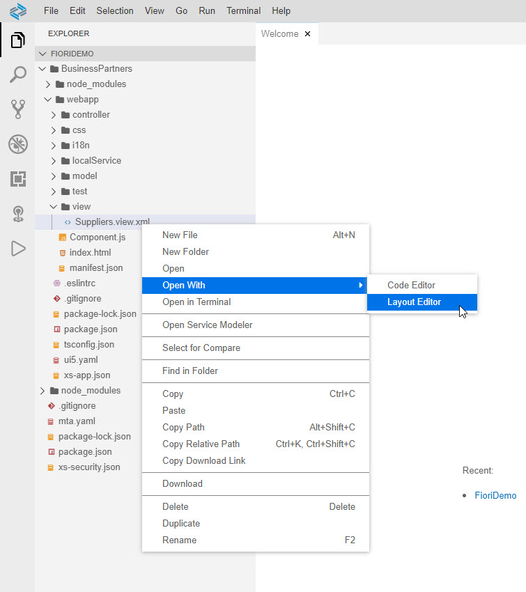
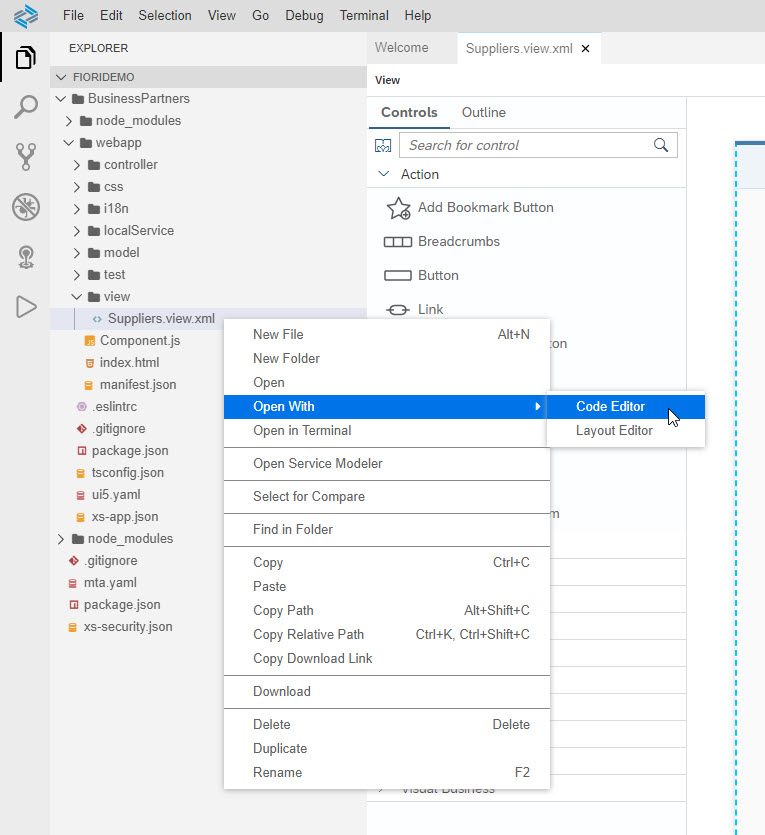
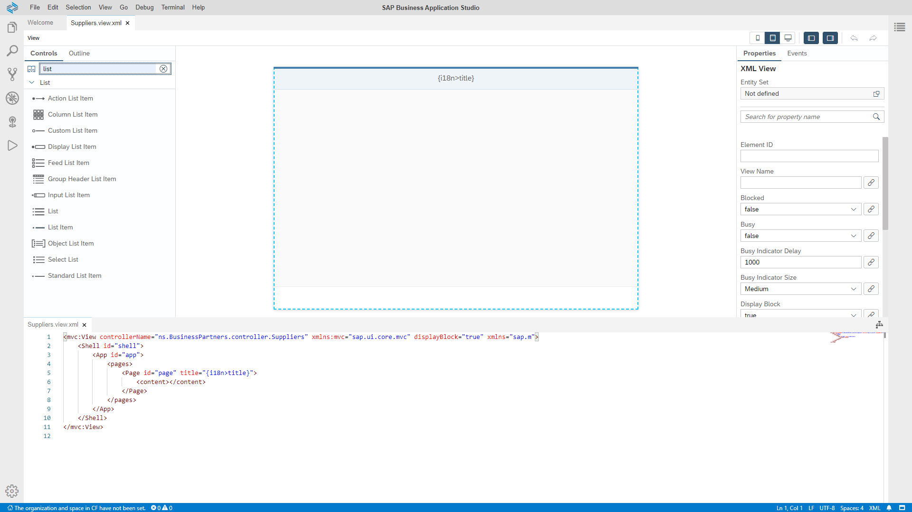
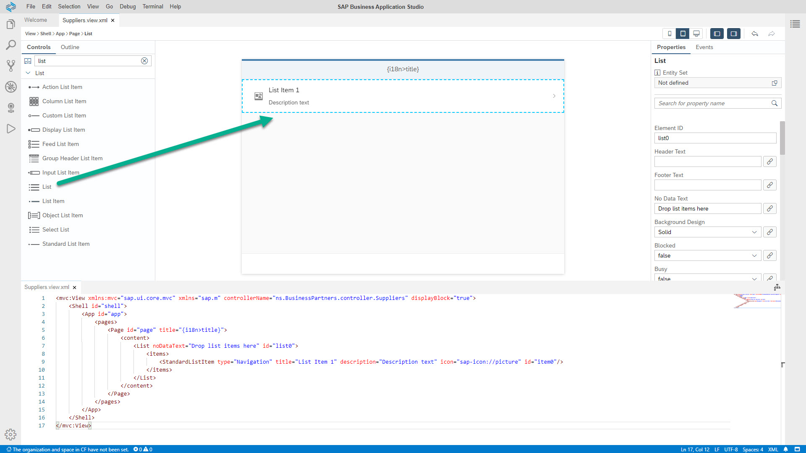
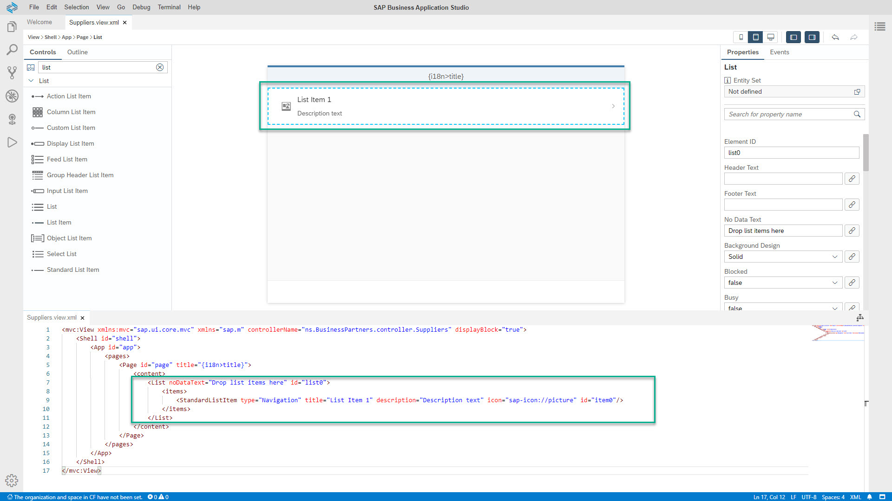
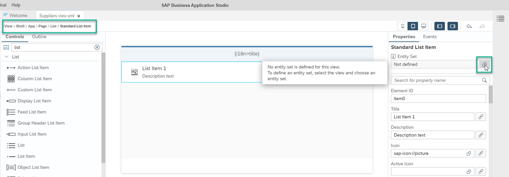
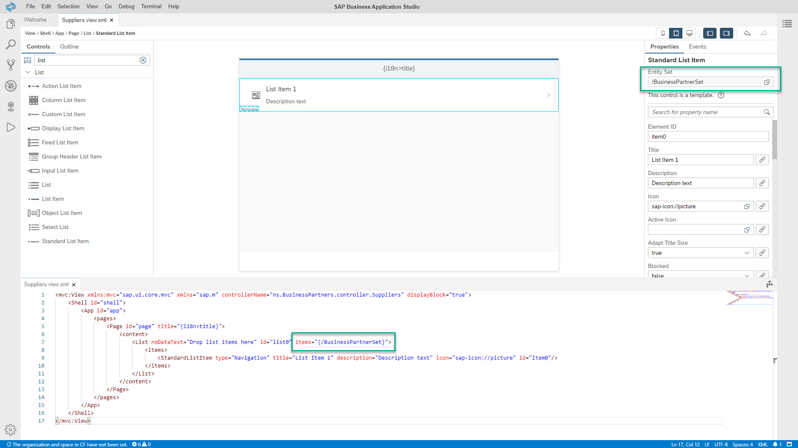
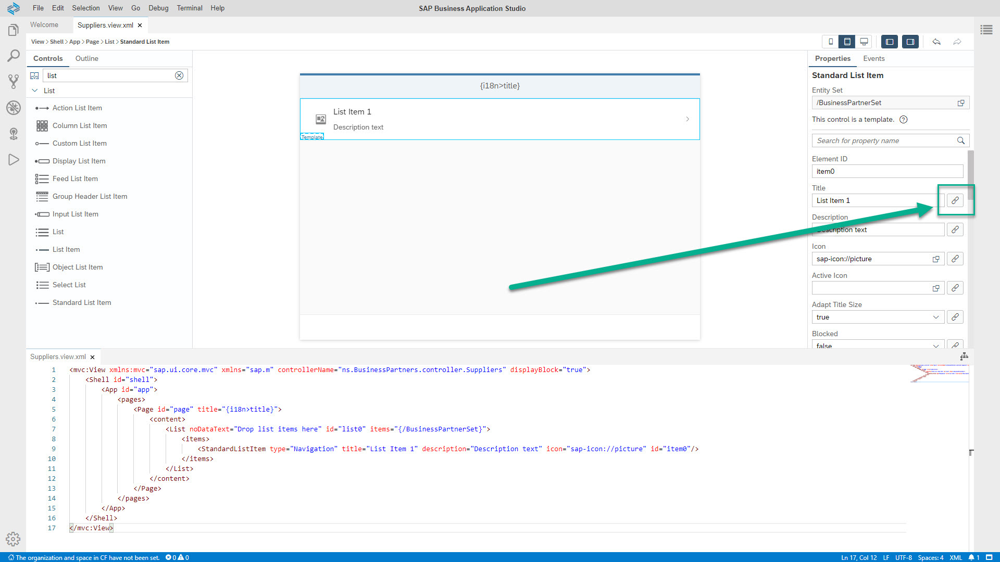
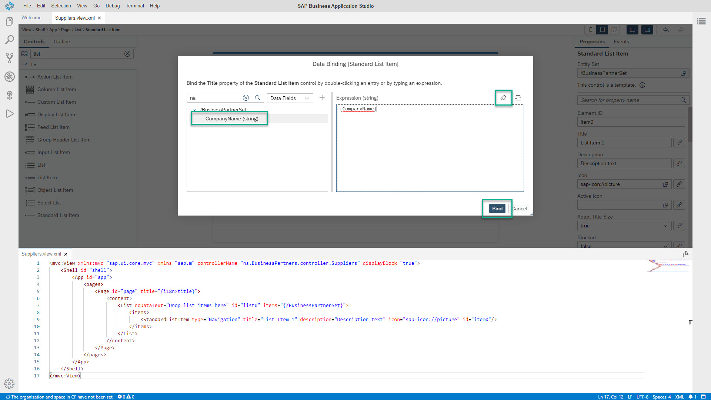

## Prerequisites
  - You have created an SAP Fiori dev space in SAP Business Application Studio. See [Create a preconfigured dev space for developing SAP Fiori apps](appstudio-devspace-fiori-create).
  - The SAP Fiori dev space is in status `RUNNING` and you opened it.
  - You configured a destination to SAP Gateway Demo System (ES5) (see [Connect SAP Cloud Platform to Your SAP Gateway Demo System Account (ES5)](cp-portal-cloud-foundry-gateway-connection)).

## Details
### You will learn
  - How to create an SAPUI5 application for SAP BTP, Cloud Foundry environment
  - How to test-run the app locally in the dev space

You will build an application that presents a list of suppliers from an on-premise backend. The suppliers' data will be retrieved from the `BusinessPartnerSet` collection in the `GWSAMPLE_BASIC` OData service that is available from SAP's ES5 demo gateway.

After a period of idle time the dev space is automatically stopped. In order to re-start the dev space open the [dev space manager](https://triallink.eu10.trial.applicationstudio.cloud.sap/), click the **Play** icon, and click the dev space.

The period for idle time for Enterprise accounts is different than for trial accounts.

---

[ACCORDION-BEGIN [Step 1: ](Create new SAP Fiori project)]

1. In the **Welcome Page** click **Start from template**.

    !

    >If the Welcome Page does not appear, in the menu bar, select **View | Find Command** to open the **command palette** and select the command **Welcome**. The command palette is opened at the top-center of the SAP Business Application Studio window.

    >!

    >The easiest way to develop an SAP Fiori freestyle app from scratch is to create it from a template. To continue developing an existing application, the best practice is to use git source code management and clone the repository.

    >Using the UI wizard you can at any point click the `Back` button to go back to the previous step, or click the specific wizard step to go back to that step.

    > You can also create a project from the terminal using Yeoman.

2. For convenience, click the **Explorer** view button to close the `Explorer` view.

3. Make sure that the target folder is `/home/user/projects`, select the **SAP Fiori Freestyle Project** template, and click **Start**.

    !

4. For **Target Running Environment**, select the following, and click **Next**.

    | Step | Parameter | Value |
    |:-----|:----------|:------|
    | A | Select the target running environment | **Cloud Foundry** |
    | B | Select the template you want to use | **SAPUI5 Application** |

    !

5. For **Project Name**, enter `FioriDemo`, and click **Next**.

    !

6. For **Approuter Configuration**, select **Managed Approuter** and provide a unique service name, e.g. **BP**, and click **Next**.

    !

    >When end-users access an app in the Cloud Foundry environment, they actually access the Application Router first. The application router is used to serve static content, authenticate users, rewrite URLs, and forward or proxy requests to other micro services while propagating user information.

    >The recommendation is to use the **Managed Approuter** that provides many benefits, when compared to the Standalone Application Router, such as save resources, lower maintenance efforts, etc. Standalone Application Router should only be used in advanced cases, for example when application router extensibility is required. More information is available in [Developing HTML5 Applications in the Cloud Foundry Environment](https://help.sap.com/viewer/65de2977205c403bbc107264b8eccf4b/Cloud/en-US/11d77aa154f64c2e83cc9652a78bb985.html)

7. For **Basic Attributes**, select the following, and click **Next**.

    | Step | Parameter | Value |
    |:-----|:----------|:------|
    | A | Enter an HTML5 module name | **`BusinessPartners`** |
    | B | Do you want to add authentication | **Yes** (default) |
    | C | Enter a namespace | **`ns`** (default) |
    | D | Do you want to enable Karma tests? | **No** (default) |

    !

8. For **View Name**, select the following, and click **Next**.

    | Step | Parameter | Value |
    |:-----|:----------|:------|
    | A | Enter a view name | **`Suppliers`** |
    | B | Do you want to add a data service | **Yes** |

    !

9. For **Consume Services**, select the following, and click **Next**.

    | Step | Parameter | Value |
    |:-----|:----------|:------|
    | A | Select a system | **My SAP systems** |
    | B | Select a source | **`ES5 [Catalog]`** |
    | C | Select a service | **`GWSAMPLE_BASIC`** |

    !

10. A notification that the project has been generated appears at the bottom right of the screen.

    !

11. Click **Open in New Workspace** in the notification or **File > Open Workspace**, and choose `FioriDemo`.

12. The **Explorer** view opens and you can see the `FioriDemo` project, its folder structure, and files. If not, you can click the **Explorer** view button at the top left of the screen.

    !

    >The status bar color changes to blue, indicating that a workspace is open.

[VALIDATE_2]
[ACCORDION-END]

[ACCORDION-BEGIN [Step 2: ](Open the layout editor and the code editor)]

The layout editor allows users to easily make changes in the app using a visual editor. In this tutorial, you will make changes so that data from the backend service is displayed when the app is running.

1. Choose **`FioriDemo` > `BusinessPartners` > `webapp` > `view`** and right-click the `Suppliers.view.xml` file that you created with the template in a previous step.

2. Choose **Open With > Layout Editor**.

    !

    >To have the Layout Editor option available after opening the workspace, you may need to wait a bit for the Layout Editor extension to be loaded.

3. The **Suppliers** view is opened in the **Layout Editor**.

    !

4. You can optionally choose to open it with the code editor and see how modifications in the Layout Editor are manifested in the code editor.

    !

    >The **Suppliers** view is opened in the code editor in a tab next to the **Layout Editor**.

    >!

5. For convenience, place the code editor below the Layout Editor. Use the drag & drop functionality.

    !

    >The **Layout Editor** and code editor are stacked so you can see how making changes to one will be reflected on the other.

    >!

[DONE]
[ACCORDION-END]

[ACCORDION-BEGIN [Step 3: ](Make changes to the UI)]

Edit your app using the layout editor, with no need to do any coding.

1. In the **Controls** pane, enter `List` to filter the controls list in the search box.

    !

    >In order to get more screen real-estate, click the **Explorer** view button to close the `Explorer` view, and adjust the ratio between the Layout Editor and the code editor.

2. Drag the **List** control and drop it on the **View** control in the canvas.

    !

    >Adding the list control to the view is reflected in both the **Layout Editor** and the code editor.

    >!

3. Select the **Standard List Item** control by clicking it (the breadcrumb indicates which control is selected) and, in the **Entity Set** property in the **Properties** pane, click the Bind icon.

    !

    >The **Select Entity Set** view is displayed.

4. Select the **Define entity set and set the selected control as template** option, and in the **Entity Set** dropdown list, choose the `BusinessPartnerSet` entity set. Click **Bind** to complete the operation.

    !

    >The space of the **Select Entity Set** view may be too narrow to show all options. In case you do not see the **Define entity set and set the selected control as template** option, scroll down in the **Select Entity Set** view to make it available.

    >The bind operation is reflected in both the **Layout Editor** and the code editor.

    >!

5. In the **Properties** pane, in the **Title** property, click the **Bind** icon.

    !

    >The **Data Binding** view is displayed.

6. Click the **Clear expression** (eraser) icon to clear the default text, and in the data fields double click  `CompanyName`. Click **Bind** to complete the operation.

    !

7. Repeat the last two steps for the **Description** property in the **Properties** pane. Choose  `BusinessPartnerID`.

    !

[VALIDATE_5]
[ACCORDION-END]

[ACCORDION-BEGIN [Step 4: ](Set Cloud Foundry preferences)]

Before you can run your new application, set your Cloud Foundry preferences.

1. In the menu bar, select **View | Find Command** to open the **command palette**.

    !

2. Select the command **CF: Login to cloud foundry**.

    >Type `cf` to filter commands.

    !

3. When prompted, provide your credentials, select the API endpoint, organization, and space for your project.

    >The Cloud Foundry organization and space appear in the status line at the bottom left part of the screen.

    !

[DONE]
[ACCORDION-END]

[ACCORDION-BEGIN [Step 5: ](Create a new service instance for xsuaa)]

Before you can run your new application, create a new service instance for `xsuaa`.

1. In the menu bar, select **View | Find Command** to open the **command palette**.

    !

2. Select the command **CF: Create a new service instance**.

    >Type `cf` to filter commands.

    !

3. When prompted, provide the following:

    | Step | Parameter | Value |
    |:-----|:----------|:------|
    | A | Enter an instance name | **`trial-uaa`** |
    | B | Select a Cloud Foundry service | **`xsuaa`** |
    | C | Select a Cloud Foundry service plan | **Application** |
    | C | Enter arbitrary parameters to be passed along to the service broker | Use default (press [ENTER]) |

    >A notification that the service instance is being created appears at the bottom-right of the page, followed by a notification that the service is instance has been created.

    !

[DONE]
[ACCORDION-END]

[ACCORDION-BEGIN [Step 6: ](Test run the application)]

Run your new application locally in the SAP Business Application Studio dev space to test it.

1. Open the **Run Configurations** view.

    !

2. Click **+** to create a new **Run Configuration**.

    !

    >Creating a new **Run Configuration** launches the command palette, a text-based mini wizard. The command palette is opened at the top-center of the SAP Business Application Studio window.

3. When "What would you like to run?" question appears, select **`BusinessPartners`**.

    >!

4. For the next steps of the wizard, select the following:

    | Step | Parameter | Value |
    |:-----|:----------|:------|
    | A | Select a runnable file | **`index.html`** |
    | B | Select a UI5 version | **latest** |
    | C | Enter a name | `Run BusinessPartners (ES5)` |

5. A new run configuration is generated for the `FioriDemo` project.

6. Expand the run configuration to display the services that can be bound.

    !

    >SAP Business Application Studio allows you to test your app with resources.

7. To bind to the destination, click the **Bind** icon to the right of the destination resource to get a list of available destinations.

    !

8. Select the `ES5` destination from the list.

    !

    >Once the destination has been bound, the icon to the left of the destination resource turns green.

9. To bind to the XSUAA, click the **Bind** icon to the right of the XSUAA resource to get a list of available destinations. Select trial-uaa.

    !

10. Hover over the run configuration and click the Run Module icon.  

    !

11. Wait for the **A service is listening to port 6004** notification and then click the button to open the app.

    >The left side view changes to the debug view and the status bar color changes to orange to indicate that the app is running in debug mode.

    >If you are running the app for the first time, the button in the notification will say **Expose and Open**. Otherwise it will say **Open in New Tab**.

    !

    >Some of the notifications appear on the screen for a short period of time.

    >You may optionally add a port description.

    >You may need to authenticate yourself to access the backend. Use your ES5 username and password.

    The app is opened in a new tab and a list of suppliers is displayed.

    !

[VALIDATE_7]
[ACCORDION-END]

[ACCORDION-BEGIN [Step 7: ](Stop the running application)]

1. Return to the SAP Business Application Studio tab.

2. In the **Debug** view click the Stop icon. Repeat it until all the threads in the **Debug** view are removed.

    !

    >The status bar background color changes from orange to blue.

    >You can re-run the app clicking the Start Debugging icon in the **Debug** view or clicking the Run Module icon in the **Run Configurations** view.

[DONE]
[ACCORDION-END]

---

Congratulations!

With this, you have successfully completed the development of an SAP Fiori app using SAP Business Application Studio, including test-running the app locally in the dev space. In this tutorial, you learned about high productivity tools that are available out-of-the-box in SAP Business Applications Studio, such as: templates and wizards, command palette, Layout Editor, local run, and more.
