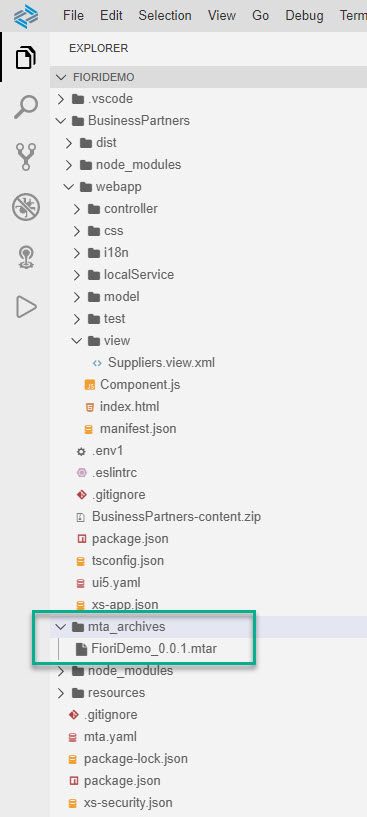
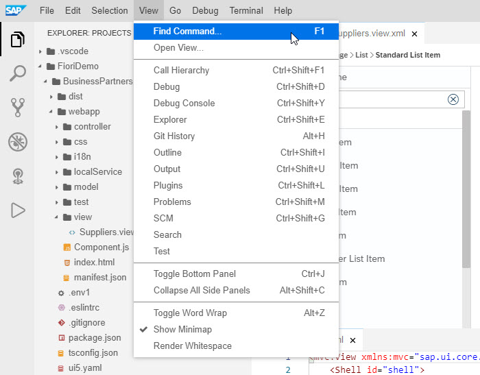
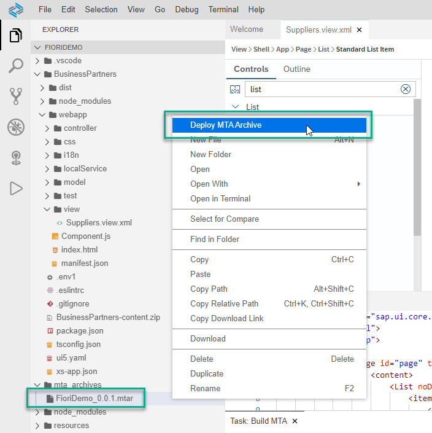
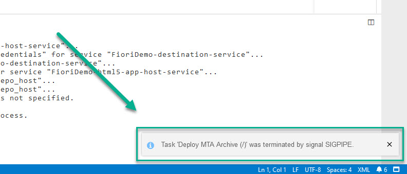
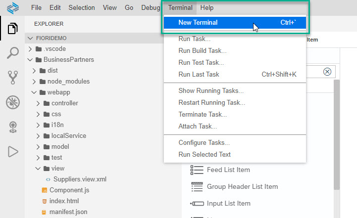
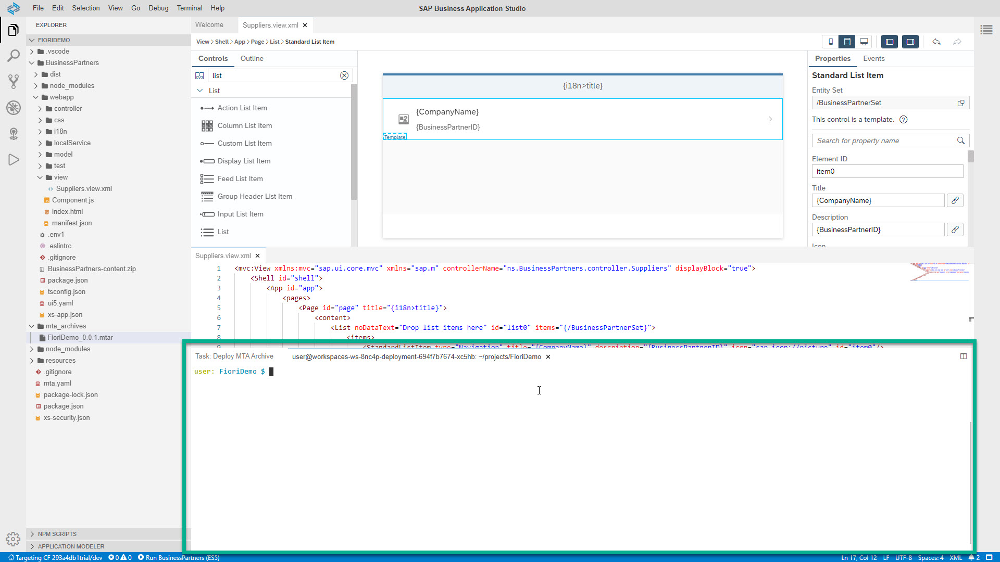

## Prerequisites
- The SAP Fiori dev space is in status `RUNNING` and you opened it.
- You are logged in to the Cloud Foundry space.
- For the deployment step, additional prerequisites apply. You need to have the following available in the Cloud Foundry space to which you will log on (see [Add a New Entitlement to Your Subaccount](cp-cf-entitlements-add)):
    - Application Runtime: 1GB free
    - Destination: 1 free
    - HTML5 Applications: 1 free

## Details
### You will learn
  - How to build and deploy an application to SAP Cloud Platform, Cloud Foundry environment
  - How to configure Cloud Foundry settings in SAP Business Application Studio
  - How to run the deployed app from your space on SAP Cloud Platform, Cloud Foundry environment

After a period of idle time the dev space is automatically stopped. In order to re-start the dev space open the [dev space manager](https://triallink.eu10.trial.applicationstudio.cloud.sap/), click the **Play** icon, and click the dev space.

The period for idle time for Factory accounts is different than for trial accounts.

---

[ACCORDION-BEGIN [Step 1: ](Build the application)]

1. Click the **Explorer** view icon to open the **Explorer** view.

    !

2. In the **Explorer** pane, right-click the `mta.yaml` file and select **Build MTA**.

    !

    >The build process creates a multitarget archive (`MTAR`) file in your project that packages all the project modules for deployment. You can find the `MTAR` file in the `FioriDemo/mta_archives` folder.

    !

[DONE]
[ACCORDION-END]

[ACCORDION-BEGIN [Step 2: ](Set Cloud Foundry preferences)]

If you are not logged in to a Cloud Foundry space - Before you can deploy your new application, set your Cloud Foundry preferences.

1. In the menu bar, select **View | Find Command** to open the **command palette**.

    !

2. Select the command **CF: Login to cloud foundry**.

    >Type `cf` to filter commands.

    !

3. When prompted, provide your credentials, select the API endpoint, organization, and space for your project.

    >The Cloud Foundry organization and space appear in the status line at the bottom left part of the screen.

    !

[DONE]
[ACCORDION-END]

[ACCORDION-BEGIN [Step 3: ](Deploy the application)]

Deploy your application to SAP Cloud Platform, Cloud Foundry environment.

Right-click the `mtar` file and select **Deploy MTA Archive**.

!

>The application deployment to the space you are connected to starts and a notification appears. The deployment process takes a few minutes. You can see that the deployment is still in progress in the **Task: Deploy** console at the bottom right of your screen.

>When the deployment process is complete, a notification will temporarily appear at the bottom-right part of the screen.

>!

[DONE]
[ACCORDION-END]

[ACCORDION-BEGIN [Step 4: ](Access the application on SAP Cloud Platform, Cloud Foundry)]

Run the deployed app on SAP Cloud Platform. The steps below show you how to access your new application and run it. You will use CF commands in a terminal for this.

1. On the menu bar select **Terminal | New Terminal**.

    !

2. A new terminal tab is opened.

    !

    >The folder it is opened in is the specific project folder. You can use the following command in the terminal to verify it:
    ```Shell/Bash
    pwd
    ```
    !

3. Open the `mta.yaml` file, and locate the destination service name. You can find it in the **modules > requires** section or in the **resources** section. In this tutorial it should be `FioriDemo-destination-service`.

4. Execute the following command in the terminal to get the details of the deployed application and its URL:

    ```Shell/Bash
    cf html5-list -di FioriDemo-destination-service -u
    ```

    !

    <br><br>!

    >To find out more about this command execute in the terminal:
    ```Shell/Bash
    cf help html5-list
    ```

5. As a temporary step you need to edit the URL. Copy the app's URL, and paste it in a new browser tab (do not click [ENTER]). Replace `cpp` with `launchpad`.

!

    >You can use this URL in any browser to access your new application in your space on SAP Cloud Platform, Cloud Foundry environment.

6. The app is running on SAP Cloud Platform, Cloud Foundry environment, accessing data from an on-premise backend.

    !

[VALIDATE_10]
[ACCORDION-END]

---

Congratulations!

With this, you have successfully completed the deployment of your SAP Fiori app to SAP Cloud Platform using SAP Business Application Studio.

In this tutorial, you used high productivity tools that are available out-of-the-box in SAP Business Applications Studio that make it easy to build and deploy applications as well as work in the Cloud Foundry environment.


---
