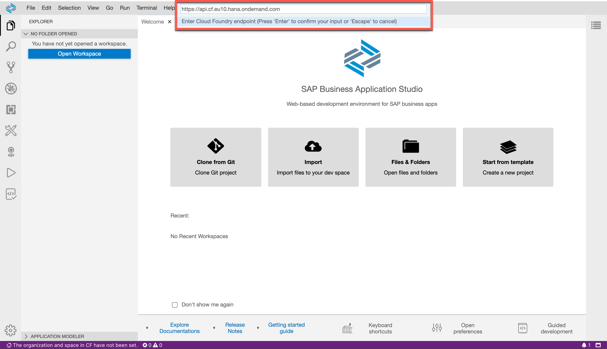
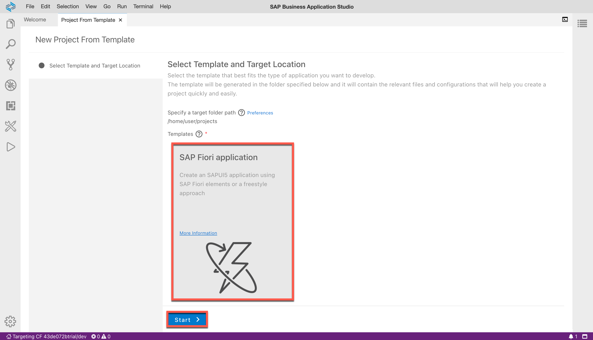
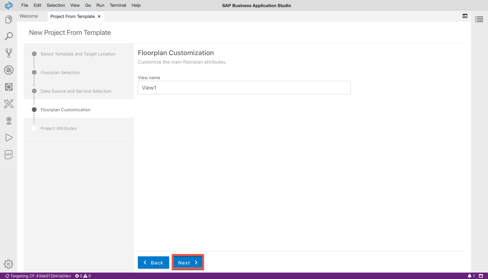
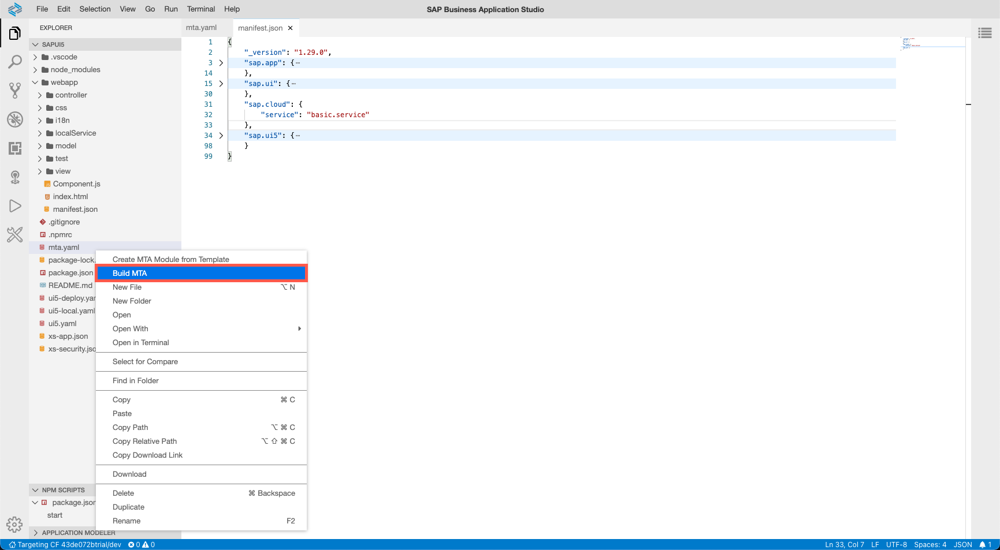
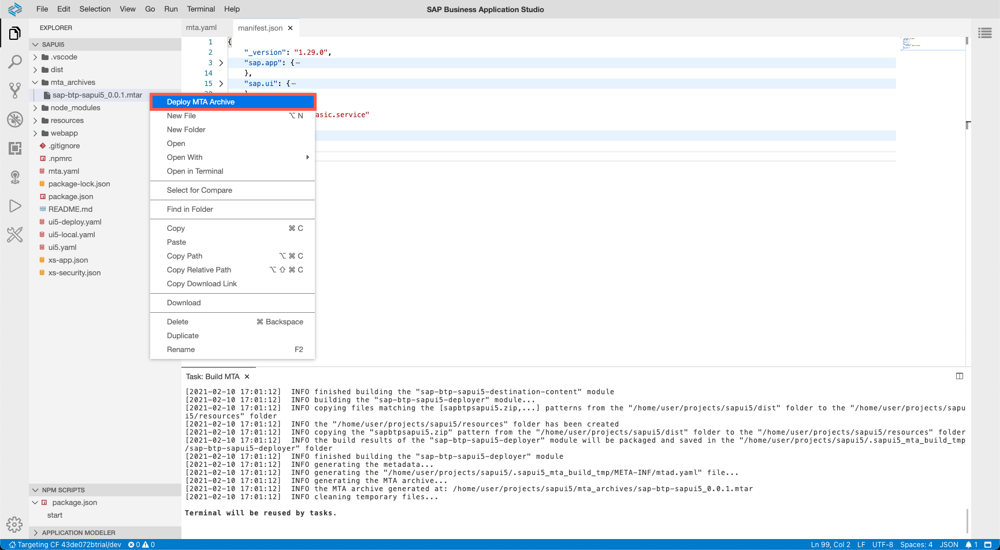
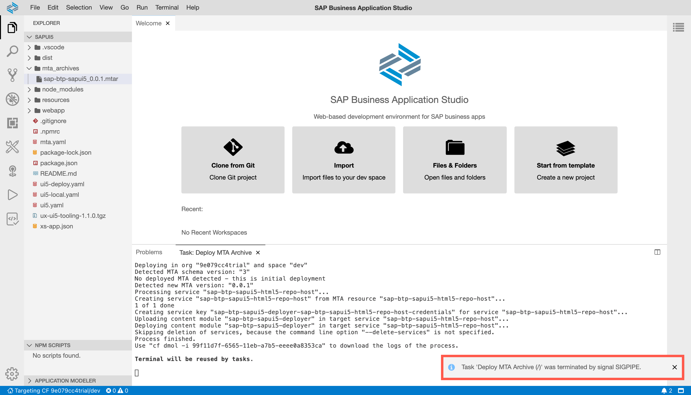
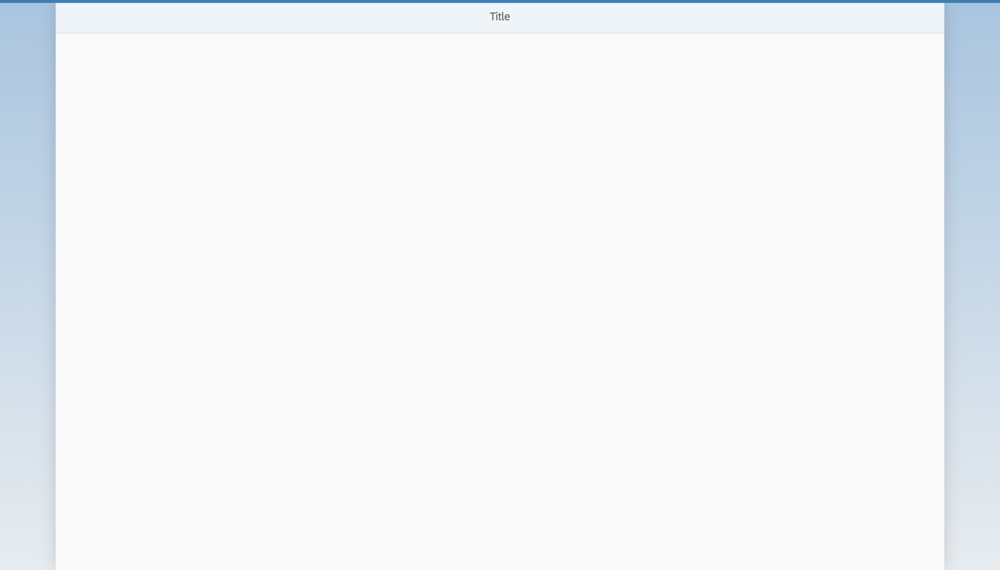

## Details
### You will learn
  - How to create an MTA archive with a UI module
  - How to build a project for Cloud Foundry
  - How to deploy a project to Cloud Foundry

---

[ACCORDION-BEGIN [Step : ](Open the Fiori dev space)]

**Start** a dev space of kind *SAP Fiori* and **open** it by clicking its name.

!

> Have a look at [this tutorial](appstudio-devspace-fiori-create) if you are unsure how to get here or how to create a dev space.

[DONE]
[ACCORDION-END]
[ACCORDION-BEGIN [Step : ](Connect to a Cloud Foundry endpoint)]

Make sure you are connected to a Cloud Foundry endpoint to which you will deploy the SAPUI5 application later.

1. Click on the bottom-left corner of the screen to start the connection flow.

    !

2. Enter the Cloud Foundry endpoint you want to use. If your environment runs in the EU10-region, this is `https://api.cf.eu10.hana.ondemand.com`. Enter your email and your password to proceed.

    !

3. Next, you need to select the Cloud Foundry Organization and space you want use. You will see that you are connected to the endpoint once these prompts have been answered.

    !

[DONE]
[ACCORDION-END]

[ACCORDION-BEGIN [Step : ](Create a new project)]
1. Click on the link **New project From template** on the *Welcome* screen.

    !

2. Select **Fiori Project** as the template category you want to use and click **Next**.

    !

3. Specify the target environment ( **Cloud Foundry** ) and the template ( **SAPUI5 Application** ) and go to the **Next** screen.

    !

4. Name the project **`tutorial`** and proceed by clicking **Next**.

    !

4. Choose **Standalone Approuter** for the runtime and click **Next**.

    !

4.  Name of the module  **`webapp`** and the namespace **`sap.cp`** and turn authentication off. Go to the **Next** screen.

    !

4. Keep the default view name and go for no data service on this screen. Click **Next** to create the new project.

    !

4. Once the project has been created, the Business Application Studio will prompt you to open the project in a new workspace. Click **Open in New Workspace**.

    !

[DONE]
[ACCORDION-END]
[ACCORDION-BEGIN [Step : ](Redirect incoming traffic to the SAPUI5 app)]

The generated code comes ready-to-deploy. By default, the web app will be available at `https://<approuter-url>/<app/id>` and the application router will not redirect traffic that hits the root URL. In this step, you will change this.

1. **Open** the file `webapp/webapp/manifest.json` and find the property `sap.app>id`. The value of this property should be `sap.cp.webapp` but can vary depending on the names you choose in the previous step.

    !

2. **Open** the file `tutorial-approuter/xs-app.json` and add a new property to define the redirect.

    !

[DONE]
[ACCORDION-END]
[ACCORDION-BEGIN [Step : ](Build the application)]

Build (aka package) the project to a `mtar` archive to deploy it to Cloud Foundry.  

1. Right-click on the `mta.yaml` file and select **Build MTA** to trigger this process.

    !

2. Check the console output to make sure the process started.

    !

3. Once the build is complete, you can see a message in the log. You can find the generated `mtar` archive in the project tree now.

[DONE]
[ACCORDION-END]
[ACCORDION-BEGIN [Step : ](Deploy the archive to Cloud Foundry)]

Now that you created a `mtar` archive, you are all set to deploy the application.

1. Right-click on the `mtar` file and select **Deploy** and **Deploy MTA Archive**.

    !

2. Check the console output to make sure the process started.

3. You will see a success message and the URL of the app in the log once the deployment finished. Open this URL in your browser to start the application.

    !

> You can also see the URL of the deployed app when running `cf apps` in a new terminal session.

> !

[DONE]
[ACCORDION-END]

[ACCORDION-BEGIN [Step : ](Test to the application)]

1. **Open** the started application in your browser. You might need to log in with your SAP ID (the same credentials you use for the SAP Cloud Platform Cockpit).

2. See that the sample application consists of a header and an empty page. So you should see something like this:

!

Enter the URL of your running application:

[VALIDATE_1]
[ACCORDION-END]
