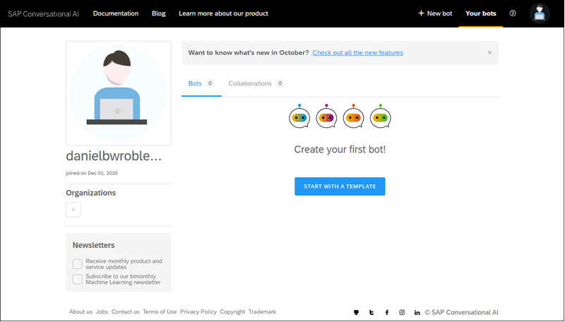
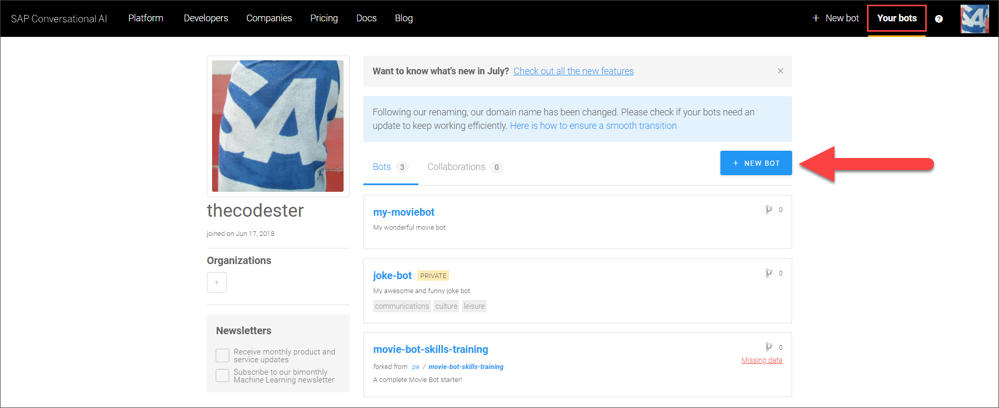
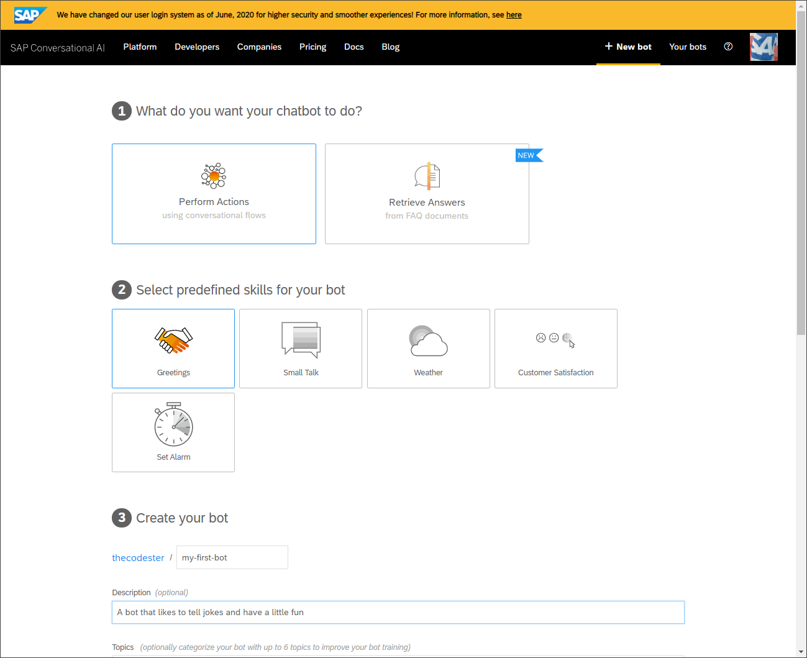
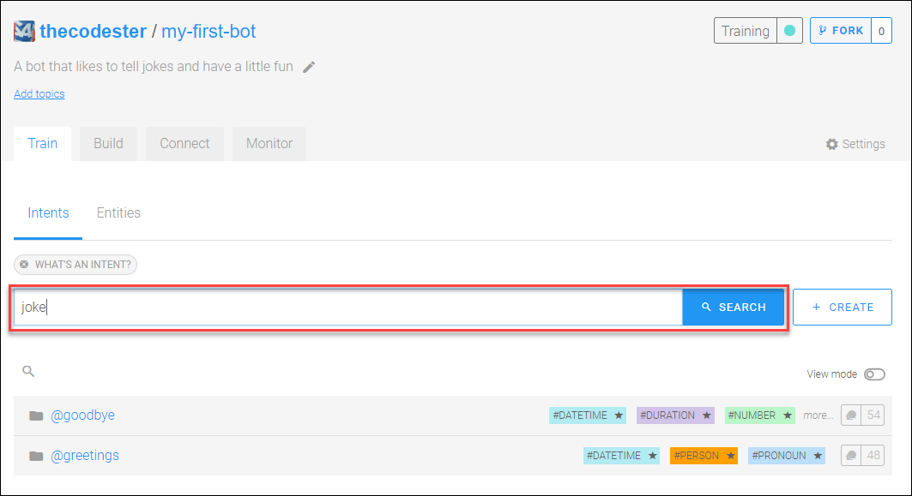
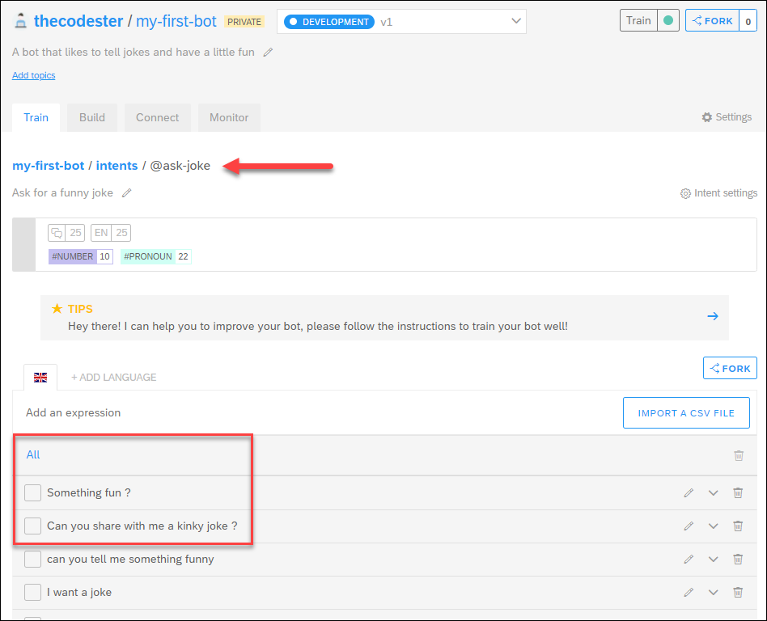
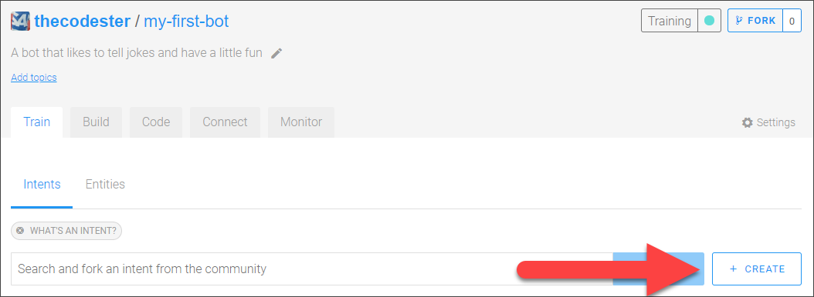
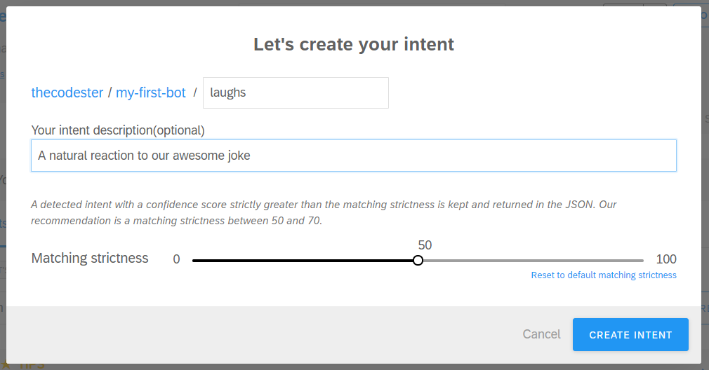
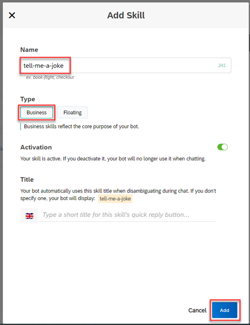
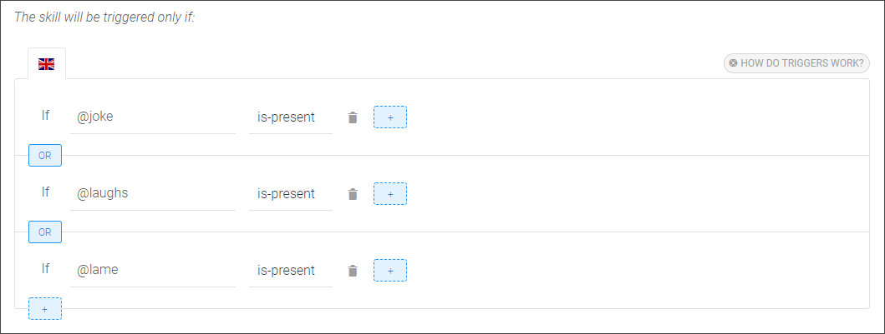
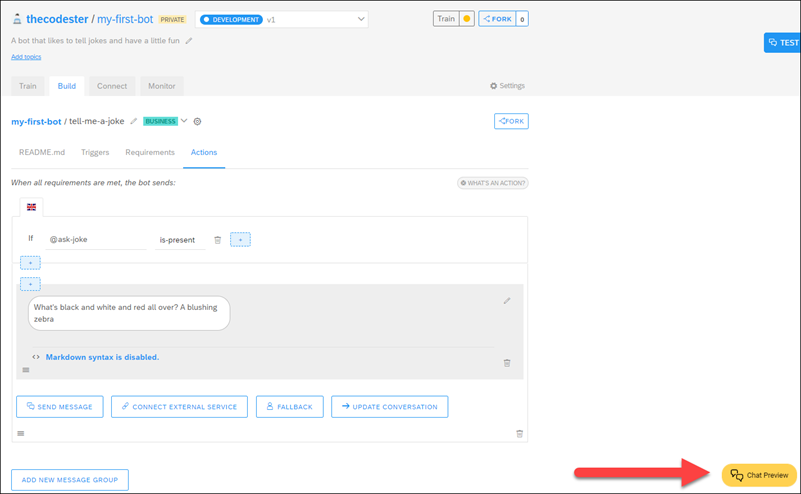

## Details
### You will learn
  - How to get an account with SAP Conversational AI
  - How to create a chatbot project
  - How to train your chatbot (to understand people)
  - How to give your chatbot skills

---

[ACCORDION-BEGIN [Step 1: ](Create SAP Conversational AI account)]

Go to [https://cai.tools.sap/](https://cai.tools.sap/), and click **Sign Up** in the upper-right corner.

Follow the instructions for creating an account.


You will get an email with a link to validate your account.

[DONE]
[ACCORDION-END]


[ACCORDION-BEGIN [Step 2: ](Create new bot project)]

1. Do one of the following:

    If you just validated your account by clicking the link in your email, click **Start with a Template**.

    

    If you are returning:

      - Go to your home page by opening the URL [https://cai.tools.sap/](https://cai.tools.sap/) and sign in.

      - Click **New Bot**.

        

2. Fill in the following:

      - Select **Perform Actions**.

        >With a standard **Perform Actions** bot, the developer is responsible for creating entities and intents with expressions. The developer is also responsible for building and managing the conversational flow that pulls information from back-end systems to help simplify processes for the chatbot end user.

        >An **FAQ** bot retrieves answers to users' questions from one or more documents (`.csv` files) that you upload. The document must include predefined pairs of questions and answers. This allows your bot to map the user's query to the best match and retrieve an answer without interpreting the intent of the question.

        >To ease the complexity of the FAQ bot, the intents and entities are predefined and hidden, and the bot includes a set of predefined skills. However, you can design the bot responses as per your business needs.

      - For the predefined skills, choose **Greetings**.

      - In the **Create your bot** section, enter the following:

        |  Field Name     | Value
        |  :------------- | :-------------
        |  Bot name       | **`my-first-bot`**
        |  Description    | **A bot that likes to tell jokes and have a little fun**

      - For **Data Policy**:

        - Select **Non-personal**.

        - Select **Non-vulnerable**.

      - For **Bot visibility**, select **Public**.

      

3. Click **Create a bot**.

[DONE]
[ACCORDION-END]


[ACCORDION-BEGIN [Step 3: ](The 4 stages of a bot's life)]

There are 4 stages in your bot's life:

  - **Train:** Teach your bot what it needs to understand.

      Here you will create ***intents*** -- ideas your bot will recognize -- using ***expressions*** that the bot should recognize coming from the user.

  - **Build:** Create your conversational flow with our Bot Builder tool. Here you give your bot skills it can perform.

      Here you will create ***skills*** -- things your bot can do -- and define when they will be triggered. Your skills are defined by ***triggers***, ***requirements*** (information your bot must collect), and the ***actions***.

  - **Connect:** Ship your bot to one or several messaging platforms.

  - **Monitor:** Train your bot to make it sharper, and get insights on its usage.

The 4 phases are represented in the bot project by the 4 tabs.


[VALIDATE_6]
[ACCORDION-END]


[ACCORDION-BEGIN [Step 4: ](Fork intent)]

Now we will work in the **Train** tab, where will build intents. Remember, intents are the things people want to tell our bot. Within an intent, we indicate all the possible expressions that a person might use to communicate that intent.

As SAP Conversational AI is collaborative, you do not have to re-create each intent every time. You can "fork" an intent someone has already created and clone it right into your bot.

1. Go to the **Train** tab.

2. In the **Search** box, enter **`joke`**, and press **Search**.

    

3. Click **Fork** for the first one.

    >There are many existing intents and the choices are always changing.

4. Explore the intent by clicking on it.

    >In the intent we forked, there are 2 expressions to discern if someone wants to be told a joke. In yours, you may receive more expressions.

    

[DONE]
[ACCORDION-END]


[ACCORDION-BEGIN [Step 5: ](Create new intents)]

You will be able to reuse many, many intents created by others. But there are times you will want to create your own.

1. Click on **Train** tab.

2. Create an intent for recognizing good reactions to jokes.

    - Click **Create**.

      

    - For the name of the intent, enter **laughs**.

    - For the description, enter **A natural reaction to our awesome jokes**.

      

    - Click **Create Intent**.

2. Create a second intent, this time for bad reactions to jokes.

    - Click **Create**.

    - For the name of the intent, enter **lame**.

    - For the description, enter **You can't succeed every time**.

    - Click **Create Intent**.


[DONE]
[ACCORDION-END]


[ACCORDION-BEGIN [Step 6: ](Add expressions)]

Now that you have created 2 intents, we need to add expressions -- things people might say if they had that intent. A golden rule would be to add **at least 30 expressions** to an intent, and ideally more than 50.

Put yourself in the shoes of the people talking to your bot. What could they possibly ask?

>For this tutorial, you do not have to come up with 50 expressions but you will add 4 to each intent.

1. Click on the `@laughs` intent.

2. In the expression field, enter a sentence you want your bot to understand, then press **Enter**.

    Here are some examples for the `laughs` intent you added:

    ```
    Hahaha that's hilarious
    ROFL you're good!
    That, my friend, was an amazing joke.
    I haven't laughed that much in a long time!
    ```

3. Do the same for the `@lame` intent (you'll have to navigate to the intent by click **Train** tab or navigating the breadcrumb).

    Here are some examples for the `lame` intent:

    ```
    You have no sense of humor whatsoever.
    That's both terrible and offensive.
    What the heck was that?
    Try harder, that was a very bad joke.
    ```

[DONE]
[ACCORDION-END]

[ACCORDION-BEGIN [Step 7: ](Test bot)]

We want to now test to see if the bot can detect when a user says something matching the intent we created.

1. Click the fly-out tab **Test** on the right.

    

2. At the bottom of the panel, enter something that you think should match the intent, like:

    ```Text
    Botty bot, can you tell me a joke please?
    ```

If the intent is successfully trained, the test will show that the bot recognized the intent.


If the bot did not recognize the intent (or selected the wrong intent), you will need to train your bot some more by adding additional expressions (Step 6).

[DONE]
[ACCORDION-END]

[ACCORDION-BEGIN [Step 8: ](Manage conversation flow with skills)]

Now that your bot knows how to understand people who talk to it, it's time to give your robot some skills.

Open the **Build** tab.

Inside, you'll find the **Bot Builder**, which helps you construct the conversation flow of your bot.

> ### What is a skill?

>Each skill represents one thing that your bot knows how to do. Your skill can be complicated (e.g., manage payment by credit card) or quite simple (e.g., answer a basic question).

>Just like intents, you can create a skill from scratch or inherit skills from other bots you've created or from other people's bots.

>In our project, choose the predefined skill **Greetings**.

>The **Greetings** skill -- like all skills -- has 4 tabs:

>  - **README.md:** A description of the purpose of your skill

>  - **Triggers:** The conditions that must occur -- generally the intents that the user must express -- for the skill to be executed

>  - **Requirements:** Information that must be collected in order for the skill to be executed

>  - **Actions:** The action to take (basically, this is the skill)

If you navigate through the tabs, you'll see that the **Greetings** skill is structured as follows:

  - It is triggered if either the intent `@greetings` or `@goodbye` is matched.

  - It has no requirements because it does not need to collect additional information. That means that it will execute actions directly after being triggered.

  - It has two possible actions: If the `@greetings` intent is matched, it sends a random welcoming message chosen from a list. If the `@goodbye` intent is matched, it does the same thing, but picks the message from a different list.

[DONE]
[ACCORDION-END]

[ACCORDION-BEGIN [Step 9: ](Create new skill)]

Now let's build a skill to tell a joke.

1. Go back to the **Build** tab -- where you see the canvas.

2. Click **Create skill**.

    >There are 3 types of skills:
    >
    >  - **Business** and **Floating** skills are basically the same, but enable you to label those skills that implement core actions (business) and those that are merely helper skills (floating).
    >
    >  - **Fallback** skills trigger when no other skill has their triggers fulfilled after a user message. Most of the time, you'll have only one of this kind, where you can remind the user what your bot can do, and ask them to rephrase.

3. Call your skill **`tell-me-a-joke`**, set the type as **Floating**, and click **Create Skill**.

    

4. Click the new **tell-me-a-joke** skill, and open the **Triggers** tab.

5. Add 3 **`If`** statements, one for each of the `@joke`, `@laugh`, and `@lame` intents.

    - Click in the empty space right after `If`, select the `@joke` intent, and then click **Save**.

    

    - Click on the **+** sign -- **Add a new list of conditions** -- and repeat the above for `@laughs` and `@lame` intents.

    - Change the logical conditions to `Or` between each `If` statement, simply by clicking `And`.

    It should now look like this:

    

6. Go to the **Actions** tab.

7. Click **Add New Message Group**, then **Add Condition**.

    After the `If`, select the `@joke` intent, and click **Save**.

8. Click **Send Message**, choose the **Text** format, and type in a really good joke.

    >You can define additional jokes, and one of the jokes from the set will be displayed randomly.

    >

    >You can also set a delay (optional) between two messages, up to 5 seconds. This might be useful when the messages your bot sends are quite long and need time to be read by the user.

9. Click **Save**.

[DONE]
[ACCORDION-END]

[ACCORDION-BEGIN [Step 8: ](Test by chatting with bot)]

Before releasing your bot to your audience, chat with it in real situation. This will help show you how the bot will behave in a "real" conversation.

Double-check if there are any errors in the conversation flow (e.g., bad answers, fallback errors, weird behavior) and correct them before sending the bot out.

> Chat with your bot as often as you can while you build it, which will make it easier to find problems.

Click on the bottom-right blue button **Chat with your bot** and start sending messages. Use **Clear** (at the top of the panel) to refresh the chat.



  - If you say **Tell me a joke**, the bot will tell you a joke.

  - Try other phrases and see how the bot responds. If the bot does not respond properly, then try improving your intent with additional expressions.

[DONE]
[ACCORDION-END]


[ACCORDION-BEGIN [Step 10: ](Test yourself)]
Congratulations! You have created your first bot.

In later tutorials, you will learn how to deploy your bot and monitor it so it gets smarter and smarter.

[VALIDATE_1]
[ACCORDION-END]


---
