## Prerequisites
 - You understand the basics of creating a chatbot, as described in the tutorial [Build Your First Chatbot with SAP Conversational AI](cai-bot-getting-started).

## Details
### You will learn
  - How to create intents
  - How to create entities
  - How to fork intents and entities
  - How to trigger skills and define required data for those skills
  - How to access data in the memory


### What you will build

You will build a bot so customers can:

  - Track a package
  - Price a package

To track a package:

  - The customer will indicate that they want to track a parcel
  - The customer will provide the package number
  - The customer will confirm they want to track the package
  - The bot will call an API to retrieve package info and display it

To price package:

  - The customer will indicate they want to price a package
  - The customer will provide the address (France only) and the size of the package
  - The bot will check that the address is in France, and then call an API to retrieve a map of the location
  - The bot will display the map, and provide a price for the package, based on its size

### In this tutorial

In this tutorial, you will start by creating a bot that understands the customer's intent to track a package, and understands when the user has provided a valid tracking number.

---

[ACCORDION-BEGIN [Step 1: ](Create skeleton bot)]

1. Go to [SAP Conversational AI](https://cai.tools.sap/) and log in.

2. Click **New Bot** and select the following:

    |  Field Name     | Value
    |  :------------- | :-------------
    |  1. What do you want your chatbot to do?           | **Perform Actions**
    |  2. Predefined Skills           | **Greetings**
    |  3. Create your bot     | <ul><li>Name: **`ShippingBot`**</li><li>Description: **A bot to help shipping customers track and price packages**</li><li>Language: **English**</li></ul>
    |  4. Data Policy  | **Non-personal** and **Non-vulnerable**
    |  5. Bot Visibility | **Public**

    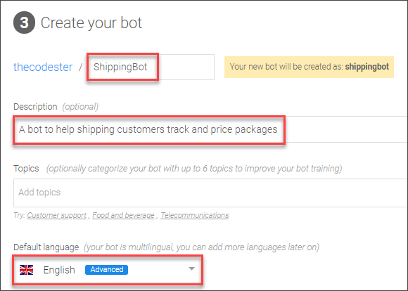

3. Click **Create a Bot**.


[DONE]
[ACCORDION-END]

[ACCORDION-BEGIN [Step 2: ](Create entity for parcel number)]

Our bot must be able to extract the parcel number from within the conversation. Such data extracted from a conversation is defined as entities.

1. Under the **Train** tab, go the subtab **Entities**.

    

2. Click **Create an Entity**.

3. Call the entity **`PARCEL-NUMBER`**, specify it as a **Free entity**, and click **Create**.

    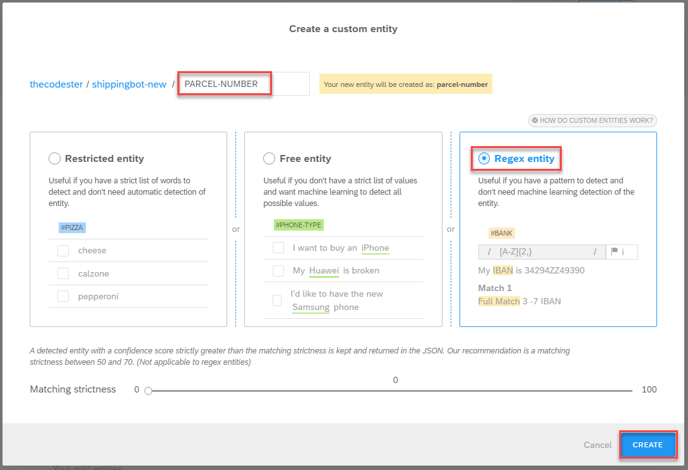

    >**Free entities**: You specify the type of data it is, and you teach the bot how to identity a value for that entity. You specify the form of the data but not the actual acceptable values.
    >
    >**Restricted entity:** You specify a limited list of acceptable values.

4. Click on **`PARCEL-NUMBER`**.

    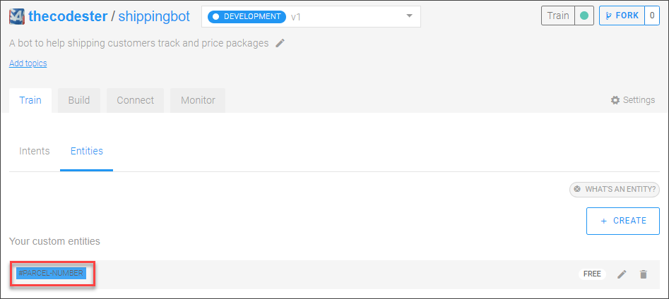

5. Enter the following values for the **List of values**.

    >**CAREFUL**: Enter the values in the field where it says **Add a new entity value**. After entering the value, press **Enter**.

    - 1Z2220060291994175
    - 1Z2220060292002190
    - 1Z2220060292634221
    - 1Z2220060292690189
    - 1ZISDE016691676846
    - 1ZY756Y60380128446

    

    We have also supplied the numbers as a [CSV file](https://raw.githubusercontent.com/SAPDocuments/Tutorials/master/tutorials/cai-bot-shipping-1-track-bot/parcel-numbers.csv). Instead of manually entering the numbers, you can download the file, then click **Import a CSV File**, select the file, and click **Upload**.

> ### About Entities
>
> SAP Conversational AI comes with built-in entities (called gold entities) for common data, like location, dates, and money values. For more information, see [List of Gold Entities](https://help.sap.com/viewer/a4522a393d2b4643812b7caadfe90c18/latest/en-US/161cfefadfea4fbd9912cc38317ded57.html).

[DONE]
[ACCORDION-END]


[ACCORDION-BEGIN [Step 3: ](Add intents for yes and no)]

Customers will have to indicate whether they accept or reject certain requests from the bot, so the bot needs to be able to recognize when a customer means **"Yes"** and when they mean **"No"**.

You do not have to create these yourself. Instead, you can fork them from others who have already created them.

>Forking is simply copying, and does not create a relationship between your bot and the source of what you forked. You can fork intents, entities, skills or an entire bot. For more information, see [Forking Bots, Skills, Intents, and Entities](https://help.sap.com/viewer/a4522a393d2b4643812b7caadfe90c18/latest/en-US/eaa5dceaa83946f487c403b0bd6b6217.html)

1. In a different browser tab, go to [cai-adoption / ups-bot / intents / @yes](https://cai.tools.sap/cai-adoption/ups-bot/train/intents/yes).

    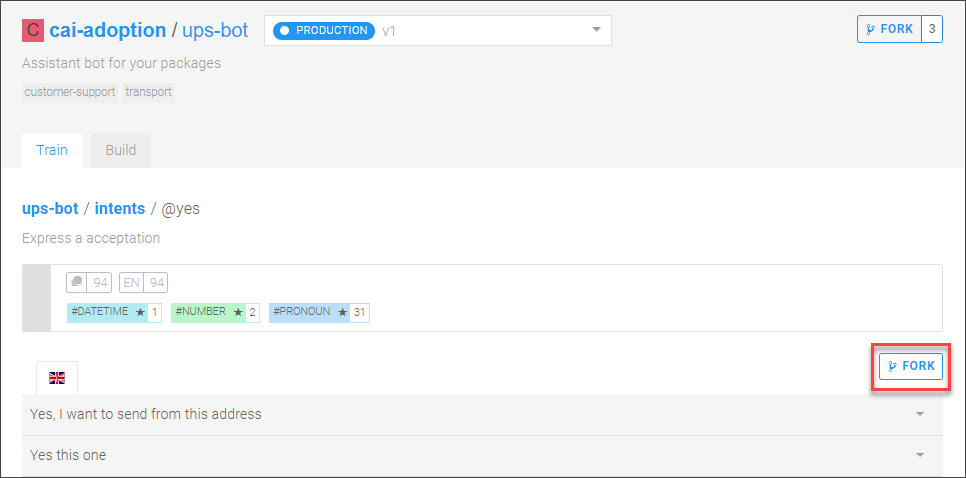

2. Just above the list of values -- **NOT** at the top of the page (that button is to fork the entire project) -- click **Fork**.

    Select your project, and click **Fork**.

    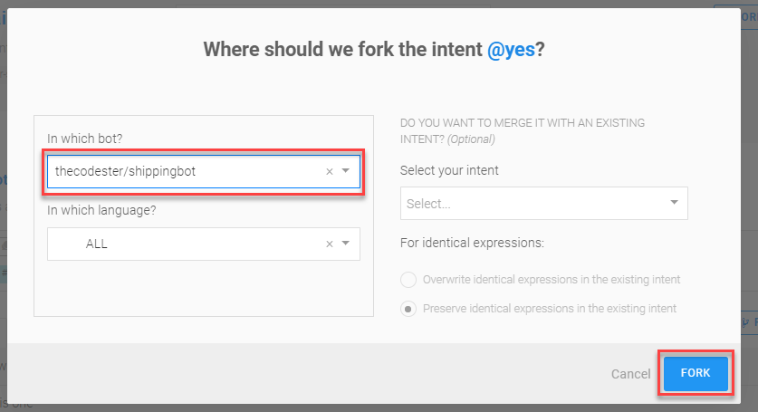

3. Go back to your project and click the **Train** tab (refresh the page if necessary), and you now see the **@yes** intent.

    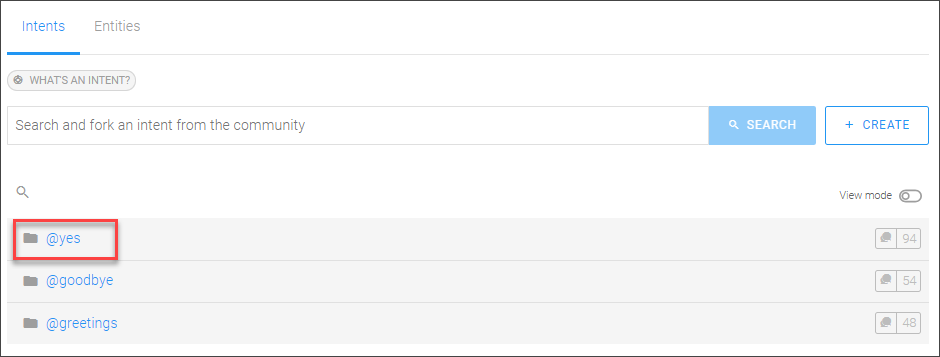

    Click into it, and see all its expressions, that is, all the ways someone could say **"Yes"**.

4. Test the intent by clicking the **Test** flap on the right of the screen, and entering expressions at the bottom.

    Enter **Sure** and **I think so** and **OK** to see that the bot understands the intent. Feel free to add additional expressions.

    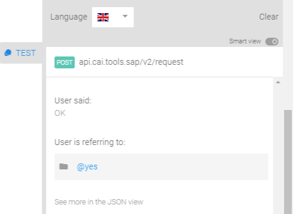

    You can see that the bot detected the intent.

5. Repeat the above steps for the **@No** intent, located at [cai-adoption / ups-bot / intents / @no ](https://cai.tools.sap/cai-adoption/ups-bot/train/intents/no).

[DONE]
[ACCORDION-END]

[ACCORDION-BEGIN [Step 4: ](Add intent for tracking parcel)]

Customers will be indicating that they want information on a parcel, so you need to create an intent for that.

Again, you do not have to create this intent yourself, but can fork an existing intent.

1. In a different browser tab, go to [cai-adoption / ups-bot / intents / @track-parcel](https://cai.tools.sap/cai-adoption/ups-bot/train/intents/track-parcel).

2. Just above the list of values -- **NOT** at the top of the page (that button is to fork the entire project) -- click **Fork**.

    

    Select your project, and click **Fork**.

3. Go back to your project and click the **Train** tab (refresh the page if necessary), and you now see the **@track-parcel** intent.

    Click into it, and see all its expressions, that is, all the ways someone could indicate they want to track a package.

    >Notice that some of the expressions contain a tracking number and some don't.

4. Test the intent by clicking the **Test** flap on the right of the screen, and entering expressions at the bottom.

    Try the following:

    - Where is my package
    - Track 1ZISDE016694068891

    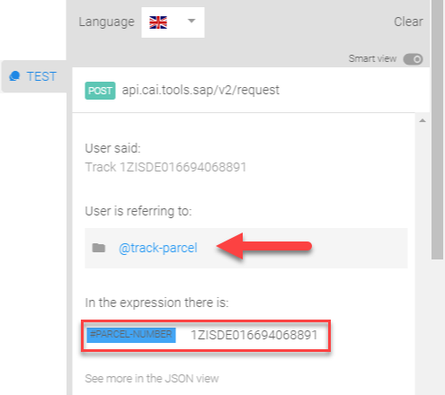

    In the second phrase, you can see that the bot not only detected the intent, but also detected the parcel number.

    Feel free to add additional expressions.

[DONE]
[ACCORDION-END]

[ACCORDION-BEGIN [Step 5: ](Create skill for tracking parcel)]

After you determined that the user wants to track a package, you have to build a skill so the bot knows what to do in response to this intent.

1. On the **Build** tab, click **Create skill**.

    Call the skill **`track-parcel`**, and specify that it is a **Floating** skill, then click **Create Skill**.

    !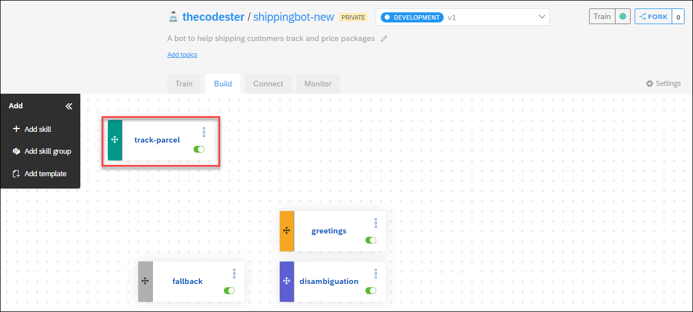

2. Open the skill for editing by clicking on its name.

3. Add a trigger so that this skill is triggered when the **@track-parcel** intent is detected.

    - In the **Triggers** tab, click in the field next to **If**.
    - Select **`@track-parcel`**.
    - Click **Save**.

    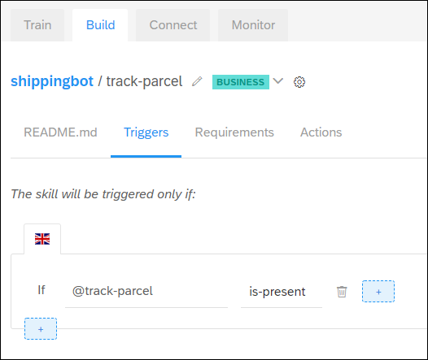


[DONE]
[ACCORDION-END]

[ACCORDION-BEGIN [Step 6: ](Add requirements to skill)]

The requirements for the **track-parcel** skill indicate the data the bot needs to extract from the conversation before executing the skill's action.

1. In the **track-parcel** skill, go to the **Requirements** tab.

2. In the first field under **Required Information**, click and then select **`#parcel-number`**.

    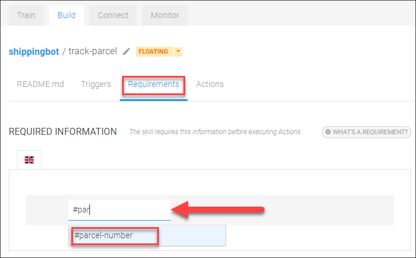

    In the second field (after **as**), enter **`parcel-number`**, and press **Enter**. This is the name in the memory for storing the data for this entity.

3. Click the **Expand** arrow.

    

    Next to **If #parcel-number is missing**, click **New Replies**, and then do the following:

    - Click **Send Message**.
    - Click **Text**.
    - For the message, enter **Could you give me your tracking number?**
    - Click **Save**, then click **Back**.

4. Add a second requirement that the user confirm they want information about the tracking number they wrote.

    Click the plus sign ( **+** ) -- the second one that when you hover it says **Add a new list of requirements**.

    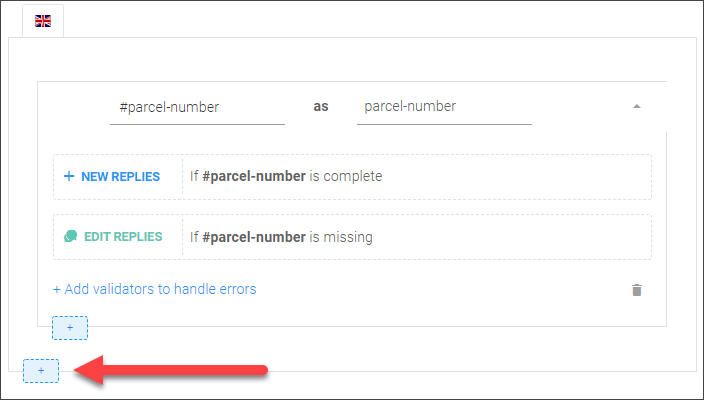

5. In the first field, click and select **@yes**.

    In the second field (after **as**), enter **`yes`** (the name in the memory for this value), and press **Enter**.

    Immediately under **@yes**, click the plus sign ( **+** ) and add the **@no** intent and store its value in the **`no`** variable. Press **Enter**.

    Click the **And** between `@yes` and `@no` and change it to **Or**.

6. Click **New Replies** next to **If @yes or @no are missing**.

    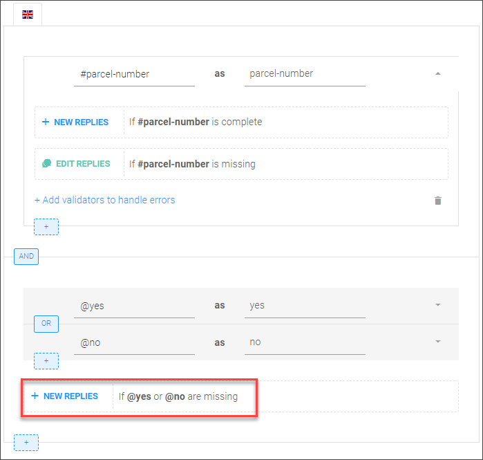

    Then do the following:

    - Click **Send Message**.
    - Click **Quick Replies**.
    - For the message, enter:

        ```Message
        Do you want to track the parcel {{memory.parcel-number.raw}} ?
        ```
        >Above you added code to retrieve the parcel number from the memory -- which stores all requirements, and any information you manually store there. For more information on the memory and syntax, see [Memory Management](https://help.sap.com/viewer/a4522a393d2b4643812b7caadfe90c18/latest/en-US/e99f8ad649a94f4a9c3c628567bede7f.html).

        - Click **Add Quick Reply** twice, and:
            - For the first, add **Yes** for both the title and value.
            - For the second, add **No** for both the title and value.

        - Click **Save**, then click **Back**.

[DONE]
[ACCORDION-END]

[ACCORDION-BEGIN [Step 7: ](Add action to skill)]

Add the action if the user says **No**.

1. Go to the **Actions** tab.

2. Click **Add New Message Group**.

    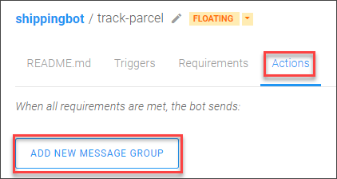

3. Click **Add Condition**, and then in the field next to **If**, select **@no**, and click **Save**.

4. Click **Send Message**, and then:

    - Select **Text**.
    - Enter **No problem. Let me know anytime if you want to track a package.** as the message.
    - Click **Save**.

5. Click **Update Conversation** | **Edit Memory**.

    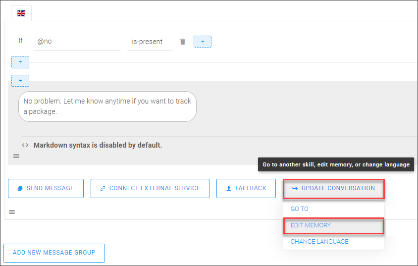

    In the **Unset memory field**, enter **`no`** (the value is case-sensitive), and then click **Save**.

    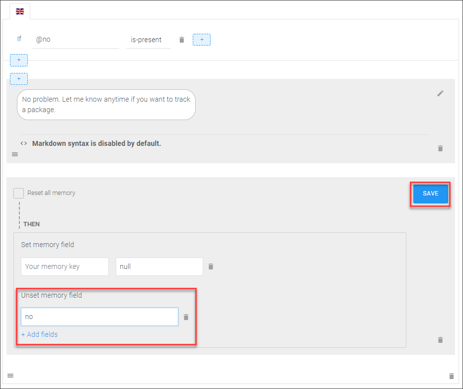

    > ### Why unset No ?
    >This will make it so the skill no longer fulfilled the requirement of having a **Yes** or **No** answer. So now if the user changes their mind, they can enter **`track package`** and the conversation will already have the tracking number stored and will only ask for confirmation.

If the customer says **Yes**, then you will make an API call and retrieve the information to display. You will code this in the next tutorial.

[DONE]
[ACCORDION-END]

[ACCORDION-BEGIN [Step 8: ](Test the bot)]

>If the **Test** panel is open, close it.

Click **Chat With Your Bot** (bottom right) and start a conversation with your bottom. Use this tracking number: **`1Z12345E6205277936`**.

In the example below, notice the bot detects the intent to track a package, but notices the tracking number is missing, and asks for it. Finally, it asks for confirmation, using the tracking number by retrieving it from memory.

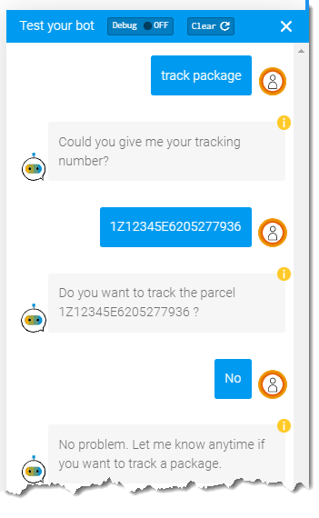

After the customer says **No**, this reply is unset in memory, so if the user again says **track package**, the bot simply asks for confirmation because the latest tracking number is still in memory.

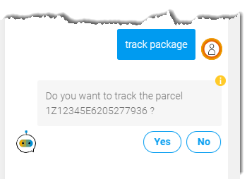

If the customer says **Yes** instead, for now the bot shows **No Reply** because you have not defined an action in this case.

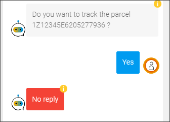

> ### No Reply vs. Fallback Actions
> When a bot has detected an intent and that intent triggers a skill, but that skill does not have an action that returns a message, then **No Reply** is shown.

> If a bot cannot figure out the intent of the user, or no skill has been triggered by the detected intent, then the fallback skill is triggered. When you created your bot, a fallback skill was created automatically for you with a default message.

> 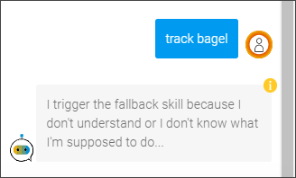

[VALIDATE_1]
[ACCORDION-END]


---
