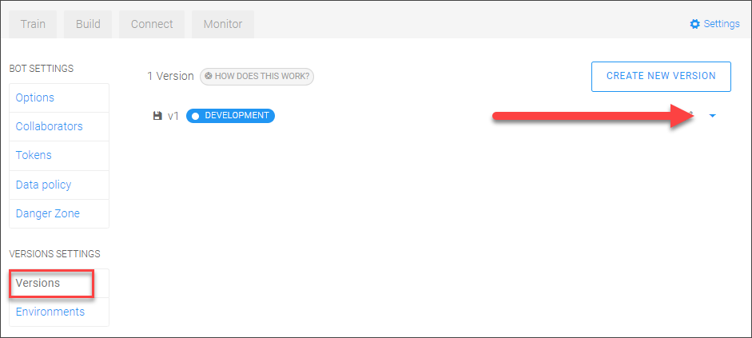
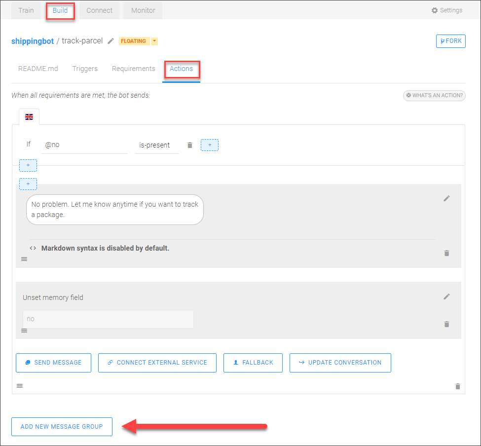
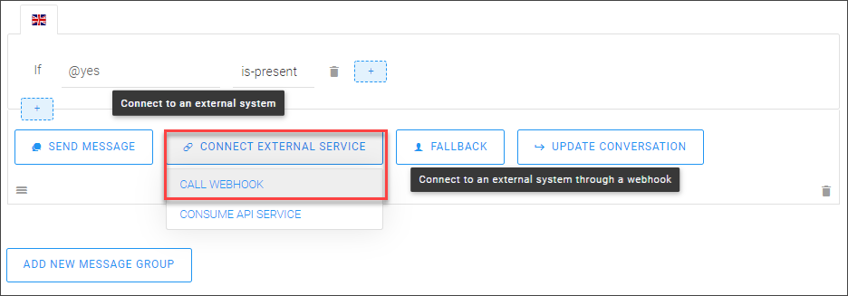
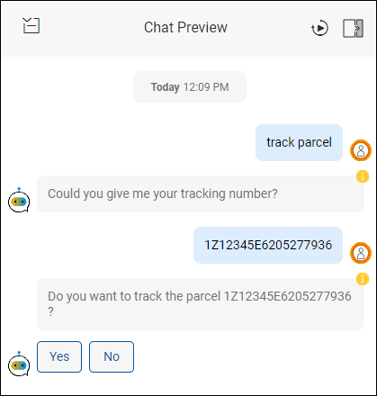

## Prerequisites
 - You have created the bot for letting customers request information on their packages, as described in [Create a Bot that Lets Customers Track Packages](cai-bot-shipping-1-track-bot).

## Details
### You will learn
  - How to set a default webhook endpoint
  - How to call a webhook during a conversation
  - How to display the response

The previous tutorial created a bot to detect the intent of customers who want to track a package, and to get the needed information.

In this tutorial, you will modify the bot so it calls an API to retrieve information on the package, based on a tracking number, and displays that information to the customer.

---

[ACCORDION-BEGIN [Step 1: ](Set default endpoint for webhooks)]

1. Open your `shippingbot` bot.

2. At the top left, click **Settings**.

    

3. Click **Versions**, and then click the arrow to the right of **v1**.

    

4. In the **Bot Builder** field, enter the endpoint to our application on SAP Cloud Platform: **`https://sapupschatbot.cfapps.eu10.hana.ondemand.com`**

5. Click **Save**.

>This endpoint contains a Python demo script that makes all kinds of API calls, including retrieving package information from UPS.

[DONE]
[ACCORDION-END]

[ACCORDION-BEGIN [Step 2: ](Call API to retrieve parcel info)]

2. Go back to the **Build** tab, and click the **track-parcel** skill.

3. Go to **Actions**.

4. Click **Add a New Message Group** (at the bottom).

    

5. Click **Add Condition**.

    After **If**, click in the field and select **@Yes**, and then click **Save**.

    Click **Connect External Service | Call Webhook**

    

    For the URL, enter **`/track_parcel`**, and click **Save**.

    

[DONE]
[ACCORDION-END]

[ACCORDION-BEGIN [Step 3: ](Test the bot)]

You can now test it by starting a conversation to trigger the **`@track-parcel`** intent, supplying the tracking number (e.g., `1Z12345E6205277936`), and saying **Yes**, you want to track the package.

[VALIDATE_1]
[ACCORDION-END]

---
