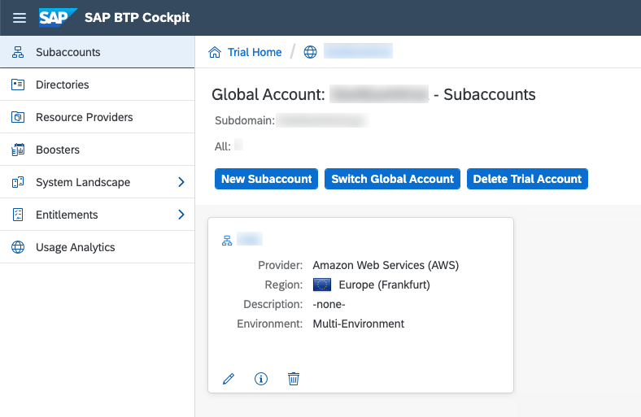
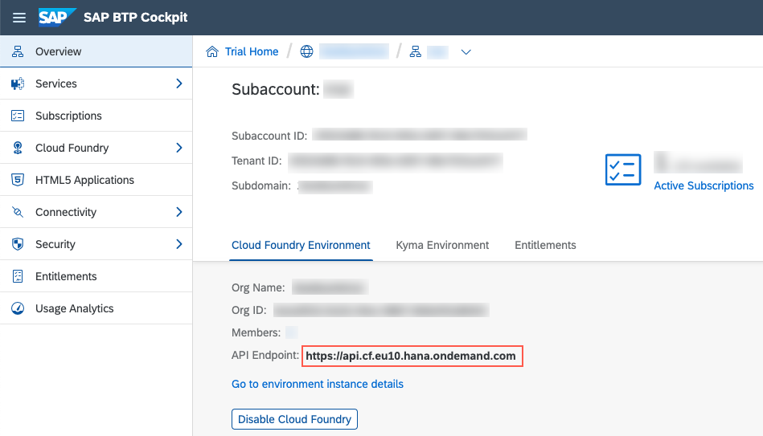

## Prerequisites
- You've finished the tutorial [Create a Business Service with Node.js using Visual Studio Code](cp-apm-nodejs-create-service).  
- If you don't have a Cloud Foundry Trial subaccount and dev space on [SAP BTP Cockpit](https://cockpit.hanatrial.ondemand.com/cockpit/) yet, create your [Cloud Foundry Trial Account](hcp-create-trial-account) with **Europe (Frankfurt) or US East (VA) as region** and, if necessary [Manage Entitlements](cp-trial-entitlements).
- You've downloaded and installed the [cf command line client](https://github.com/cloudfoundry/cli#downloads) for Cloud Foundry as described in the tutorial [Install the Cloud Foundry Command Line Interface (CLI)](cp-cf-download-cli).

## Details
### You will learn  
  - How to deploy your business service on SAP Business Technology Platform (SAP BTP) using the SAP Cloud Application Programming Model (CAP) and binding appropriate service instances. See the [Developer Guide for Cloud Foundry](https://docs.cloudfoundry.org/devguide/) for more details.

---

[ACCORDION-BEGIN [Step 1: ](Enhance project configuration for SAP HANA)]

It's now time to switch to SAP HANA as a database.

1. If `cds watch` is still running in Visual Studio Code, press **CTRL+C** in the command line to stop the service.

2. In Visual Studio Code add the following configuration in the file `package.json` of your `my-bookshop` project. Overwrite any existing `cds` configuration:

    ```JSON
    "cds": {
        "requires": {
          "db": {
            "kind": "sql"
          }
        }
      }
    ```

    > `kind:sql` declares the requirement for an SQL database. It evaluates to `sqlite` in the `development` profile (active by default), while in `production` it equals `hana`. This way you don't need to modify this file if you want to switch between the two databases.

    > Don't edit the `gen/db/package.json` file.

3. In the command line add the SAP HANA driver as a dependency to your project:

```Shell/Bash
npm add @sap/hana-client --save
```
In case of problems, see the [Troubleshooting guide](https://cap.cloud.sap/docs/advanced/troubleshooting#npm-installation) in the CAP documentation for more details and check that you've installed the latest long-term support (LTS) version of [Node.js](https://nodejs.org/en/).

[DONE]

[ACCORDION-END]

[ACCORDION-BEGIN [Step 2: ](Identify SAP BTP Cloud Foundry endpoint)]

The Cloud Foundry API endpoint is required so that you can log on to your SAP BTP Cloud Foundry space through Cloud Foundry CLI.

1. Go to the [SAP BTP Trial Cockpit](https://cockpit.hanatrial.ondemand.com/cockpit#/home/trial) and choose **Enter Your Trial Account**.

    !

2. Navigate to the **Subaccount** overview:

    !

3. Navigate to your Subaccount and copy the **Cloud Foundry API Endpoint** value:

    !

4. Go back to Visual Studio Code to the command line. Authenticate with your login credentials using the following command:

```Shell/Bash
cf login
```
> This will ask you to select CF API, org, and space.

> The API Endpoint is taken by default. If you want to change the API Endpoint use `cf api <CF_API_ENDPOINT>` to change the API. Replace `<CF_API_ENDPOINT>` with the actual value you obtained in the previous step.

[DONE]
[ACCORDION-END]

[ACCORDION-BEGIN [Step 3: ](Deploy using cf push)]

SAP BTP, Cloud Foundry environment has a built-in [cf push](https://docs.cloudfoundry.org/devguide/push.html) command to deploy applications. It needs the application files plus an optional `manifest.yml` file to push the application code and to bind the relevant services to the application.

[OPTION BEGIN [Windows]]

1. As `cf push` can only bind but not create services, you need to create the SAP HANA service manually (along with an HDI container and a database schema). In the command line add:

    ```Shell/Bash
    cf create-service hanatrial hdi-shared my-bookshop-db
    ```

    > This process takes some minutes.

    > Check the status of your service using `cf service my-bookshop-db`.

    > If service creation fails, see the [Troubleshooting guide](https://cap.cloud.sap/docs/advanced/troubleshooting#hana) in the CAP documentation for more details.

2. Now, build and deploy both the database part and the actual application and add:

    ```Shell/Bash
    cds build --production
    cf push -f gen/db
    cf push -f gen/srv --random-route
    ```

    > This process takes some minutes.

    > The first command creates the SAP HANA table and view definitions along with `manifest.yaml` files in both in `gen/db` and `gen/srv` folders. Look at `gen/db/manifest.yaml` and see that it binds to the `my-bookshop-db` service that you've created in the previous step.

    > See the section [Deploy using cf push](https://cap.cloud.sap/docs/advanced/deploy-to-cloud#deploy-using-cf-push) in the CAP documentation for more details.

3. In the deploy log, find the application URL in the `routes` line at the end:

    ```
    name:              my-bookshop-srv
    requested state:   started
    routes:            my-bookshop-srv-....cfapps.....hana.ondemand.com
    ```

4. Open this URL in the browser and try out the provided links, for example, `.../catalog/Books`. Application data is fetched from SAP HANA.

!

[OPTION END]

[OPTION BEGIN [MacOS and Linux]]

1. As `cf push` can only bind but not create services, you need to create the SAP HANA service manually (along with an HDI container and a database schema). In the command line add:

    ```Shell/Bash
    cf create-service hanatrial hdi-shared my-bookshop-db
    ```

    > This process takes some minutes.

    > Check the status of your service using `cf service my-bookshop-db`.

    > If service creation fails, see the [Troubleshooting guide](https://cap.cloud.sap/docs/advanced/troubleshooting#hana) in the CAP documentation for more details.

2. Now, build and deploy both the database part and the actual application and add:

    ```Shell/Bash
    cds build --production && cf push -f gen/db && cf push -f gen/srv --random-route
    ```

    > This process takes some minutes.

    > The first part of the command creates the SAP HANA table and view definitions along with `manifest.yaml` files in both in `gen/db` and `gen/srv` folders. Look at `gen/db/manifest.yaml` and see that it binds to the `my-bookshop-db` service that you've created in the previous step.

3. In the deploy log, find the application URL in the `routes` line at the end:

        ```
        name:              my-bookshop-srv
        requested state:   started
        isolation segment: trial
        routes:            my-bookshop-srv-....cfapps.....hana.ondemand.com
        ```

4. Open this URL in the browser and try out the provided links, for example, `.../catalog/Books`. Application data is fetched from SAP HANA.

    !

[OPTION END]

[VALIDATE_1]

[ACCORDION-END]

<p style="text-align: center;">Give us 55 seconds of your time to help us improve</p>

<p style="text-align: center;"><a href="https://sapinsights.eu.qualtrics.com/jfe/form/SV_0im30RgTkbEEHMV?TutorialID=cap-service-deploy" target="_blank"></a></p>
