## Prerequisites
  - You'll need an SAP Conversational AI trial account. See [Build Your First Chatbot with SAP Conversational AI](https://developers.sap.com/tutorials/cai-bot-getting-started.html).

## Details
### You will learn
  - How to fetch entity values through an external (OData) service
  - Hot to build a custom message using scripting
  - How to set up an end-user skill trigger from a button

You will build a bot so customers can order a product from categories like food, beverages or electronics -- simulating a convenience store digital commercial chatbot. Here it goes a sneak peek:

  !

To build the bot, you start by creating an intent for ordering a product, which then gives the customer a dynamically generated list of products depending on the category the customer chose. This is done by calling an OData service.

The main purpose of this tutorial is to demonstrate how to make API requests and handling its responses by using scripting capabilities to show the content the user is asking for in different UI elements (e.g., Cards or Buttons).

- For more information on the scripting syntax, see [Scripting with Variables](https://help.sap.com/viewer/a4522a393d2b4643812b7caadfe90c18/latest/en-US/5b86debf32444658b29db44733d8d81a.html).

- For more information on how to make API calls and webhooks, see [Connect Your SAP Conversational AI Chatbot to External Services](https://developers.sap.com/group.conversational-ai-external-services.html).

---

[ACCORDION-BEGIN [Step 1: ](Create new bot and intent)]

1. Go to [SAP Conversational AI](https://cai.tools.sap/) and log in.

2. Click **New Bot** and select the following:

    |  Field Name     | Value
    |  :------------- | :-------------
    |  1. What do you want your chatbot to do?           | **Perform Actions**
    |  2. Predefined Skills           | **Greetings**
    |  3. Create your bot     | <ul><li>Name: **`bestrunbot`**</li><li>Description: **A bot to help customers order a product**</li><li>Language: **English**</li></ul>
    |  4. Data Policy  | **Non-personal**, **Store data** and **Non-vulnerable**
    |  5. Bot Visibility | **Public**

    !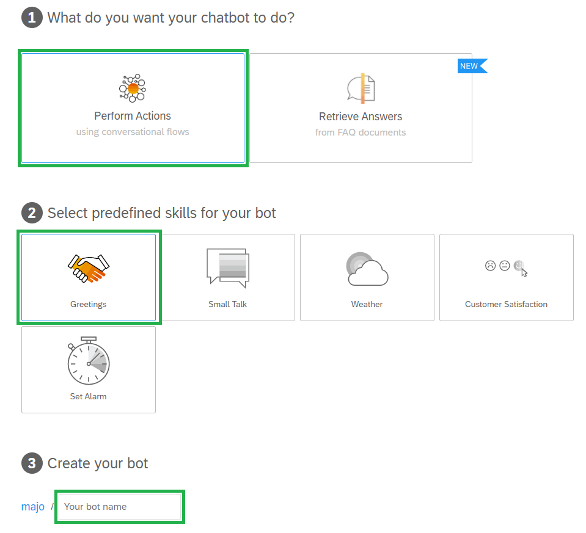

    Click **Create a Bot**.

3. Go to the **Train > Intents** tab, and create an intent.

    Call the new intent `categoriesforsale` and click **Create Intent**.

    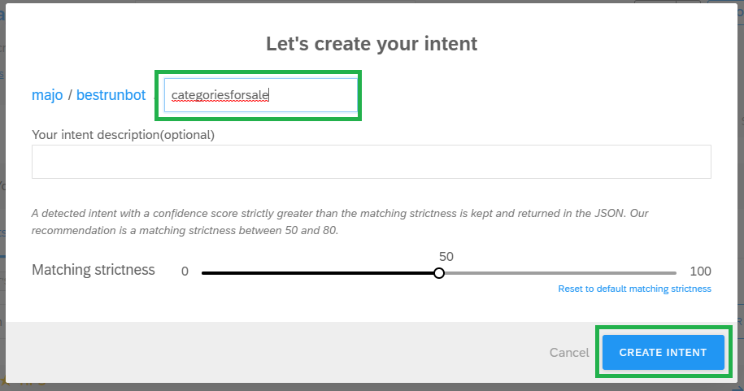

4. Open the intent and add the following expression: `See Categories for Sale`.

    !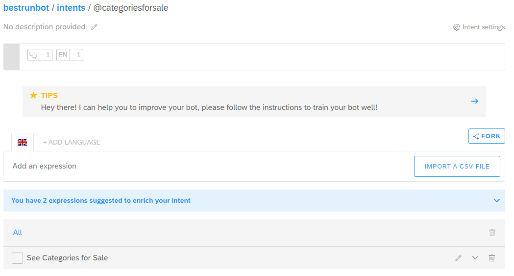

[DONE]
[ACCORDION-END]

[ACCORDION-BEGIN [Step 2: ](Create entities)]

You will create entities to represent the categories of products, and another entity for the products. The list of products will be fetched from an API.

1. In the **Train > Entities** tab, click **Create an Entity**.

    Make the entity **Restricted**, call it `category`, and click **Create**.

    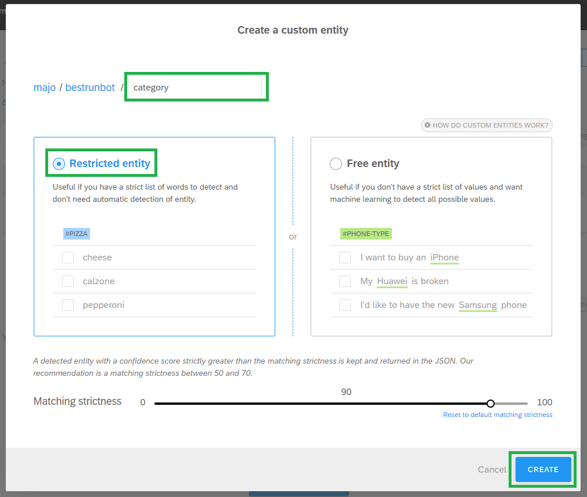

2. In this entity, we'll add the values manually as there are only 3.

    Open the entity, and add the following values:

    -	Food
    -	Beverages
    -	Electronics

    !

3. Create another entity for products, but in this case, we are going to fetch the data from an external (OData) service.

    Go back to the **Entities** tab (you can click on **entities** in the breadcrumb) and click **Create**.

    Make the entity **Restricted**, call it `product`, and click **Create**.

4. Open the `product` entity, and click **Fetch Via Service API**.

    !

    Select **GET** and paste the following endpoint (this is a public OData service, so feel free to explore it 😊):

    ```URL
    https://services.odata.org/V3/(S(vnym1b3ehndm0p4fr0bdtbon))/OData/OData.svc/Products/?$format=json
    ```

    Click **Fetch**.

5. Once the API data is fetched, go to the box on the left called **Transform your API service response to fit the format**, delete everything inside, and add the following code:

    ```JSON
    {{{json (pluck api_service_response.body.value 'Name')}}}
    ```

    Click **Transform** to see the values that will be imported.

    Keep the option **Replace**, and then click **Import**.

    !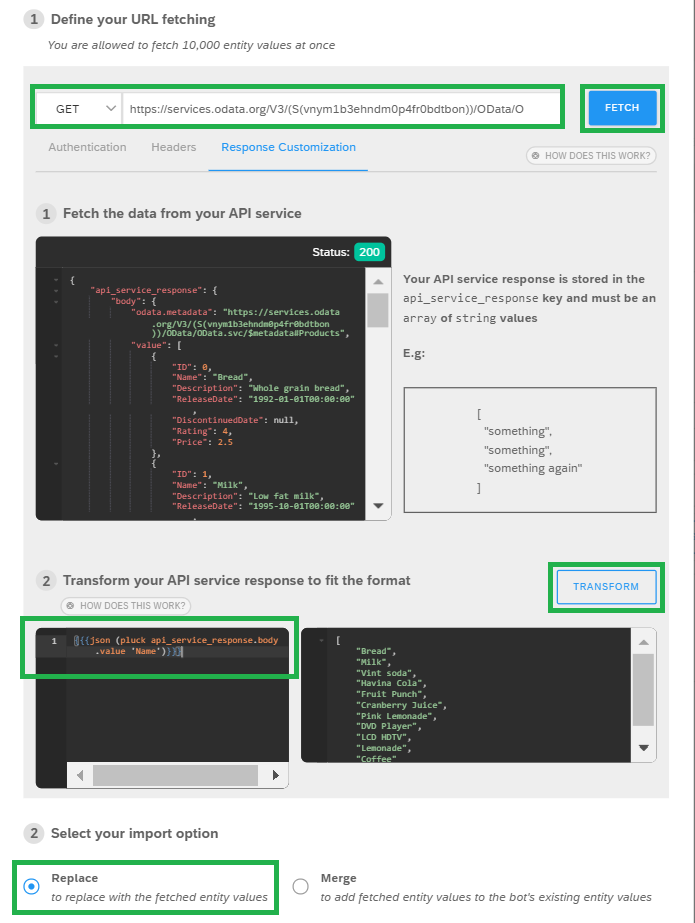

    You should be able to see the values imported like this:

    !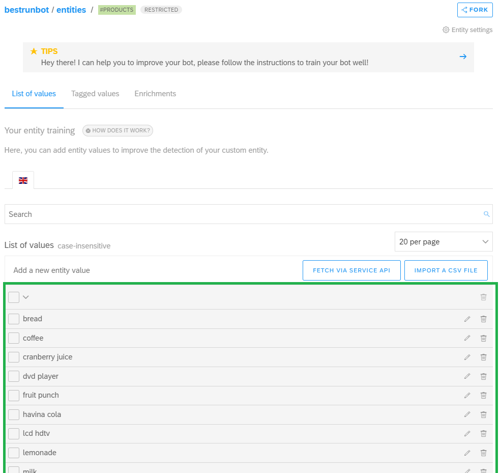

>If you want to know more about importing entity values using an external service and more, see [Importing Entity Values](https://help.sap.com/viewer/a4522a393d2b4643812b7caadfe90c18/latest/en-US/9e2258a02ba74660b6607bf3d8f6b890.html).

[DONE]
[ACCORDION-END]


[ACCORDION-BEGIN [Step 3: ](Create skill for ordering)]

1. In the **Build** tab, click **Add skill**.

2. Call the skill `forsale`, choose **Business** for the type, and click **Add**.

    !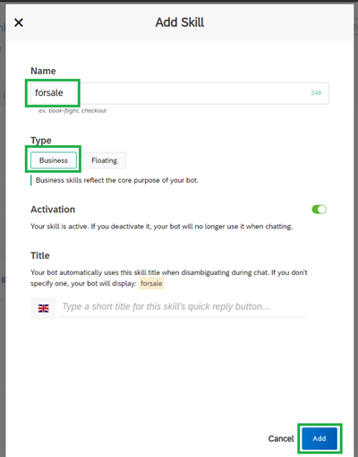

    You'll see your skill created like this:

    !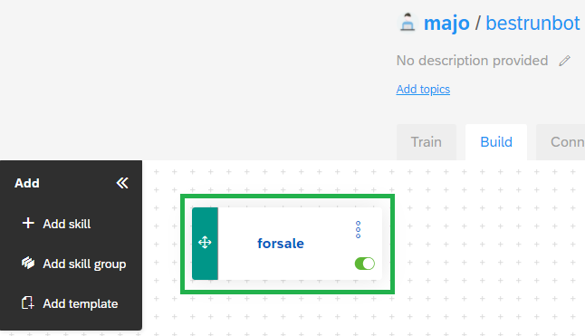

3. Click on the skill and go to the **Triggers** tab.

    We want the skill to be executed when someone wants to order a product.

4. Click the box next to **If**, select the **`categoriesforsale`** intent, and click **Save**.

    !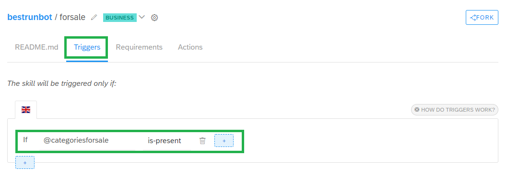

[DONE]
[ACCORDION-END]

[ACCORDION-BEGIN [Step 4: ](Add category requirement for skill)]

To order, the customer must provide a category and a product. These will be set up as requirements for the skill.

1. Go to the **Requirements** tab of the skill.

2. Select the **#category** entity as a requirement, and enter **category** as the memory variable, and then press **Enter**.

3. Expand this requirement and click **if #category is missing**.

    !

    Click **Connect External Service > Consume API Service**. We will use the service, and then use scripting on its response, to tell the user to select a category.

    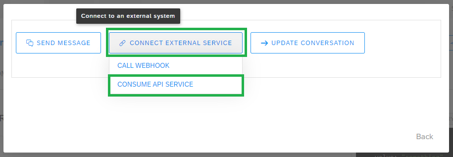

4. Select **GET**, and copy and paste this API endpoint

    ```URL
    https://services.odata.org/V3/(S(vnym1b3ehndm0p4fr0bdtbon))/OData/OData.svc/Categories/?$format=json
    ```

    Click **Save**.

5. Click **Send Message > Custom**. This will enable us to create a message based on the API response.

    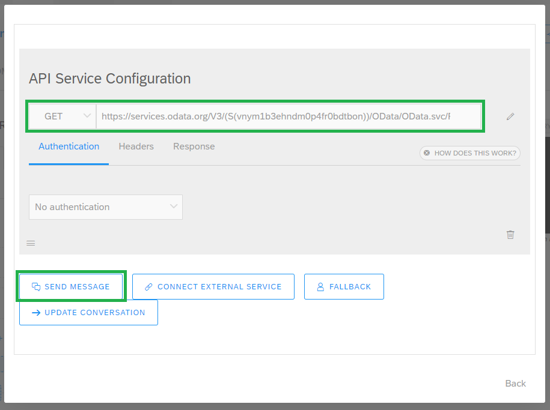

    Select **Buttons** as the message type and replace the script with the following code:

    ```JSON
    {
      "type": "buttons",
      "delay": "",
      "content": {
        "title": " Please select the category you are interested in!",
        "buttons": [
        {{#eachJoin api_service_response.default.body.value}}
          {
            "title": "{{Name}}",
            "value": "{{Name}}",
            "type": "postback"
          }{{/eachJoin}}
        ]
      }
    }
    ```

    Click **Save**.

    You should have the following:

    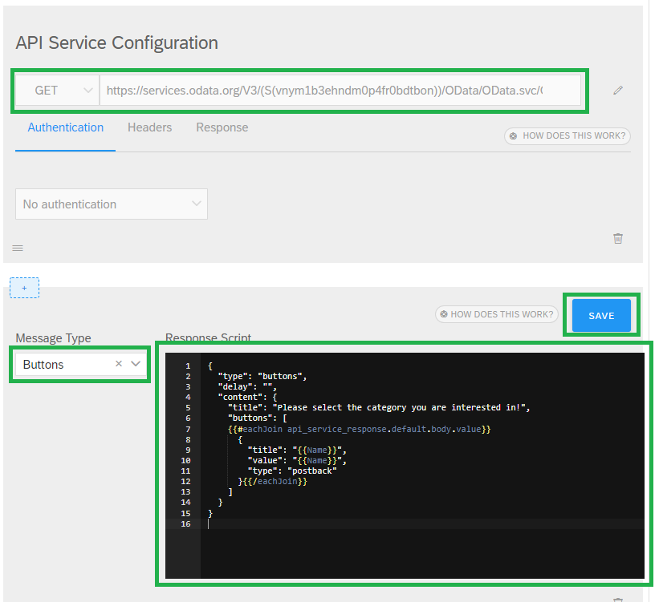

    >If you want to know more about custom messages, see [Message Types](https://help.sap.com/viewer/a4522a393d2b4643812b7caadfe90c18/latest/en-US/ad3681adae824f8a96cbcf8b889a4ffc.html).


[DONE]
[ACCORDION-END]


[ACCORDION-BEGIN [Step 5: ](Add product requirement for skill)]

1. Go back to **Requirements** tab.

    Add a new requirement by click the first **+** sign (**Add a new requirement**) immediately below the category requirement we just added.

    !

2. Select the **#product** entity as a requirement, and enter **product** as the memory variable, and then press **Enter**.

3. Expand this requirement and click **if #product is missing**.

    Click **Connect External Service > Consume API Service**. We will use the service, and then use scripting on its response, to tell the user to select a product.

4. Select **GET**, and copy and paste this API endpoint

    ```URL
    https://services.odata.org/V3/(S(vnym1b3ehndm0p4fr0bdtbon))/OData/OData.svc/Products/?$filter=%20Categories/any(Category:Category/Name%20eq%20%27{{memory.category.raw}}%27)&&$format=json
    ```

    In this URL you can see that we are getting from the chatbot's memory the category the user selected using this syntax inside the URL endpoint: `{{memory.category.raw}}`.

    Click **Save**.

5. Click **Send Message > Text**.

    ```JSON
    {{#if (length api_service_response.default.body.value)}} Availability: {{pluralize 'product' quantity=(length api_service_response.default.body.value) }}. {{/if}}
    ```

    >This scripting is to customize the message in case we have more than one product, so it can be shown as a plural response. For more information, see [Scripting Syntax](https://help.sap.com/viewer/a4522a393d2b4643812b7caadfe90c18/latest/en-US/b4f08a9a66434327a405b6934880445c.html).

    Click **Save**.

6. Click **Send Message > Custom**.

    Select **List** as the message type and replace the script with the following code:

    ```JSON
    {"type": "list",
                "content": {
                  "elements": [
                   {{#eachJoin api_service_response.default.body.value}}
                    {
                      "title": "{{Name}}",
                      "imageUrl": "",
                      "subtitle": "$ {{Price}}",
                      "buttons": [{
                        "title": "{{Name}}",
                        "value": "{{Name}}",
                        "type": "postback"
                      }]
                    } {{/eachJoin}}
                    ]
                    }
                    }
    ```

    Click **Save**.

    You should have the following:

    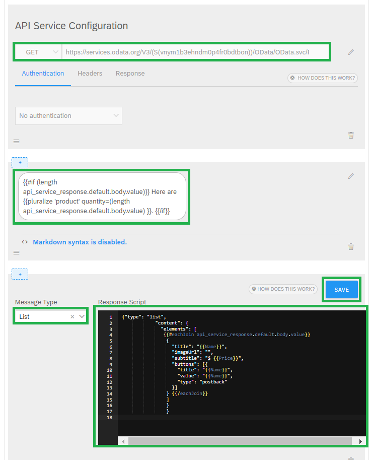

    >If you want, you can start testing the chatbot by clicking on the **Chat Preview** button. Text *See Categories for Sale* and see how the chatbot shares the categories available, select one and later you'll see its products.

[DONE]
[ACCORDION-END]


[ACCORDION-BEGIN [Step 6: ](Create skill for checkout)]

Once the customer selects a product, you'll want to let the customer checkout and buy the product.

1. Click the **Build** tab.

2. Click **Add skill**, name the skill **`checkout`**, make it a business skill.

    Click **Save**.

    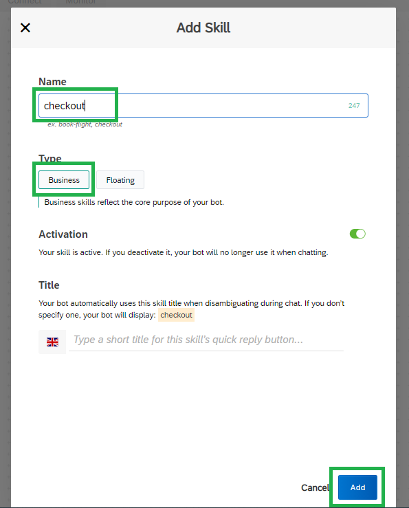

    >It is possible that the `checkout` skill is covering up visually the `forsale` skill. To be able to see them both, just grab the checkout skill and move it to an empty space inside the **Build** tab.

3. Open the skill and go to the **Requirements** tab.

4. Select the **#person** entity as a requirement, and enter **person** as the memory variable, and then press **Enter**.

5. Expand this requirement and click **if #person is missing**, where you will ask for the user's full name.

    !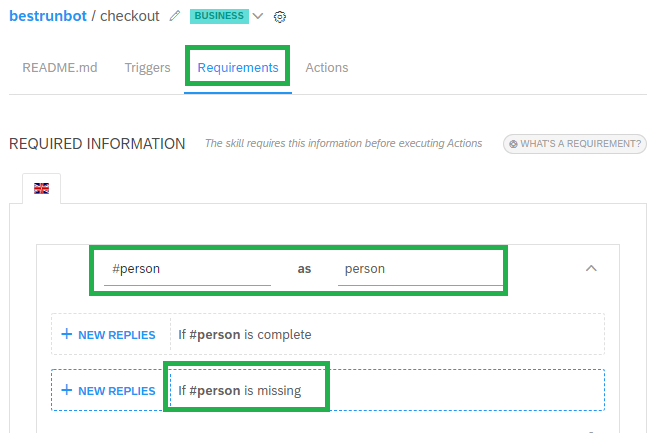

    Click **Send Message > Text**, and copy and paste the following:

    ```Text
    Could you please share with me your full name?
    ```

    Click **Save**.

    !

6. Now let's do the same for the customer's email and location (address).

    Click the **+**, first to add **#email** and then **#location** requirements. In each case, set the variable to the same name without the #.

    After adding email and location and expanding them, you'll see the following:

    !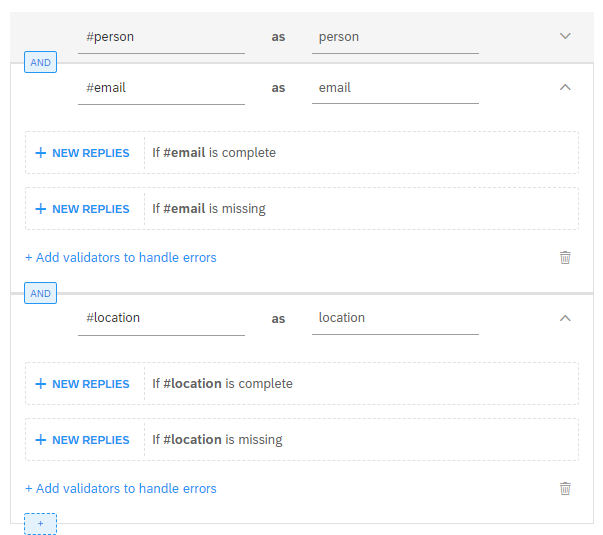

7. Now let's put the questions for each of them.


    Click **if #email is missing**, paste the following as a text message, and click **Save**:

    ```Text
    And your email as well?
    ```

    Click **if #location is missing**, paste the following as a text message, and click **Save**:

    ```Text
    Now I need your shipping address, could you please write it down?
    ```

[DONE]
[ACCORDION-END]

[ACCORDION-BEGIN [Step 7: ](Let user trigger checkout skill)]

Now we'll connect the skills `forsale` and `checkout` together, for the checkout process.

1. Let's go back to the **`forsale`** skill.

2. In the **Build** tab, open the `forsale` skill.

3. In the **Action** tab, click **Add New Message Group**.

4. Click **Send Message > Buttons**.

    For the message, copy and paste the following:

    ```Text
    You've selected this product {{memory.product.raw}} in your cart. To proceed with your purchase, click here to checkout.
    ```

5. Click **Add a Button > Trigger Skill**.

    !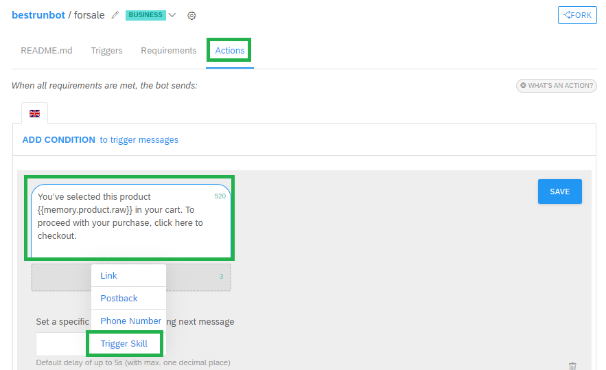

    Set the following for the button:

    |  Field Name     | Value
    |  :------------- | :-------------
    |  Button title           | `Go to checkout`
    |  Skill           | `checkout`

    Click **Save**.

    >As you can see, we're enabling an end-user skill trigger feature by selecting the `checkout` skill as a button's action. In this way, the chatbot will trigger the `checkout` skill automatically when the user selects this option.

[DONE]
[ACCORDION-END]

[ACCORDION-BEGIN [Step 8: ](Add actions to checkout skill)]


1. Go to the **Build** tab and click the **checkout** skill.

    

2. In the **Actions** tab, click **Add a New Message Group**.

3. Click **Send Message > Text** and past the following:

    ```Text
    Alright {{memory.person.raw}}, you've selected the product: {{memory.product.raw}}. We'll send you an email to {{memory.email.raw}} with the order confirmation which will be delivered to your shipping address: {{memory.location.formatted}}. Thank you for using BestRunMarket Bot! :)
    ```

    Click **Save**.

You should see the following:

!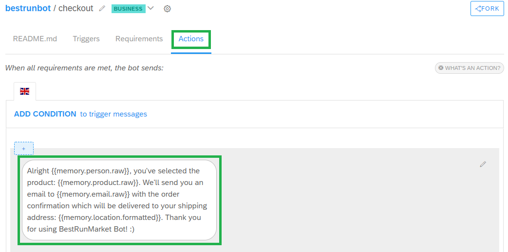  

> We are going to leave the exercise 'til this point. However, you can use this as an example on how to build a commercial bot and continue integrating it with a backend server app, e-commerce platform or an external service such as a payment engine to charge the order to the customer.

[DONE]
[ACCORDION-END]

[ACCORDION-BEGIN [Step 9: ](Modify greetings skill to ask about ordering)]

1. Go to the **Build** tab and open the **greetings**' skill.

    !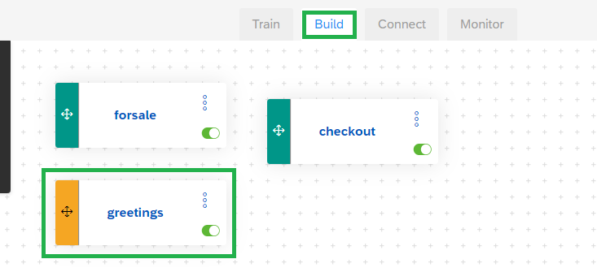

2. Go to the **Actions** tab.

    Notice that this skill and its responses are already configured because at the beginning we selected **Greetings** as a predefined skill for the bot.

3. **Delete** all the messages (not the message groups), since we will define our own.

    !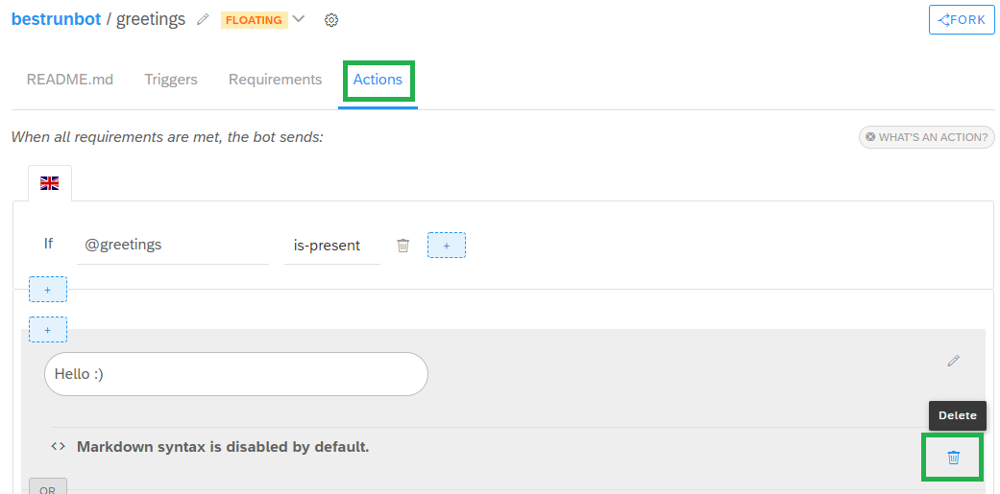

4. Click **Send Message > Card**.

    !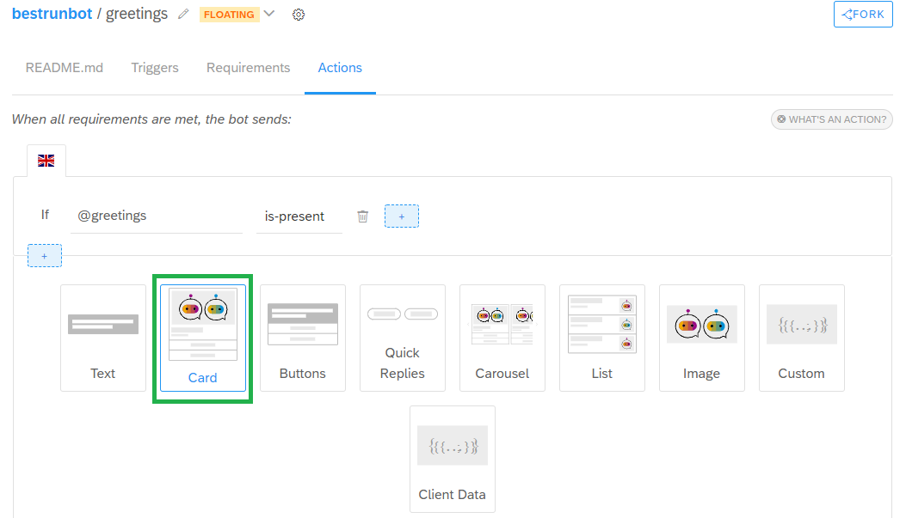

    Set the following:

    |  Field Name     | Value
    |  :------------- | :-------------
    |  **Image URL**  | `https://i.imgur.com/reQirgK.png`
    |  **Title**           | `Hello! Welcome to the BestRunMarket Bot!`
    |  **Subtitle**    | `How may I help you?`

5. Click **Add a Button > Postback**.

    !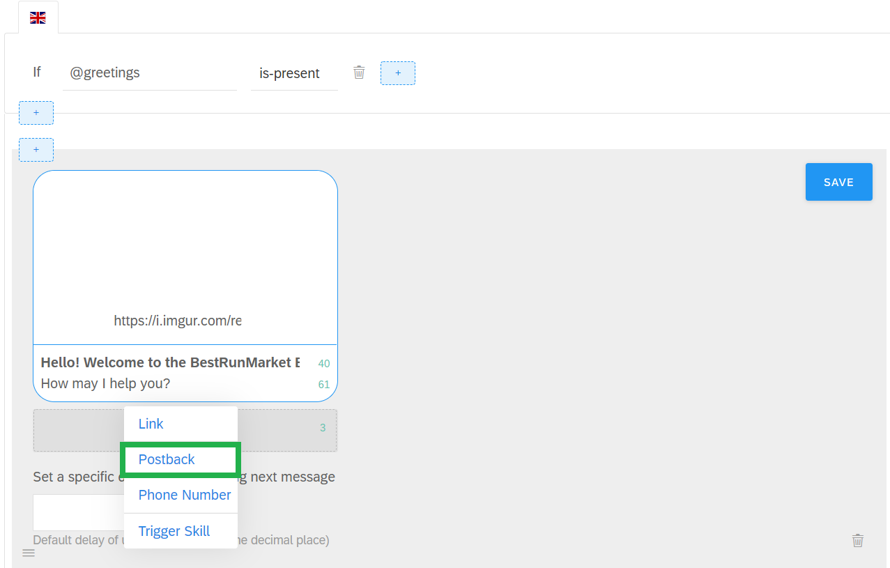

    Notice that here we can also set up a end-user skill trigger feature to trigger the `forsale` skill. But in this case we will "link" the intent `categoriesforsale` with its main expression **See Categories for Sale** using the **Postback** option.

    Enter `See Categories for Sale` for both the **Button Title** and **Postback** values.

6. Click **Add a Button > Postback**.

    !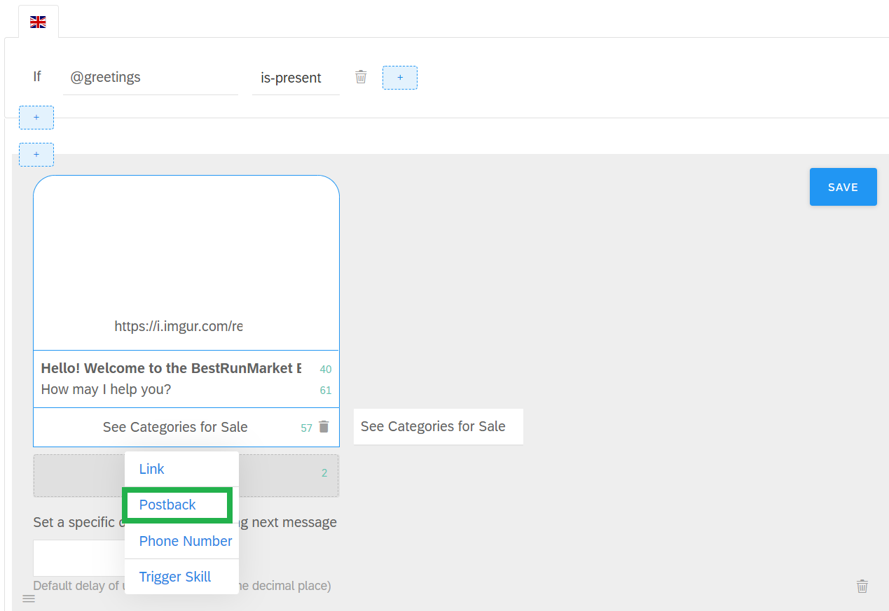

    Enter `Ask for an Order Tracking` for both the **Button Title** and **Postback** values.

    >We're going to leave it 'til here, using **see categories for sale** as the main intent for this exercise. However this is an example of how we can put more options for the user to select and interact with the chatbot.

    !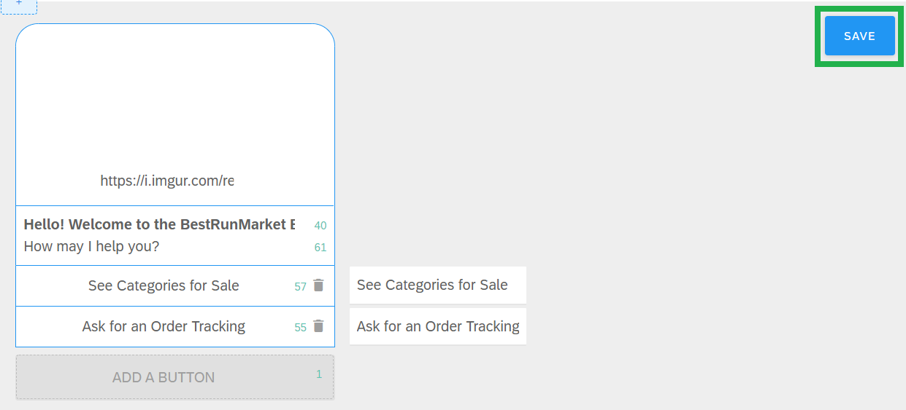

7. Click **Save**.

[DONE]
[ACCORDION-END]

[ACCORDION-BEGIN [Step 10: ](Test bot)]

1. Click **Chat Preview**.

    !

2. Test the bot by talking with it. The following is an example of the conversation:

    !

3. Check out the bot's memory by clicking on the yellow *i* for the last message. You'll be able to see the whole entities saved in the bot's memory, like this:

    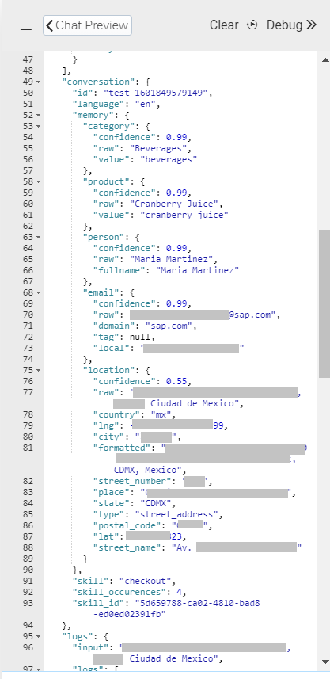

    While testing, you can also click **Debug** to see which skills were triggered in every step of the conversation. This can help you to better understand how the chatbot is working and to keep improving its performance.

[DONE]
[ACCORDION-END]


[ACCORDION-BEGIN [Step 9: ](Test yourself: scripting syntax)]

[VALIDATE_6]
[ACCORDION-END]


[ACCORDION-BEGIN [Step 10: ](Test yourself: custom messages)]

[VALIDATE_7]
[ACCORDION-END]

---

### Now you've learned:
  - How to fetch entity values through an external service, in this case using an OData service.
  - How to build custom messages and also enabling scripting syntax for dynamic responses while using an external service.
  - How to set up end-user skill triggers from a button.

  Hope you'd enjoyed this exercise! 😊

---
