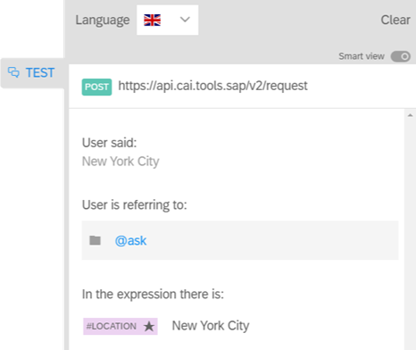
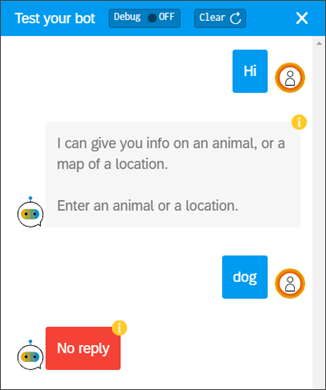
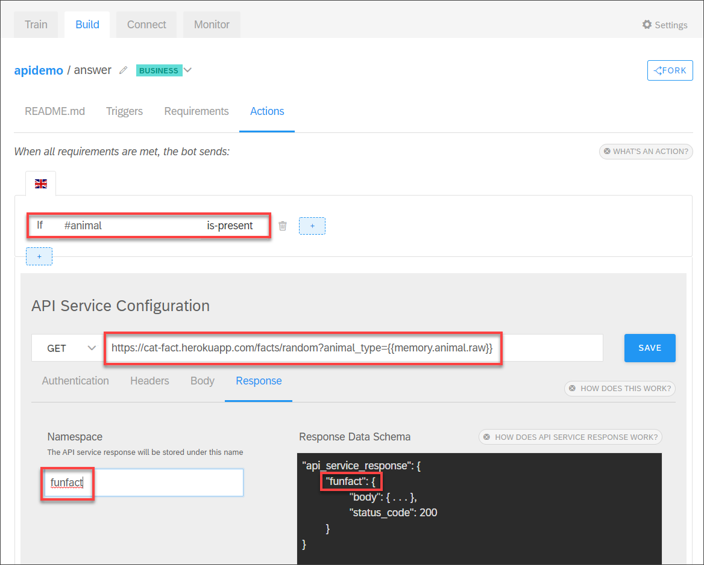
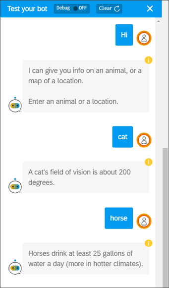
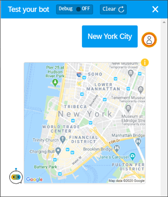
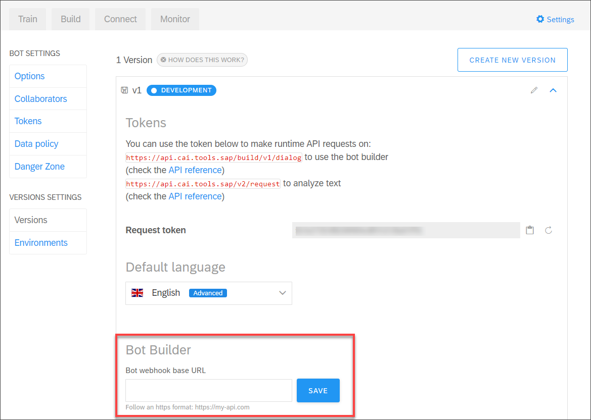

## Prerequisites
- You understand the basics of creating a chatbot, as described in the tutorial [Build Your First Chatbot with SAP Conversational AI](cai-bot-getting-started).
 

## Details
### You will learn
  - How to call an API from your chatbot
  - How to call a webhook from your chatbot

In this tutorial, you will create a simple chatbot to check if the user entered an animal or a location or both: if an animal, the chatbot will display a "fun fact" about the animal by calling an API; if a location, the chatbot will display a Google map by calling a webhook.

- The **Consume API Service** option is used when you need to call an API service and capture the results to be used in other actions like messages or other API calls. You can send any body content you want, and the returned JSON is returned in the `api_service_response` variable, which you can then use in other actions.

- The **Call Webhook** option is used when you need to create more complex middleware. By default, the entire conversation context JSON is sent (for POST requests), and the webhook must return JSON in the format that can be displayed in the chatbot UI (see [Getting Response Using Webhook](https://help.sap.com/viewer/a4522a393d2b4643812b7caadfe90c18/latest/en-US/7f06277acb1d46529daa9c5828a8a045.html)). The next tutorial in this group will show you how to create your own webhook designed to be called from a chatbot.

>From a feature point of view, the 2 ways of calling an API are the same except:

> - A webhook is automatically sent the conversation context JSON (for POST requests) by default.

> - A webhook must return JSON that conforms to the SAP Conversational AI UI protocol.

For more information on making calls from your chatbot, see [Connect to External Service](https://help.sap.com/viewer/a4522a393d2b4643812b7caadfe90c18/latest/en-US/31f328484e0f40f98d12a507e6f76f0c.html).

---

[ACCORDION-BEGIN [Step 1: ](Create a simple chatbot)]

You will create a very simple bot that lets the user specify an animal or a location.

1. Create a new bot and call it `apidemo`. Use the following values:

    |  Field Name     | Value
    |  :------------- | :-------------
    |  1. What do you want your chatbot to do?           | **Perform Actions**
    |  2. Predefined Skills           | None
    |  3. Create your bot     | <ul><li>Name: **`apidemo`**</li><li>Description: **A bot to test APIs and webhooks**</li><li>Language: **English**</li></ul>
    |  4. Data Policy  | **Non-personal** and **Non-vulnerable**
    |  5. Bot Visibility | **Public**

    Click **Create Bot**.

2. In the **Train** tab, create an intent called `ask`, and add the expression **I'm interested in**.

    >Since we define only one intent, this intent will always be triggered when the user types in a message.

3. In the **Train** tab, create a restricted entity called `animal` and add 4 valid values: **cat**, **horse**, **snail**, **dog**.

    

4. Open the **Test** tab and test the bot. No matter what you type the intent will be `ask`.

    Enter `dog` and it will recognize the `animal` entity.

    

    Enter `New York City` and it will recognize the built-in `location` entity.

    

[DONE]
[ACCORDION-END]

[ACCORDION-BEGIN [Step 2: ](Add a skill)]

1. In the **Build** tab, create a skill called **answer**, and open it.

2. Under **Triggers**, set the condition to: `If @ask is-present`.

3. Under **Requirements**, specify both `#animal` and `#location`, and make the logical operator **Or**.

    

    Click the **New Replies**, and add the following text message, and then click **Save** and **Back**:

    ```Message
    I can give you info on an animal, or a map of a location.

    Enter an animal or a location.
    ```

    >This message is displayed if the requirements are missing.

4. Open **Chat with Your Bot**.

    Enter anything that is not a location or animal, like `Hi`. This will trigger our skill but not contain the requirements, so the reply when the requirements are missing will be sent.

    Then enter one of the animals. Now the requirements are met but we did not define a reply so the default reply **No reply** is sent.

    


[DONE]
[ACCORDION-END]


[ACCORDION-BEGIN [Step 3: ](Add an API Call)]

Now you will call an API to return an a fun fact about the animal you specify.

>The API you will use is a simple one so we can focus on the SAP Conversational AI side. It is created by [`Alex Wohlbruck`](https://github.com/alexwohlbruck) and returns a fun fact about animals. See <https://alexwohlbruck.github.io/cat-facts/docs/>.

1. Go to your `answer` skill, and open the **Actions** tab.

2. Click **Add New Message Group**.

3. Click **Add Condition** and set the condition to `If #animal is-present`.

    

4. Click **Connect External Service | Consume API Service**.

    - Set the HTTP method to **GET**.

    - Enter the URL:

        ```URL
        https://cat-fact.herokuapp.com/facts/random?animal_type={{memory.animal.raw}}
        ```

        Onto the URL we use the scripting syntax to append the animal from the memory. The animal is in memory because the memory contains all the required entities we added to the skills.

    - Under **Response**, enter for the namespace: `funfact`

    - Click **Save**.

    

5. Click **Send Message**, select **Text**, and set the message text to:

    ```Message
    {{api_service_response.funfact.body.text}}
    ```

6. Click **Update Conversation | Reset Conversation**, and click **Save**.

    We reset the memory so that you can enter a new animal. Otherwise, the chatbot would use the existing value for the animal entity.

>For more information on the chatbot syntax, see [Scripting with Variables](https://help.sap.com/viewer/a4522a393d2b4643812b7caadfe90c18/latest/en-US/5b86debf32444658b29db44733d8d81a.html).

[DONE]
[ACCORDION-END]


[ACCORDION-BEGIN [Step 4: ](Test API call)]

Open **Chat with Your Bot**, and enter any text as well as animals.



[DONE]
[ACCORDION-END]


[ACCORDION-BEGIN [Step 5: ](Add webhook call)]
Now you will call a webhook designed to receive the chatbot conversation (as JSON) and do custom processing.

>The webhook you will use is a demo Python webhook deployed to SAP Cloud Platform. You can see the code for the webhook in this [blog](https://cai.tools.sap/blog/how-to-build-first-delivery-tracking-chatbot-sap-conversational-ai/).

1. In the `answer` skill, click **Add New Message Group**.

2. Click **Add Condition** and set the condition to `If #location is-present`.

3. Click **Connect External Service | Call Webhook**.

    - Set the HTTP method to **POST**.

        > The conversation context as JSON will automatically be sent to the webhook.

    - Enter the URL:

        ```URL
        https://sapupschatbot.cfapps.eu10.hana.ondemand.com/get_location_thumbnail
        ```
    - Click **Save**.

4. Click **Update Conversation | Reset Conversation**, and click **Save**.


Notice that for the webhook you did not create a message. That's because the webhook provides the response in the syntax SAP Conversational AI understands -- see [Getting Response Using Webhook](https://help.sap.com/viewer/a4522a393d2b4643812b7caadfe90c18/latest/en-US/7f06277acb1d46529daa9c5828a8a045.html). Of course, you could provide additional messages in this message group.

[DONE]
[ACCORDION-END]

[ACCORDION-BEGIN [Step 6: ](Test webhook call)]

Open **Chat with Your Bot**, and enter a location, like **New York City**.



>One more feature: You can define the base URL to be used in both API and webhook calls. Go to the chatbots **Settings | Versions | <version> | Bot Builder**.

> Then, for the URL for each API or webhook call, you could enter just the route, starting with `/`.  

> 

[DONE]
[ACCORDION-END]


[ACCORDION-BEGIN [Step 1: ](Test yourself)]


[VALIDATE_7]
[ACCORDION-END]


---
