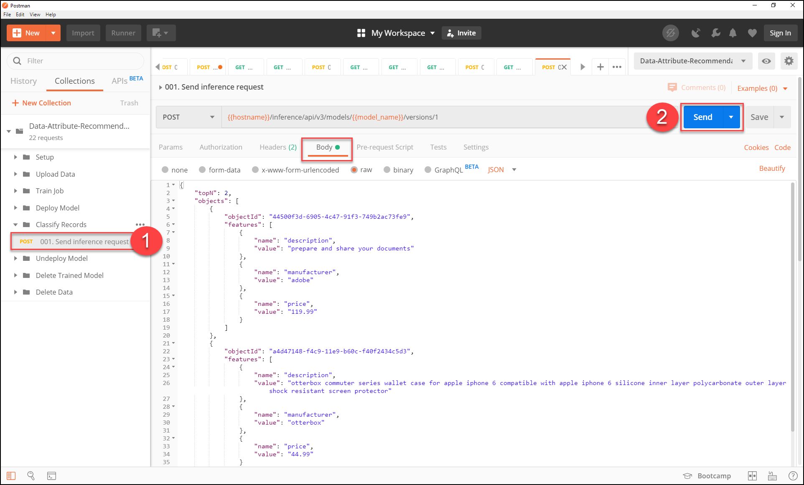
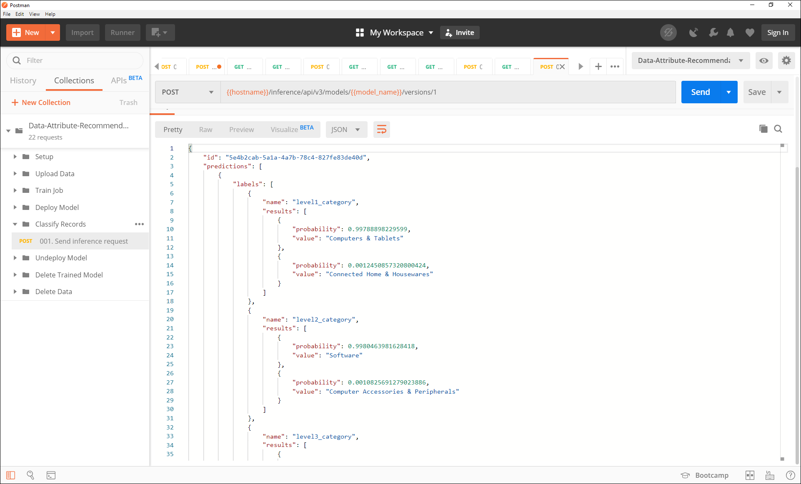
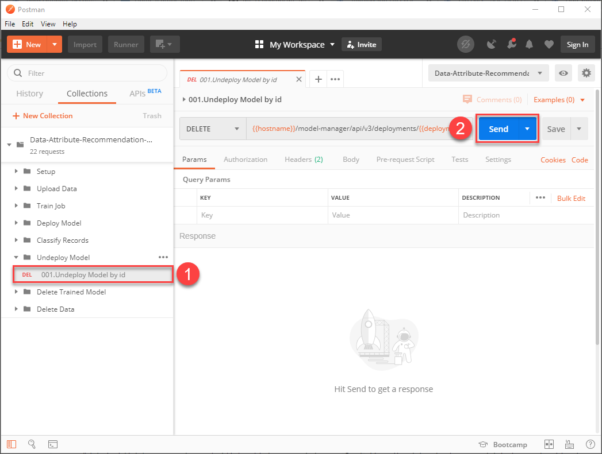
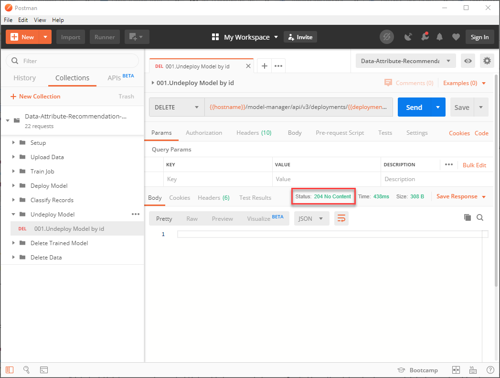
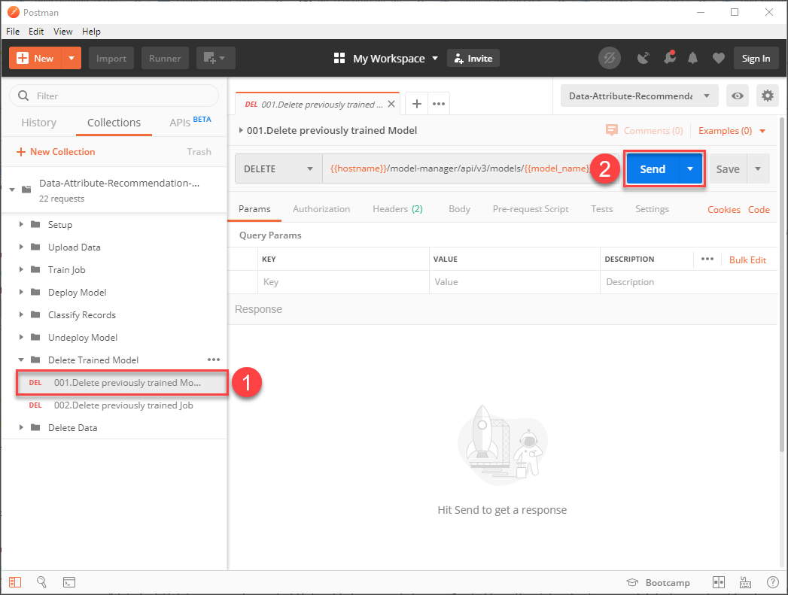
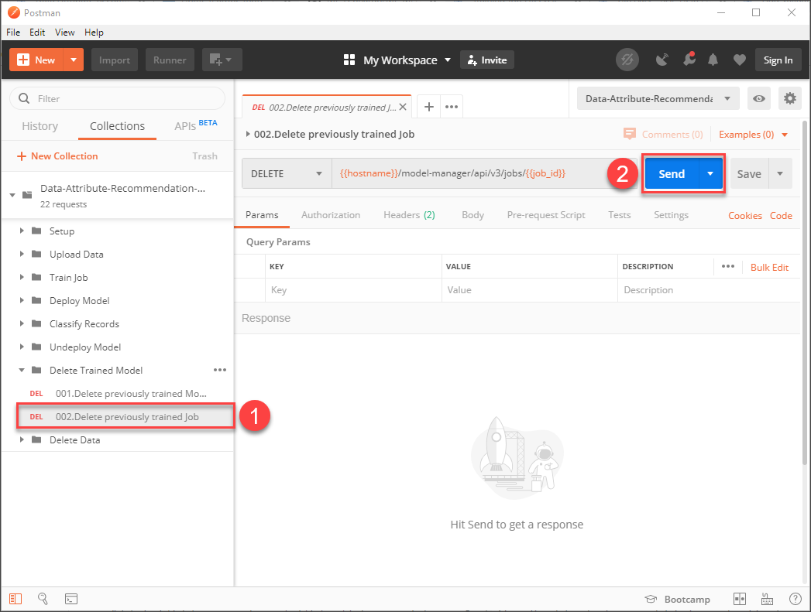
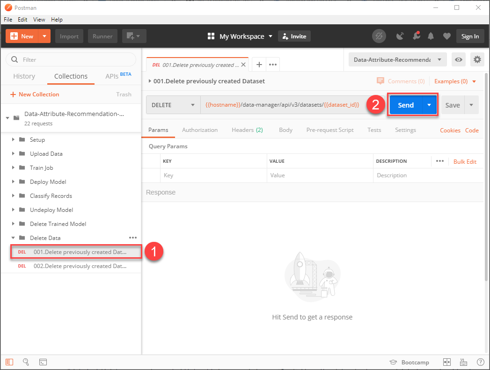
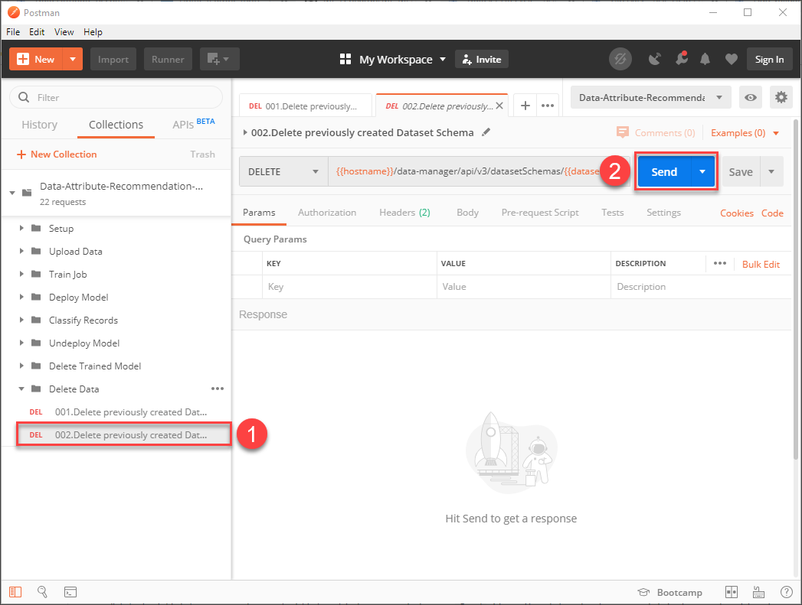

## Details
### You will learn
  - How to classify records using your Data Attribute Recommendation machine learning model
  - How to undeploy and delete your model
  - How to delete datasets and dataset schemas

Based on your deployed machine learning model you can now classify records. For more information, see [Data Attribute Recommendation](https://help.sap.com/dar). For further definition of specific terms, see [Concepts](https://help.sap.com/viewer/105bcfd88921418e8c29b24a7a402ec3/SHIP/en-US/fe501df6d9f94361bfea066f9a6f6712.html).

---

[ACCORDION-BEGIN [Step 1: ](Classify records)]

To classify records, you need to send an inference request to your model.

**Open** Postman and make sure that your `Data Attribute Recommendation environment` is selected.

Expand the subfolder `Classify Records` and select the request `Send inference request`. Click on the `Body` tab to see the sample data that you will send to the service.

The sample data is a list of products and their product information, including `description`, `manufacturer` and `price`. Based on these information three levels of product categories shall be predicted by the service.

Click **Send** to send an inference request to your model.

In the response, you find the predictions of the model. This includes the values that are predicted for each level of product category for each product that was sent to the service along with their probabilities. The probability describes how certain the model is about its prediction. If the probability is close to 1, the model is very certain.

You have successfully classified records using your machine learning model.

[DONE]
[ACCORDION-END]

[ACCORDION-BEGIN [Step 2: ](Undeploy your model)]

Now that you have learned the whole process about how to use Data Attribute Recommendation, it's time to clean up.

First, undeploy your model. For that, expand the subfolder `Undeploy Model` and select the request `Undeploy Model by id`. Click **Send** to undeploy the model.

There is no actual content in the response. Instead you can tell by the http-status whether the operation was successful. If the status says `204 No Content`, the model is successfully undeployed.

You have successfully undeployed your model, but the model is not yet deleted. Instead it is not in production which means that you cannot make inference requests. You can deploy it again at any time.

[DONE]
[ACCORDION-END]

[ACCORDION-BEGIN [Step 3: ](Delete your model)]

Once undeployed, you can delete the model.

For that, expand the subfolder `Delete Trained Model` and select the request `Delete previously trained Model`. Click **Send** to send a deletion request for your model.

As explained in the previous step, you can tell by the `http-status` whether the operation was successful. If the status is `204 No Content`, the model is successfully deleted.

[DONE]
[ACCORDION-END]

[ACCORDION-BEGIN [Step 4: ](Delete your training job)]

Now that the model is deleted, you can delete the training job that created the model.

Select the request `Delete previously trained Job` and click **Send** to delete the job.

Again, the operation was successful if you receive the status `204 No Content`.

[DONE]
[ACCORDION-END]

[ACCORDION-BEGIN [Step 5: ](Delete your dataset)]

To clear the uploaded data, you can now delete the dataset as the associated training job is already deleted.

Expand the subfolder `Delete Data` and select the request `Delete previously created Dataset`. Click **Send** to delete it.

If you receive the status `204 No Content`, you have successfully deleted the dataset.

[DONE]
[ACCORDION-END]

[ACCORDION-BEGIN [Step 6: ](Delete your dataset schema)]

If you do not need your dataset schema anymore, you can delete it as well.

Select the request `Delete previously created Dataset Schema` and click **Send** to delete the schema.

If you receive the status `204 No Content`, you have successfully deleted the dataset schema.

[DONE]
[ACCORDION-END]

[ACCORDION-BEGIN [Step 7:](Test yourself)]

[VALIDATE_1]
[ACCORDION-END]
