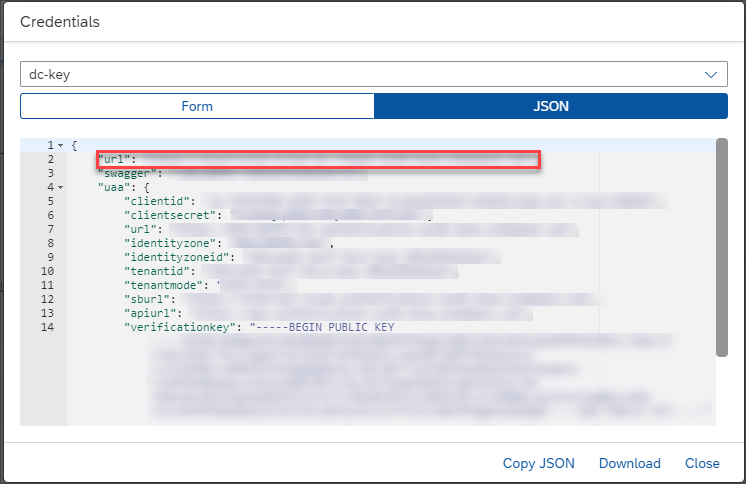
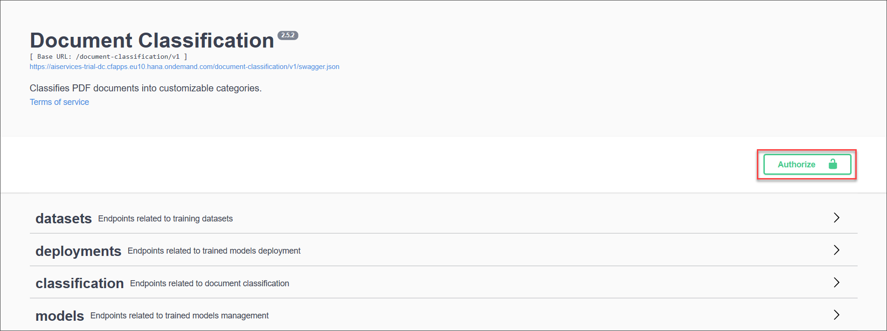
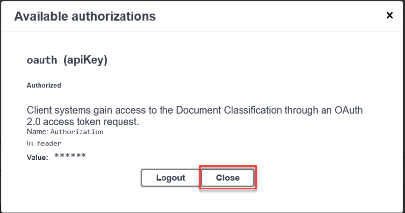
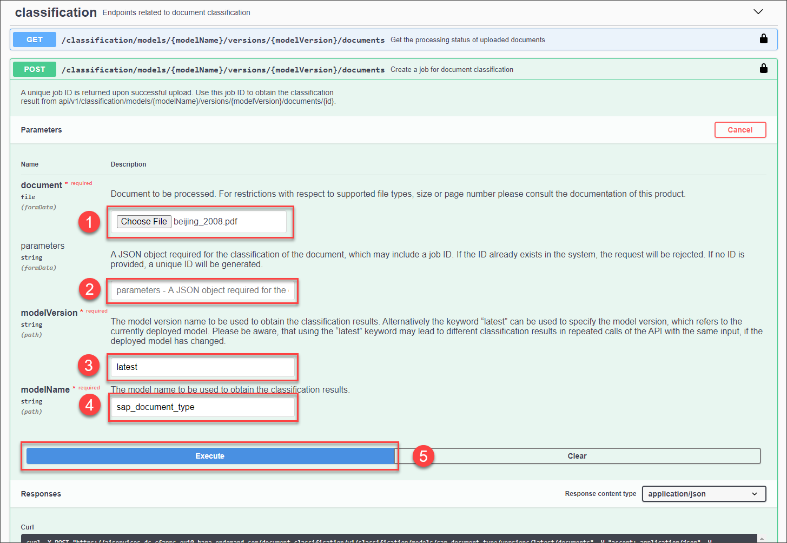
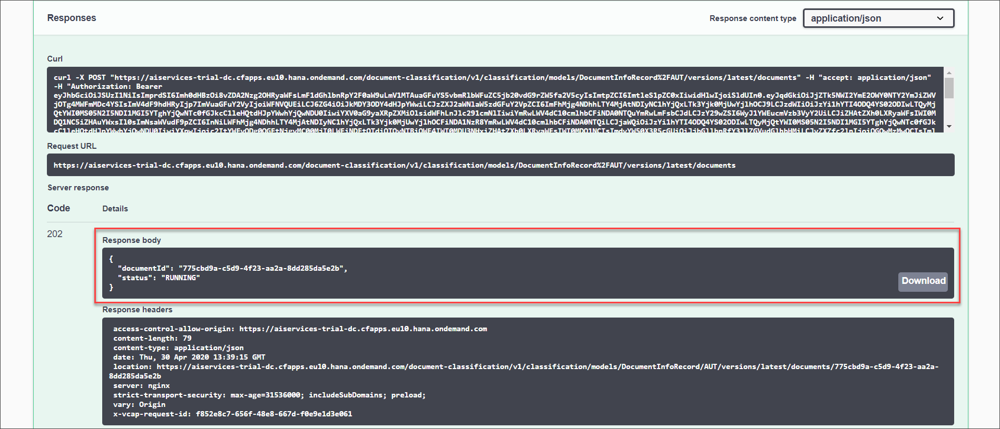
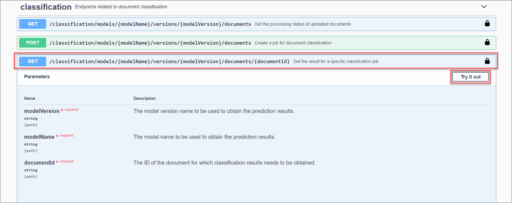
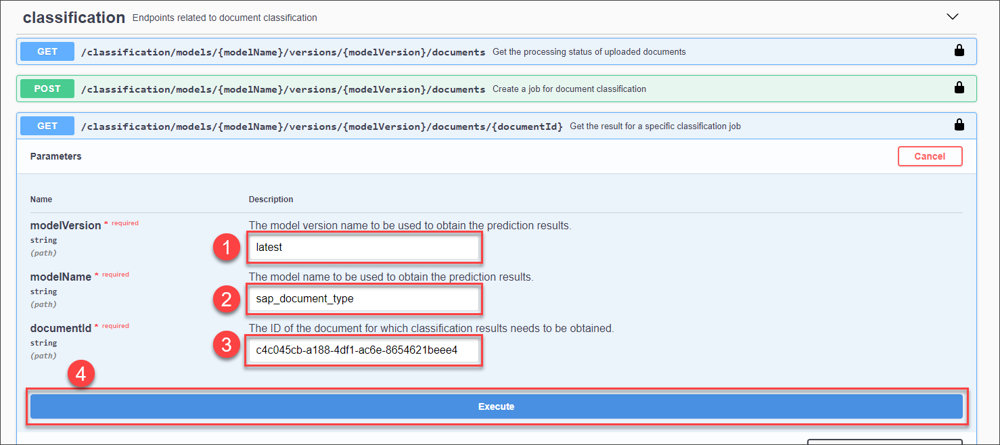
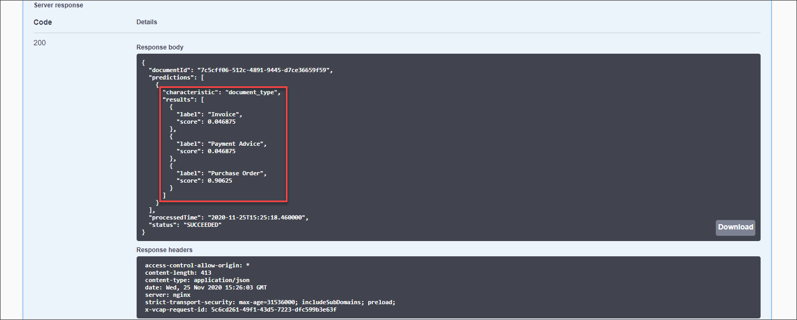

## Details
### You will learn
  - How to call and test Document Classification
  - How to access and use Swagger UI (User Interface)
  - How to classify documents into categories with Document Classification

The core functionality of Document Classification is to automatically classify documents into categories. The categories are not predefined and can be chosen by the user.

In the trial version of Document Classification, however, a predefined and pre-trained machine learning model is made available for all users. Thus, the classification categories cannot be customized. This tutorial gives you an introduction to the service. If you want to try out the Document Classification training endpoints to create your own classification model, you can use an Enterprise Account (see [Trial Accounts](https://help.sap.com/viewer/65de2977205c403bbc107264b8eccf4b/Cloud/en-US/046f127f2a614438b616ccfc575fdb16.html) versus [Enterprise Accounts](https://help.sap.com/viewer/3504ec5ef16548778610c7e89cc0eac3/Cloud/en-US/171511cc425c4e079d0684936486eee6.html)) or a paid SAP Cloud Platform global account.

---

[ACCORDION-BEGIN [Step 1: ](Authorize Swagger UI)]

You will use Swagger UI, via all major web browser, to call the Document Classification APIs. Swagger UI allows developers to effortlessly interact and try out every single operation an API exposes for easy consumption. For more information, see [Swagger UI](https://swagger.io/tools/swagger-ui/).

In the service key you created for Document Classification in the previous tutorial: [Create Service Instance for Document Classification with Trial Account](cp-aibus-dc-service-instance), you should find (outside the `uaa` section of the service key) an entry called `url` (as highlighted in the image below).

1. To access the Document Classification Swagger UI, add **`/document-classification/v1`** to the `url` value, paste it in any web browser and press **Enter**.

    

2. To be able to use the Swagger UI endpoints you need to authorize yourself. In the top right corner, click **Authorize**.

    

3. Copy the `access_token` created in the previous tutorial [Get OAuth Access Token for Document Classification Using Any Web Browser](cp-aibus-dc-web-oauth-token), add **Bearer** in front of it, and enter in the **Value** field.

    ```
    Bearer <access_token>
    ```

    

4. Click **Authorize**, and then click **Close**.

    

[VALIDATE_1]

[ACCORDION-END]


[ACCORDION-BEGIN [Step 2: ](Classify documents)]

In this step, you can upload documents and get the service classification results. Please refer to the [documentation](https://help.sap.com/viewer/ca60cd2ed44f4261a3ae500234c46f37/SHIP/en-US/c66983111a5949af9dfd8fec25cba257.html) about the file formats that are supported by the service.

In the Document Classification trial, there is a pre-trained model available for all users. The model predicts whether a document is an invoice, purchase order or payment advice. Feel free to use and upload any of such documents.

>As an alternative to uploading your own documents to the service, you can use the following sample files (right click on the link, then click ***Save link as*** to download the files locally):

> - [Invoice](https://github.com/SAPDocuments/Tutorials/raw/master/tutorials/cp-aibus-dc-swagger-ui/data/bejing_2008.pdf) ("Beijing Olympics logo" by sha3bi1Beijing)
> - [Payment Advice](https://github.com/SAPDocuments/Tutorials/raw/master/tutorials/cp-aibus-dc-swagger-ui/data/flickr.pdf) ("Logo of Flickr" by `topgold`)
> - [Purchase Order](https://github.com/SAPDocuments/Tutorials/raw/master/tutorials/cp-aibus-dc-swagger-ui/data/guru_shop.pdf) ("Logo Guru Shop" by `Carlo Armanni`)
> - [Other](https://github.com/SAPDocuments/Tutorials/raw/master/tutorials/cp-aibus-dc-swagger-ui/data/twitter.pdf) ("Logo of Twitter" by `topgold`)

>Please note that those files are fake invoices, purchase orders, payment advices and other business documents for demo purposes. Logos were downloaded from search.creativecommons.org, all licensed under CC BY 2.0. Logos were embedded in the documents unaltered. The creators of the logos are denoted in brackets.


In Swagger UI, open the group `classification`. Then click the second endpoint, called `/classification/models/{modelName}/versions/{modelVersion}/documents`. The request is marked by `POST` which indicates that data is sent to the service.

Next, click **Try it out** to try the request.


Once you click the button, several input fields show up:

  1.  In the field `document`, upload the document you want to classify.

  2.  The field `parameters` should be empty. In case the field has any pre-filled content, go ahead and delete it.

  3.  The field `modelVersion` needs to be filled. As machine learning models can have multiple versions, the version of the model needs to be specified with every request. Write `latest` into the field so that the latest version of the model is used.

  4.  The field `modelName` needs to be specified. Enter `DocumentInfoRecord/AUT` to use the model that categorizes products.

  5.  Finally, click **Execute** to send the document to the service.



Once you have executed the request, you will receive a response from the server. To see the response, scroll down a bit until you find the `Response body`.

The response includes the current `status` of the classification process. The status should be `RUNNING`, which indicates that the classification is in process. Additionally, a `documentId` is included in the response. This ID is automatically assigned to the document by the server. Copy or make note of the ID, as you will need it in the next step.



[DONE]
[ACCORDION-END]


[ACCORDION-BEGIN [Step 3: ](See classification results)]

To obtain the results of the classification, a different endpoint has to be used.

Open the third endpoint within the group `classification`, called `/classification/models/{modelName}/versions/{modelVersion}/documents/{documentId}`. The `GET` in front indicates that this time data is requested from the server.

Click **Try it out** to try the request.



Once you click the button, similar input fields, as before, show up:

  1.  Enter `latest` in the field `modelVersion`.
  2.  Enter `DocumentInfoRecord/AUT` in the field `modelName`.
  3.  In the field `documentId`, enter the ID you received in the previous step.

Finally, click **Execute** to request the classification results.



Once you have executed the request, you will receive a response from the server which you find under `Response body`, as in the previous step. This time, the response includes the classification results for every characteristic by which the document is classified.

The only characteristic in this model is `document_type`. The possible types of the characteristic are invoice, payment advice and purchase order. The `label` indicates the type and the associated `score` represents how confident the service is about the prediction - the higher value the more confident the model is.

In the screenshot below, the sample purchase order was used.



Go ahead and upload other documents to see the outcome. Just note that there is a limited amount of documents that you can classify using a trial account. Find the trial account input limits for Document Classification [here](https://help.sap.com/viewer/ca60cd2ed44f4261a3ae500234c46f37/SHIP/en-US/baeb1924c84343158f483d82b21bd6a4.html).

Congratulations, you have now successfully used our machine learning model to classify business documents, namely invoice, payment advices and purchase orders.

[DONE]
[ACCORDION-END]
