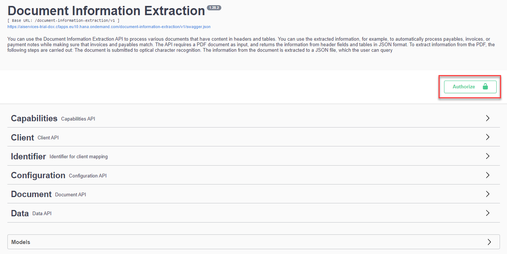
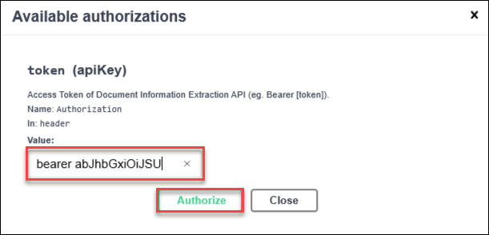
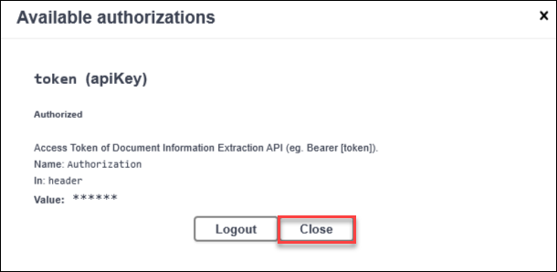
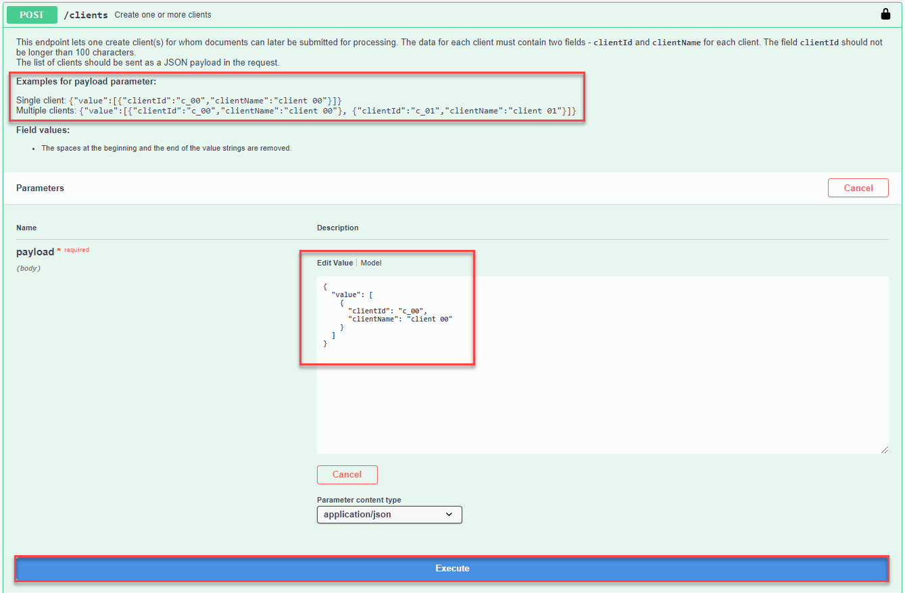
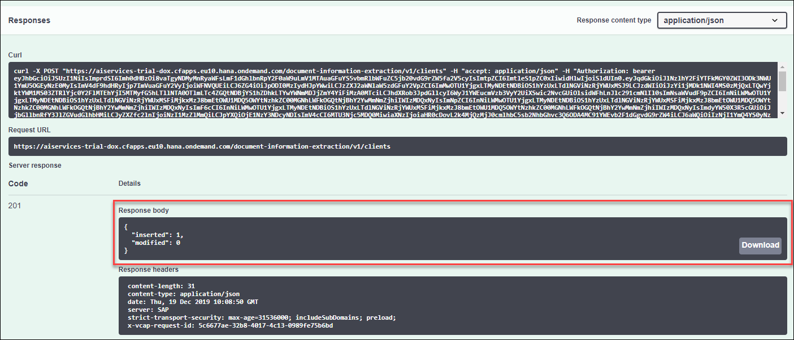
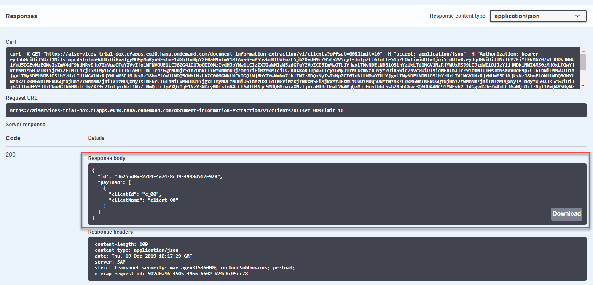
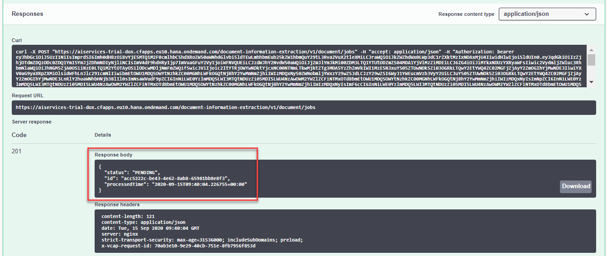
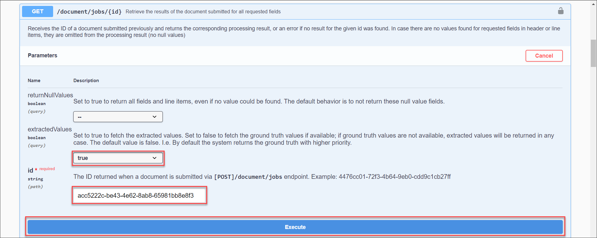
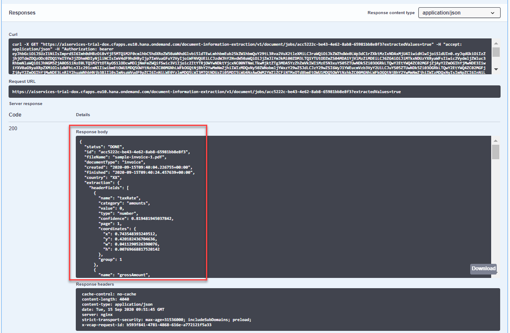
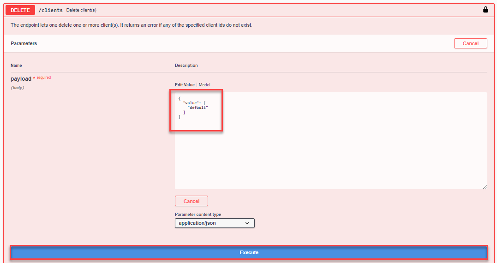

## Details
### You will learn
  - How to call and test Document Information Extraction
  - How to access and use Swagger UI (User Interface)
  - How to extract information from files with Document Information Extraction

The core functionality of Document Information Extraction is to automatically extract structured information from documents using machine learning. When you finish this tutorial, you will get field value predictions for the documents you upload to Document Information Extraction.

---

[ACCORDION-BEGIN [Step 1: ](Authorize Swagger UI)]

You will use Swagger UI, via any web browser, to call the Document Information Extraction APIs. Swagger UI allows developers to effortlessly interact and try out every single operation an API exposes for easy consumption. For more information, see [Swagger UI](https://swagger.io/tools/swagger-ui/).  

In the service key you created for Document Information Extraction in the previous tutorial: [Create Service Instance for Document Information Extraction](cp-aibus-dox-service-instance), you should find (outside the `uaa` section of the service key) an entry called `url` (as highlighted in the image below).

1. To access the Document Information Extraction Swagger UI, add **`/document-information-extraction/v1`** to the `url` value, paste it in any web browser and press **Enter**.

    

2. To be able to use the Swagger UI endpoints you need to authorize yourself. In the top right corner, click **Authorize**.

    

3. Get the `access_token` value created in the previous tutorial: [Get OAuth Access Token for Document Information Extraction Using Any Web Browser](cp-aibus-dox-web-oauth-token), then add **bearer** in front of it, and enter in the **Value** field.

    ```
    bearer <access_token>
    ```

    

4. Click **Authorize**, and then click **Close**.

    

[VALIDATE_1]
[ACCORDION-END]


[ACCORDION-BEGIN [Step 2: ](See list of document fields you can extract)]

Use the **GET /capabilities** endpoint to see a list of document fields you can extract with Document Information Extraction.

Click the endpoint name to expand it, click **Try it out**, and then **Execute**.


You should receive a response like the following:


>If you get an error response code 401 (Unauthorized), your token is probably incorrect. Check if you have added the word **`bearer`** before the token and if the token value is complete and has been properly copied from the **`access_token`** value you received in the previous tutorial: [Get OAuth Access Token for Document Information Extraction via Web Browser](cp-aibus-dox-web-oauth-token).

[DONE]
[ACCORDION-END]


[ACCORDION-BEGIN [Step 3: ](Create client)]

To use Document Information Extraction, you need to create a client. This client is used in most of the endpoints to distinguish and separate data.

You can either create a single client or multiple clients in the **payload** field of the **POST /clients** endpoint. The **`clientId`** values created here will be used in other service endpoints.

1. Expand the **POST /clients** endpoint.

2. Click **Try it out**.

3. Enter your **`clientId`** and **`clientName`** values in the **payload** field in the format you see in **Examples for payload parameter** (`c_00` and `client 00`, for example).

4. Click **Execute**.



You should receive a response like the following:




>**CAUTION:**

>Be aware of the following Document Information Extraction trial account limitations:​

>- Maximum 40 uploaded documents per week​

>- Maximum 1 created `clientId`

>- Maximum 10 created enrichment `dataIds`


[DONE]
[ACCORDION-END]


[ACCORDION-BEGIN [Step 4: ](See created clients)]

To see a list of the clients you have created:

1. Expand the **GET /clients** endpoint.

2. Click **Try it out**.

3. Enter a maximum number of clients to be listed in the **limit** field.

4. Click **Execute**.


You should receive a response like the following:



[DONE]
[ACCORDION-END]


[ACCORDION-BEGIN [Step 5: ](Upload document)]

>Document Information Extraction uses a globally pre-trained machine learning model that currently obtains better accuracy results with invoices and payment advices in English. The team is working to support additional document types and languages in the near future.

Upload to the service any document in PDF format that has content in headers and tables, such as an invoice, using the **POST /document/jobs** endpoint. You need to specify the following:

  - A file.

  - A **`clientId`**.

  - The fields to be extracted. You can find the list of available fields that can be extracted in the response of the **GET /capabilities** endpoint.

Do the following:

1. Expand the **POST /document/jobs** endpoint.

2. Click **Try it out**.

3. Upload a document PDF file.

4. Enter the list of fields to be extracted from the uploaded file (`documentNumber,taxId,purchaseOrder,shippingAmount,subTotalAmount,vendorAddress,vendorName,totalAmount,currencyCode`, for example), a client id or multiple client ids (`c_00`, for example), and the document type (`invoice`, for example).

5. Click **Execute**.

    

After you have clicked **Execute**, you should receive a response like the following:



Copy the **`id`** from the **Response body** to see the result of the extraction in the **GET /document/jobs/{`uuid`}** endpoint.

[DONE]
[ACCORDION-END]


[ACCORDION-BEGIN [Step 6: ](See extracted fields)]

You can now use the **GET /document/jobs/{`uuid`}** endpoint to receive the prediction.

1. Expand the **GET /document/jobs/{`uuid`}** endpoint.

2. Click **Try it out**.

3. Set **`extractedValues`** to `true` to get the extracted values.

4. Enter the **`clientId`** you used in the previous step (`c_00`, for example).

5. Enter the **`id`** received in the **POST /document/jobs** endpoint as the **`uuid`**.

6. Click **Execute**.

    

You should receive a response like the following:



In the response, you will find some general information about the document you uploaded. In the `headerFields`, such as `documentType` and `fieldName`, you will find the prediction for the extracted fields. If the status of the document (indicated by the **status** field) is **PENDING** instead of **DONE**, then it means that the service is still extracting some fields and the returned JSON file does not yet contain all the requested fields.

You have now successfully used our machine learning model to get field value predictions for the document you uploaded to Document Information Extraction.

[DONE]
[ACCORDION-END]


[ACCORDION-BEGIN [Step 7: ](Delete client)]

If you want to delete a client you created in Step 3, use the **DELETE /clients** endpoint.

1. Expand the **DELETE /clients** endpoint.

2. Click **Try it out**.

3. Enter in the **payload** field the client id or multiple client ids (`c_00`, for example) you want to delete.

4. Click **Execute**.



You should receive a response like the following:


Congratulations, you have completed this tutorial.

[DONE]
[ACCORDION-END]
