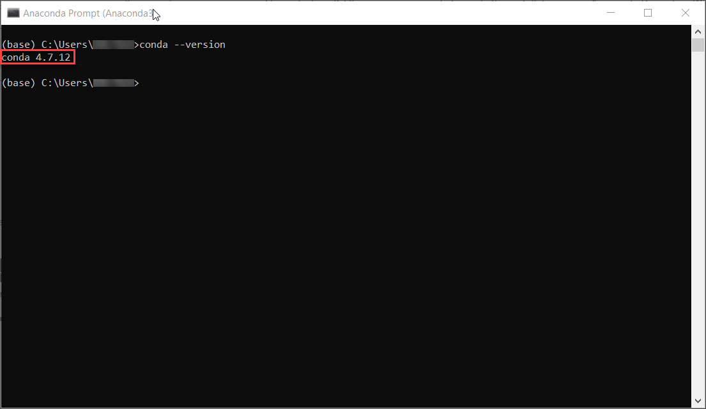
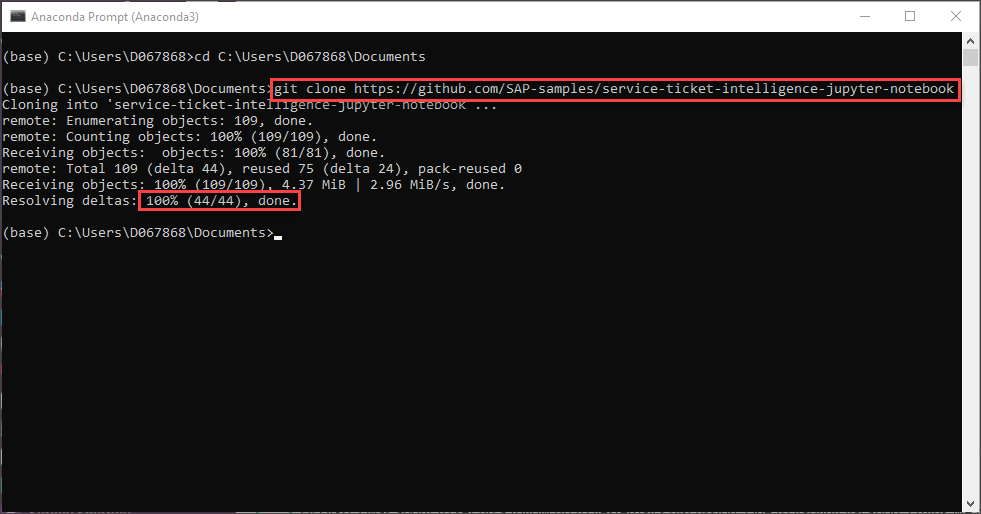
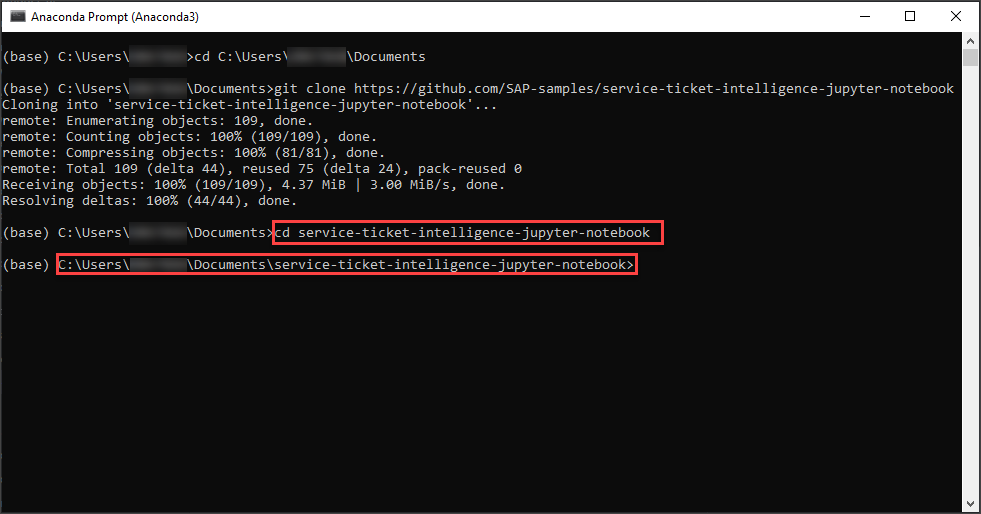
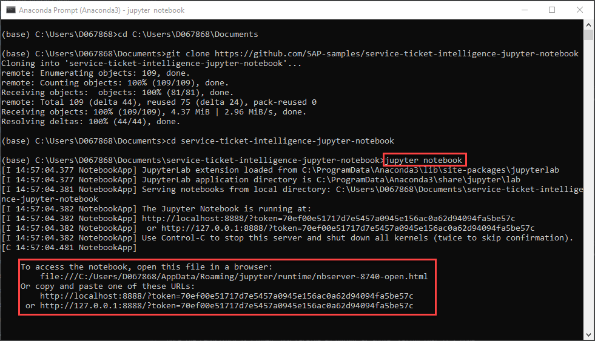

## Details
### You will learn
  - How to install Python and Anaconda
  - How to set up a local Jupyter server to run Jupyter notebooks

A Jupyter Notebook is used in the following tutorials to make the steps interactive and easy to follow. For more information on Jupyter Notebooks, see [Jupyter](https://jupyter.org/). The notebooks and datasets used for this tutorial mission are available in this [repository](https://github.com/SAP-samples/service-ticket-intelligence-jupyter-notebook-sample).

---

[ACCORDION-BEGIN [Step 1: ](Install Anaconda)]

First, you need to install Anaconda. Anaconda is a platform that offers tools to process large datasets and is often used by data scientists. When installing Anaconda, the programming language Python is installed as well.

To install Anaconda, head over to the [Anaconda installation guide](https://docs.anaconda.com/anaconda/install/) and look for your operating system. Once there, follow the installation guide.

[OPTION BEGIN [Windows]]

To verify the installation, search for `Anaconda Prompt` in your programs and open it. In the command prompt, enter `conda --version` and the version is printed as in the image below. 

[OPTION END]

[OPTION BEGIN [Mac and Linux]]

To verify the installation, open a new Terminal or Command Prompt. In the command prompt, enter `conda --version` and the version is printed as in the image below.

[OPTION END]



You have successfully installed Anaconda.

[DONE]
[ACCORDION-END]

[ACCORDION-BEGIN [Step 2: ](Clone the repository)]

All you will need throughout the tutorial is within this [repository](https://github.com/SAP-samples/service-ticket-intelligence-jupyter-notebook-sample) on GitHub. It includes two Jupyter notebooks, one for each of the use cases of Service Ticket Intelligence, as well as some dataset that can be used. In the following, you will clones this repository to your local computer.

[OPTION BEGIN [Windows]]

Open the `Anaconda Prompt` again in case you have closed it. Navigate into the folder where the repository should be placed using the command `cd <path>` or stay where you are. Then, enter the following command to clone the repository:
```shell
git clone https://github.com/SAP-samples/service-ticket-intelligence-jupyter-notebook-sample
```

[OPTION END]

[OPTION BEGIN [Mac and Linux]]

Open a Terminal or Command Prompt again in case you have closed it. Navigate into the folder where the repository should be placed using the command `cd <path>` or stay where you are. Then, enter the following command to clone the repository:
```shell
git clone https://github.com/SAP-samples/service-ticket-intelligence-jupyter-notebook-sample
```

[OPTION END]



Once the repository is cloned, you receive an output as above, saying that it's done.

[DONE]
[ACCORDION-END]

[ACCORDION-BEGIN [Step 3: ](Configure service credentials)]

Next, you need to configure the notebooks to use the service key that you obtained in [Set Up Account for Service Ticket Intelligence and Get Service Key](cp-aibus-sti-booster-key).

Open a file explorer and navigate to the folder called `service-ticket-intelligence-jupyter-notebook-sample` that was just created. Open the file called `sti_config.ini` in a simple text editor.


Then, insert the following values from your service key into the corresponding spaces of the template. Make sure to copy only the values, without the surrounding quotes.

|  Service key property                                             | Property in template
|  :----------------------------------------------------------------| :--------------------
|  `sti_service_url` (outside the `uaa` section of the service key) | `service_url`
|  `url` (inside the `uaa` section of the service key)              | `uaa_url`
|  `clientid`                                                       | `client_id`
|  `clientsecret`                                                   | `client_secret`

Finally, save the file.

[DONE]
[ACCORDION-END]

[ACCORDION-BEGIN [Step 4: ](Start Jupyter server)]

To use the Jupyter notebooks, you must have a local instance of the Jupyter server running.

Stay in the Anaconda Prompt (Windows) or the Terminal (Mac and Linux) and navigate into the new folder that was created while cloning the repository by using the command `cd service-ticket-intelligence-jupyter-notebook-sample`. You then move into the folder and your current path will change accordingly.



Next, enter the command `jupyter notebook` to start the server.



Once the server started, the site automatically opens in browser. In case it does not, you can use the URLs that were printed in the command prompt.

With that, you are done with setup and can proceed with the following tutorials.

[DONE]
[ACCORDION-END]

[ACCORDION-BEGIN [Step 5: ](Test yourself)]

[VALIDATE_1]
[ACCORDION-END]
