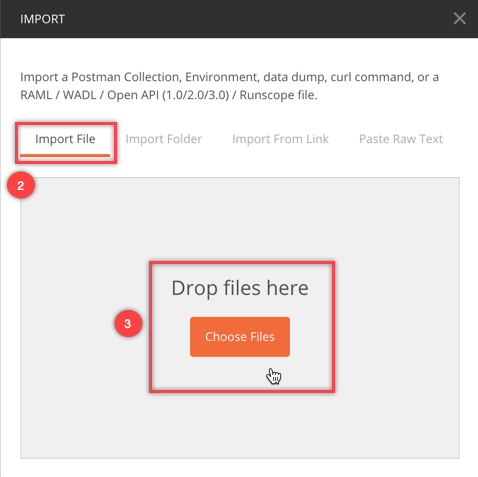
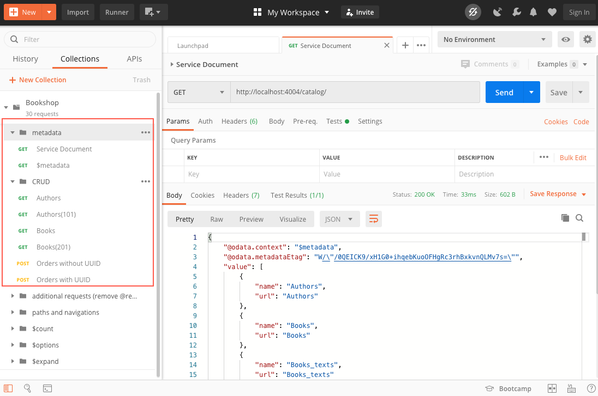
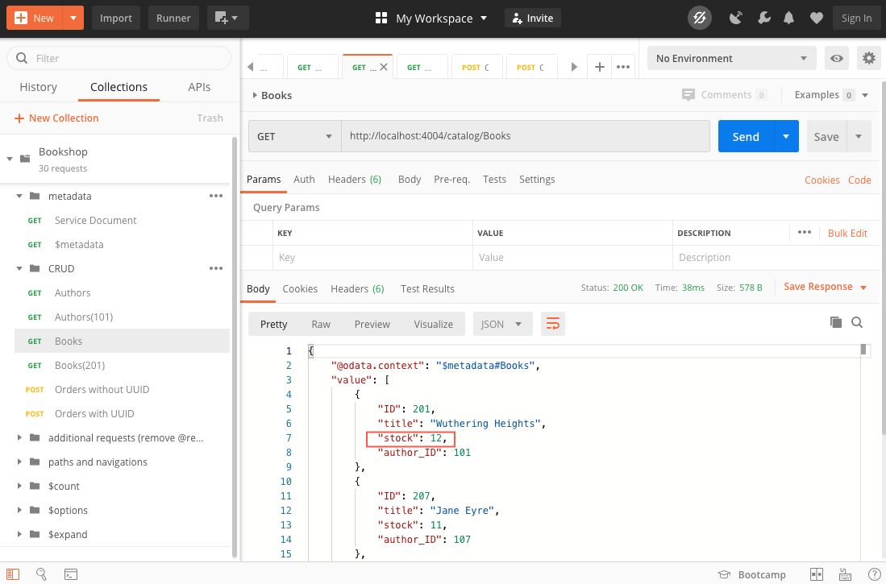

## Prerequisites
- You've installed [Node.js](https://nodejs.org/en/). Use latest long-term support (LTS) version. In case of problems, see the [Troubleshooting guide](https://cap.cloud.sap/docs/advanced/troubleshooting#npm-installation) for CAP.
- You've installed the latest version of [Visual Studio Code](https://code.visualstudio.com/).
- (For Windows users only) You've installed the [SQLite](https://sqlite.org/download.html) tools for Windows. Find the steps how to install it in the Troubleshooting guide in section [How Do I Install SQLite](https://cap.cloud.sap/docs/advanced/troubleshooting#sqlite) in the CAP documentation.
- You've installed [Postman application](https://www.getpostman.com/) or any other HTTP client.

## Details
### You will learn
  - How to develop a sample business service using CAP and `Node.js`
  - How to define a simple data model and a service that exposes the entities you created in your data model
  - How to run your service locally
  - How to deploy the data model to an `SQLite` database
  - How to add custom handlers to serve requests that aren't handled automatically

---

[ACCORDION-BEGIN [Step 1: ](Set up local development environment)]

Before you start, make sure that you've completed the prerequisites.

1. Set the NPM registry for `@sap` packages by executing the following command in a command line window:

    ```Shell/Bash
    npm set @sap:registry=https://npm.sap.com
    ```

2. Install the `cds` development kit globally by executing the following command:

    ```Shell/Bash
    npm i -g @sap/cds-dk
    ```

    >This process takes some minutes installing the `cds` command, which you will use in the next steps.

    >On MacOS/Linux, you may need to follow the steps as described [here](https://docs.npmjs.com/resolving-eacces-permissions-errors-when-installing-packages-globally).

    >If there's an older `@sap/cds` package already installed on the machine, you may have to remove it first; if so, you'll be instructed to do so.

    >In case of problems, see the [Troubleshooting guide](https://cap.cloud.sap/docs/advanced/troubleshooting#npm-installation) for CAP.

3. To verify that the installation was successful, run `cds` without arguments:

    ```Shell/Bash
    cds
    ```

    

    >This lists the available `cds` commands.  For example, use `cds version` to check the version that you've installed. To know what is the latest version, see the [Release Notes](https://cap.cloud.sap/docs/releases/) for CAP.

[DONE]

[ACCORDION-END]

[ACCORDION-BEGIN [Step 2: ](Install Visual Studio Code extension)]

1. Go to [SAP Development Tools](https://tools.hana.ondemand.com/#cloud-vscodecds) and download the `vsix` file for CDS Language Support for Visual Studio Code.

2. Open Visual Studio Code. Choose **View** > **Extensions** > **Install from VSIX...** and and install the extension by choosing the `vsix` file you have downloaded before:

    

    &nbsp;

    


    >If you see a compatibility error, make sure that you have the latest version of Visual Studio Code.

[DONE]

[ACCORDION-END]

[ACCORDION-BEGIN [Step 3: ](Start project)]

[OPTION BEGIN [Windows]]

With your installed CDS command line tool, you can now create a new CAP-based project, in the form of a new directory with various things preconfigured.

1. Open a command line window and run the following command in a folder of your choice to create the project:

    ```Shell/Bash
    cds init my-bookshop
    ```

    >This creates a folder `my-bookshop` in the current directory.

2. Open Visual Studio Code, go to **File** > **Open Folder** and choose the **`my-bookshop`** folder.

3. Go to **Terminal** > **New Terminal** to open a command line window within Visual Studio Code and run the following command in the root level of your project:

    ```Shell/Bash
    npm install
    ```

4. In the command line window run the following:

    ```Shell/Bash
      cds watch
    ```

    >This command tries to start a `cds` server. Whenever you feed your project with new content, for example, by adding or modifying `.cds`, `.json`, or `.js` files, the server automatically restarts to serve the new content. As there's no content in the project so far, it just keeps waiting for content with a message as shown below:

    ```
    [cds] - running nodemon...
    --ext cds,csn,csv,ts,mjs,cjs,js,json,properties,edmx,xml

        No models found at db/,srv/,app/,schema,services.
        Waiting for some to arrive...
    ```

[OPTION END]

[OPTION BEGIN [MacOS and Linux]]

1. Open a command line window and run the following command in a folder of your choice to create the project:

    ```Shell/Bash
    cds init my-bookshop
    ```

    >This creates a folder `my-bookshop` in the current directory.

2. Open Visual Studio Code, go to **File** > **Open** and choose the **`my-bookshop`** folder.

3. Go to **View** > **Command Palette** > **Terminal: Create New Integrated Terminal** to open a command line window within Visual Studio Code and run the following command in the root level of your project:

    ```Shell/Bash
    npm install
    ```
4. In the command line window run the following:

    ```Shell/Bash
      cds watch
    ```
    >This command tries to start a `cds` server process. As there's no content in the project so far, it just keeps waiting for content with a message as shown below:

    ```
    [cds] - running nodemon...
    --ext cds,csn,csv,ts,mjs,cjs,js,json,properties,edmx,xml

        No models found at db/,srv/,app/,schema,services.
        Waiting for some to arrive...
    ```

[OPTION END]

[DONE]

[ACCORDION-END]

[ACCORDION-BEGIN [Step 4: ](Define your first service)]

After initializing the project, you should see the following empty folders:

- `app`: for UI artifacts
- `db`: for the database level schema model
- `srv`: for the service definition layer


1. Let's feed it by adding a simple domain model. In the **`srv`** folder choose the **New File** icon in Visual Studio Code and create a new file called `cat-service.cds`.

2. Add the following code to the file `cat-service.cds`:

    ```CDS
    using { Country, managed } from '@sap/cds/common';

    service CatalogService {

      entity Books {
        key ID : Integer;
        title  : localized String;
        author : Association to Authors;
        stock  : Integer;
      }

      entity Authors {
        key ID : Integer;
        name   : String;
        books  : Association to many Books on books.author = $self;
      }

      entity Orders : managed {
        key ID  : UUID;
        book    : Association to Books;
        country : Country;
        amount  : Integer;
      }

    }
    ```

    >Remember to save your files (keyboard shortcut **CTRL+S**).

3. As soon as you've saved your file, the still running `cds watch` reacts immediately with some new output as shown below:

    ```
    [cds] - connect to db { database: ':memory:' }
    /> successfully deployed to sqlite in-memory db

    [cds] - serving CatalogService { at: '/catalog' }

    [cds] - launched in: 696.753ms
    [cds] - server listening on { url: 'http://localhost:4004' }
    [ terminate with ^C ]
    ```
    >This means, `cds watch` detected the changes in `srv/cat-service.cds` and automatically bootstrapped an in-memory SQLite database when restarting the server process.

4. To test your service, go to: <http://localhost:4004>

    >You won't see data, because you haven't added a data model yet. However, click on the available links to see the service is running.

[DONE]

[ACCORDION-END]

[ACCORDION-BEGIN [Step 5: ](Provide mock data)]

Add service provider logic to return mock data.

1. In the **`srv`** folder, create a new file called `cat-service.js`.

2. Add the following code to the file `cat-service.js`:

    ```JavaScript
    module.exports = (srv) => {

     // Reply mock data for Books...
     srv.on ('READ', 'Books', ()=>[
       { ID:201, title:'Wuthering Heights', author_ID:101, stock:12 },
       { ID:251, title:'The Raven', author_ID:150, stock:333 },
       { ID:252, title:'Eleonora', author_ID:150, stock:555 },
       { ID:271, title:'Catweazle', author_ID:170, stock:222 },
     ])

     // Reply mock data for Authors...
     srv.on ('READ', 'Authors', ()=>[
       { ID:101, name:'Emily Brontë' },
       { ID:150, name:'Edgar Allen Poe' },
       { ID:170, name:'Richard Carpenter' },
     ])

    }
    ```

    >Remember to save your files.

3. To test your service, click on these links:

    - <http://localhost:4004/catalog/Books>

    - <http://localhost:4004/catalog/Authors>

    >You should see the mock data that you've added for the `Books` and `Authors` entities.

[DONE]

[ACCORDION-END]

[ACCORDION-BEGIN [Step 6: ](Add data model and adapt service definition)]

To get started quickly, you've already added a simplistic all-in-one service definition. However, you would usually put normalized entity definitions into a separate data model and have your services expose potentially de-normalized views on those entities.

1. In the **`db`** folder choose the **New File** icon in Visual Studio Code and create a new file called `data-model.cds`.

2. Add the following code to the file `data-model.cds`:

    ```CDS
    namespace my.bookshop;
    using { Country, managed } from '@sap/cds/common';

    entity Books {
      key ID : Integer;
      title  : localized String;
      author : Association to Authors;
      stock  : Integer;
    }

    entity Authors {
      key ID : Integer;
      name   : String;
      books  : Association to many Books on books.author = $self;
    }

    entity Orders : managed {
      key ID  : UUID;
      book    : Association to Books;
      country : Country;
      amount  : Integer;
    }
    ```

3. Open the file `cat-service.cds` and replace the existing code with:

    ```CDS
    using my.bookshop as my from '../db/data-model';

    service CatalogService {
      entity Books @readonly as projection on my.Books;
      entity Authors @readonly as projection on my.Authors;
      entity Orders @insertonly as projection on my.Orders;
    }
    ```

    >Remember to save your files.

[DONE]

[ACCORDION-END]

[ACCORDION-BEGIN [Step 7: ](Add initial data)]

In Visual Studio Code you will add plain CSV files in folder `db/csv` to fill your database tables with initial data.

1. In the `db` folder, choose **New File** and enter `csv/my.bookshop-Authors.csv` to create a new folder `csv` with the file named `csv/my.bookshop-Authors.csv`. Add the following to the file:

    ```CSV
    ID;name
    101;Emily Brontë
    107;Charlote Brontë
    150;Edgar Allen Poe
    170;Richard Carpenter
    ```

2. In the newly created `csv` folder, choose **New File** and create a file called `my.bookshop-Books.csv`. Add the following to the file:

    ```CSV
    ID;title;author_ID;stock
    201;Wuthering Heights;101;12
    207;Jane Eyre;107;11
    251;The Raven;150;333
    252;Eleonora;150;555
    271;Catweazle;170;22
    ```
    >Remember to save your files.

    >Make sure that you now have a folder hierarchy `db/csv/...`. Remember that the `csv` files must be named like the entities in your data model and must be located inside the `db/csv` folder.

    >After you added these files, `cds watch`restarts the server with an output, telling that the files have been detected and their content been loaded into the database automatically:
    ```
    [cds] - connect to sqlite db { database: ':memory:' }
     > filling my.bookshop.Authors from db/csv/my.bookshop-Authors.csv
     > filling my.bookshop.Books from db/csv/my.bookshop-Books.csv
    /> successfully deployed to sqlite in-memory db
    [cds] - serving CatalogService { at: '/catalog', impl: 'srv/cat-service.js' }
    [cds] - launched in: 751.073ms
    [cds] - server listening on { url: 'http://localhost:4004' }
    [ terminate with ^C ]
    ```

3. Remove the code with mock data in `cat-service.js`, because you want to see the data loaded from the `csv` files.

4. To test your service, open a web browser and go to:

    <http://localhost:4004/catalog/Books>

    <http://localhost:4004/catalog/Authors>

    >As you now have a fully capable SQL database with some initial data, you can send complex OData queries, served by the built-in generic providers.

    <http://localhost:4004/catalog/Authors?$expand=books($select=ID,title)>

    >You should see a book titled Jane Eyre. If not, make sure you've removed the mock data from `cat-service.js`.

[DONE]

[ACCORDION-END]

[ACCORDION-BEGIN [Step 8: ](Add persistent database)]

Before you continue, make sure that you've completed the prerequisites and installed SQLite (for Windows users only).

Instead of using in-memory, you can also use persistent databases.

1. If `cds watch` is running, press **CTRL+C** in the command line to stop the service.

2. Install `SQLite3` packages.

    ```Shell/Bash
    npm i sqlite3 -D
    ```

3. Deploy the data model to an `SQLite` database:

    ```Shell/Bash
    cds deploy --to sqlite:db/my-bookshop.db
    ```

    >You've now created an `SQLite` database file under `db/my-bookshop.db`.

    >This configuration is saved in your `package.json` as your default data source. For subsequent deployments using the default configuration, you just need to run `cds deploy`.
    The difference to the automatically provided in-memory database is that you now get a persistent database stored in the local file.

4. Open `SQLite` and view the newly created database:

    ```Shell/Bash
    sqlite3 db/my-bookshop.db -cmd .dump
    ```

    >If this doesn't work, check if you have [SQLite](https://sqlite.org/download.html) installed. On Windows, you might need to enter the full path to SQLite, for example: `C:\sqlite\sqlite3 db/my-bookshop.db -cmd .dump`.

5. To stop `SQLite` and go back to your project directory, press **CTRL+C**.

6. Run your service.

    ```Shell/Bash
    cds watch
    ```

    ```
    [cds] - using bindings from: { registry: '~/.cds-services.json' }
    [cds] - connect to sqlite db { database: 'db/my-bookshop.db' }
    [cds] - serving CatalogService { at: '/catalog', impl: 'srv/cat-service.js' }

    [cds] - launched in: 610.318ms
    [cds] - server listening on { url: 'http://localhost:4004' }
    [ terminate with ^C ]
    ```

[DONE]

[ACCORDION-END]

[ACCORDION-BEGIN [Step 9: ](Test generic handlers with Postman)]

You can now see the generic handlers shipped with CAP in action.

1. Open the Postman application.

    >You can use any other HTTP client than Postman.


2. Click on the following link and save the file to a folder of your choice: ['postman.json'](https://raw.githubusercontent.com/SAPDocuments/Tutorials/master/tutorials/cp-apm-nodejs-create-service/postman.json).

3. In the Postman app, use the **Import** button in the toolbar:

    

4. Choose **Import File** in the wizard. Click on **Choose Files** and select the file that you've saved before.

    

5. In the imported collection, execute the various requests in the `metadata` and `CRUD` groups. They should all return proper responses.

    

    > With your current service implementation, you can get only `POST` orders. Any `GET` or `DELETE` to an order fails, since you've specified the `Orders` entity to be `@insertonly` in `srv/cat-service.cds`.

[VALIDATE_1]

[ACCORDION-END]

[ACCORDION-BEGIN [Step 10: ](Add custom logic)]

1. In Visual Studio Code open the file `cat-service.js` and replace the existing code with::

    ```JavaScript
      module.exports = (srv) => {

      const {Books} = cds.entities ('my.bookshop')

      // Reduce stock of ordered books
      srv.before ('CREATE', 'Orders', async (req) => {
        const order = req.data
        if (!order.amount || order.amount <= 0)  return req.error (400, 'Order at least 1 book')
        const tx = cds.transaction(req)
        const affectedRows = await tx.run (
          UPDATE (Books)
            .set   ({ stock: {'-=': order.amount}})
            .where ({ stock: {'>=': order.amount},/*and*/ ID: order.book_ID})
        )
        if (affectedRows === 0)  req.error (409, "Sold out, sorry")
      })

      // Add some discount for overstocked books
      srv.after ('READ', 'Books', each => {
        if (each.stock > 111)  each.title += ' -- 11% discount!'
      })

    }
    ```
    >Remember to save your files.

    >Whenever orders are created, this code is triggered. It updates the book stock by the given amount, unless there aren't enough books left.

2. In Postman, execute the `GET Books` request.

    >Look at the stock of book `201`.

    

3. Execute one of the `POST Orders` requests.

    >This triggers the logic above and reduce the stock.

4. Execute the `GET Books` request again.

    >The stock of book `201` is lower than before.

[DONE]

[ACCORDION-END]

<p style="text-align: center;">Give us 55 seconds of your time to help us improve</p>

<p style="text-align: center;"><a href="https://sapinsights.eu.qualtrics.com/jfe/form/SV_0im30RgTkbEEHMV?TutorialID=cp-apm-nodejs-create-service" target="_blank"></a></p>
