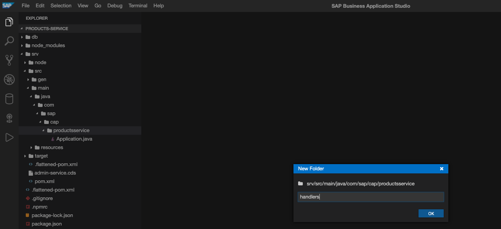
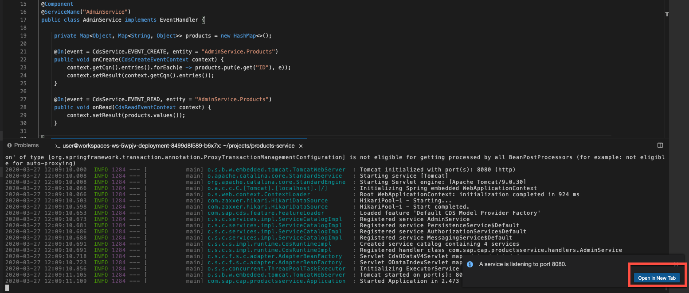
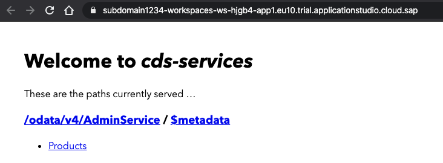
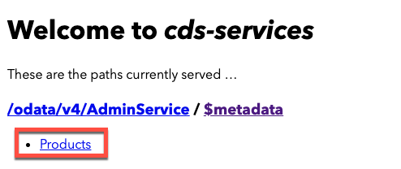

## Details
### You will learn
  - How to write a custom event handler for CAP Java
  - Which event handler classes and methods are available

In the following tutorials, you'll learn that the CAP Java runtime can handle all CRUD events (create, read, update, and delete) triggered by OData requests out of the box. For now, we'll show you how to do this manually, so that you can see how to easily write a custom event handler to extend the event handling process.

---

[ACCORDION-BEGIN [Step 1: ](Create Java class for custom event handler)]

1. Create the Java package, by creating a new folder called `handlers` under `srv/src/main/java/com/sap/cap/productsservice`.

    !

2. Create the Java class file `AdminService.java` in the created `handlers` folder, with the following content and make sure you **Save** the file:

```Java
 package com.sap.cap.productsservice.handlers;

 import java.util.HashMap;
 import java.util.Map;

 import org.springframework.stereotype.Component;

 import com.sap.cds.services.cds.CdsCreateEventContext;
 import com.sap.cds.services.cds.CdsReadEventContext;
 import com.sap.cds.services.cds.CdsService;
 import com.sap.cds.services.handler.EventHandler;
 import com.sap.cds.services.handler.annotations.On;
 import com.sap.cds.services.handler.annotations.ServiceName;

 @Component
 @ServiceName("AdminService")
 public class AdminService implements EventHandler {

     private Map<Object, Map<String, Object>> products = new HashMap<>();

     @On(event = CdsService.EVENT_CREATE, entity = "AdminService.Products")
     public void onCreate(CdsCreateEventContext context) {
         context.getCqn().entries().forEach(e -> products.put(e.get("ID"), e));
         context.setResult(context.getCqn().entries());
     }

     @On(event = CdsService.EVENT_READ, entity = "AdminService.Products")
     public void onRead(CdsReadEventContext context) {
         context.setResult(products.values());
     }

 }
```

This class now handles the `READ` and `CREATE` events that target the `Products` entity of the `AdminService`.

  - The `READ` operation just returns all entities kept in memory.

  - The `CREATE` event extracts the payload from the CQN representation and stores it in memory.

[CDS Query Notation](https://cap.cloud.sap/docs/cds/cqn) (CQN) is the common language in CAP to run queries against services. It can be used to talk to the services defined by your model, but also remote services, such as the database.

The event handler uses the following APIs, which are available for service providers in CAP Java:

* [Event handler classes](https://cap.cloud.sap/docs/java/srv-impl#event-handler-classes) have to implement the marker interface `EventHandler` and register themselves as Spring Beans (`@Component`). The marker interface is important, because it enables the CAP Java runtime to identify these classes among all Spring Beans.
* [Event handler methods](https://cap.cloud.sap/docs/java/srv-impl#event-handler-methods) are registered with `@On`, `@Before`, or `@After` annotations. Every event, such as an entity creation, runs through these three [phases](https://cap.cloud.sap/docs/java/srv-impl#event-phases). Each phase has a slightly different semantic. You'll learn more about these semantics in the subsequent tutorial.
* The annotation `@ServiceName` specifies the default service name all event handler methods apply to. Here this is `AdminService`, as this was also the name when defining the service in the CDS model.
* Event handler methods get an event-specific event context parameter, which provides access to the input parameters of the event and the ability to set the result. For example, let's look at the `CdsCreateEventContext context` parameter. The event we're extending is the `CREATE` event. The type of the context variable is specific to this extended `CREATE` event. The `onCreate` method returns `void`, as the result is set by running: `context.setResult(…)`.

[VALIDATE_1]
[ACCORDION-END]

[ACCORDION-BEGIN [Step 2: ](Stop the application)]

Stop your application if it's still running by using **`CTRL+C`** in the terminal.

[DONE]
[ACCORDION-END]


[ACCORDION-BEGIN [Step 3: ](Restart the application)]

1. Restart the application by running the following command in the terminal:

    ```Shell/Bash
    cd ~/projects/products-service && mvn clean spring-boot:run
    ```

2. Choose **Open in New Tab** when prompted.

    !

    A new Browser tab should be opened with your application.

    !

[DONE]
[ACCORDION-END]

[ACCORDION-BEGIN [Step 4: ](Insert data through cURL)]

Try to insert some data into the running application. For example, use cURL from a new terminal to run the following request.

1. You can open terminals by choosing **Terminal** > **New Terminal** from the main menu.

2. Execute the following command in the terminal to insert some data into the running application (while the process for the application is still running in the other terminal window):

    ```Shell/Bash
    curl -X POST http://localhost:8080/odata/v4/AdminService/Products \
    -H "Content-Type: application/json" \
    -d '{"ID": 42, "title": "My Tutorial Product", "descr": "You are doing an awesome job!"}'
    ```

The POST request causes an [OData Insert](https://www.odata.org/getting-started/basic-tutorial/#create) on the entity **Products** of the service **`AdminService`**. The properties of the record to be created are passed in the body of the request (`-d` argument in the curl command) as [JSON](https://www.json.org/json-en.html) (argument `-H Content-Type: application/json` in the curl command).

The response will be the created record and should look similar to this output:
```JSON
`{"@context":"$metadata#Products/$entity","ID":42,"title":"My Tutorial Product","descr":"You are doing an awesome job!"}`.
```

[DONE]
[ACCORDION-END]

[ACCORDION-BEGIN [Step 5: ](Read data using the Products entity page)]

To read the data again, open the welcome page of the application again.

1. From the main menu, go to **View** > **Find Command** to open the command palette.

    !

2. Type **Ports: Expose** and select or enter `8080`. Provide `app-port` as the unique description. If you don't see port `8080` listed in the **Ports: Expose** view, use **View** > **Find Command** again and type **Ports: Preview** instead. Then click on the port `8080` to open the application.

    !

3. Choose **Products** from the app welcome page or add `/odata/v4/AdminService/Products` to the app URL.

!

You should see something like this:

!

This is the record you've inserted in the previous step through the curl command.

> If the data isn't formatted the way it is shown in the screenshot, use the [JSON Formatter extension](https://chrome.google.com/webstore/detail/json-formatter/bcjindcccaagfpapjjmafapmmgkkhgoa?hl=en) for Google Chrome or another JSON Formatter for your preferred browser. The data itself should be the same anyway.

[DONE]
[ACCORDION-END]

Great Job! You have successfully added custom logic to handle specific requests. The next tutorial will show you how to extend the application and build the products service from scratch.

In addition, you'll use an actual database as the persistence and see some of the features the CAP Java SDK provides out of the box, without a single line of custom coding.

---
