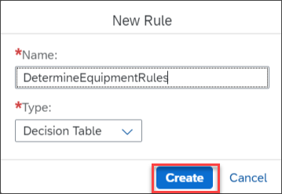
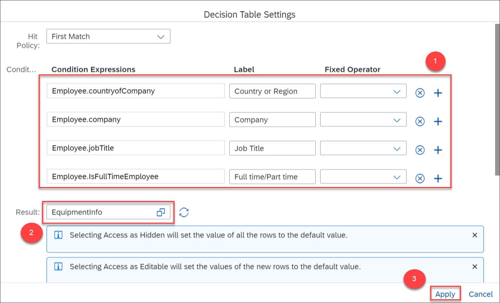
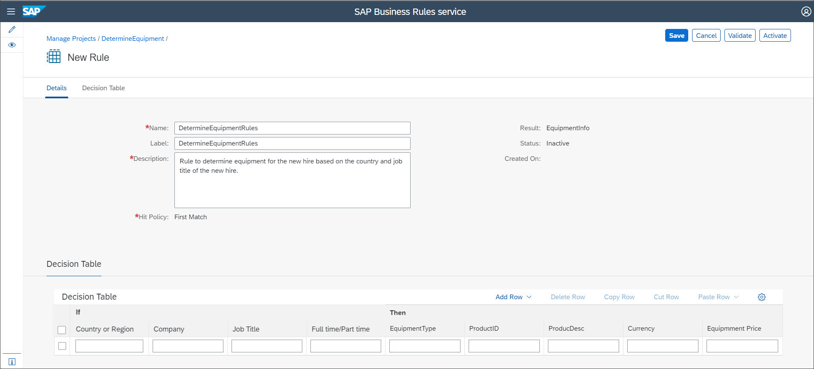
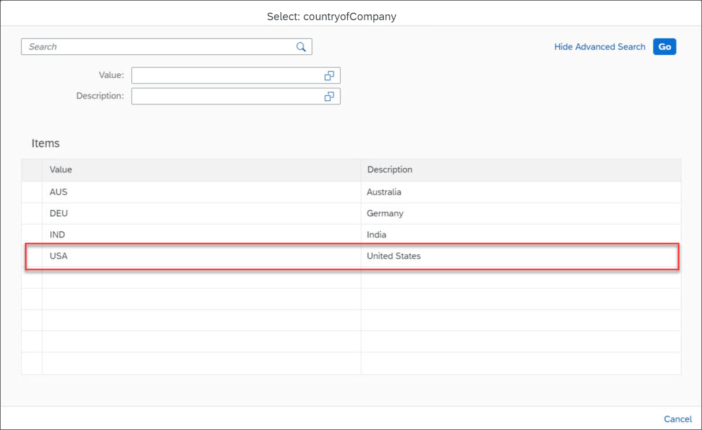
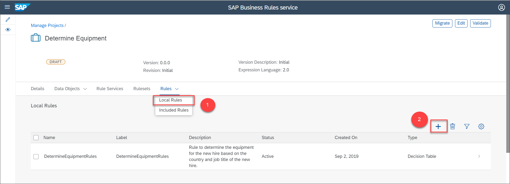
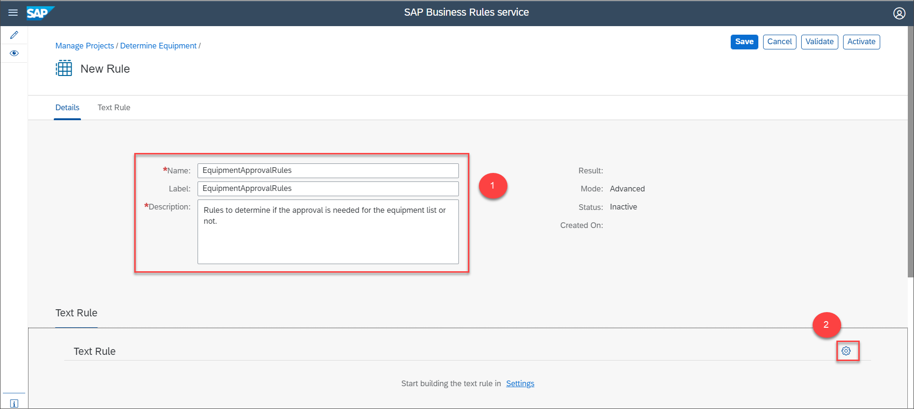
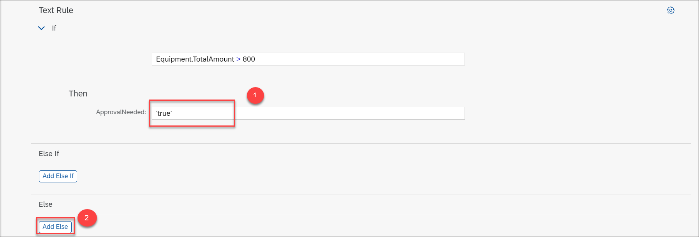
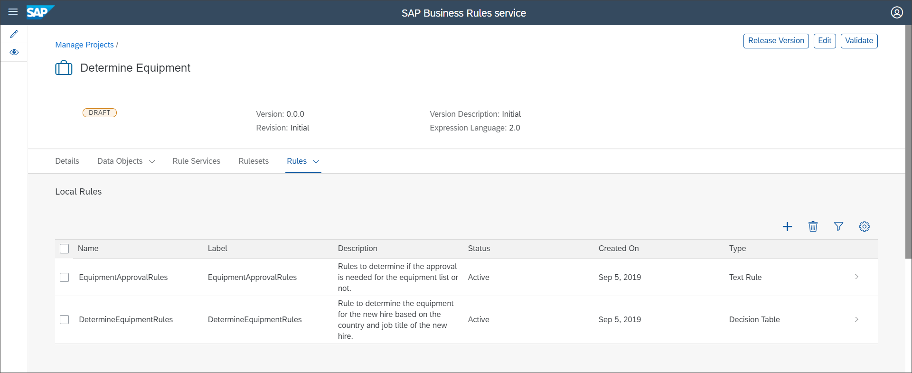

## Details
### You will learn
  - How to create decision table rules
  - How to create text rules

A decision table rule is the collection of rule expressions in tabular format and sequentially executes each rule in the table.
A text rule is a decision logic in simple if-then format. The **If** condition of the text rule is evaluated by the system once the rule is triggered. Based on the result of the condition, the rule performs a set of operations.

In this tutorial, we will create the decision logic required to assign equipment for the new hire, both as text rule as well as decision table.

---

[ACCORDION-BEGIN [Step 1: ](Create decision table rules)]

1. Navigate to the **Rules** > **Local Rules** tab, then choose +.

    

2. In the **New Rule** prompt, provide the following details:

    |  Field Name     | Value
    |  :------------- | :-------------
    |  Name           | **`DetermineEquipmentRules`**
    |  Type          | **`Decision Table`**

    Then choose **Create**.

    

3. In the **New Rule** page, provide the following details and then choose **Settings** icon.

    |  Field Name     | Value
    |  :------------- | :-------------
    |  Label           | **`DetermineEquipmentRules`**
    |  Description     | **`Rule to determine equipment for the new hire based on the country and job title of the new hire.`**

    

    The decision table settings window opens.

4. In the decision table settings window, select the **Hit Policy** as **All Match**. With **Hit Policy** as **All Match**, the decision table returns all the rows that matches the condition.

    

5. Press **CTRL** + **SPACE** to load the autosuggestion list, and then choose **Employee** under **Vocabulary** section.

    

6. Choose the attribute **`countryofCompany`** from the **Vocabulary** section.

    

7. From the **Fixed Operator** dropdown list, select **None**.

    

8. Similarly, create the following condition expressions:

    |  Condition Expressions     | Fixed Operator
    |  :------------- | :-------------
    |  **`Employee.company`**   | **`None`**
    |  **`Employee.jobTitle`**   | **`None`**
    |  **`Employee.isFullTimeEmployee`**   | **`None`**

    Choose **`EquipmentInfo`** as the **Result** data object from the dropdown list and then choose **Apply**.

    

    A decision table gets created with the condition columns and result columns as shown:

    

9. In the **`Employee.countryofCompany`** column, press **CTRL** + **SPACE**. Under **Comparison Operators**, select **is equal**.

    

10. Under **Fixed Value** section, select the value help icon to select the value.

    

    Select **USA** from the value help.

    

11. In the **`Employee.company`** column provide the following value using the autosuggestion list:

    `='ACE_USA'`

    

12. In the subsequent cells, provide the following values:

    |  Field Name     | Value
    |  :------------- | :-------------
    |  **`Employee.jobTitle`**   | **`MATCHES '.*'`**
    |  **`Employee.isFullTimeEmployee`**   | **`= true OR Employee.isFullTimeEmployee = false`**
    |  **`Currency`**   | **`EUR`**
    |  **`ProductID`**   | **`106743`**
    |  **`Equipment Type`**   | **`Audio and Video`**
    |  **`Equipment Price`**   | **`35.96`**
    |  **`Product Desc`**   | **`Lovely Sound 5.1`**

    

11. Select the first row, then choose **Add Row** > **Insert After**.

    

12. Enter the following values in the condition and result columns of the new row:

    |  Field Name     | Value
    |  :------------- | :-------------
    |  **`Employee.countryofCompany`**   | **`= 'USA'`**
    |  **`Employee.company`**   | **`MATCHES '.*'`**
    |  **`Employee.jobTitle`**   | **`MATCHES '.*'`**
    |  **`Employee.isFullTimeEmployee`**   | **`= true OR Employee.isFullTimeEmployee = false`**
    |  **`Currency`**   | **`EUR`**
    |  **`ProductID`**   | **`106875`**
    |  **`Equipment Type`**   | **`Notebook`**
    |  **`Equipment Price`**   | **`956.00`**
    |  **`Product Desc`**   | **`Notebook Basic 15`**

    Then, choose **Activate**.

    

[DONE]
[ACCORDION-END]

[ACCORDION-BEGIN [Step 2: ](Create text rules)]

1. Navigate to **Rules** > **Local Rules** tab, then choose +.

    

2. In the **New Rule** window, enter the following values and then choose **Create**.

    |  Field Name     | Value
    |  :------------- | :-------------
    |  Name           | **`EquipmentApprovalRules`**
    |  Type          | **`Text Rule`**
    |  Mode    | **`Advanced`**

    

3. In the **New Rule** page, enter the following details:

    |  Field Name     | Value
    |  :------------- | :-------------
    |  Label          | **`EquipmentApprovalRules`**
    |  Description   | **`Rules to determine if the approval is needed for the equipment list or not`**

    In the **Text Rule** section, choose the **Settings** icon.

    

4. In the **Text Rule Settings** window, select **`EquipmentApproval`** as the **Result** and then choose **Apply**.

    

5. In the **If** section, press **CTRL**+**SPACE** and then provide condition expression using the autosuggestion list:

    `Equipment.TotalAmount > 800`

    

     In the **Then** section, provide the following value:

     `'true'`

     Then, choose **Add Else** to an **Else** section.

     

6. In this **Else** section, enter the following value:

    `'false'`

    

    Then, choose **Activate**.

    

    Navigate to the **Rules** > **Local Rules** tab to view the list of rules as shown:

    

[VALIDATE_1]

[ACCORDION-END]
