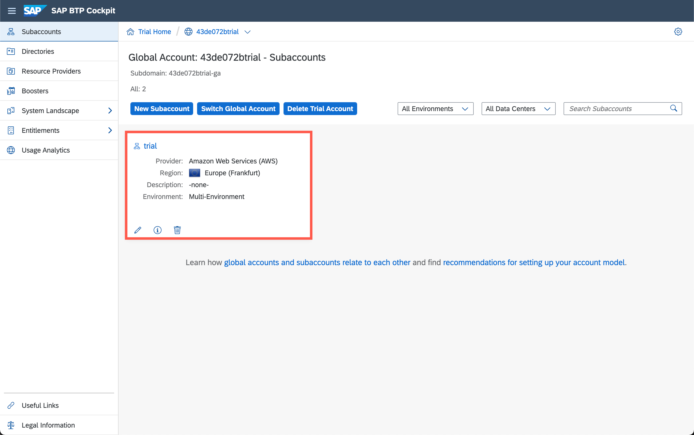
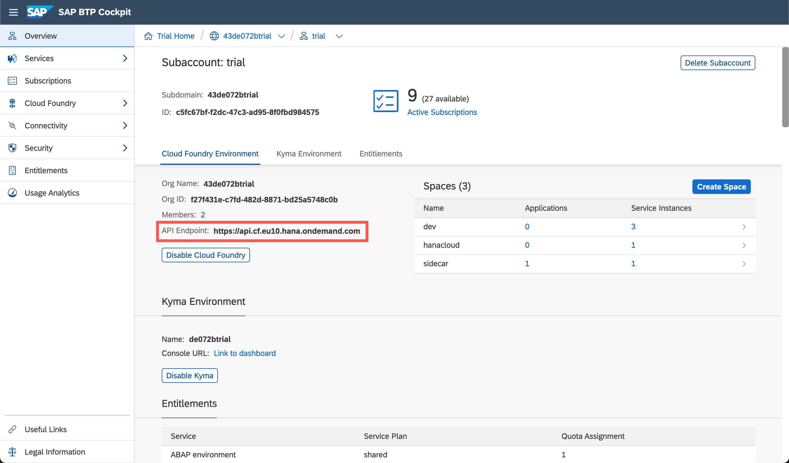

## Details
### You will learn  
 - How to download the Command Line Interface (CLI) package
 - How to install the CLI and connect it to Cloud Foundry
 - How to explore a few basic CLI commands

---

[ACCORDION-BEGIN [Step](Download the Command Line interface)]

Download the latest Command Line Interface (CLI) from the Cloud Foundry web site.  Use the following URL:  

[https://github.com/cloudfoundry/cli#downloads](https://github.com/cloudfoundry/cli#downloads).

On the Cloud Foundry website, choose either the command line installer or the binary from the table listed on the webpage. If you don't know which to use, choose the installer (not the binary) for your Operating System from the table.

Open the installer on your computer, and follow the installation instructions.

> For more help with the CLI installation, look at the [Cloud Foundry CLI installation documentation](http://docs.cloudfoundry.org/cf-cli/install-go-cli.html).

[DONE]
[ACCORDION-END]

[ACCORDION-BEGIN [Step](Test the Cloud Foundry CLI)]

Open a command prompt on your computer.  

> In Windows, you can search in the start menu for the application "command prompt".  
>
> On a Mac, use spotlight to find the application "terminal".
>
> On Linux/Unix, you know how this works, just open your favorite command shell.

Next, test the Cloud Foundry command line interface to make sure it is installed correctly.

To test the CLI, type in the following:

    cf

You should see a list of Cloud Foundry commands.


[VALIDATE_1]
[ACCORDION-END]

[ACCORDION-BEGIN [Step](Determine your Cloud Foundry URL)]

First, find the correct API URL for your region.  Select the correct region from this table, and copy the URL.  You will use the URL in the next steps to connect to Cloud Foundry.  

| Region                                          | URL                                         |
| ----------------------------------------------- | ---------------------------------------     |
| Europe (Frankfurt)        | `https://api.cf.eu10.hana.ondemand.com`     |
| Europe (Netherlands)  | `https://api.cf.eu20.hana.ondemand.com`     |
| US East (VA)               | `https://api.cf.us10.hana.ondemand.com`     |
| US West (CA)        | `https://api.cf.us20.hana.ondemand.com`     |

> If your region is not in this list, check the [Regions and API endpoints list](https://help.sap.com/viewer/65de2977205c403bbc107264b8eccf4b/Cloud/en-US/350356d1dc314d3199dca15bd2ab9b0e.html#loiof344a57233d34199b2123b9620d0bb41) for the most up to date list.

You can also identify your API Endpoint using your Cloud Foundry account:

First, navigate to the [SAP Cloud Platform Cockpit](https://hanatrial.ondemand.com) and click **Log On**.

Next, select **Enter Your Trial Account**


Next, click on the subaccount.



The **API Endpoint** is displayed on the right-hand side of the **Overview** page.



[DONE]
[ACCORDION-END]

[ACCORDION-BEGIN [Step](Log in using the CLI)]

Next, open a command line prompt on your computer.  In the command line screen, type in the following:

```bash
cf login -a <URL>
```
> Replace the `<URL>` section with the URL you selected from the table.

When prompted, enter your username and password.  Once you are logged in, you should see your API endpoint, user, org, and space.

You are now set up to use the Cloud Foundry systems on SAP Cloud Platform.

> For more information on the Command Line Interface (CLI), go to the Cloud Foundry [Getting Started with the CLI](http://docs.cloudfoundry.org/cf-cli/getting-started.html) website.

[VALIDATE_2]
[ACCORDION-END]
