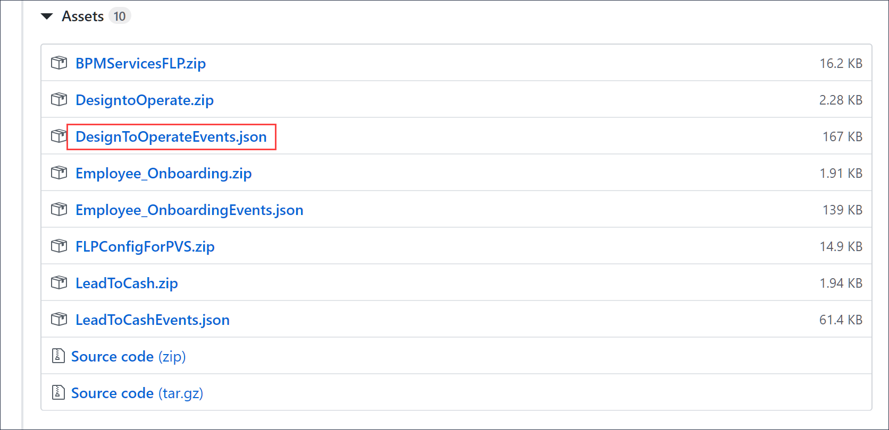
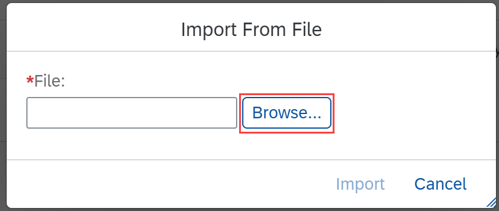
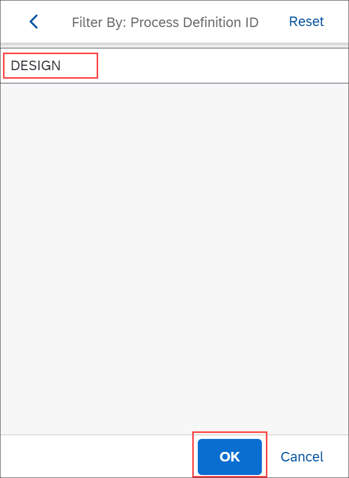
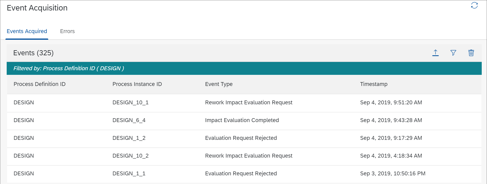
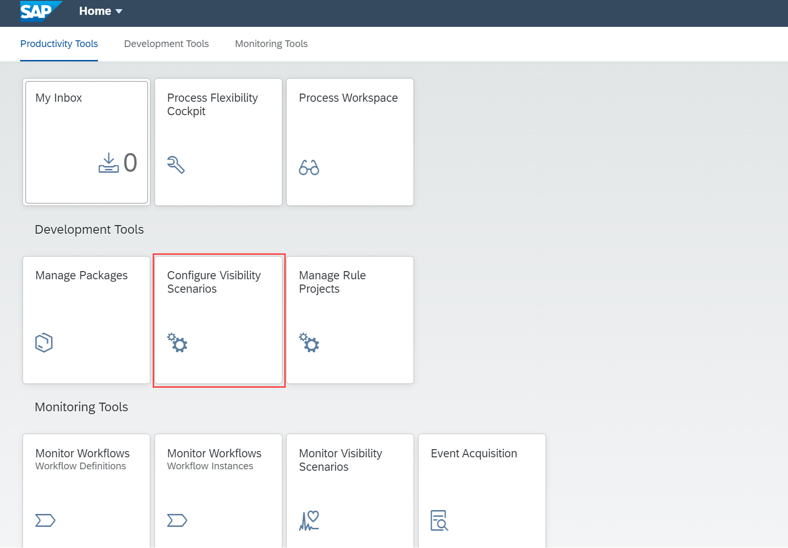
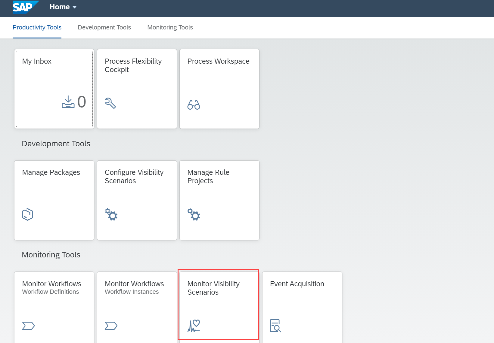
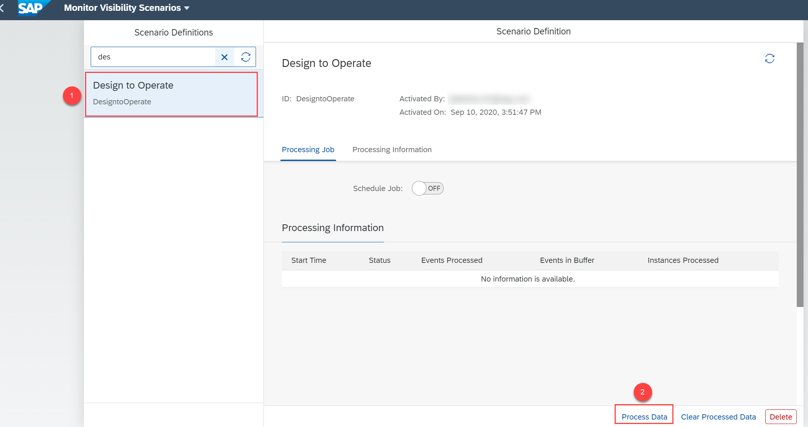
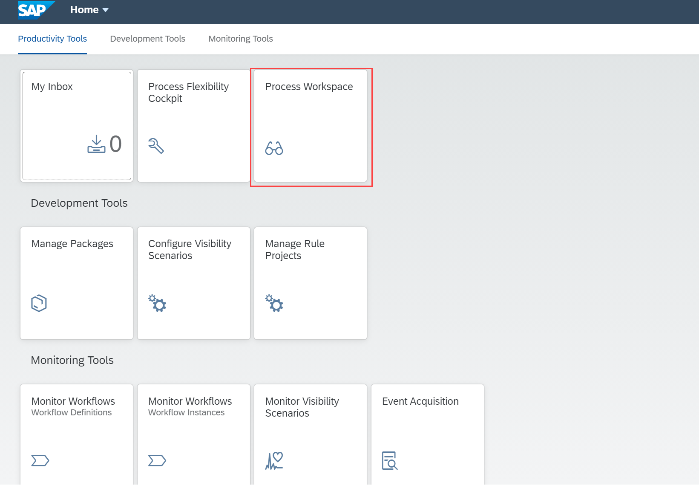

## Prerequisites
 Set up the Workflow Management service. For more information, see the [Set Up Workflow Management in Cloud Cockpit](cp-starter-ibpm-employeeonboarding-1-setup) tutorial.

## Details
### You will learn
  - How to import a sample design-to-operate business scenario
  - How to import the events for sample design-to-operate business process
  - How to gain visibility on sample design-to-operate business process
  - How to quickly get started with the Process Visibility service using the sample design-to-operate business process

Design-to-operate is a supply chain centric business process that enables companies to connect digitally to perfect reality across their product and asset lifecycle. This end-to-end business process consists of stages from design, planning, manufacturing, logistics, and operations.

In this tutorial, you can learn how to gain visibility on a sample design-to-operate business process using the Process Visibility service. You are provided with JSON files with events and zip files that contain the business scenario using which you can easily try out the capabilities of the service.

[ACCORDION-BEGIN [Step 1: ](Download files from GitHub)]
In this step, you will download the sample design-to-operate business scenario and the respective events from GitHub to your local file system.

1. Use the following link to access [GitHub](https://github.com/SAP-samples/cloud-process-visibility/releases).

2. Choose the `DesignToOperateEvents.json` file.

      

    >This downloads the `DesignToOperateEvents.json` file to your local system.

3. Now, from the GitHub, choose the `DesigntoOperate.zip` file.

    

    >This downloads the `DesigntoOperate.zip` file to your local system.

    You now have the two downloaded files in your local system with the events and scenario relevant to design-to-operate process.

[DONE]
[ACCORDION-END]

[ACCORDION-BEGIN [Step 2: ](Import events)]

In this step, you will import the `DesignToOperateEvents.json` to the Event Acquisition application.

1. Log onto the **Event Acquisition** tile using the Workflow Management home screen.

    

2. Choose the **Import** icon.

    

3. In the **Import From Tile** dialog, browse for the `DesignToOperateEvents.json` that is in your local file system.

    

4. Choose **Import**.  

    

5. Check if the events are imported successfully, by choosing the **View Filter Settings** icon.

    

    Choose the **Process Definition ID** option. Provide the value as **`DESIGN`** and choose **OK**.

      

      You can view a list of events imported for this process definition ID.

      

    >Similarly, you can search for other process definition IDs such as **`DELIVER`** and **`MANUFACTURE`**. You will be able to view the list of events imported for the respective process definition IDs.

[DONE]
[ACCORDION-END]

[ACCORDION-BEGIN [Step 3: ](Import the business scenario)]

In this step, you will import the `DesigntoOperate.zip` file to the Configure Business Scenarios application.

1. Log on to the **Configure Visibility Scenarios** tile by navigating to the home screen.

    !

2. Choose the **Import Scenario** icon.

    !

3. In the **Import Scenario** dialog, browse for the `DesigntoOperate.zip` file from your local system. Then choose **Import**.

    !

    You can now see the imported business scenario as shown.

      !

4. Choose the **Design to Operate** business scenario.

    !

5. Click **Activate**.

    !

    > You will see a message upon successful activation of the scenario.

[DONE]
[ACCORDION-END]

[ACCORDION-BEGIN [Step 4: ](Process the data)]

In this step, you can process the data of the activated business scenario using the Monitor Visibility Scenarios application.

1. Click the **Monitor Visibility Scenarios** tile by navigating to the home screen.

      !

2. Choose the **Design to Operate** scenario definition, then choose **Process Data**.

      !

3. On successful processing of data, choose the refresh icon to view the processing information listed out under **Processing Information**.

      !

[DONE]
[ACCORDION-END]

[ACCORDION-BEGIN [Step 5: ](Track Business Scenario)]

In this step, you will be able to track the progress of the sample design-to-operate business scenario using the visual representation of the Process Workspace application.

1. Click the **Process Workspace** tile by navigating to the home screen.

    !

2. Choose the **Design to Operate** business scenario.

    !

    You can view the overview page for the **Design to Operate** business scenario as shown below. You can view information such as open orders, cycle time, open orders by product category and so on.

    !

    >You can customize the cards displayed on the overview page by modifying the business scenario in the **Configure Visibility Scenario** application. For more information, see [SAP Help](https://help.sap.com/viewer/62fd39fa3eae4046b23dba285e84bfd4/Cloud/en-US/df284fd12073454392c5db8913f82d81.html).

[VALIDATE_1]
[ACCORDION-END]
---
