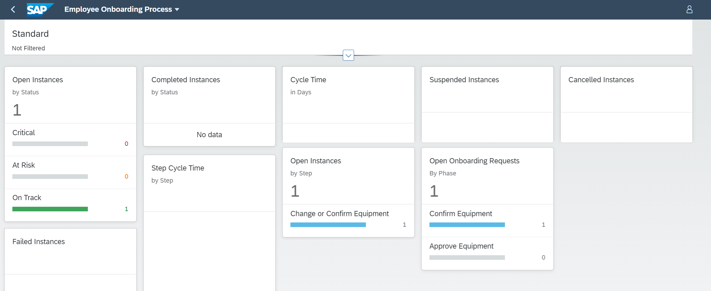
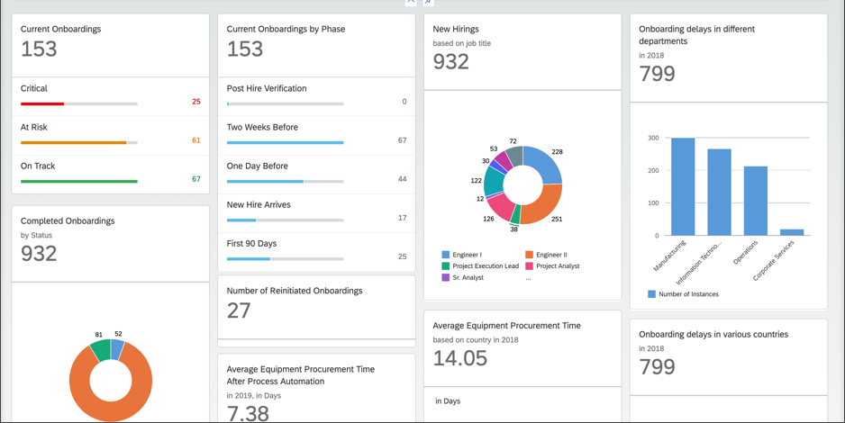

## Prerequisites
 - You have the **Process Workspace** application configured on SAP Fiori launchpad. For more information, refer to [Consume the Process Visibility UI Applications Using SAP Fiori Launchpad](cp-cf-processvisibility-setup-flp).
 - You are assigned to the **`PVOperator`** role. For more information on how to assign these roles, refer to [Assign the Process Visibility Roles to Users](cp-cf-processvisibility-setup-assignroles).

## Details
### You will learn
  - How to gain visibility on end-to-end processes

You can track the workflow in real time and analyze performance indicators to gain insights on the needed improvements.

SAP Cloud Platform Process Visibility provides the Process Workspace application to gain visibility on end-to-end processes for line-of-business users. It enables you to track processes in real-time, search and filter instances, analyze performance indicators, and view detailed information about an instance.

---

[ACCORDION-BEGIN [Step 1: ](Access the Process Workspace)]

1.	Log in to SAP Fiori launchpad.

2.	Click on the **Process Workspace** tile.

    

[DONE]
[ACCORDION-END]

[ACCORDION-BEGIN [Step 2: ](Analyze performance indicators for a scenario instance)]

1.	In the **Scenarios** table, choose **Employee Onboarding Process**.

    

      You can see the Process workspace overview page of **Employee Onboarding Process** scenario as shown below.

      

      Above is the basic default process workspace, if you enhance the scenario to add  more phases, calculated attributes, and performance indicators then you can achieve a dashboard as shown below, which can be used by the business users in their daily work to track workflow instances.

      

2. Choose one of the tiles to view details of the workflow instances contributing to the respective performance indicators.

    

    

3. Choose an instance from the table to navigate to the details view of the scenario instance.

    

    The scenario instance details view provides detailed information about the selected instance.

    

    In the scenario instance details view, you can view the following:

    **Phases** view displays where exactly the workflow is, how much time has elapsed, how many more phases and steps are left, and any violations which could bring the instance to risk based on the target cycle time.

    

    **Path** provides an ordered list or a flow chart to show the progress of workflow in terms of time taken to traverse from one task to another. This helps you to identify the bottlenecks, inconsistencies, and possible causes of the delays in the workflow.

    

[VALIDATE_1]
[ACCORDION-END]
