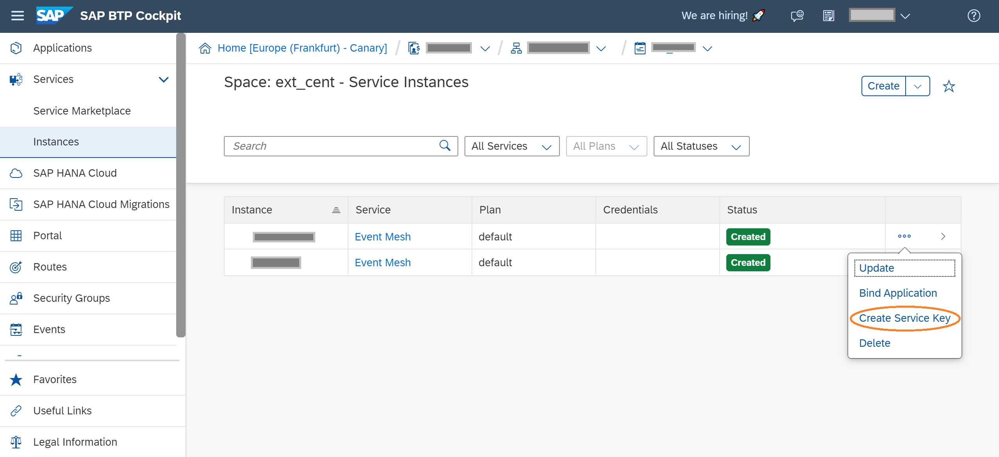
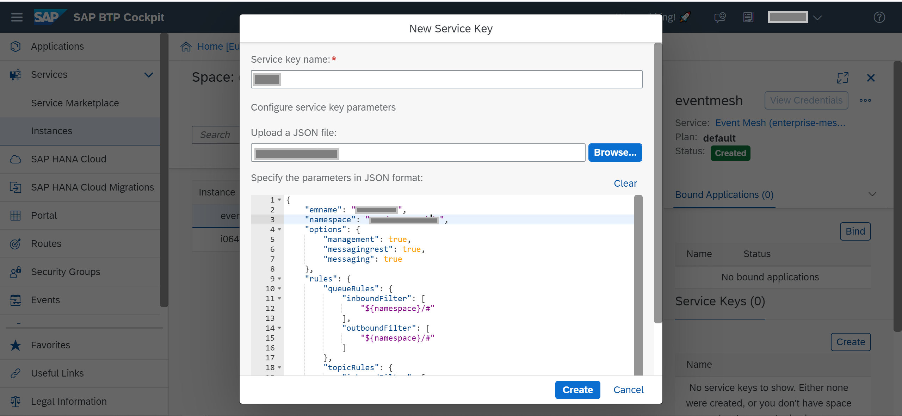
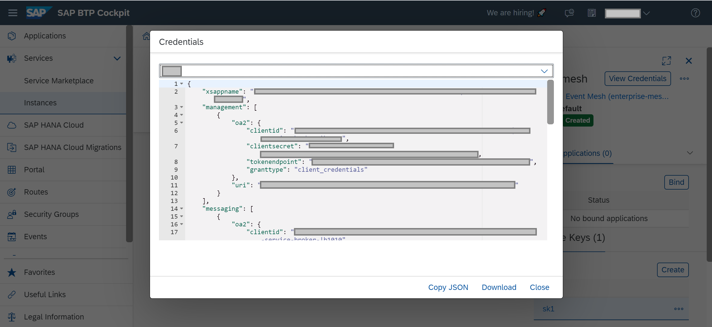

## Prerequisites
- SAP Business Technology Platform environment with SAP Event Mesh entitlement  
 
## Details
### You will learn
  - How to create an SAP Event Mesh service instance
  - How to access the Service Key of a SAP Event Mesh service instance


**IMPORTANT:** It is really important to learn the basics of messaging before going ahead with this tutorial. Check out [The Basics of SAP Event Mesh](cp-enterprisemessaging-learn-messaging-concepts).


---


[ACCORDION-BEGIN [Step 1: ](Create an instance)]

1. Open the SAP Business Technology Platform cockpit, Cloud Foundry environment.

2. Navigate to a **Space** in your Cloud Foundry environment and select **Services >  Service Marketplace > Event Mesh**.

3. Click **Instances > New Instance**.

4. Select **default** type service plan from the dropdown and click **Next**.

5. Specify parameters of the service descriptor using a JSON file.

    ```JSON
    {
    "emname": "<yourmessageclientname>",
    "namespace": "<yourorgname>/<yourmessageclientname>/<uniqueID>",
    "version": "1.1.0",
    "options": {
        "management": true,
        "messagingrest": true,
        "messaging": true
    },
	"rules": {
        "queueRules": {
            "publishFilter": [
                "${namespace}/*"
            ],
            "subscribeFilter": [
                "${namespace}/*"
            ]
        },
        "topicRules": {
            "publishFilter": [
                "${namespace}/*"
            ],
            "subscribeFilter": [
                "${namespace}/*"
            ]
        }
    }
}
    ```


    Service descriptor defines the message client. Each service instance is a message client that contains a name, namespace and a set of rules.

    The following section describes each parameter used in the service descriptor.

    - **emname** - It specifies the name of the message client. Should be unique for a subaccount.

    - **namespace** - The namespace ensures that every message client within a subaccount is unique. The namespace should be provided as a prefix and is not done automatically. The namespace contains exactly 3 segments (max length of 24 characters) with recommended approach as orgName/clientName/uniqueId.

    - **options** -  It is used to define the access channels for the message client.

    - **rules** -  Defines the access privileges for the message client. In order to allow access to a queue or a topic, the namespace of the corresponding owner message client has to be added

    Click **Next**.

6. Opens another screen. Click **Next**.

7. Enter the instance name and click **Finish**. The instance name has to be the same as has been given against the **`emname`** parameter in the service descriptor.

    An instance of SAP Event Mesh is created.

    

    >Each Event Mesh instance represents a message client. Each message client has a set of queues and topics to which it is associated. All these queues and topics belonging to one message client are exposed to other message clients using its unique credentials. This entire set of queues and topics within different message clients in a subaccount can send and receive messages or events to each other using the service.  

    [VALIDATE_1]


    [ACCORDION-END]

[ACCORDION-BEGIN [Step 2: ](Understanding Service Key of SAP Event Mesh)]

When an instance of SAP Event Mesh is created with the steps mentioned above, it stores the information of the protocols, corresponding end-points and authorizations which can be used to bind it to an Application. **Service Key** holds this information when an instance of SAP Event Mesh is created.
You can create a service key of the instance with the following steps depicted through following three images.

  - Click on Create a Service Key
  

  - Naming the Service Key
  

  - Service Key gets Created
  

Do find below a template Service Key of an SAP Event Mesh instance.
```JSON
{
  "xsappname": "<app-name>",
  "serviceinstanceid": "<instance-id>",
  "messaging": [
    {
        "oa2": {
              "clientid": "<client_id>",
              "clientsecret": "<client_secret>",
              "tokenendpoint": "https://<app-url>/oauth/token",
              "granttype": "client_credentials"
        },
        "protocol": ["amqp10ws"],
        "broker": {
            "type": "sapmgw"
        },
        "uri": "wss://<app-url>/protocols/amqp10ws"
    },
    {
        "oa2": {
                "clientid": "<client_id>",
                "clientsecret": "<client_secret>",
                "tokenendpoint": "https://<app-url>/oauth/token",
                "granttype": "client_credentials"
        },
        "protocol":["mqtt311ws"],
        "broker": {
                    "type": "sapmgw"
        },
        "uri": "wss://<app-url>/protocols/protocols/mqtt311ws"
    },
    {
        "oa2": {
              "clientid": "<client_id>",
              "clientsecret": "<client_secret>",
              "tokenendpoint": "https://<app-url>/oauth/token",
              "granttype": "client_credentials"
        },
        "protocol": ["httprest"],
        "broker": {
              "type": "saprestmgw"
        },
        "uri": " https://<app-url>/"
    }
  ],
  "management": [
      {
        "oa2": {
              "clientid": "<client_id>",
              "clientsecret": "<client_secret>",
              "tokenendpoint": "https://<app-url>/oauth/token",
              "granttype": "client_credentials"
        },
        "uri": " https://<app-url>/"
      }
  ]
}

```
 - The segment `management` in the service binding information is available only if you have set the option management as true during service instance creation.

 - The segment `httprest` in the service binding information is available only if you have set the option `messagingrest` as true during service instance creation.

Now you can proceed with the tutorial [Create Queues and Queue Subscriptions for Event Mesh](cp-enterprisemessaging-queue-queuesubscription) to create queues and queue subscriptions so you can start working with SAP Event Mesh.

[VALIDATE_2]
[ACCORDION-END]


---
