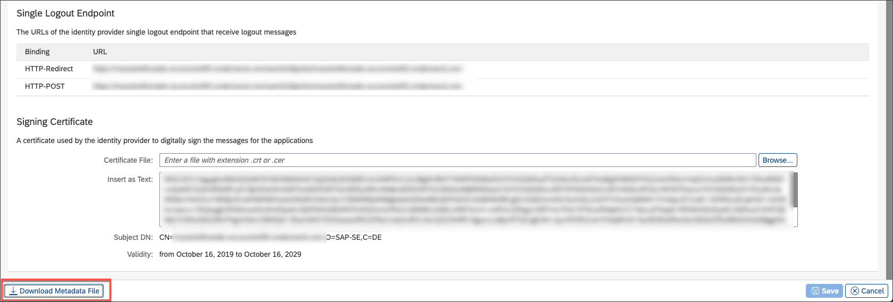
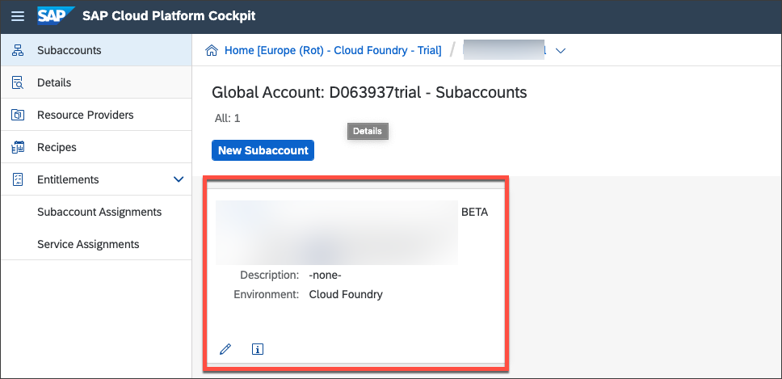
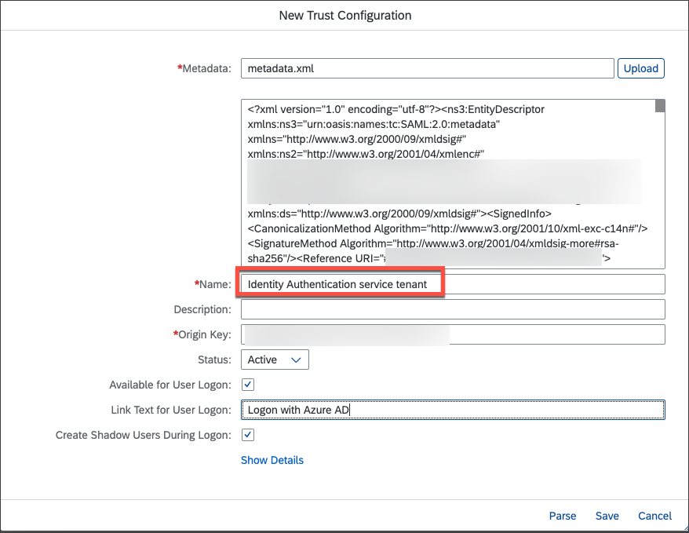
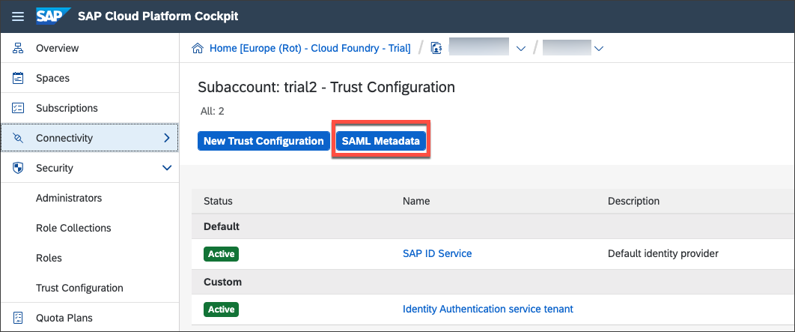
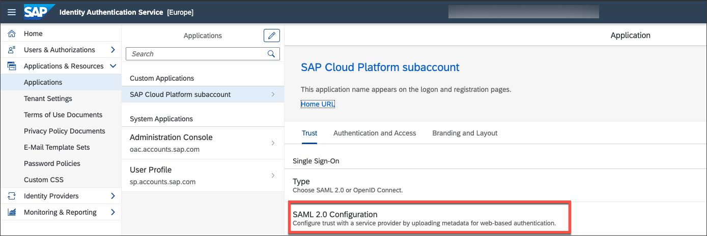
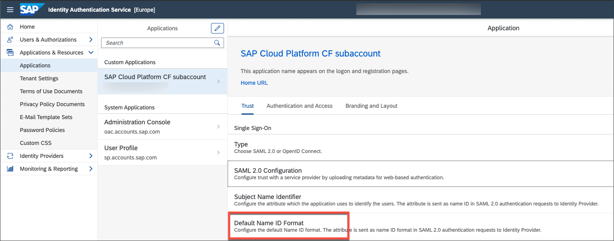
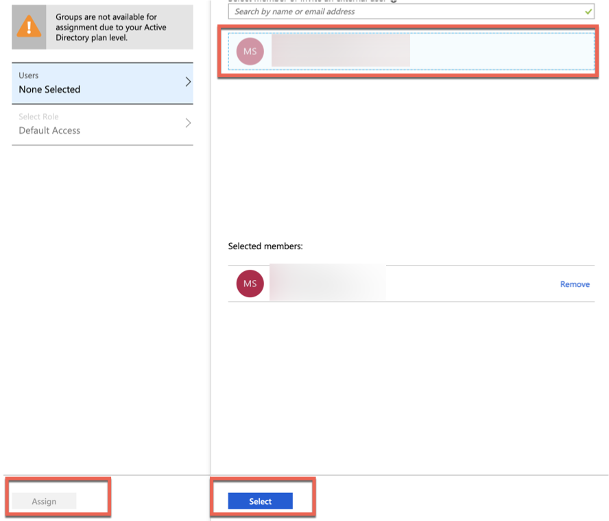
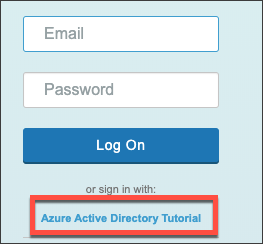

## Prerequisites
 - [Get a Free Trial Account on SAP Cloud Platform](hcp-create-trial-account)

## Details
### You will learn
  - How to establish trust between your SAP Cloud Platform Cloud Foundry subaccount and the SAP Identity Authentication service
  - How to configure users for single sign-on usage

---

[ACCORDION-BEGIN [Step 1: ](Log into SAP Cloud Platform Identity Authentication service)]

> This step is optional if you have already downloaded the metadata file in the previous tutorial.

Log into the administration console of SAP Cloud Platform Identity Authentication service through your particular URL.

The URL therefore is: **`https://[TENANT_ID].accounts.ondemand.com/admin`**

>Tenant ID is an automatically generated ID by the system. The first administrator created for the tenant receives an activation e-mail with a URL in it. This URL contains the tenant ID. For more information, have a look at [SAP Cloud Identity Services - Identity Authentication](https://discovery-center.cloud.sap/serviceCatalog/identity-authentication) in the SAP Discovery Center.

[DONE]
[ACCORDION-END]

[ACCORDION-BEGIN [Step 2: ](Download service tenant metadata)]

> This step is optional if you have already downloaded the metadata file in the previous tutorial.

Go to the **Tenant Settings** in SAP Cloud Platform Identity Authentication Service and navigate to the **SAML 2.0 Configuration**.

**Scroll down** to the bottom of the page and **download** the metadata file.

[DONE]
[ACCORDION-END]

[ACCORDION-BEGIN [Step 3: ](Add trust configuration)]

1. Navigate to your SAP Cloud Platform Cloud Foundry subaccount. Therefore, go to the [SAP Cloud Platform cockpit](https://hanatrial.ondemand.com/) and click **Enter Your Trial Account**.

2. Click the tile of your subaccount where you want to establish trust with the SAP Cloud Platform Identity Authentication service.

    

3. Note down the subdomain (in this case **demos**) and the region (in this case **eu20**) for later use (in Step 8).

4. Open the submenu **Trust Configuration** in the **Security** section, and click **New Trust Configuration**.

    

5. Upload the metadata file of the SAP Cloud Platform Identity Authentication service tenant, which you downloaded in the previous step (or previous tutorial).

    A message *Metadata parsed successfully* should appear.

    Enter **Identity Authentication service tenant** as the name for the trust configuration.

    

6. Set **`Azure Active Directory Tutorial`** as **Link Text for User Logon**. This will appear on the login screen once a user tries to log in.

    Continue with **Save**.

You should now see an additional trust configuration.

[DONE]
[ACCORDION-END]

[ACCORDION-BEGIN [Step 4: ](Download SAP Cloud Platform SAML metadata)]

Download the **SAML Metadata** file of your subaccount.

[DONE]
[ACCORDION-END]

[ACCORDION-BEGIN [Step 5: ](Create new SAML service provider)]

1. Go back to the administration console of SAP Cloud Platform Identity Authentication service through your particular URL.

    > The URL is the same as the one in Step 1 of this tutorial: **`https://[TENANT_ID].accounts.ondemand.com/admin`**

2. Choose **Applications** in the **Applications & Resources Applications** menu section to go to the service provider configuration.

3. Create a new application by using the **+ Add** button to add a new SAML service provider.

    

4. Enter **SAP Cloud Platform CF subaccount** as the name for the application that clearly identifies it as your new service provider. **Save** your changes.

> Users see this name in the login screen when the authentication is requested by the UAA service. Seeing the name, they know which application they currently access after authentication.

[DONE]
[ACCORDION-END]

[ACCORDION-BEGIN [Step 6: ](Upload subaccount metadata file)]

1. Choose **SAML 2.0 Configuration** in the recently created application.

2. Import the relevant metadata XML file of the SAP Cloud Platform Cloud Foundry subaccount.

3. Click **Save**.

[DONE]
[ACCORDION-END]

[ACCORDION-BEGIN [Step 7: ](Configure default name ID format)]

1. Choose **Default Name ID Format** in the list of configurations.

2. Select **E-Mail** as a unique attribute.

3. Save the changes.

[DONE]
[ACCORDION-END]

[ACCORDION-BEGIN [Step 8: ](Upload subaccount metadata file)]

Choose **Assertion Attributes** in the list of configurations.

Use **+Add** and enter **Groups** (case-sensitive) as assertion attribute name for the Groups user attribute, and click **Save**.

[DONE]
[ACCORDION-END]

[ACCORDION-BEGIN [Step 9: ](Log into subaccount with Azure AD user)]

1. Open a new browser window and replace the **<subdomain>** and **region** placeholder with the information you have noted down in Step 3.

    `https://<subdomain>.authentication.<region>.hana.ondemand.com`

    You will still be able to log in with your S-User/P-User e-mail and password. You will see a link to Azure AD below the form. In **Trust Configuration**, you can enable/disable the SAP ID Service or any other trust configuration you have configured.

    If you disable the SAP ID Service, you will only see the links to the external identity providers. If there is only one identity provider configured, you will be automatically redirected to it.

2. Log in via the Microsoft Azure AD Link `Azure Active Directory Tutorial` and enter your Azure Active Directory user.

    One of the following error messages should appear:

    *AADSTS50105: The signed in user '`xyz`' is not assigned to a role for the application '`abc`'(`MyAzureTutorial`).*

    or:

    *AADSTS700016: Application with identifier 'https://<subdomain>.authentication.<region>.hana.ondemand.com' was not found in the directory '`xyz`'.*

    Until now, you don't have any users assigned to this enterprise application in Microsoft Azure AD. Only your Microsoft Azure AD is known as an Identity Provider in your SAP Cloud Platform Identity Authentication Service, but so far no users are allowed to log in with it.

3. Go back to your [overview of enterprise applications](https://portal.azure.com/#blade/Microsoft_AAD_IAM/StartboardApplicationsMenuBlade/AllApps/menuId/) in Microsoft Azure AD and click your application.

    Add a new user by clicking **Add user** in the **Users and groups** submenu, as shown on the screenshot.

    

4. For this tutorial, you only want to add a single user (instead of, for example, whole groups).

    Continue by clicking **Users** (so far the application has no users assigned, accordingly **None Selected** should appear). Search for either your name or the email address you want to continue working with.

    !

    By hitting the result tile, you select the user, which should appear under `Selected members` panel. Finish your user assignment with clicks on **Select** and **Assign**.

    !

[DONE]
[ACCORDION-END]

[ACCORDION-BEGIN [Step 10: ](Test your configuration)]

Check if your user assignment was successful. Open a new browser window again and enter the UAA tenant URL again:

`https://<subdomain>.authentication.<region>.hana.ondemand.com`

Log in via the Microsoft Azure AD Link `Azure Active Directory Tutorial` and enter your Azure Active Directory user you previously assigned to the enterprise application in Microsoft Azure AD. You will be redirected back to UAA afterwards.

You should not see any particular application, because you did not access a CF application, only the UAA tenant page.

>You can check the users details, including the groups mapped, by accessing the following URL:

>`https://<subdomain>.authentication.<region>.hana.ondemand.com/config?action=who&details=true`

[VALIDATE_1]
[ACCORDION-END]

Congratulations!

You have successfully connected Azure Active Directory with your SAP Cloud Platform Identity Authentication Service tenant. Furthermore, the SAP Cloud Platform Cloud Foundry subaccount can now leverage all the capabilities of SAP Cloud Platform Identity Authentication service, for instance users can login with their mail address of Azure Active Directory (as long as their account is part of the Azure Active Directory and the enterprise application).

Good Job!

---
