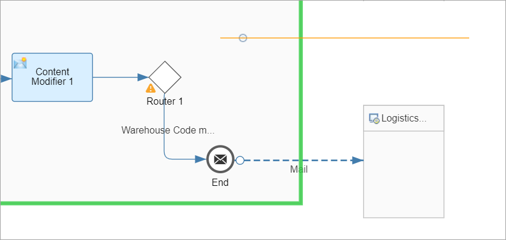
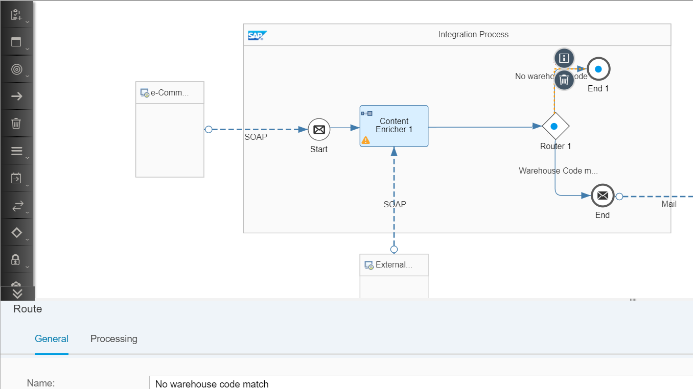
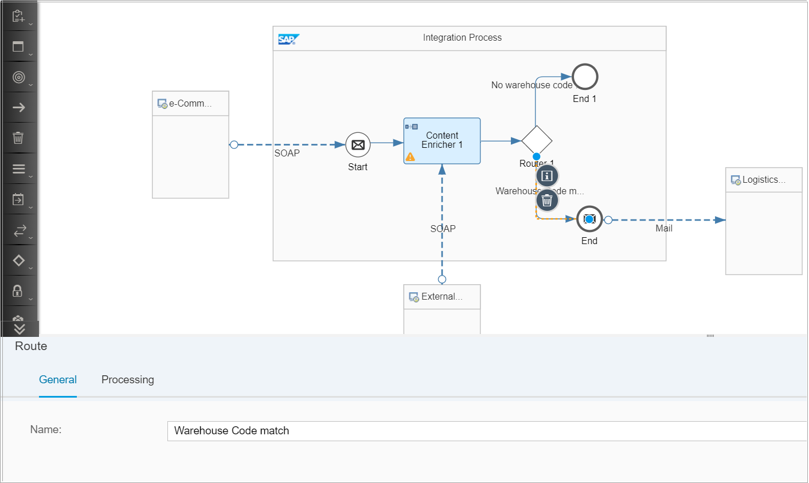
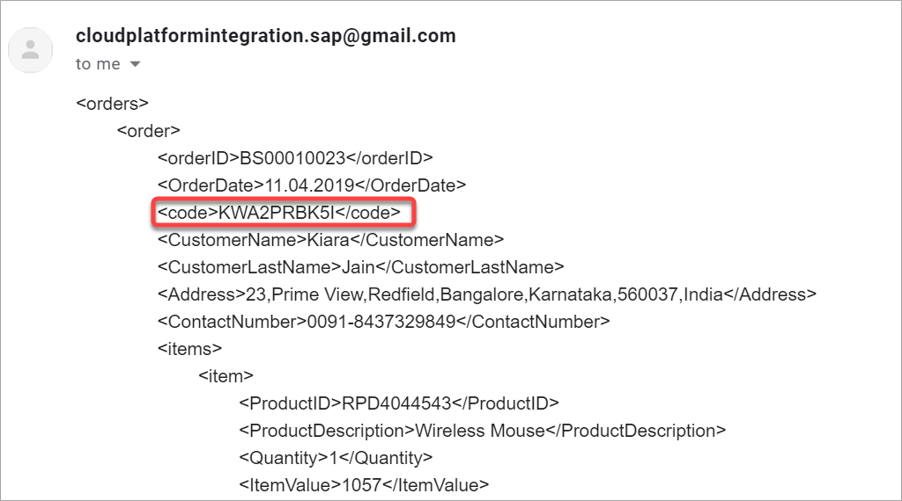

## Details
### You will learn
  - How to add conditional routing in an integration flow
  - How to define routing conditions
  - How to define routing conditions based on message content
  - How to configure multiple routes in your integration flow

Lets us check the value of the code retrieved in the previous exercise to define how the purchase order needs to be processed.

In this exercise, we terminate the processing in case we receive anything apart from KWA2PRBK5I.

---

[ACCORDION-BEGIN [Step 1: ](Add conditional processing)]

1. Add a router step to the integration flow:

    * Click on the design Palette.
    * Choose __Message Routing__.
    * Choose __Router__.

    

    * Drag it on to the execution pipeline after the __Content Enricher__ step.

    

    * Add the existing connectors as shown in the picture below:

    

2. Add an additional End event:

    * Click on the design Palette.
    * Choose __Events__.
    * Choose __End Event__.

    

    * Drag it on to the execution pipeline next to the __Router__ step.

      

3. Define the default route:

    * Connect the router step to the newly added __End Event__.
    * Click on the connector, go to the properties sheet, __General__ tab and rename the step to __No warehouse code match__.

    

    * Click on the connector, go to the properties sheet, __Processing__ tab and choose __Default Route__:

    

 4. Configure the routing condition for correct warehouse code.
    * Click on the connector between the Router and the __End Message Event__.
    * Click on the connector, go to the properties sheet, __General__ tab and rename the step to __Warehouse code match__.

    

    * Click on the connector, go to the properties sheet, __Processing__ tab and add the following:

    | Field     | Value     |
    | :------------- | :------------- |
    | Expression Type       | XML       |
    | Condition       | ```//orders/order/order/code = 'KWA2PRBK5I'```       |

    

5. Save, deploy and execute the flow with the existing input message.

6. Check the mail received:

    You should have received the following mail:

         

7. Now change the input message by changing the value of the address field in the input message.

    Change the address to __2025,M Street,Northwest,Washington DC,20036,USA__ in Postman and execute the flow again.

    You should not receive any mail. This indicates that the processing took the default route because the warehouse code generated from the new address is not __KWA2PRBK5I__.

[VALIDATE_1]

[ACCORDION-END]

---
