## Prerequisites
 - You have created a basic flow using the first tutorial.

## Details
### You will learn
  - How to expose an SOAP endpoint and how to call it from another flows.
  - Different ways of calling external endpoints.
  - Difference between Request-Reply and Content Enricher.

Instead of using an external API, we shall use an API exposed on your tenant. To expose the API, we shall create an additional flow. We will expose an SOAP endpoint through this integration flow and then consume it in the basic flow that was created in the previous chapter.

Feel free to replace the same with any externally available API.

---

[ACCORDION-BEGIN [Step 1: ](Create flow to expose SOAP endpoint)]
1. Go to the package __SAP Cloud Platform Integration Tutorials__.

2. Add an integration flow to this package.

    - Go to the __Artifacts__ tab.
    - Click __Edit__.
    - In the __Add__ dropdown, choose __Integration Flow__.

    

3. Choose __Create__.

    Field Name             | Value
    ---------              | -------------
    Name                   | Find Closest Warehouse Code
    Short Description      | Takes the address of the customer and returns the code of the closest warehouse.

    Keep the rest of the settings as it is.

    

4. Click __OK__.

    An integration flow is now created and added to the Integration package.

    Click on the name to launch the integration flow editor.

    The system creates a skeleton flow for you by default.

    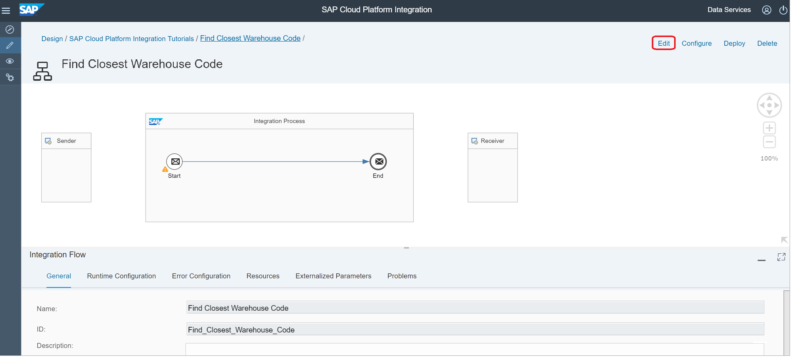

5. Click __Edit__ to start adding logic to your integration flow.

    The __design palette__ appears on the left side that provides all the process steps that can be added to the integration flow.

6. Delete the receiver - click on the receiver and choose __delete__ from the speed button.

    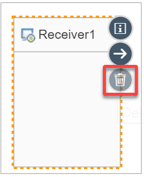

7. Create the sender channel:
    - Click on the Sender system.
    - Click on the __Connector__ speed button.

    

    - Drag the arrow to the __Start message event__.
    - Choose __SOAP__ from the __Adapter Type__ pop-up and in the following window, choose SOAP 1.x.

    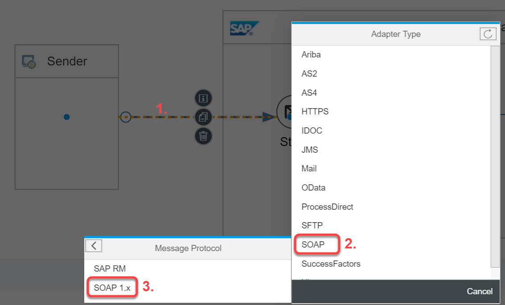

8. Configure the SOAP sender to expose an SOAP endpoint:   
     - Click on the SOAP sender channel.
     - Go to the __Properties sheet__.
     - Go to the __Connection__ tab and configure the following settings:

    Field   | Value
    ------------- | -------------
    Address      | **`/getWarehouseCode`**
    Service Definition| Manual
    Use WS-Addressing | Not checked
    Message Exchange Pattern| Request-Reply    
    Authorization | User Role
    User Role | ESBMessaging.send

    > This is the SOAP endpoint that we will use as an external API and shall call it from the basic flow.

    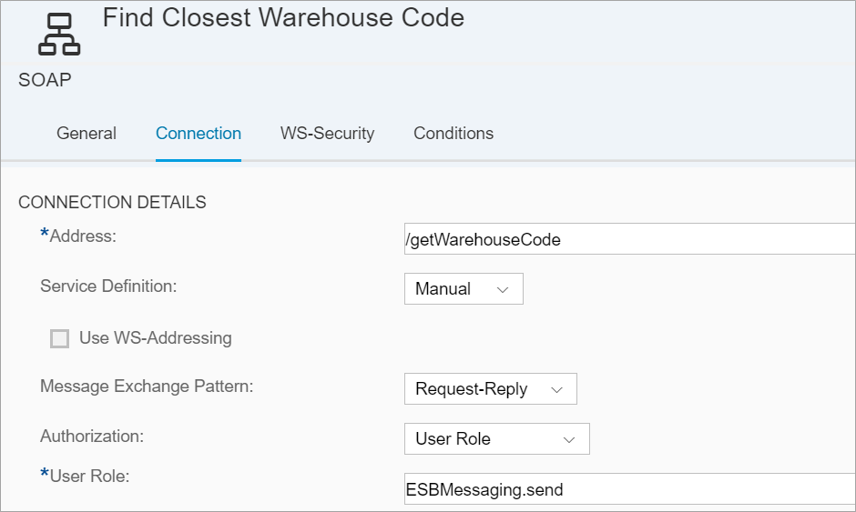    

9. Retrieve the **`OrderID`** from the incoming message and store it into a header:

    * Click on the design Palette.
    * Choose __Message Transformers__.
    * Choose __Content Modifier__.

    

    * Drag it on to the execution pipeline after the __Message Start Event__ step.

        

    * Click on the __Content Modifier__ step, go to the properties sheet, __Header__ tab and add the following details:

    Field     | Value    
    ------------- | -------------
    Action       | Create       
    Name | **`orderID`**
    Type | **`XPath`**
    Data Type | **`java.lang.String`**
    Value | **`/orders/order/orderID`**


    

    > You can add ${in/body} in the Message Body if the system does not pick the value of the orderID.

  10. Add a Filter step to retrieve the address field from the incoming message:
    * Click on the design Palette.
    * Choose __Message Transformers__.
    * Choose __Filter__.

    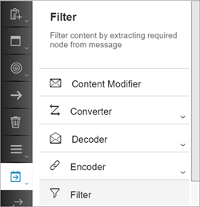

    * Drag it on to the execution pipeline after the __Content Modifier__.

    

    * Click on the __Filter__ step, go to the properties sheet, __General__ tab and rename the step to __Retrieve Address__.

    

    * Click on the __Filter__ step, go to the properties sheet, __Processing__ tab and configure the following:

    Field               |Value
    -------------       |-------------
    `XPath Expression`   | `//orders/order/Address/text()`
    Value Type          | Node

    

    > Now the message in the pipeline is only the text of the address field of the incoming message. All other message content get discarded.

  11. Add a script step to compute the warehouse code from the recipient's address-
    * Click on the design Palette.
    * Choose __Message Transformers__.
    * Choose __Script__.
    * Choose __Groovy Script__.


    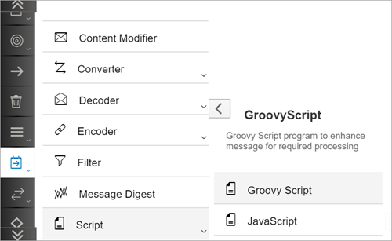

    * Drag it on to the execution pipeline after the __Filter__ step.


    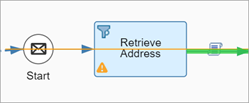

    * Click on the __Script__ step, go to the properties sheet, __General__ tab and rename the step to __Compute Warehouse Code__.

        

    * Click on the __Script__ step and choose __Create (+)__ from the list of speed buttons.

        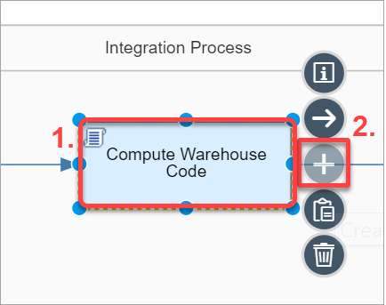

    * Add the following code to the script's __processData__ method:

    ```Groovy
    def Message processData(Message message)
    {
     def body = message.getBody();
     String s = message.getBody(String.class);
     String[] str;
     String code = "KWA";
     str = s.split(',');
     for( String values : str )
     code = code + values.substring(0,1);
     message.setBody(code);
     return message;
    }
    ```      

    > In this script, we are picking the first letter of each address field and concatenating it to create a warehouse code. Feel free to change the code as you prefer.   

    * Click __Ok__.

12. Create an XML body using a Content Modifier:
    * Click on the design Palette.
    * Choose __Message Transformers__.
    * Choose __Content Modifier__.

      

    * Drag it on to the execution pipeline after the __Script__ step.

      

    * Click on the __Content Modifier__ step, go to the properties sheet, __Message Body__ tab and add the following details:

        Field     | Value    
        ------------- | -------------
        Type       | Expression       
        Body | **`<?xml version="1.0" encoding="utf-8"?> <order><code>${in.body}</code><orderID>${headers.OrderID}</orderID></order>`**

        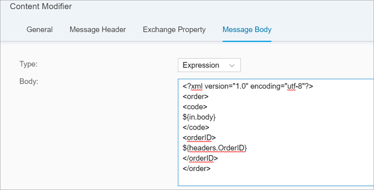

10. Save, deploy and retrieve the endpoint:

    * Save the integration flow by clicking on __Save__.

    > Alternatively, you can use __Save as version__ to change the version of the integration flow. Versions are managed by the Web Interface which also allows you to rollback to saved versions.

    > The system performs configuration check of all the integration flow settings that you configured so far and lists them in the __Problems View__. Errors and warnings are displayed.

    * Deploy the integration flow by clicking on __Deploy__.


          

        * Click __Yes__ in the Confirmation dialog.

        * Click __Ok__ in the Deployment pop-up.

    * Click on __Monitor__ to open the Monitoring View and choose the first tile from the __Manage Integration Content__ section.

      

    * Look for your integration flow. Make sure it is in __Started__ state.


    * You can find the endpoints on the right hand pane.   

    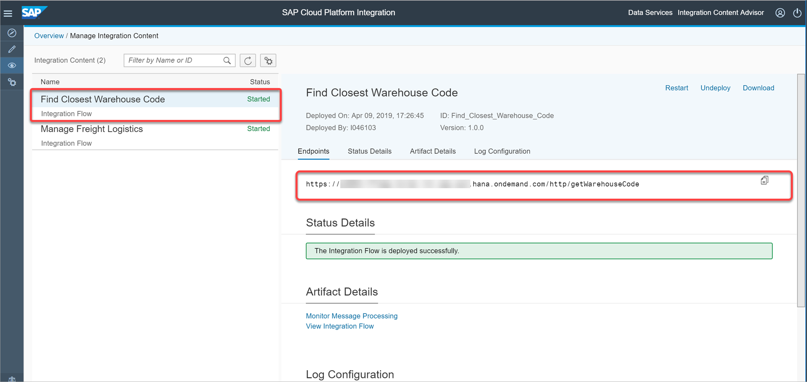  

[DONE]
[ACCORDION-END]

[ACCORDION-BEGIN [Step 2: ](Create a credential to call the above flow)]

In order to call the above flow from the basic flow, you need a user who has ESBMessaging.send. This is what was configured in the SOAP channel.

Assign ESBMessaging.send to a user and then add the corresponding user as a credential in  the tenant. You can do this by following **Step 6** in the [Integration Suite Onboarding Tutorial](cp-starter-isuite-onboard-subscribe).

> A _User Credential_ is an artifact created in the secure store of SAP Cloud Platform Integration to securely store user/passwords. The credential artifact is always stored as encrypted and hence keeps the password safe.

1.	Create and deploy a credential for sending mail on behalf of a mail account.
    - Go to the __Monitor view__.
    - Click on __Security Material__.
    - Add __User Credential__.
    - Set __Name__ to __user__.
    - Enter the __Client ID__ in the **User** and __Client Secret__ in the **Password** fields respectively.

    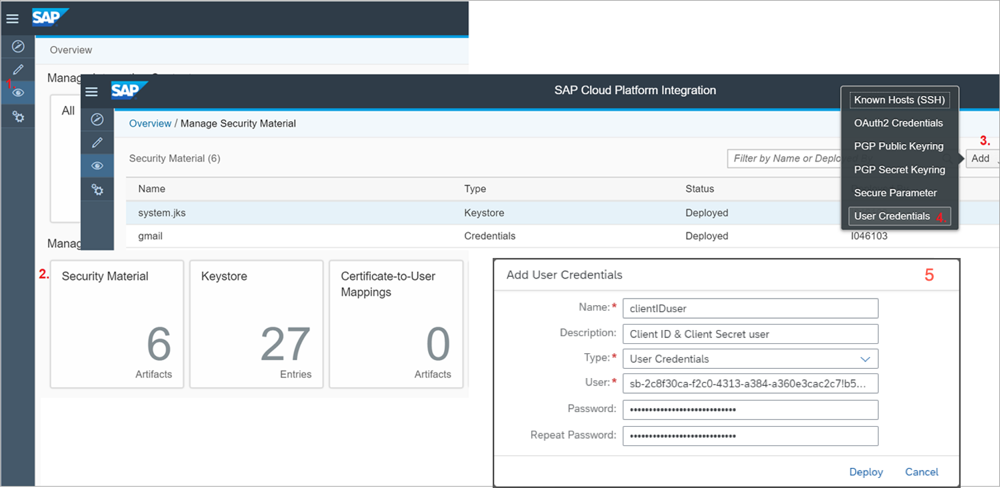

    Click __Deploy__.


[DONE]
[ACCORDION-END]


[ACCORDION-BEGIN [Step 3: ](Call the exposed endpoint from the basic flow)]

1. Open the basic flow __Manage Freight Logistics__.
2. Click on __Edit__ to start editing the flow.
3. Add a **Request Reply** step to the message pipeline:
    * Click on the design palette.
    * Choose __Call__.
    * Choose __External Call__.
    * Click on __Request Reply__.

    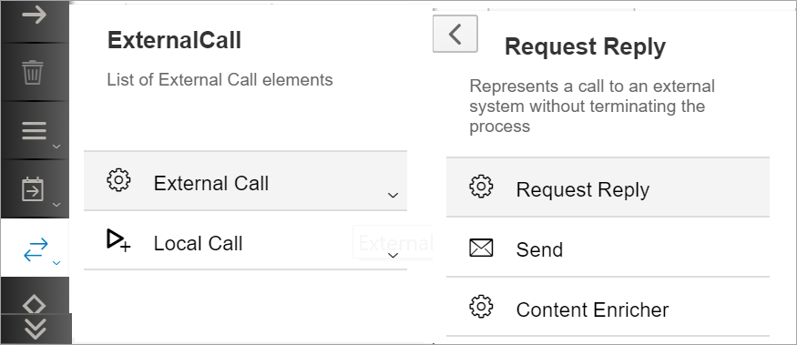

    * Drop it on to the message pipeline after the __Message Start Event__.

    

4. Add a receiver to the canvas:
    * Click on the design palette.
    * Choose __Participants__.
    * Choose __Receiver__.

    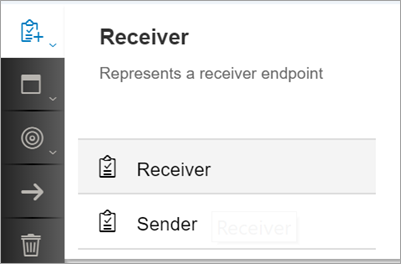

    * Drag the receiver on the canvas as shown below.

    

    * Rename the receiver **`ExternalAPI`**.  
    * Click on **`RequestReply`** and drag the connector to the Receiver.
    * Choose the SOAP connector because we exposed an SOAP endpoint in the flow creates in step 1.

    

5. Configure the external API in the SOAP connector.
    * Choose the SOAP connector.
    * Go to the __Properties Sheet__.
    * Go to the __Connections__ tab.

    Field     | Value  
    ------------- | -------------
    Address       | SOAP endpoint URL of the flow created in Step 1
    Authentication | __Basic__  
    Credential Name | __user__

    

6. Save, deploy and execute the flow.

7. Check the mail received:

    You should have received the following mail:
    

8. As you may have noticed, the result if the external API call overwrote the message in the pipeline.

    > In case you wanted to preserve the input message and add the result of the API call to it, you must you a __Content Enricher__ instead. This is covered in the next step.


[DONE]
[ACCORDION-END]


[ACCORDION-BEGIN [Step 4: ](Replace the Request Reply step with a Content Enricher)]

1. Delete the request reply step.

    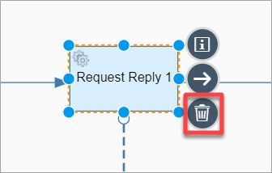

3. Add a Content Enricher step to the message pipeline (in place of the Request Reply):

    * Click on the design palette.
    * Choose __Call__.
    * Choose __External Call__.
    * Click on __Content Enricher__.


    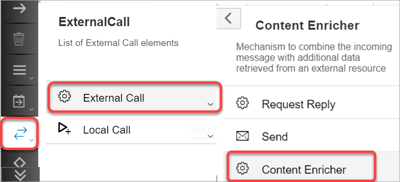

    * Drop it on to the message pipeline after the __Message Start Event__.

    

  3. Configure the Content Enricher:

    * Choose the Content Enricher.
    * Go to the __Properties Sheet__.
    * Go to the __Processing__ tab.

    Field     | Value  
    ------------- | -------------
    Aggregation Algorithm | Enrich
    ORIGINAL MESSAGE - Path to Node | /orders/order
    ORIGINAL MESSAGE - Key Element | orderID
    LOOKUP  MESSAGE - Path to Node | /order
    LOOKUP  MESSAGE - Key Element | orderID


4. Add SOAP connector:  

    * Click on Receiver and drag the connector to the Content Enricher.
    * Choose the SOAP connector because we exposed an SOAP endpoint in the flow creates in step 1.

    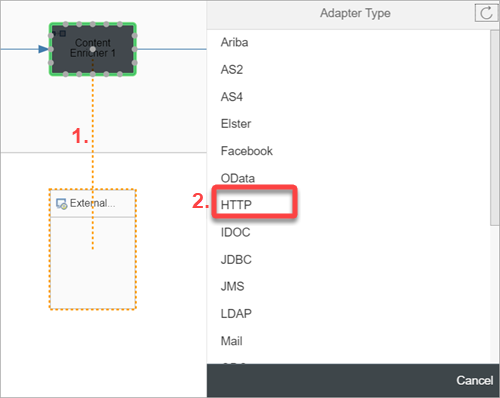

  5. Configure the external API in the SOAP connector.
    * Choose the SOAP connector.  
    * Go to the __Properties Sheet__.
    * Go to the __Connections__ tab.

    Field     | Value  
    ------------- | -------------
    Address       | SOAP endpoint URL of the flow created in Step 1
    Method | __POST__
    Authentication | __Basic__  
    Credential Name | __User__

    

6. Save, deploy and execute the flow.

7. Check the mail received:

    You should have received the following mail:

    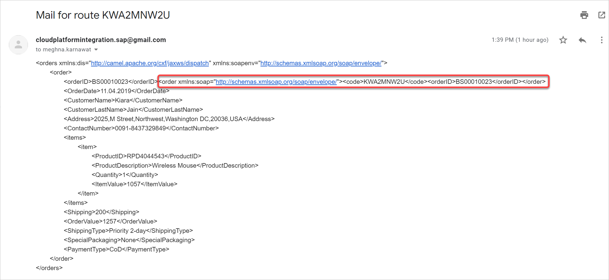

    As you can see, a new __order__ element is added under the parent Order node and it contains the __code__ element.

[VALIDATE_1]

[ACCORDION-END]

---
