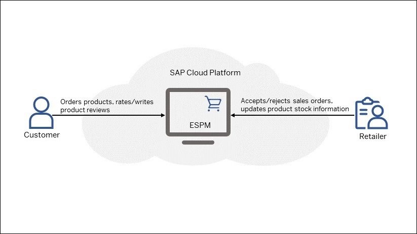

## Prerequisites  
 - **Proficiency:** intermediate

## Details

### You will learn  
- What is the ESPM application

### Time to Complete
**5 Min**

---
[ACCORDION-BEGIN [Step 1: ](Overview of ESPM)]

The Enterprise Sales and Procurement Model (`ESPM`) is a reference application that demonstrates how you can build Java-based applications on the SAP Cloud Platform, Neo environment. To showcase the rich set of capabilities and application services the platform offers today, the ESPM application consumes services such as Persistence, Document Service, SAP Jam, API Management and Authorization Management. The technologies the application uses are OData, JPA and the SAP HANA Database. The application User Interface (UI) is built with the SAPUI5 framework following the SAP Fiori design principles.

 The `ESPM` application's business scenario is one of an `eCommerce` site that sells electronic products. The customer can order products as well as provide reviews and rate them. The retailer can accept those sales orders and update the product stock information.

[VALIDATE_1]
[ACCORDION-END]

---
