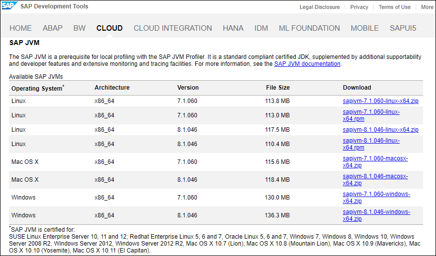
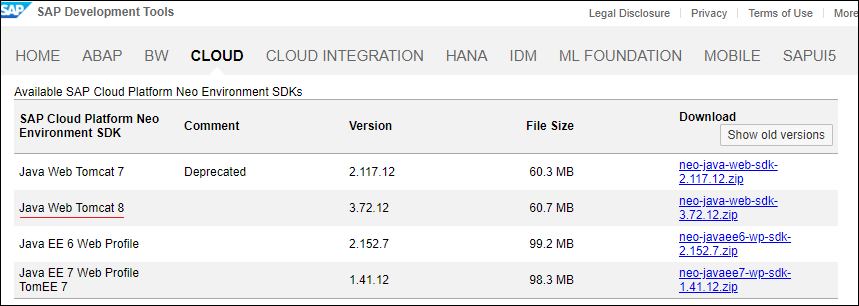
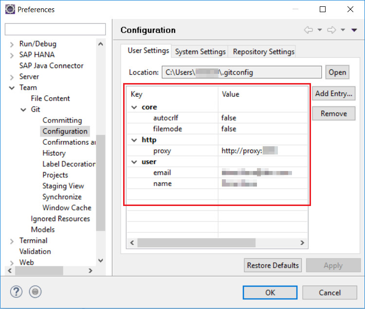

## Details
### You will learn
  - The tools you will need in order to complete this tutorial series
  - How to set up your Java development environment


---

[ACCORDION-BEGIN [Step 1: ](Sign up for Account on SAP Cloud Platform)]

Sign up for a Free Developer Account on the [SAP Cloud Platform](https://hcp.sap.com/try.html).

[DONE]
[ACCORDION-END]

[ACCORDION-BEGIN [Step 2: ](Install Java Development Kit 8)]

Install [Java JDK 1.8](http://www.oracle.com/technetwork/java/javase/downloads/jdk8-downloads-2133151.html) and set up the `JAVA_HOME` and `PATH` environment variables on your local machine.

Alternatively, if you want to use the SAP JVM, you can download it from the [SAP Development Tools for Eclipse](https://tools.hana.ondemand.com/#cloud) page, as well.



[DONE]
[ACCORDION-END]


[ACCORDION-BEGIN [Step 3: ](Download Java Web Tomcat)]

Download [Java Web Tomcat 8 SDK](https://tools.hana.ondemand.com/#cloud) and extract the archive.



[VALIDATE_1]
[ACCORDION-END]

[ACCORDION-BEGIN [Step 4: ](Install Eclipse)]

Install [Eclipse Oxygen IDE](https://www.eclipse.org/oxygen).

[DONE]
[ACCORDION-END]

[ACCORDION-BEGIN [Step 5: ](Install SAP Development Tools)]

Follow the instructions how to install [Install SAP Development Tools for Eclipse Oxygen](https://help.hana.ondemand.com/help/frameset.htm?76137a37711e1014839a8273b0e91070.html).

[DONE]
[ACCORDION-END]

[ACCORDION-BEGIN [Step 6: ](Set up the Runtime Environment)]

 1. In the Eclipse IDE main menu, choose **Window** > **Preferences**.

 2. Choose **Server** > **Runtime Environments**

 3. Choose the **Add** button.

 4. Choose **SAP** > **Java Web Tomcat 8**.

 5. Choose **Next**.

 6. Java Web Tomcat 8 is set as default name. You can change it if needed.

 7. Add your SDK directory:
    - If you have previously downloaded SDK for Java Web Tomcat 8 from Cloud Tools, choose the **Browse** button to locate your SDK folder.
    - If you have no SDK for Java Web Tomcat 8 locally available or need the latest version, choose the **Download and Install** button to download it directly from the Maven Central. You can create a new folder to keep your workspace well-organised.

 8. Choose **Finish**.

 9. Java Web Tomcat 8 is added as a server runtime environment.

 10. In the **Preferences** window, choose **OK**.

[DONE]
[ACCORDION-END]

[ACCORDION-BEGIN [Step 7: ](Set Up SAP JVM in Eclipse)]

Follow the steps in order to [Set Up SAP JVM in Eclipse IDE](https://help.sap.com/viewer/65de2977205c403bbc107264b8eccf4b/Cloud/en-US/7613eaad711e1014839a8273b0e91070.html).

[DONE]
[ACCORDION-END]

[ACCORDION-BEGIN [Step 8: ](Configure Git)]

Configure Git in Eclipse as per your environment.  

1. From the menu bar in Eclipse choose **Window** > **Preferences** > **Team** > **Git** > **Configuration**.  

2. Under **User Settings**, add the following configuration and adjust the **proxy**, **email** and **name** settings as per your environment, then select **Apply**. If you are not working behind a proxy, you do not need to set up the proxy value as shown below.

    

[DONE]
[ACCORDION-END]

[ACCORDION-BEGIN [Step 9: ](Configure Maven)]

1. Install [Maven](https://maven.apache.org/download.cgi).

2. From the Eclipse menu bar choose **Window** > **Preferences** > **Maven** > **User Settings** and select the **User Settings** node.

3. If you are using Maven for the first time, you need to create a `settings.xml` file at location `C:/Users//.m2/settings.xml` for Windows users and
`/Users//.m2/settings.xml` for Mac OS users.
You can use the sample snippet below that shows you where you should specify the proxy server in the `settings.xml` file.

4. If you have already installed Maven before, you can click on the **open file** link and add the proxy configuration to your `settings.xml` if it is not already there.
Note that if you are not working behind a proxy, you can remove the entire proxy section from the snippet.


```
 <settings xmlns="http://maven.apache.org/SETTINGS/1.0.0"
     xmlns:xsi="http://www.w3.org/2001/XMLSchema-instance"
     xsi:schemaLocation="http://maven.apache.org/SETTINGS/1.0.0 http://maven.apache.org/xsd/settings-1.0.0.xsd">
     <localRepository>${user.home}/.m2/repository</localRepository>
     <profiles>
       <profile>
         <id>development</id>
         <activation>
           <activeByDefault>true</activeByDefault>
         </activation>
         <properties>
         </properties>
       </profile>
     </profiles>
     <proxies>
     <proxy>
       <active>true</active>
       <protocol>http</protocol>
       <host>proxy</host>
       <port>your_proxy_port</port>
     </proxy>
 </proxies>
 </settings>
```

[DONE]
[ACCORDION-END]

---
