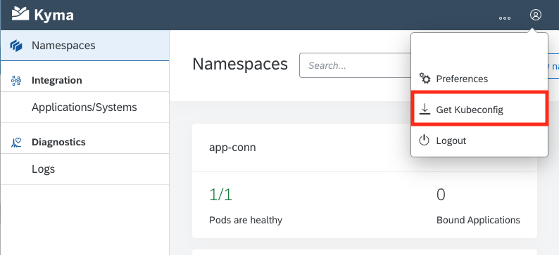

## Details
### You will learn  
  - How to download `kubectl` - the Kubernetes command line tool
  - How to install `kubectl` and connect it to a Kyma runtime
  - How to explore a few basic `kubectl` commands

The Kyma runtime is a Kubernetes cluster. To manage resources and configurations from the command line, the tool `kubectl` can be used. This tutorial provides the steps to configure the tool to access the Kyma runtime. In subsequent tutorials you will learn various commands provided by `kubectl`.

---

[ACCORDION-BEGIN [Step 1: ](Download and install kubectl)]

1. Download the latest `kubectl` command line tool from the Kubernetes website. Use the following URL:  

    <https://kubernetes.io/docs/tasks/tools/install-kubectl>

2. On the Kubernetes website, follow the instructions listed for your operating system, for example: [Install kubectl on macOS](https://kubernetes.io/docs/tasks/tools/install-kubectl/#install-kubectl-on-macos).

[DONE]
[ACCORDION-END]

[ACCORDION-BEGIN [Step 2: ](Test the kubectl installation)]

1. Open a command prompt on your computer.

    > On Windows, you can search for the `cmd` or `command prompt` applications in the Start menu.  
    >
    > On macOS, use Spotlight to find the "terminal" application.
    >
    > On Linux/Unix, you know how this works - just open your favorite command shell.

2. Test the `kubectl` command line tool to make sure it is installed correctly by running the following command in your CLI:

```Shell/Bash
kubectl version --client
```

This should return a list of version properties, for example:

```Shell/Bash
'Client Version: version.Info{Major:"1", Minor:"18", GitVersion:"v1.18.0", GitCommit:"9e991415386e4cf155a24b1da15becaa390438d8", GitTreeState:"clean", BuildDate:"2020-03-26T06:16:15Z", GoVersion:"go1.14", Compiler:"gc", Platform:"darwin/amd64"}
```

[VALIDATE_1]
[ACCORDION-END]

[ACCORDION-BEGIN [Step 3: ](Download the Kyma runtime kubeconfig)]

The `kubectl` tool relies on configuration file called the `kubeconfig`, to configure access to the cluster. This step details how this can be obtained for the Kyma runtime Console UI. Please note that the `kubeconfig` has an expiration of eight hours and will have to be re-download once it expires.   

1. Navigate to the Console UI of your Kyma runtime.

2. Log onto the Kyma runtime.

3. At the top-right of the Kyma runtime window, choose the user information dropdown.

    

4. Choose the **Get Kubeconfig** option to download the file.

[DONE]
[ACCORDION-END]

[ACCORDION-BEGIN [Step 4: ](Set the KUBECONFIG environment variable)]

1. Open a command line prompt on your computer. In the command line screen, type in the following:

[OPTION BEGIN [Mac and Linux]]

```Shell/Bash
export KUBECONFIG=<KUBECONFIG_FILE_PATH>
```

[OPTION END]

[OPTION BEGIN [Windows]]

```PowerShell
$ENV:KUBECONFIG="<KUBECONFIG_FILE_PATH>"
```

```DOS
set KUBECONFIG="<KUBECONFIG_FILE_PATH>"
```

[OPTION END]

Replace the `<KUBECONFIG_FILE_PATH>` section with the file path of the `Kubeconfig` you downloaded in the previous step.

2. Test the configuration by running this command:  

    ```Shell/Bash
    kubectl config get-contexts
    ```

    This should return a response similar to:

    |CURRENT|NAME|CLUSTER|AUTHINFO|NAMESPACE|
    |-------|----|-------|--------|---------|
    |*      | `c-#######.kyma.shoot.live.k8s-hana.ondemand.com`|`c--#######.kyma.shoot.live.k8s-hana.ondemand.com`|`OIDCUser`| |

3. You are now set up to use the Kyma runtime on SAP BTP Platform.

> For more information on `kubectl`, visit the Kubernetes [overview](https://kubernetes.io/docs/reference/kubectl/overview/) and [kubectl-commands](https://kubernetes.io/docs/reference/generated/kubectl/kubectl-commands) websites.

[VALIDATE_2]
[ACCORDION-END]

---
