## Prerequisites
 - **Tutorials:** [Get a Free Trial Account on Get a Free Account on SAP BTP Trial](hcp-create-trial-account)

## Details
### You will learn
  - How to enable the SAP BTP, Kyma runtime trial.

---

[ACCORDION-BEGIN [Step 1: ](Set entitlements)]
If the entitlement for the Kyma runtime trial has not be activated the button **Enable Kyma** will not be shown. The following steps detail the process of enabling the entitlement. In case you have the necessary entitlements set, continue with **Step 2** of this tutorial

1. In the left-hand menu, click **Entitlements**.

    !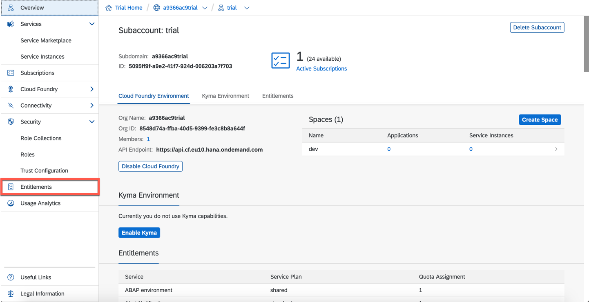

    Use the search field to search for **Kyma** in order to check if you have the needed entitlements enabled. If you have a new trial account, the needed entitlements should automatically be added to your account as seen in the screenshot below.

    !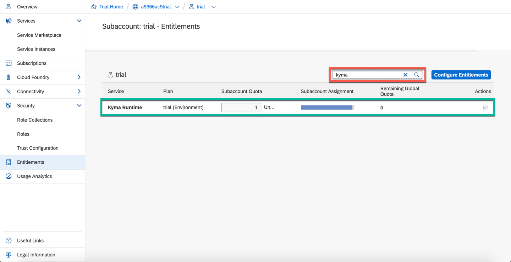

2. In case you don't have the entitlement in your account you need to add it in order to continue. Without the entitlement you won't be able to enable the Kyma runtime for your account.

    Click **Configure Entitlements**.

    !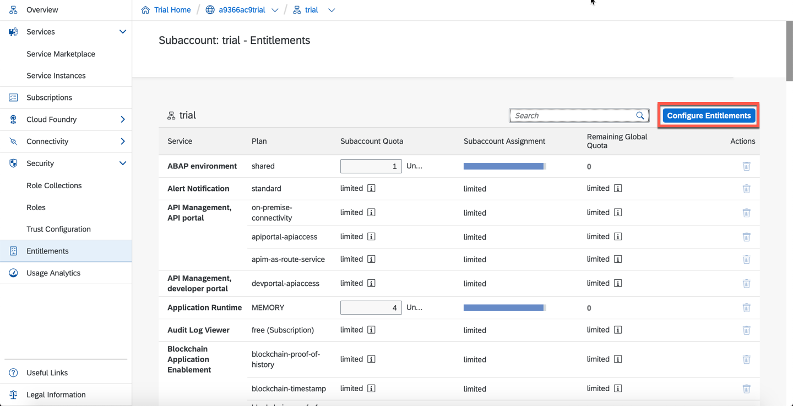

    Click **Add Service Plans** to add the Kyma runtime entitlement to your account.

    !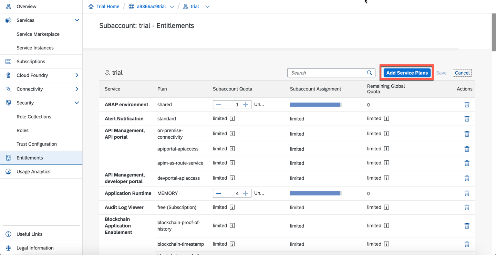

    Search for **Kyma**, check the trial checkbox and click **Add 1 Service Plan**.

    !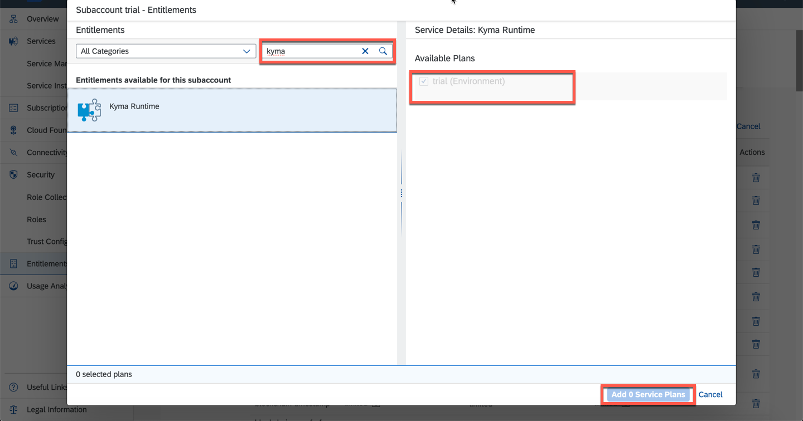

    > In case you see the message **You have already used all the global account quota for this service plan. To add this service plan, purchase more quota or remove quota from other subaccounts.**, you already have the Kyma runtime entitlement used in another subaccount. Navigate to the subaccount where the Kyma runtime entitlement is assigned and delete the entitlement. You can also continue with this tutorial in the entitled subaccount.

    Click **Save** to save the newly added service plan.

If you want to learn more about entitlements, visit the [Add a New Entitlement to Your Subaccount](cp-cf-entitlements-add) tutorial.

Go back to the **Overview** with help of the menu item on the left-hand-side. You should see the **Kyma Environment** tab.

[DONE]
[ACCORDION-END]

[ACCORDION-BEGIN [Step 2: ](Enable the Kyma environment)]

Now that you've made sure the Kyma entitlement is set, you can click **Enable Kyma** to trigger the enablement of the Kyma environment.

!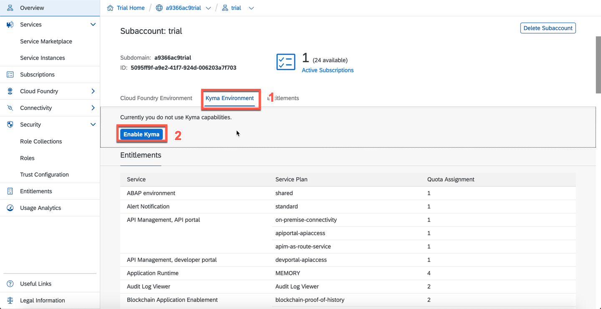

In the popup, enter your cluster name of choice and click **Create**.

!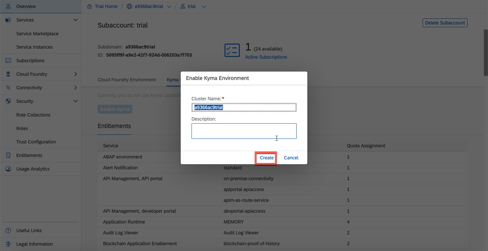

In the background, a new Kubernetes cluster is being set up where the Kyma runtime and all its components will run on. This might take up 60 min.

To continue with this tutorial, you need to wait until the enablement is finished. You can still use the SAP BTP trial or close the window as the setup process will continue automatically.

!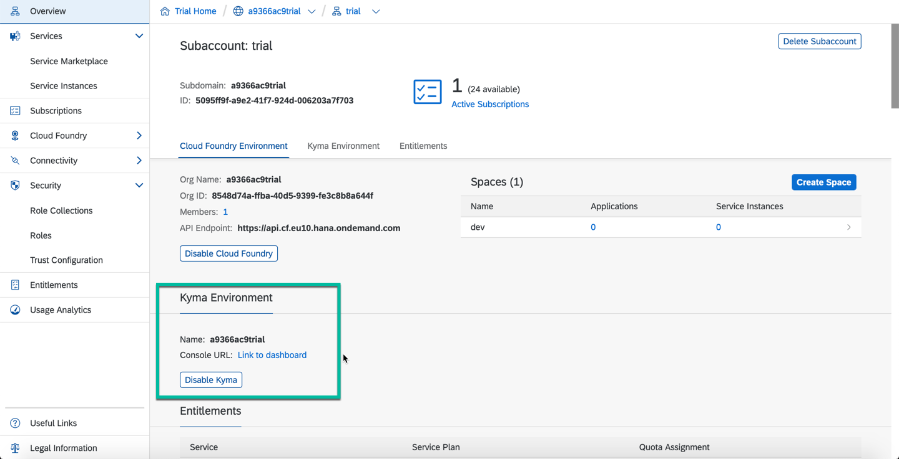

To learn more about the Kyma environment and its functionality, see:

- [kyma-project](https://kyma-project.io/docs/)
- [SAP Help Portal - Kyma Environment](https://help.sap.com/viewer/3504ec5ef16548778610c7e89cc0eac3/Cloud/en-US/468c2f3c3ca24c2c8497ef9f83154c44.html)
- [SAP BTP, Kyma runtime](https://discovery-center.cloud.sap/serviceCatalog/kyma-runtime)
- [Kyma - YouTube](https://www.youtube.com/channel/UC8Q8bBtYe9gQN-dQ-_L8JvQ)
- [project "Kyma" - Enablement Content](https://www.youtube.com/playlist?list=PL6RpkC85SLQC33__v6BFLDcV32uy5D3Rz)

[DONE]
[ACCORDION-END]

[ACCORDION-BEGIN [Step 3: ](Create role collection for your Kyma user)]

Once you've enabled the Kyma runtime, the last step is to assign your user the role needed to access the Kyma console UI. There are two different roles available for you to choose from: `KymaRuntimeNamespaceAdmin` and `KymaRuntimeNamespaceUser`.

In this tutorial, you will assign the admin role as it allows you to have full access to the full feature set provided by the Kyma runtime trial.

1. Create a role collection to which you assign the required role.

    This will allow you to later add additional roles, if you're using other services in combination with the Kyma runtime.

    In the left-hand menu, click **Security > Role Collections**. From there, click the plus icon ( **+** ) to  create a new role collection.

    !

2. In the popup, provide a name for the collection, and click **Create**.

    !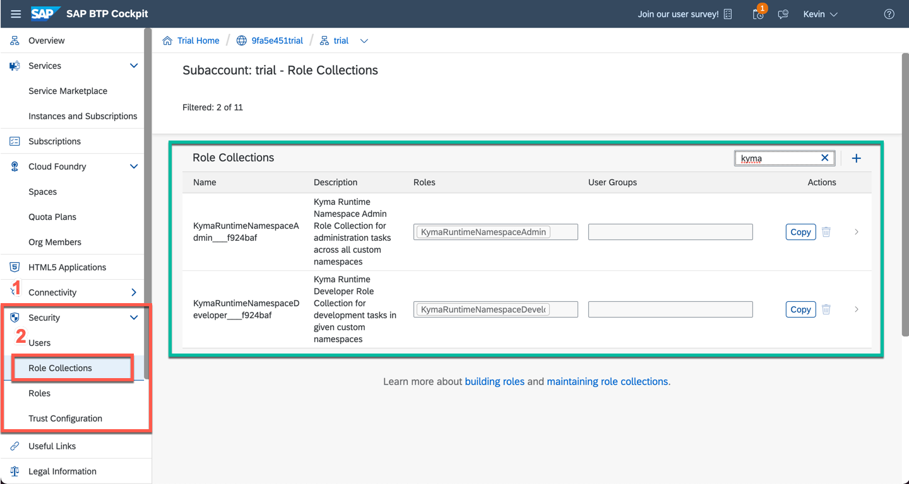

3. Locate your created role collection in the table below and click its name to open the collection detail screen.

    !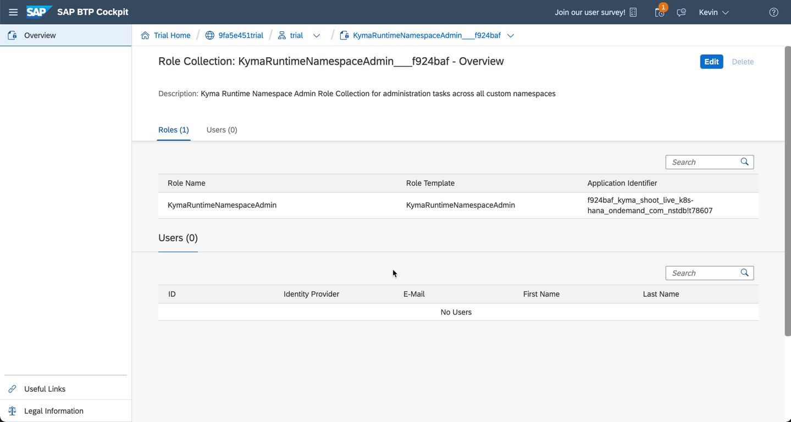

4. In the role collection detail screen, click **Edit** to add roles to it.

    !

    Locate the two-box-icon in order to open up the roles catalogue. The roles catalogue contains all available roles including the Kyma runtime roles.

    !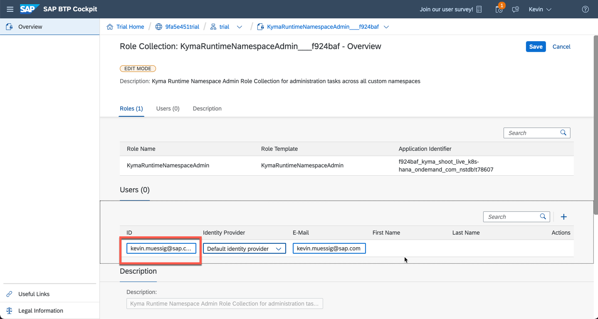

    Search for the role `KymaRuntimeNamespaceAdmin` and add it to your collection by checking the checkbox. Click **Add** to finish up the process.

    !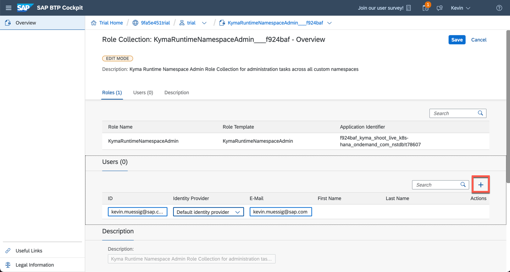

    Assign your user ID to the role collection. Locate the **Users** section and enter your email address into the **ID** field -- the UI should give you a nice autocompletion.

    Click on **Save**.

    !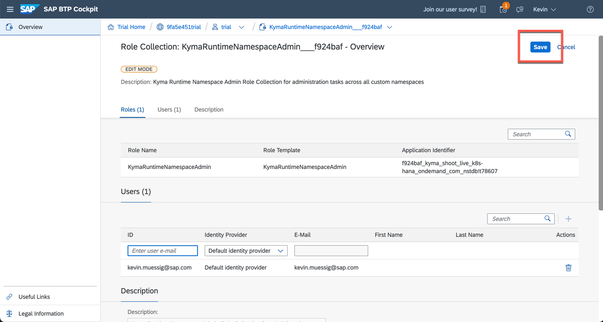

[DONE]
[ACCORDION-END]

[ACCORDION-BEGIN [Step 4: ](Open Kyma runtime console UI)]

Go back to the overview of your subaccount. From there, click **Link to Dashboard**.

!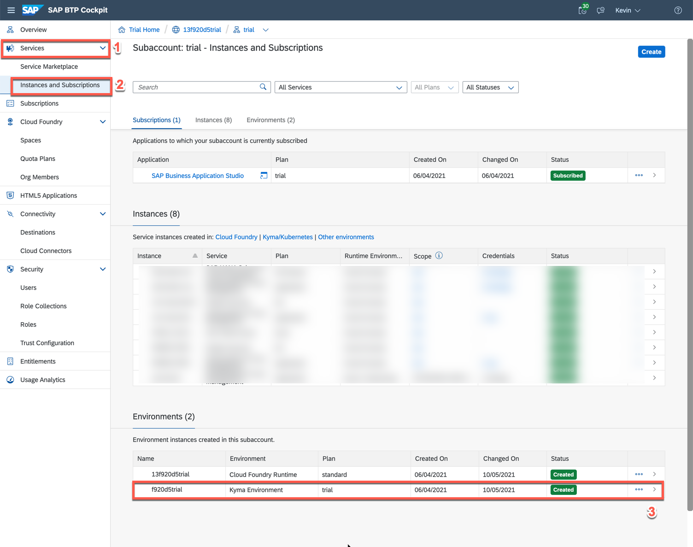

The dashboard or Kyma console UI is your graphical playground for managing and deploying applications or services on the Kyma runtime. With the dashboard you can not only deploy or delete deployments but also manage them for scale, expose them over self-defined API Rules and much more.

To learn more about the capabilities and features of the SAP BTP, Kyma runtime, follow the Kyma tutorials, blog posts, read the documentation or check out the YouTube videos. If you aren't aware, there is also a [Kyma slack channel](https://kyma-community.slack.com/) where you can ask questions to the active community.

!

[VALIDATE_5]
[ACCORDION-END]
