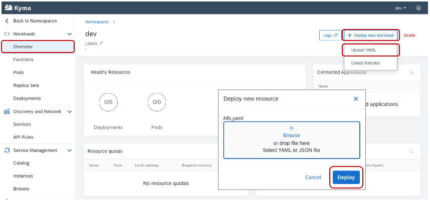
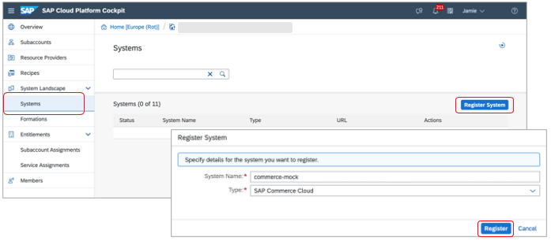
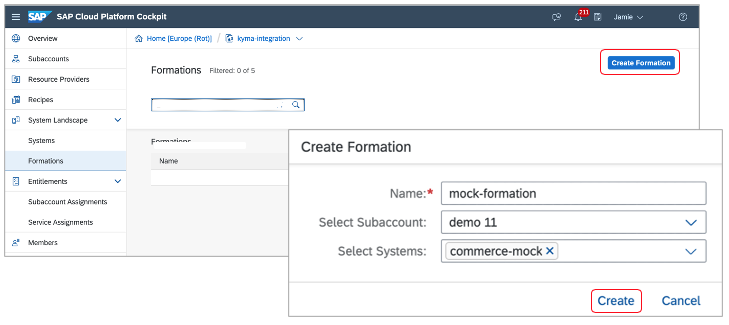
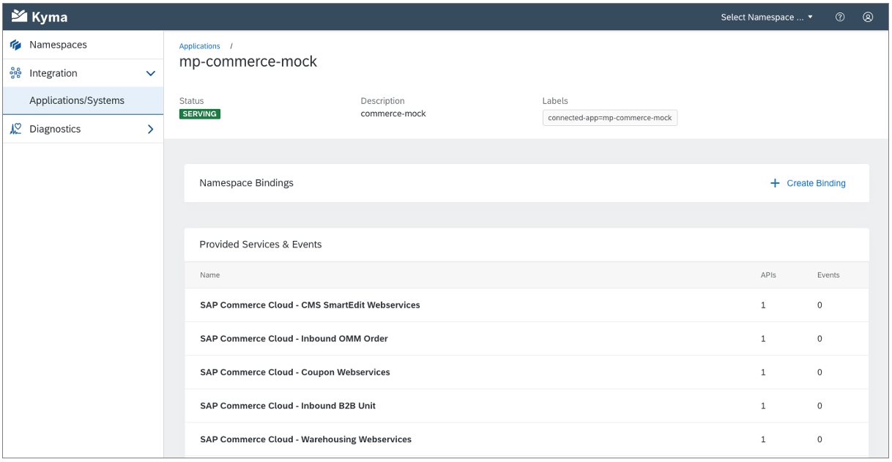

## Prerequisites
  - [GIT](https://git-scm.com/downloads) installed

## Details
### You will learn
  - How to create a Namespace in the Kyma runtime
  - How to deploy the Kyma mock application, which includes a Kyma `APIRule` to expose the API to the Internet

The Kyma mock application contains lightweight substitutes for SAP applications to ease the development and testing of extension and integration scenarios based on [`Varkes`](https://github.com/kyma-incubator/varkes). Together with SAP Cloud Platform, Kyma runtime, it allows for efficient implementation of application extensions without the need to access the real SAP applications during development.

---

[ACCORDION-BEGIN [Step 1: ](Clone the Git repository)]

1. Go to the [xf-application-mocks](https://github.com/SAP-samples/xf-application-mocks) repository. Within the repo you can find each of the mock applications and their Deployment files within the respective folder. The process outlined in the tutorial is the same for each, but focuses on configuring the Commerce mock.

2. Download the code by choosing the green **Code** button and then choosing one of the options to download the code locally.

    You can instead run the following command within your CLI at your desired folder location:

    ```Shell/Bash
    git clone https://github.com/SAP-samples/xf-application-mocks
    ```

[DONE]
[ACCORDION-END]

[ACCORDION-BEGIN [Step 2: ](Apply resources to Kyma runtime)]

1. Open the Kyma console and create the `dev` Namespace by choosing **Add new namespace**, providing the name `dev`, and choosing **Create**.

    

2. Open the `dev` Namespace by choosing the tile.

3. Apply the Deployment of the mock application to the `dev` Namespace by choosing the **Deploy new resource** option, using the **Browse** option to choose the `k8s.yaml` file, and finally choosing **Deploy**.

    

    > You can find the file at `/SAP-samples/xf-application-mocks/commerce-mock/deployment/k8s.yaml`.

4. Apply the `APIRule` of the mock application to the `dev` Namespace by choosing the **Deploy new resource** option, using the **Browse** option to choose the `xf.yaml` file, and finally choosing **Deploy**. The `APIRule` exposes the resource to the Internet.

    > You can find the file at at `/SAP-samples/xf-application-mocks/commerce-mock/deployment/xf.yaml`.

[DONE]
[ACCORDION-END]


[ACCORDION-BEGIN [Step 3: ](Open Commerce mock application)]

1. You can view the `APIRules` in the Kyma console within the `dev` Namespace under the **Configuration > `APIRules`** menu options, which will display the associated **Host** value.

2. Open the mock application in the browser by choosing the **HOST** value `https://commerce.*******.kyma.shoot.live.k8s-hana.ondemand.com`. If you receive the error `upstream connect...`, the application may have not finished starting. Wait for a minute or two and try again.

[DONE]
[ACCORDION-END]

[ACCORDION-BEGIN [Step 4: ](Create a System)]

In this step you will create a System in the SAP Cloud Platform which will be used to pair the mock application to the Kyma runtime.

1. Open your global SAP Cloud Platform account and choose the **System Landscape > Systems** menu options.

2. Choose the **Register System** option, provide the name **commerce-mock**, set the type to **SAP Commerce Cloud** and then choose **Register**.

    

3. Copy the **Token** value and close the window. This value will expire in five minutes and will be needed in a subsequent step.

    

[DONE]
[ACCORDION-END]

[ACCORDION-BEGIN [Step 5: ](Create a Formation)]

In this step you will create a Formation. A Formation is used to connect one or more Systems created in the SAP Cloud Platform to a runtime.

1. Within your global SAP Cloud Platform account, choose the **System Landscape > Formations** menu options. Choose the **Create Formation** option.

2. Provide a **Name**, choose your **Subaccount** where the Kyma runtime is enabled, choose the **commerce-mock** System and finally choose **Create**.

    

[VALIDATE_1]
[ACCORDION-END]

[ACCORDION-BEGIN [Step 6: ](Pair an application)]

1. Navigate back to the mock application browser window and choose **Connect**. Paste the copied value in the token text area and then choose **Connect**. If the token has expired, you may receive an error. Simply return to [Step 4: ](Create a System) and generate a new token.

    

2. Choose **Register All** to register the APIs and events from the mock application.

    

[DONE]
[ACCORDION-END]


[ACCORDION-BEGIN [Step 6: ](Verify setup)]

1. In the Kyma home workspace, choose **Integration > Applications**.

2. Choose the **mp-commerce-mock** application by clicking on the name value shown in the list.

> After choosing the system you should now see a listing of the APIs and events the mock application is exposing.

  

[DONE]
[ACCORDION-END]

---
