## Prerequisites
  - [Provision Kyma](cp-kyma-getting-started)
  - [Setup Mock Application](cp-kyma-mocks)

## Details
### You will learn
  - How to deploy a microservice using the Kyma Console
  - How to deploy functions using the Kyma Console
  - How to create Service Instances
  - How to bind Service Instances to a Serverless Functions

This sample provides a Redis deployment and two serverless functions that interact with it. The function `cache-order` will be set to subscribe to an `order.created` event provided by the Commerce mock application. Once triggered, the function will perform an API call to the Commerce mock to obtain additional details regarding the order and then cache the information into Redis. The function `get-order`, exposed as an API, is used to then retrieve the order details from the Redis cache.

---

[ACCORDION-BEGIN [Step 1: ](Clone the Git repository)]

1. Go to the [kyma-runtime-extension-samples](https://github.com/SAP-samples/kyma-runtime-extension-samples) repository. This repository contains a collection of Kyma sample applications which will be used during the tutorial.

2. Download the code by choosing the green **Code** button, and then choosing one of the options to download the code locally.

   You can instead run the following command using your CLI at your desired folder location:

```Shell/Bash
git clone https://github.com/SAP-samples/kyma-runtime-extension-samples
```

[DONE]
[ACCORDION-END]

[ACCORDION-BEGIN [Step 2: ](Bind application to namespace)]

In this step, you will bind the Commerce Mock application to the dev namespace. This will allow the APIs and Events of the mock application to be used within the namespace.

1. In the Kyma home workspace, choose **Integration > Applications/Systems**.

2. Choose the **`mp-commerce-mock`** application by clicking on the name value shown in the list.

3. Choose the option **Create Binding**.

4. In the **Namespace** select list choose the option `dev` and then choose **Create**.

    

[DONE]
[ACCORDION-END]

[ACCORDION-BEGIN [Step 3: ](Create the Events service instances)]

In this step, you will create service instances of the Events the Commerce Mock application exposes. This will allow the events to be consumed from resources within the namespaces such as functions or microservices.

1. In the Kyma home workspace, choose **Namespace**.

2. Choose the `dev` namespace.

    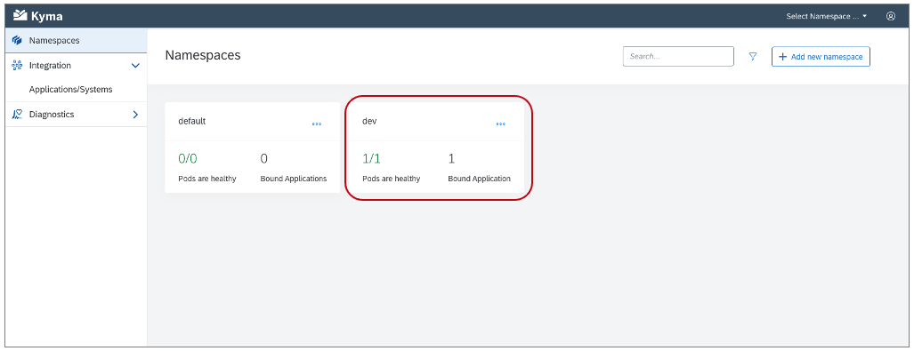

3. Within the `dev` namespace, choose **Service Management > Catalog**.

4. Choose the tile **`mp-commerce-mock`** to view the Service Class Plans of the application.

    

5. Choose the Service Class Plan for **SAP Commerce Cloud - Events**.

    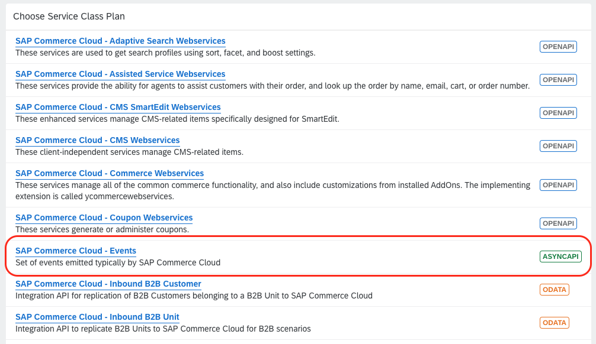

6. Choose **Add** and then **Create** to create a Service Instance of the **SAP Commerce Cloud - Events**

    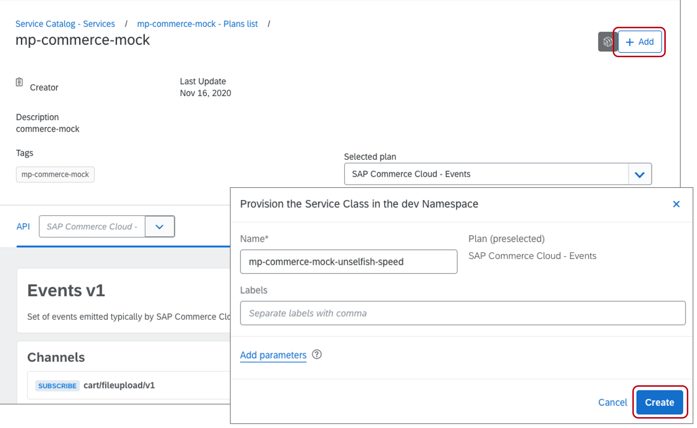

7. This will then navigate you to the newly created service instance.

    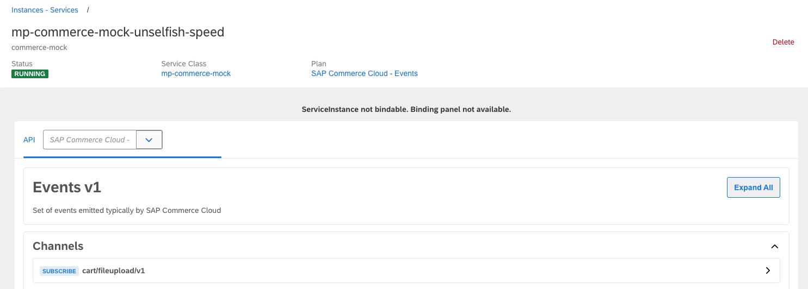

[DONE]
[ACCORDION-END]

[ACCORDION-BEGIN [Step 4: ](Create API service instances)]

In this step, you will create a service instance of the `Commerce Webservices` the Mock application exposes. The service instance will expose the APIs to resources within the namespace such as functions and microservices.


1. In the `dev` namespace, choose **Service Management > Catalog**.

2. Choose the tile **mp-commerce-mock** to view the Service Class Plans of the application.

    

3. Choose the Service Class Plan for **`SAP Commerce Cloud - Commerce Webservices`**.

    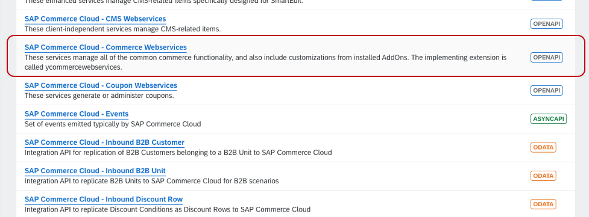

4. Choose **Add** and then **Create** to create a Service Instance of the **`SAP Commerce Cloud - Commerce Webservices`**.

    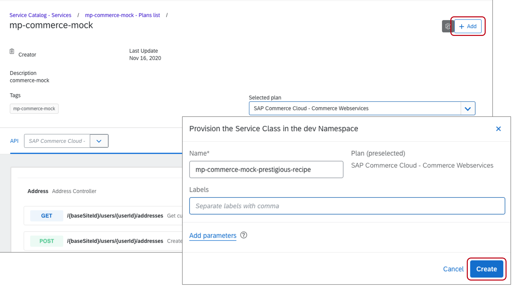

4. This will then navigate you to the newly created service instance.

      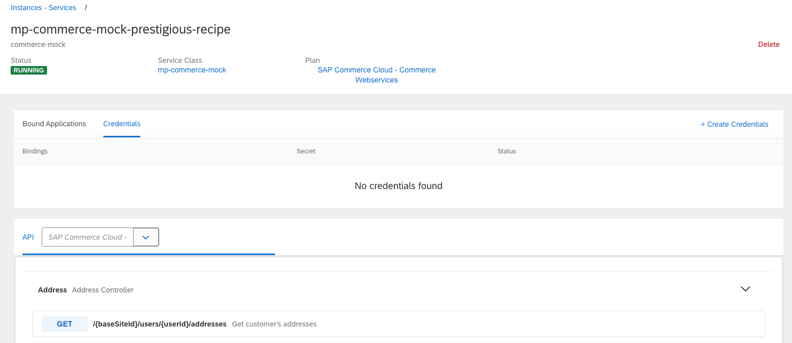

[DONE]
[ACCORDION-END]

[ACCORDION-BEGIN [Step 5: ](View service instances)]

In this step we will view the  **SAP Commerce Cloud - Events** and the **`SAP Commerce Cloud - Commerce Webservices`** service instances created in the previous two steps.

1. In the `dev` namespace, choose **Service Management > Instances**. This view will list the service instances existing in the namespace.

    

[DONE]
[ACCORDION-END]

[ACCORDION-BEGIN [Step 6: ](Deploy resources)]

In this step, you will deploy three resources into the Kyma runtime that were obtained in [Step 1](Clone the Git repository). These resources include:

  - **cache-order**: This function will subscribe to an event published by the Commerce mock application. Once triggered, it will call back to the Commerce mock application to obtain the `totalPriceWithTax` and then cache the information into Redis.
  - **get-order**: This function will be exposed as an API allowing retrieval of data stored within the Redis cache.
  - **redis-deployment**: This deployment defines the Redis cache configuration and the associated Kubernetes service which exposes the Redis instance to the two Serverless functions.

1. In the `dev` namespace, choose **Workload > Overview**.

2. Choose **Deploy new workload > Upload YAML**. using the **Browse** option choose the file **`redis-function/k8s/cache-order.yaml`** and choose **Deploy**.

3. Repeat the steps to deploy the files **`redis-function/k8s/get-order.yaml`** and **`redis-function/k8s/redis-deployment.yaml`**.

    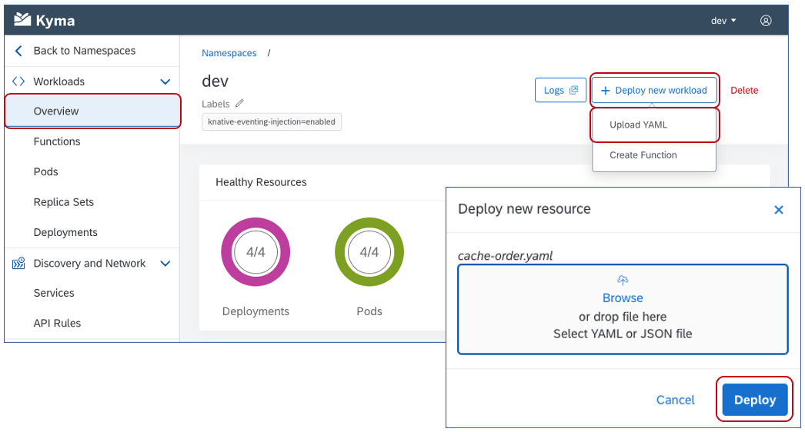

4. After completing the deployment of the resources, the **Healthy Resources** panel found in **Workload > Overview** will report the status of the **deployments** and the **pods** they generate. The chart indicates the amount **Ready** vs the **Total**. An equal relation means everything is ready.

    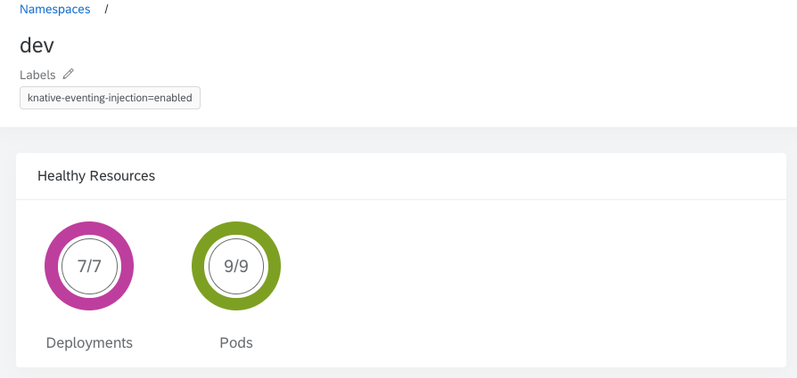

[DONE]
[ACCORDION-END]

[ACCORDION-BEGIN [Step 7: ](Add event trigger to function)]

In this step, you will configure the function `cache-order`, deployed in the previous step, to be triggered when the **order.created** event is fired from the Commerce Mock application.

1. In the `dev` namespace, choose **Workload > Functions**.

2. Choose the function **cache-order**.

    

3. Choose the tab **Configuration**.

    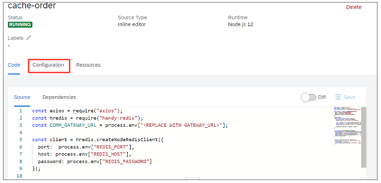

4. In the **Configuration** scroll down and choose **Add Event Triggers**.

5. Choose the event **order.created** and then choose **Add**

    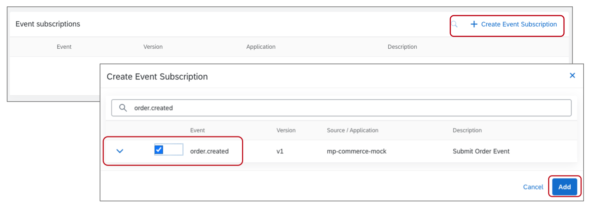

[DONE]
[ACCORDION-END]

[ACCORDION-BEGIN [Step 8: ](Add service instance to function)]

In this step, you will add a service instance to the function cache-order allowing it to easily call the related API.

1. In the function **cache-order**, choose the tab **Configuration**.

2. In the **Configuration** scroll down and choose **Create Service Binding**.

3. Choose the Service instance created in the previous step from the drop down list. The name of your service instance will defer from what is shown in the screenshot.

4. Choose **Create**.

    

[DONE]
[ACCORDION-END]

[ACCORDION-BEGIN [Step 9: ](Adjust function code)]

1. In the function **cache-order** choose the `Code` tab.

2. On line three, replace the value **`<REPLACE WITH GATEWAY_URL>`** with the **`GATEWAY_URL`** found in the Environment Variables below the function code. This value will defer from what is shown in the screenshot.

3. Choose **Save**. Choosing **Save** will cause the function to be rebuilt and deployed. The **Status** field will indicate when the function is **Running** again after this process completes.

    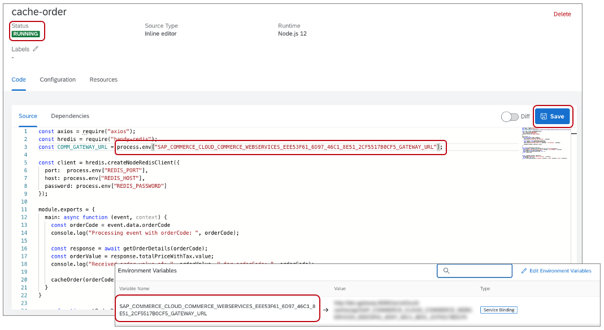

[VALIDATE_1]
[ACCORDION-END]

[ACCORDION-BEGIN [Step 10: ](Test event consumption)]

With the configuration steps completed, you can now test the scenario to validate that it is working as intended.

1. Open the mock application in the browser by choosing **Discovery and Network > `APIRules`** from the menu.

2. Choose the **Host** entry for the **commerce-mock** `APIRule` to open it in the browser. This URL should be similar to:
   `https://commerce.*******.kyma.shoot.live.k8s-hana.ondemand.com`

   

3. Choose the **Remote APIs** tab.

    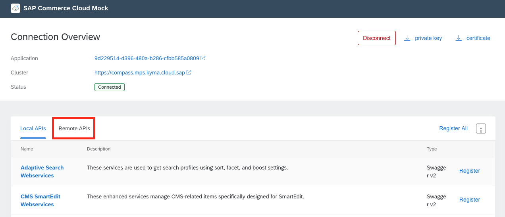

4. Choose the **SAP Commerce Cloud - Events** option.

5. For the **Event Topics**, choose **order.created.v1**.

6. Modify the `orderCode` value as desired and choose **Send Event**. Make sure to remember the `orderCode` value, it will be used in a later step.

    

[DONE]
[ACCORDION-END]

[ACCORDION-BEGIN [Step 11: ](Review output in function logs)]

In this step, we will view the logs outputted by the function to verify that the scenario is working.

1. In the `dev` namespace, choose **Workload > Functions**.

2. Choose the function **cache-order**.

3. Expand the **Logs** viewer by clicking on the arrow found at the bottom of the function viewer.

4. Search for the value `orderCode`.

5. The output should be similar to:

    

[DONE]
[ACCORDION-END]

[ACCORDION-BEGIN [Step 12: ](Get output from API rule function)]

In this step, we use the get-order function to perform a read request of the data cached in the Redis database.

1. Choose **Discovery and Network > `APIRules`** from the menu.

2. Choose the **Host** entry for the **get-order** `APIRule` to open the application in the browser. When first opened you will received the message

    `{"error":"No orderCode received!"}`

    

3. Append the value `?orderCode=12331231` to the URL where the value is the same as used when sending the event, for example

    `https://get-order.*********.kyma-stage.shoot.live.k8s-hana.ondemand.com/?orderCode=12331231`

4. This should output the value saved when the event was submitted.

    `{"orderCode":"12331231","Date":"Tue Nov 17 2020 19:28:42 GMT+0000 (Coordinated Universal Time)","Value":"100"}`

[VALIDATE_2]

**Congratulations!** You have successfully completed the mission.

[ACCORDION-END]

---
